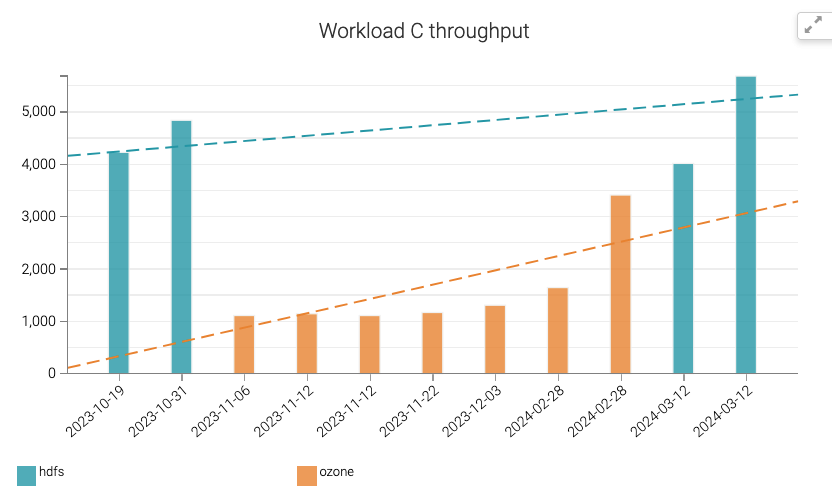
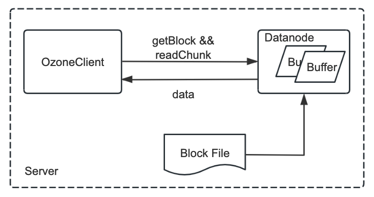
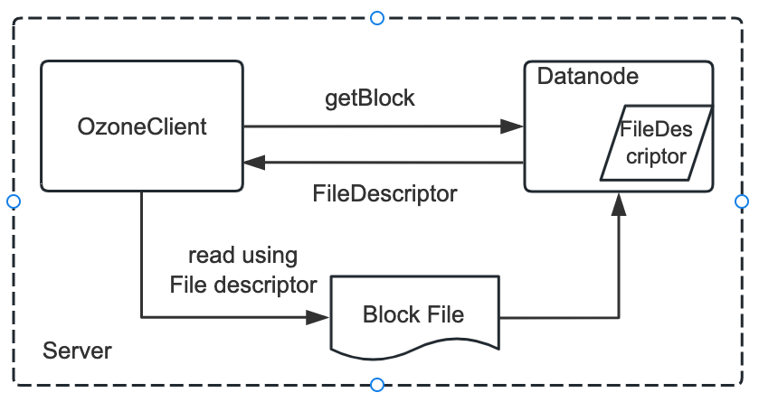
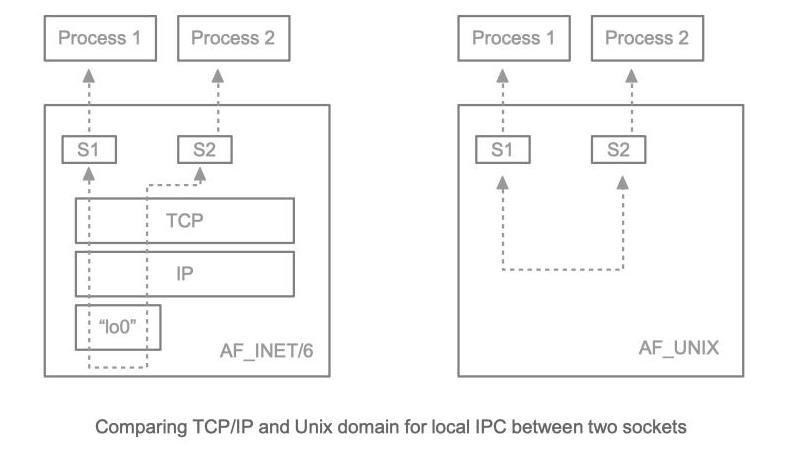
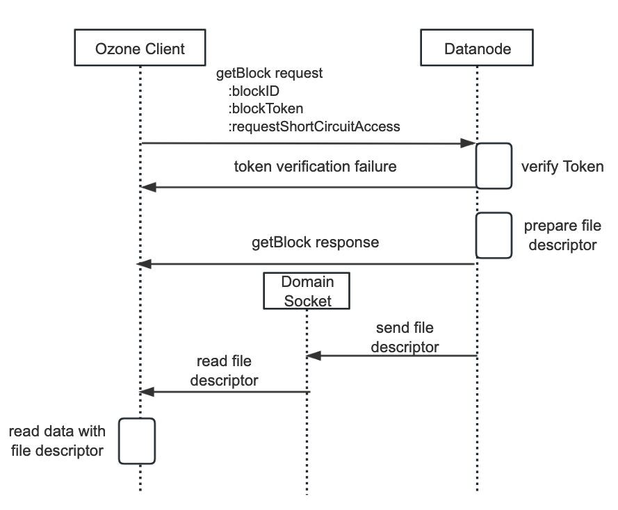
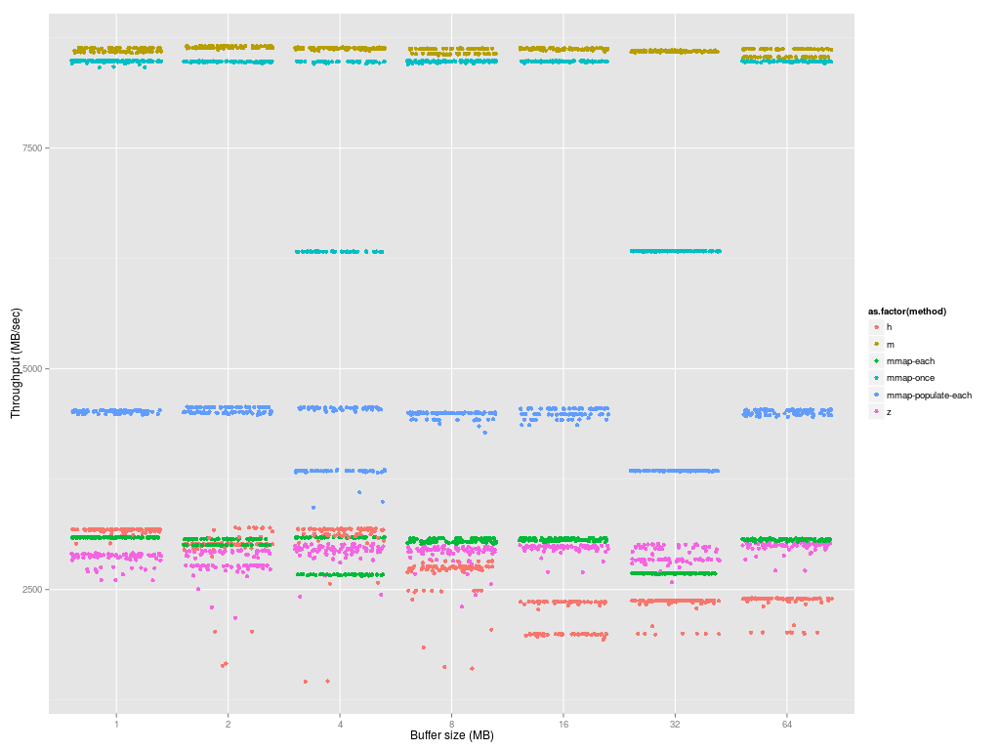

<!--
  Licensed under the Apache License, Version 2.0 (the "License");
  you may not use this file except in compliance with the License.
  You may obtain a copy of the License at

   http://www.apache.org/licenses/LICENSE-2.0

  Unless required by applicable law or agreed to in writing, software
  distributed under the License is distributed on an "AS IS" BASIS,
  WITHOUT WARRANTIES OR CONDITIONS OF ANY KIND, either express or implied.
  See the License for the specific language governing permissions and
  limitations under the License. See accompanying LICENSE file.
-->

## Background

During benchmark Ozone on Hbase, we found that current Ozone (branch HDDS-7593) is about 30% slower than HDFS, while HDFS has the short circuit read enabled by default. We further benchmarked HDFS on Hbase w/o short circuit, the performance gap is around 20%~30% with different workload sets.

The benchmark compared three configurations on a pure read workload (workload C). The last third is Ozone, the second is HDFS without short circuit read, and the last is HDFS with short circuit read.



To have competitive read performance as HDFS, we consider supporting short circuit read in Ozone.

## Short Circuit Read

Here is how an Ozone Client reads data from DN. Once the client gets the KeyInfo from OzoneManager, it will know the location of each block. The Client will send a getBlock request to Datanode, to retrieve the Block and ChunkInfo for one block. With the ChunkInfo, next the client will send a readChunk request to Datanode. All these requests are sent on a TCP connection between Client and Datanode. When Datanode receives the readChunk request, it will locate the BlockFile on disk, open it, and read from the specified offset, with specified length into its internal data buffer, then wrap the buffer and send the data through the network to the Client.



Currently this flow is the same regardless of whether the Client and Datanode are on the same server or not. Obviously, there is a lot of buffer copy, packing data, transfer data, unpacking data operation here. So if the Client and Datanode are on the same server, a straightforward idea is why just let the OzoneClient read from the Block file directly, save the cost of network data transfer, packing/unpacking data and possibly less buffer copy.

Here is the target flow: instead of passing the data to Client, Datanode will pass a file descriptor of the Block file. Once the Client receives this file descriptor, it can use it to read the file directly.



To achieve the above flow, we need to leverage Unix Domain Socket.

## Unix Domain Socket

According to [Wikipedia](https://en.wikipedia.org/wiki/Unix_domain_socket), a Unix domain socket is an inter-process communication (IPC) type, exchanging data between processes executing on the same host operating system. It has been a feature of Unix operating systems for decades.

The API for Unix domain sockets is similar to that of an Internet socket, for example bind, accept, read, write etc. Rather than using an underlying network protocol, all communication occurs entirely within the operating system kernel.

Comparing TCP/IP and Unix domain for local IPC between two sockets:



Unix domain sockets may use the file system as their address name space, eg. `/foo/bar` or `C:\foo\bar`. Processes reference Unix domain sockets as file system inodes, so two processes can communicate by opening the same socket. In addition to sending data, processes may send file descriptors across a Unix domain socket connection using the `sendmsg()` and `recvmsg()` system calls. This allows the sending process to grant the receiving process access to a file descriptor for which the receiving process otherwise does not have access. This is how it will be used in Ozone.

## Design

The short circuit read feature is on the read path from Ozone client to Datanode. Only Ozone client and Datanode need to support this feature; OzoneManager and StorageContainerManager will remain the same.

### Interface Change

For a client to read data, it will first send a **GetBlock** command, then following **ReadChunk** commands. Here is the new GetBlock command and response to support short circuit read:

```protobuf
message GetBlockRequestProto {
    required DatanodeBlockID blockID = 1;
    optional bool requestShortCircuitAccess = 2 [default = false];
}

message GetBlockResponseProto {
    required BlockData blockData = 1;
    optional bool shortCircuitAccessGranted = 2;
}
```

The **GetBlock** request and response will be exchanged over the current gRPC channel between client and Datanode. Once the client receives the response with `shortCircuitAccessGranted` true, it will read the file descriptor of the block file from domain socket. File descriptor only transmits over Unix Domain Socket. After the file descriptor is received, the client will use it as an InputStream, starting to read data with it, not through ReadChunk any more. The checksum of the block is included in the BlockData in **GetBlock's** response.

### Flow



## Configuration

Because Java (before Java 16) cannot directly operate Unix domain sockets, this feature depends on the Hadoop native package `libhadoop`. To check if `libhadoop` is installed or not, you can run the following command to check whether these native packages are installed.

This is `libhadoop` not installed:

```shell
bash-4.2$ ozone checknative
Native library checking:
hadoop: false
```

This is `libhadoop` installed:

```shell
bash-4.2$ ozone checknative
Native library checking:
hadoop: true
/usr/lib/libhadoop.so.1.0.0
```

Short circuit local reads (in `ozone-site.xml`) are configured as follows:

```XML
<property>
    <name>ozone.client.read.short-circuit</name>
    <value>false</value>
</property>
<property>
    <name>ozone.domain.socket.path</name>
    <value></value>
</property>
```

Above two properties need to be configured on both the DataNode and the client.

Datanode and client will enable the feature when both native `libhadoop` is loaded and these two properties are properly enabled and set.

The DataNode is responsible for creating the path defined with `ozone.domain.socket.path` during startup. So please make sure there doesn't exist a file or directory in the file system with the same path.

## Security

Short-circuit reads make use of a UNIX domain socket. It requires a special path in the filesystem that allows the client and the DataNode to communicate. The path will be set with the property `ozone.domain.socket.path` described in the above Configuration section. The DataNode is responsible for creating this path during startup. So DataNode should have the permission to do that. On the other hand, it should not be possible for any user except the Ozone user or root to create this path. For this reason, paths under `/var/run` or `/var/lib` are often used.

To ensure data security and integrity, Ozone will follow the rule as Hadoop. It will not use the Unix Domain socket if the filesystem permissions of the domain socket are inadequate. The current Hadoop rules are:

1. To ensure nobody malicious can overwrite the entry with their own socket, the entire path to the socket must not contain any world-writable directory.
2. No entry in the path is group writable, except in the special case that the owner is root (and of course the group must be one containing only trusted accounts).
3. The owner of the file is neither root nor the "effective user" trying to work with the socket.

All these requirements are checked during Datanode startup. If they are unmet, then Datanode startup will just fail.

## Metrics

We should have metrics for things like:

- How much data is read through short circuit read
- The success short circuit read count
- The failure short circuit read count

## Compatibility

Support backwards compatibility. Clients should check for the Datanode version, before it sends short-circuit read requests to Datanode.

## Limitation

The Short Circuit Read will only support `FILE_PER_BLOCK` container layout. `FILE_PER_CHUNK` layout is not supported.

## Further Improvement

Besides the Unix Domain Socket, HDFS further improves the read performance by allowing the client and the DataNode to exchange information via a shared memory segment on `/dev/shm`.

According to [HDFS-4953](https://issues.apache.org/jira/browse/HDFS-4953), there is a microbenchmark, which shows that the mmap cache can achieve the same performance as pure memory operation, 3x faster than normal short circuit read.



- The top line is file in memory, so pure memory operation.
- The second top line is the short circuit read, with cached mmap, so no page faulting overhead.
- The bottom orange line is the normal short circuit read.

So the overall performance gain of the short circuit read feature of HDFS, one part from the Unix Domain Socket, one part from this mmap cache. How much weight of each of them, there is no existing data for this.

The implementation of this mmap cache is quite complex in HDFS, way more complex than passing the file descriptor through the Unix Domain Socket. So it would be nice to set this as a Phase II target.

## Appendix

1. [Unix domain socket](https://en.wikipedia.org/wiki/Unix_domain_socket)
2. [Socket path security](https://wiki.apache.org/hadoop/SocketPathSecurity)
3. [Java support of Unix domain socket](https://openjdk.org/jeps/380)
4. [HDFS-347](https://issues.apache.org/jira/browse/HDFS-347)
5. [HDFS-4953](https://issues.apache.org/jira/browse/HDFS-4953)
