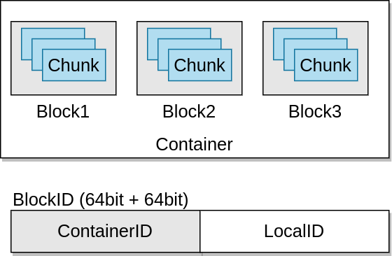

<!---
  Licensed to the Apache Software Foundation (ASF) under one or more
  contributor license agreements.  See the NOTICE file distributed with
  this work for additional information regarding copyright ownership.
  The ASF licenses this file to You under the Apache License, Version 2.0
  (the "License"); you may not use this file except in compliance with
  the License.  You may obtain a copy of the License at

      http://www.apache.org/licenses/LICENSE-2.0

  Unless required by applicable law or agreed to in writing, software
  distributed under the License is distributed on an "AS IS" BASIS,
  WITHOUT WARRANTIES OR CONDITIONS OF ANY KIND, either express or implied.
  See the License for the specific language governing permissions and
  limitations under the License.
-->

容器是 Ozone/HDDS 的基本复制单元，由 Storage Container Manager (SCM) 服务管理。

容器是可以包含多个块的大型二进制单元：

块作为本地信息，不由 SCM 管理。因此，即使在系统中创建了数十亿个小文件（即创建了数十亿个块），数据节点也仅报告容器的状态，以及复制容器。

当 Ozone Manager 向 SCM 请求分配一个新的块时，SCM 将找到一个合适的容器，并且产生一个包含 `容器ID` + `本地ID` 的块Id，客户端则连接到存储这个容器的数据节点上。而数据节点则能够基于 `本地ID` 管理这个独立的块。

## OPEN 和 CLOSED 容器

当一个容器被创建后，它就以 OPEN 状态开始。而当其被写满（写入约 5GB 数据）时，它就会被关闭并且处于 CLOSED 状态。

OPEN 和 CLOSED 容器之间的根本区别：

OPEN | CLOSED
-----------------------------------|-----------------------------------------
可变 | 不可变
基于 RAFT (Ratis) 进行复制 | 异步地对容器副本进行复制
只有 Raft leader 用于读/写 | 所有节点都可用于读
