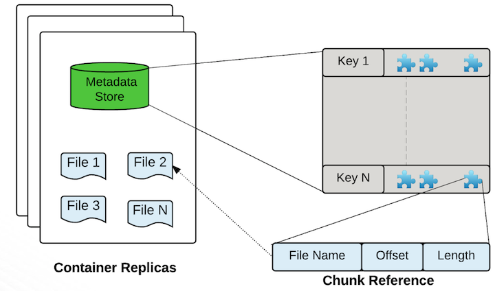
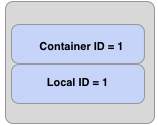

<!---
  Licensed to the Apache Software Foundation (ASF) under one or more
  contributor license agreements.  See the NOTICE file distributed with
  this work for additional information regarding copyright ownership.
  The ASF licenses this file to You under the Apache License, Version 2.0
  (the "License"); you may not use this file except in compliance with
  the License.  You may obtain a copy of the License at

      http://www.apache.org/licenses/LICENSE-2.0

  Unless required by applicable law or agreed to in writing, software
  distributed under the License is distributed on an "AS IS" BASIS,
  WITHOUT WARRANTIES OR CONDITIONS OF ANY KIND, either express or implied.
  See the License for the specific language governing permissions and
  limitations under the License.
-->

数据节点是 Ozone 中的 worker，所有的数据都存储在数据节点上，用户以块的方式写数据，数据节点将多个块聚合成一个存储容器，存储容器中包含用户写入的数据块和这些块的元数据。

## 存储容器

Ozone 的存储容器是一个自包含的超级块，容器中包含一系列的 Ozone 块，以及存储实际数据的磁盘文件，这是默认的存储容器格式。对于 Ozone 来说，容器只是提供了一个协议规范，它独立于具体的存储格式实现，换句话说，我们可以很容易扩展或引入新的容器实现格式。因此，上述格式应当被看作是 Ozone 存储容器的参考实现。

## 理解 Ozone 中的块和容器

当用户想要从 Ozone 中读取一个键时，用户向 OM 发送该键名，OM 会返回组成该键的块列表。

每个 Ozone 块包含一个容器 ID 和一个本地 ID，下图展示了 Ozone 块的逻辑组成：

容器 ID 用来让用户发现容器的位置，容器位置的权威信息存储在 SCM 中。大部分情况下，OM 会缓存容器的位置信息，并会将它们随 Ozone 块一起返回给用户。

当用户定位到容器的位置，即知道哪些数据节点包含这个容器后，用户会连接数据节点，然后读取由 _容器ID:本地ID_ 指定的数据流，换句话说，本地 ID 相当于容器内的索引，描述了我们应该读取哪个数据流。

### 容器的位置发现

SCM 如何获得容器的位置？这一点和现有的 HDFS 十分相似。数据节点会定期发送类似于块报告的容器报告，容器报告比块报告的内容简洁的多，比如，对于一个存储容量为 196 TB 的集群，Ozone 大概会拥有四万个容器，相比于 HDFS 的一百五十万个块，块报告数量缩减为四十分之一。

这种间接管理的方式大大地提高了 Ozone 的扩展性，因为 SCM 需要处理的块数据大大减少，且命名服务（OM）作为一个独特的服务主体对于扩展 Ozone 具有重要意义。

## 需要关注的配置项

配置项 |默认值 | 
描述

----|---------|------------
dfs.container.ratis.datanode.storage.dir | none | 该目录用于存储 Ratis 元数据，如日志。
ozone.scm.datanode.id.dir | none | 数据节点上用于存储数据节点 ID 的路径。 
hdds.datanode.dir | none | 此配置决定数据节点上的数据将存储在本地文件系统的哪个位置。
hdds.datanode.dir.du.reserved | none | 每个卷保留的存储空间（以字节为单位）。始终为非DFS用途保留这么多空闲空间。
ozone.metadata.dirs | none | 用于存储持久化数据（RocksDB）的目录。
ozone.recon.address | 0.0.0.0:9891 | Recon的RPC地址。 使用 <host:port> 连接到Recon。