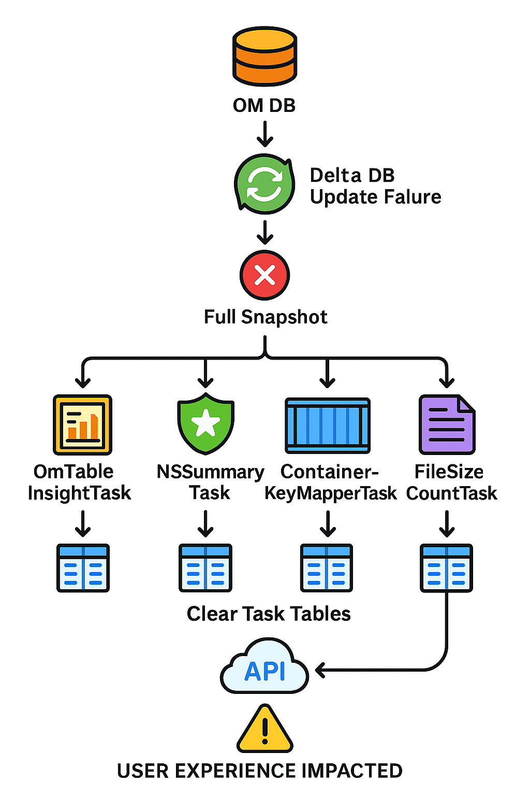

<!---
  Licensed to the Apache Software Foundation (ASF) under one or more
  contributor license agreements.  See the NOTICE file distributed with
  this work for additional information regarding copyright ownership.
  The ASF licenses this file to You under the Apache License, Version 2.0
  (the "License"); you may not use this file except in compliance with
  the License.  You may obtain a copy of the License at

      http://www.apache.org/licenses/LICENSE-2.0

  Unless required by applicable law or agreed to in writing, software
  distributed under the License is distributed on an "AS IS" BASIS,
  WITHOUT WARRANTIES OR CONDITIONS OF ANY KIND, either express or implied.
  See the License for the specific language governing permissions and
  limitations under the License.
-->

## 1. Executive Summary

### Problem Statement
Currently, when Recon falls back to full snapshot recovery (due to SequenceNumberNotFoundException (OM DB Compaction) or any other error thrown by OM), all underlying downstream ReconOmTasks truncates their existing processed data tables before rebuilding from the new snapshot. This causes some Recon APIs to return empty/blank data during the reprocessing period affecting the visualization of OM metadata, creating a poor user experience in the Recon UI until respective tasks complete their full snapshot re-processing.

### Proposed Solution
Implement a **Staged Reprocessing Architecture** that leverages the existing staging pattern (similar to TarExtractor) to maintain data availability during full snapshot recovery. The solution involves:

1. **Staging Database Creation**: Create staging instance of Recon rocksDB where ReconOmTask data tables will be processed without impacting production rocksDB tables.
2. **Parallel Reprocessing**: Process full snapshot data into staging tables while production tables remain accessible
3. **Atomic Switchover**: Atomically replace production tables with staging tables once all respective concurrently running tasks complete successfully. 
4. **Rollback Capability**: Provide a rollback mechanism in case of reprocessing failures
5. **Enhanced Monitoring**: Introduce metrics and health checks to monitor staging operations

### Benefits
- **Zero Downtime**: Recon APIs remain functional even during full snapshot recovery and bootstrapping.
- **Data Consistency**: Atomic switchover ensures a consistent view across all task data, because once all the tasks complete their reprocessing and success, then the staging tables are switched to production tables, else failure of one task which is related, may provide data inconsistency. E.g. OmTableInsightTask (Number of keys, Number of buckets etc) and NSSummary tree. This is how the current architecture works as well.
- **Failure Resilience**: Rollback capability ensures system stability during failures
- **Performance Isolation**: Reprocessing load doesn't impact API query performance
- **Minimal Disk Usage**: Staging tables can be cleaned up after successful switch, minimizing disk usage. Full OM DB tar ball is already stored in the Recon OM DB, so no need to store it again in the staging area.

---

## 2. Current Architecture Analysis

### 2.1 Current Sync Flow



> **Figure:** Full‐snapshot fallback path: OM DB delta error → fetch full snapshot → concurrently trigger tasks (`OmTableInsightTask`, `NSSummaryTask`, `ContainerKeyMapperTask`, `FileSizeCountTask`) → each task clears its Recon metadata tables → API reads from those cleared tables (empty) → **User Experience Impacted**


### 2.2 Current ReconOmTask Data Management

#### Task Data Tables Overview
| Task Class | Data Tables | Storage Type | Clear Method | Impact on APIs |
|------------|-------------|--------------|--------------|----------------|
| **NSSummaryTask** | `nsSummaryTable` | RocksDB | `clearNSSummaryTable()` | Namespace browsing, path construction |
| **OmTableInsightTask** | `GlobalStats` (SQL) | SQL | Reinitialize maps | Table statistics, counts |
| **FileSizeCountTaskFSO/OBS** | `FILE_COUNT_BY_SIZE` (SQL) | SQL | `delete().execute()` | File size distribution charts |
| **ContainerKeyMapperTask** | `CONTAINER_KEY`, `KEY_CONTAINER`, `CONTAINER_KEY_COUNT` | RocksDB | `reinitWithNewContainerDataFromOm()` | Container content browsing |

#### Current Reprocess Flow
```java
// Current problematic pattern across all tasks
public TaskResult reprocess(OMMetadataManager omMetadataManager) {
    try {
        // STEP 1: Clear existing data (USER IMPACT STARTS HERE)
        clearExistingData(); 
        
        // STEP 2: Process full snapshot (TAKES SIGNIFICANT TIME)
        processFullSnapshot(omMetadataManager);
        
        // STEP 3: Commit new data (USER IMPACT ENDS HERE)
        return buildTaskResult(true);
    } catch (Exception e) {
        return buildTaskResult(false);
    }
}
```

### 2.3 Current Recon OM Task Interface

#### ReconOmTask
```java
public interface ReconOmTask {
    // Current operations
    String getTaskName();
    default void init() { }
    TaskResult process(OMUpdateEventBatch events,
                       Map<String, Integer> subTaskSeekPosMap);
    TaskResult reprocess(OMMetadataManager omMetadataManager);
}
```

#### SQL-based Storage (GlobalStatsDao, FileCountBySizeDao)

## 3. Proposed Staged Reprocessing Architecture

### 3.1 High-Level Architecture


### 3.2 Core Components

#### 3.2.1 Updated Recon OM Task Interface
```java
public interface ReconOmTask {
  // Current operations
  String getTaskName();
  default void init() { }
  TaskResult process(OMUpdateEventBatch events,
                     Map<String, Integer> subTaskSeekPosMap);
  TaskResult reprocess(OMMetadataManager omMetadataManager);
  // Returns a staged task that can be used to reprocess events.
  default ReconOmTask getStagedTask(ReconOMMetadataManager stagedOmMetadataManager, DBStore stagedReconDbStore)
      throws IOException {
    return this;
  }
}
```

## 4. Detailed Design

### 4.1 Staging State Management

#### 4.1.1 Staging State Enum
```java
public enum StagingState {
    NONE,              // No staging operation in progress
    INITIALIZING,      // Creating staging area and storage interfaces  
    PROCESSING,        // Tasks are reprocessing into staging area
    READY_TO_COMMIT,   // All tasks completed successfully, ready for switch
    COMMITTING,        // Atomic switch in progress
    COMMITTED,         // Switch completed successfully
    ROLLING_BACK,      // Rollback in progress due to failure
    FAILED             // Operation failed, manual intervention needed
}
```

#### 4.1.2 Staging State Transitions


### 4.2 Orchestrated Staging Reprocess Flow

#### 4.2.1 Enhanced ReconTaskController
```java
public class ReconTaskControllerImpl implements ReconTaskController {
    
    private volatile StagingState currentStagingState = StagingState.NONE;
    
    /**
     * Enhanced reInitializeTasks with staging support
     */
    @Override
    public synchronized void reInitializeTasksWithStaging(ReconOMMetadataManager omMetadataManager,
                                                         Map<String, ReconOmTask> reconOmTaskMap) {
        try {
            // Phase 1: Initialize staging DB area
            
            // Phase 2: Execute staging reprocess
            
            if (!allTasksSucceeded) {
                throw new RuntimeException("One or more tasks failed during staging reprocess");
            }
            
            // Phase 3: Validate staging data
                        
            // Phase 4: Atomic commit
            
            currentStagingState = StagingState.COMMITTED;
            LOG.info("Staging reprocess completed successfully with stagingId: {}", stagingId);
            
            // Notify all tasks of successful staging completion
        } catch (Exception e) {
            LOG.error("Staging reprocess failed", e);
            currentStagingState = StagingState.ROLLING_BACK;
        } finally {
            if (currentStagingState != StagingState.FAILED) {
                currentStagingState = StagingState.NONE;
            }
        }
    }
}
```

## 5. Implementation Scenarios

### 5.1 Success Scenario: Smooth Staging Operation

#### Timeline
```
T0: SequenceNumberNotFoundException occurs or any other runtime error thrown at OM → Full snapshot triggered
T1: Staging area creation begins
    - Create staging RocksDB instances  
    - Create staging SQL tables
    - Initialize staging storage interfaces
    
T2: Parallel staging reprocess begins (Production APIs remain functional)
    - NSSummaryTask 
    - ContainerKeyMapperTask  
    - FileSizeCountTask 
    - OmTableInsightTask 
    
T3: All tasks complete staging reprocess successfully
    - Staging data validation passes
    - System ready for atomic switch
    
T4: Atomic switchover (Brief API unavailability ~seconds)
    - RocksDB: Atomic directory moves
    - SQL: Atomic table renames in transaction
    - Storage interface reinitialization
    
T5: System operational with fresh data
    - All APIs using new processed data
    - Staging cleanup completed
    - Old backup data retained for rollback if needed
```

#### User Experience
- **T0-T4**: Recon UI continues to show existing data (slightly stale but functional)
- **T4**: Brief loading indicators during atomic switch (~1-5 seconds)
- **T5+**: Fresh data from new OM snapshot available

### 5.2 Failure Scenario: Task Failure During Staging

#### Timeline
```
T0: SequenceNumberNotFoundException occurs → Full snapshot triggered
T1: Staging area creation successful
T2: Staging reprocess begins
T3: One task fails (e.g., NSSummaryTask encounters corruption)
    - Task failure detected
    - Rollback procedure initiated
    - Other tasks stopped gracefully
    
T4: Cleanup completed
    - Staging data deleted
    - System returns to previous state
    - Error logged for investigation
    
T5: Retry mechanism or manual intervention
    - Automatic retry after delay (configurable)
    - Or manual intervention based on error type
```

#### User Experience
- **T0-T3**: Normal operation continues with existing data
- **T4+**: System continues with previous data, error logged
- **Admin notification**: Alert sent for manual investigation

### 5.3 Failure Scenario: Atomic Switch Failure

#### Timeline
```
T0-T3: Normal staging process completes successfully
T4: Atomic switch begins but fails (e.g., filesystem error, DB lock)
    - Partial switch detected
    - Immediate rollback initiated
    - Production data restored from backup
    
T5: System recovery
    - Production services restored
    - Staging data preserved for analysis
    - Fallback to old data until next retry
```

#### User Experience
- **T0-T4**: Normal operation continues
- **T4**: Brief service disruption (seconds to minutes)
- **T5+**: Service restored with previous data, retry scheduled

### 5.4 High Load Scenario: Large Dataset Processing

#### Timeline
```
T0: Full snapshot with 100M+ keys triggered
T1: Staging area created with enhanced resources
    - Increased memory allocation for staging tasks
    - Separate thread pools for staging vs production
    
T2: Intelligent processing strategies
    - Batch size optimization based on available memory
    - Periodic progress reporting
    - Circuit breaker for resource exhaustion
    
T3: Extended processing time (30-60 minutes)
    - Production APIs remain responsive
    - Staging progress monitored and reported
    - Resource utilization tracked
    
T4: Successful completion and switch
    - Large dataset successfully processed
    - Atomic switch with minimal downtime
```

#### User Experience
- **T0-T4**: Normal operation with progress indicators in admin UI
- **T4**: Standard brief switch period
- **T5+**: Fresh data available with improved performance

---

## 6. Monitoring

### 6.1 Metrics and Monitoring

#### Staging Metrics
REPROCESS_STAGING will be a new task to track staging operations:
```java
ReconTaskStatusUpdater reprocessTaskStatus = taskStatusUpdaterManager.getTaskStatusUpdater(REPROCESS_STAGING);
```


---

## 6. Testing Strategy

### 6.1 Unit Testing

#### Component Tests
- **StagingManager**: Mock storage interfaces, test state transitions
- **Enhanced Storage Interfaces**: Test staging operations in isolation
- **Task Implementations**: Test staging-aware reprocess methods

#### Mock-based Testing
```java
TestNSSummaryTaskControllerIntegration.java
TestNSSummaryTaskControllerIntegration.java
TestOMUpdateEventBuffer.java
TestReconTaskControllerImpl.java
TestReconOmMetadataManagerImpl.java
TestOzoneManagerServiceProviderImpl.java
TestEventBufferOverflow.java
```

### 7.2 Integration Testing

#### End-to-End Staging Tests
```java
TestReconInsightsForDeletedDirectories.java
TestReconWithOzoneManagerFSO.java
TestReconContainerEndpoint.java
TestReconWithOzoneManagerHA.java
```

### 7.3 Performance Testing

#### Load Testing Scenarios
1. **Large Dataset Processing**: 100M+ keys with staging
2. **Concurrent API Load**: High API traffic during staging
3. **Resource Constraint Testing**: Limited memory/disk scenarios
4. **Failure Recovery**: Performance after rollback operations

---
## 8. Conclusion

The Staged Reprocessing Architecture for HDDS-13515 provides a robust solution to eliminate the data availability gap during Recon's full snapshot recovery operations. By leveraging the proven staging pattern from TarExtractor and extending it to all ReconOmTask data tables, we can maintain continuous API availability while ensuring data consistency and system reliability.

### Key Benefits Delivered:
1. **Zero Downtime**: APIs remain functional during reprocessing
2. **Data Consistency**: Atomic switchover ensures consistent state
3. **Failure Resilience**: Comprehensive rollback and retry mechanisms
4. **Performance Isolation**: Staging operations don't impact API performance
5. **Operational Visibility**: Complete monitoring through metrics and health checks

### Implementation Readiness:
- **Low Risk**: Builds on existing proven patterns
- **Backward Compatible**: Feature flags enable gradual rollout
- **Well Tested**: Comprehensive testing strategy covers all scenarios
- **Monitoring Ready**: Built-in metrics and health checks
- **Operationally Sound**: Clear procedures for all scenarios

This design provides a production-ready foundation for eliminating one of Recon's most significant user experience issues while maintaining the robustness and reliability expected in enterprise Apache Ozone deployments.