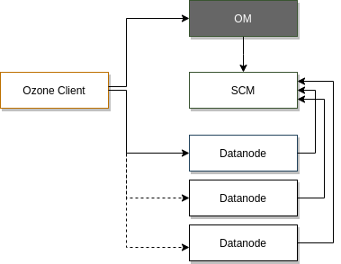
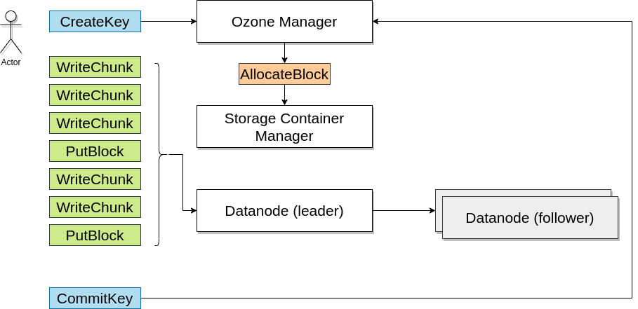
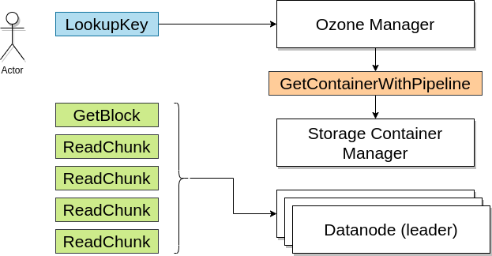

<!---
  Licensed to the Apache Software Foundation (ASF) under one or more
  contributor license agreements.  See the NOTICE file distributed with
  this work for additional information regarding copyright ownership.
  The ASF licenses this file to You under the Apache License, Version 2.0
  (the "License"); you may not use this file except in compliance with
  the License.  You may obtain a copy of the License at

      http://www.apache.org/licenses/LICENSE-2.0

  Unless required by applicable law or agreed to in writing, software
  distributed under the License is distributed on an "AS IS" BASIS,
  WITHOUT WARRANTIES OR CONDITIONS OF ANY KIND, either express or implied.
  See the License for the specific language governing permissions and
  limitations under the License.
-->

Ozone Manager（OM）管理 Ozone 的命名空间。

当向 Ozone 写入数据时，你需要向 Ozone Manager 请求一个块，Ozone Manager 会返回这个块并记录下相关信息。当你想要读取那个文件时，你则需要先通过 Ozone Manager 获取那个块的地址。

Ozone Manager 还允许用户在卷和桶下组织键，卷和桶都是命名空间的一部分，也由 Ozone Manager 管理。

每个卷都是 OM 下一个独立命名空间的根，这一点和 HDFS 不同，HDFS 提供的是单个根目录的文件系统。

Ozone 的命名空间是卷的集合，或者可以看作是相对于 HDFS 单根树状结构的森林。因此，Ozone 可以非常容易地支持部署多个 OM 来进行扩展。

## Ozone Manager 元数据

OM 维护了卷、桶和键的列表。它为每个用户维护卷的列表，为每个卷维护桶的列表，为每个桶维护键的列表。

Ozone Manager 使用 Apache Ratis（一种 Raft 协议的开源实现）来复制 Ozone Manager 的状态，这为 Ozone 提供了高可用保证。

## Ozone Manager 和 Storage Container Manager

我们可以通过跟踪一个键的读写过程来方便地理解 Ozone Manager 和 Storage Container Manager 之间的关系。

### 写入键

* 为了向 Ozone 中写入键，客户端需要告诉 Ozone Manager 将键写入哪一个卷下的哪一个桶中。一旦 Ozone Manager 确认了允许您向该桶中写入键，则 OM 需要分配一个块用于客户端写入数据；

* 为了分配一个用于写入的块，Ozone Manager 会向 Storage Container Manager（SCM） 发送一个请求。 SCM 作为数据节点的管理器，会选取三个可用于客户端写入的数据节点，然后分配块并将块 ID 返回给 Ozone Manager ； 

* Ozone Manager 会将块的信息记录在它的元数据当中，并将块和块令牌（将数据写入块的安全权限）返回给客户端；

* 客户端使用块令牌来证明自己有权限向该块写入数据，并且将数据写入对应的数据节点；

* 数据写入完成以后，客户端就会向 Ozone Manager 中更新该块的信息。

### 读取键

* 键的读取相对比较简单，客户端首先向 Ozone Manager 请求该键的块列表；

* Ozone Manager 会返回块列表以及对应的块令牌，允许客户端从数据节点读取数据；

* 客户端连接到数据节点，并提供对应的块令牌，然后从数据节点上读取数据即可。

## Ozone Manager 的主要组件

为了详细地了解 Ozone Manager ，本节针对它所提供的网络服务和持久化状态提供一个快速概述。

### Ozone Manager 提供的网络服务

Ozone 为客户端和管理命令提供网络服务，主要的服务如下：

 * 键、桶、卷 / 增删改查
 * 分块上传（Initiate, Complete…）
    * 支持大文件的多步上传
 * 与文件系统相关的调用（针对分层查询而非对象存储的扁平化命名空间进行了优化）
   * GetFileStatus, CreateDirectory, CreateFile, LookupFile
 * ACL 相关
   * 使用 [内部 ACLs]() 代替 [Ranger]() 管理访问控制列表
 * 授权令牌（获取 / 刷新 / 取消）
   * 用于安全相关
 * 管理 API
   * 获取 S3 的访问密钥
   * ServiceList（用于服务发现）
   * DBUpdates（用于 [Recon]() 下载快照）
 
### 持久化状态

以下数据将保存在 Ozone Manager 端的指定 RocksDB 目录中：

 * 卷 / 桶 / 键 表
    * 这些都由 OM 负责管理
    * 键的元数据包含用于查找数据的块 ID（其中又包含容器的 ID）
 * OpenKey 表
    * 存放已经被创建，但是还未被提交的键
 * 授权令牌表
    * 用于安全相关
 * PrefixInfo 表
    * 使用特定的索引表来存储目录级的 ACL 信息，并为分层查询提供更好的性能
 * S3 密钥表
   * 用于 S3 密钥的管理
 * 分块上传信息表
   * 用于跟踪正在进行的分块上传
 * 删除表
   * 跟踪应从数据节点上删除的块

## 需要关注的配置项

配置项 | 默认值 | 描述
----|---------|------------
ozone.om.address | 0.0.0.0:9862 | OM 的 RPC 地址，客户端需要用到
ozone.om.http-address | 0.0.0.0:9874 | 默认的 HTTP Server 地址和端口
ozone.metadata.dirs | none | 存储持久化数据的目录（RockDB）
    
