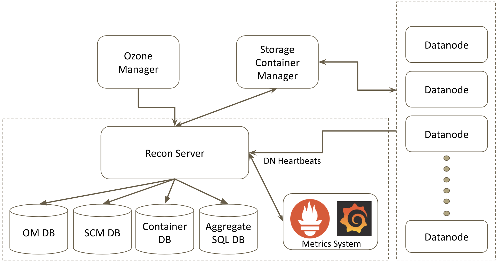
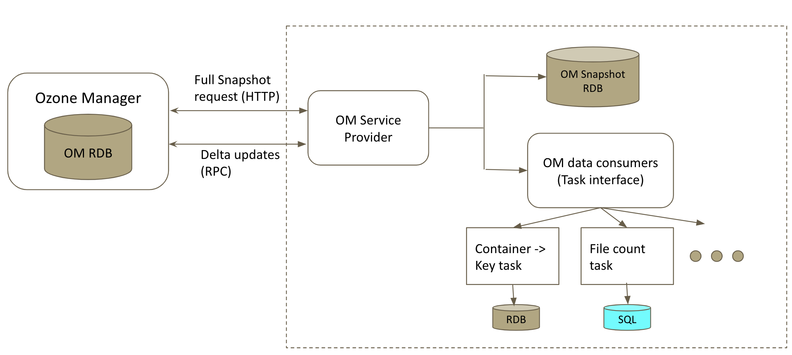
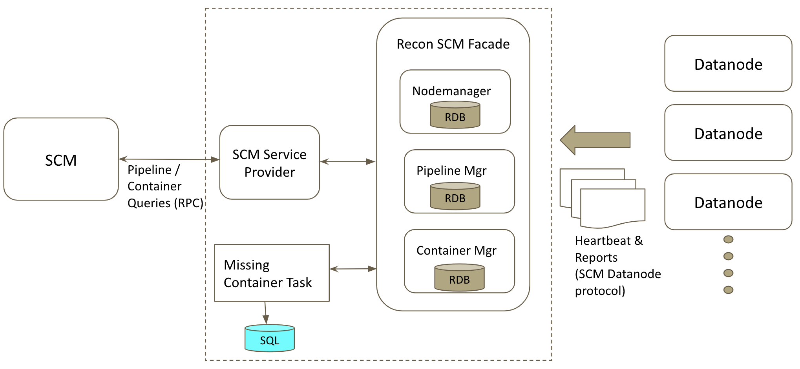

<!---
  Licensed to the Apache Software Foundation (ASF) under one or more
  contributor license agreements.  See the NOTICE file distributed with
  this work for additional information regarding copyright ownership.
  The ASF licenses this file to You under the Apache License, Version 2.0
  (the "License"); you may not use this file except in compliance with
  the License.  You may obtain a copy of the License at

      http://www.apache.org/licenses/LICENSE-2.0

  Unless required by applicable law or agreed to in writing, software
  distributed under the License is distributed on an "AS IS" BASIS,
  WITHOUT WARRANTIES OR CONDITIONS OF ANY KIND, either express or implied.
  See the License for the specific language governing permissions and
  limitations under the License.
-->

Recon serves as a management and monitoring console for Ozone. It gives a 
bird's-eye view of Ozone and helps users troubleshoot any issues by presenting
the current state of the cluster through REST based APIs and rich web UI.
    

## High Level Design

 

On a high level, Recon collects and aggregates metadata from Ozone Manager (OM), 
Storage Container Manager (SCM) and Datanodes (DN) and acts as a central 
management and monitoring console. Ozone administrators can use Recon to query 
the current state of the system without overloading OM or SCM. 

Recon maintains multiple databases to enable batch processing, faster querying 
and to persist aggregate information. It maintains a local copy of OM db and 
SCM db along with a SQL database for persisting aggregate information.

Recon also integrates with Prometheus to provide a HTTP endpoint to query Prometheus 
for Ozone metrics and also to display a few crucial point in time metrics in 
the web UI.

## Recon and Ozone Manager

 

Recon gets a full snapshot of OM rocks db initially from the leader OM's HTTP 
endpoint, untars the file and initializes RocksDB for querying locally. The
database is kept in sync by periodically requesting delta updates from the leader
OM via RPC calls from the last applied sequence id. If for any reason, the delta 
updates could not be retrieved or applied to the local db, a full snapshot is 
requested again to keep the local db in sync with OM db. Due to this, Recon can 
show stale information since the local db will not always be in sync.

The db updates retrieved from OM is then converted into a batch of events for 
further processing by OM db tasks via [Recon Task Framework](#task-framework). 

## Recon and Storage Container Manager

 

Recon also acts as a passive SCM for datanodes. When Recon is configured in the
cluster, all the datanodes register with Recon and send heartbeats, container 
reports, incremental container reports etc. to Recon similar to SCM. Recon uses
all the information it gets from datanodes to construct its own copy of SCM rocks db 
locally. Recon never sends any command to datanodes in response and just acts as
a passive SCM for faster lookup of SCM metadata.

##  Task Framework

Recon has its own Task framework to enable batch processing of data obtained 
from OM and SCM. A task can listen to and act upon db events such as `PUT`, `DELETE`,
`UPDATE`, etc. on either OM db or SCM db. Based on this, a task either implements 
`org.apache.hadoop.ozone.recon.tasks.ReconOmTask` or extends 
`org.apache.hadoop.ozone.recon.scm.ReconScmTask`.   

An example `ReconOmTask` is `ContainerKeyMapperTask` that persists the container -> key 
mapping in RocksDB. This is useful to understand which keys were part of the container 
when the container is reported missing or is in a bad health state. Another example is 
`FileSizeCountTask` which keeps track of count of files within a given file size range in 
a SQL database. These tasks have implementations for two scenarios:
 
 - Full snapshot (reprocess())
 - Delta updates (process())
 
When a full snapshot of OM db is obtained from the leader OM, the reprocess() 
is called on all the registered OM tasks. On subsequent delta updates, process()
is called on these OM tasks. 

An example `ReconScmTask` is `ContainerHealthTask` that runs in configurable 
intervals to scan the list of all the containers and to persist the state of 
unhealthy containers (`MISSING`, `MIS_REPLICATED`, `UNDER_REPLICATED`, `OVER_REPLICATED`)
in a SQL table. This information is used to determine if there are any missing 
containers in the cluster.

## Recon and Prometheus

Recon can integrate with any Prometheus instance configured to collected metrics 
and can display useful information in Recon UI in Datanodes and Pipelines pages.
Recon also exposes a proxy endpoint ([/metrics]())
to query Prometheus. This integration can be enabled by setting this configuration `ozone.recon.prometheus.http.endpoint` 
to the Prometheus endpoint like `ozone.recon.prometheus.http.endpoint=http://prometheus:9090`.

## API Reference

[Link to complete API Reference]()
   
## Persisted state

 * A local copy of [OM database]()
 * A local copy of [SCM database]()
 * The following data is persisted in Recon in the specified RocksDB directory:
     * ContainerKey table
       * Stores the mapping (container, key) -> count
     * ContainerKeyCount table
       * Stores containerID -> no. of keys count within the container
 
 * The following data is stored in the configured SQL database (default is Derby):
     * GlobalStats table
       * A Key -> Value table to store aggregate information like total
       number of volumes / buckets / keys present in the cluster
     * FileCountBySize table
       * Keeps track of the number of files present within a file size range in the cluster
     * ReconTaskStatus table
       * Keeps track of the status and last run timestamp of the registered OM and SCM 
       db tasks in the [Recon Task Framework](#task-framework)
     * ContainerHistory table
       * Stores ContainerReplica -> Datanode mapping with last known timestamp. This 
       is used to determine the last known datanodes when a container is reported missing 
     * UnhealthyContainers table
       * Keeps track of all the Unhealthy Containers (MISSING, UNDER_REPLICATED,
       OVER_REPLICATED, MIS_REPLICATED) in the cluster at any given time
 

## Notable configurations

key | default | 
description

----|---------|------------
ozone.recon.http-address | 0.0.0.0:9888 | The address and the base port where the Recon web UI will listen on.
ozone.recon.address | 0.0.0.0:9891 | RPC address of the Recon.
ozone.recon.db.dir | none | Directory where the Recon Server stores its metadata.
ozone.recon.om.db.dir | none | Directory where the Recon Server stores its OM snapshot DB.
ozone.recon.om.snapshot .task.interval.delay | 10m | Interval in MINUTES by Recon to request OM DB Snapshot / delta updates.
ozone.recon.task .missingcontainer.interval | 300s | Time interval of the periodic check for Unhealthy Containers in the cluster.
ozone.recon.sql.db.jooq.dialect | DERBY | Please refer to [SQL Dialect](https://www.jooq.org/javadoc/latest/org.jooq/org/jooq/SQLDialect.html) to specify a different dialect.
ozone.recon.sql.db.jdbc.url | jdbc:derby:${ozone.recon.db.dir} /ozone_recon_derby.db | Recon SQL database jdbc url.
ozone.recon.sql.db.username | none | Recon SQL database username.
ozone.recon.sql.db.password | none | Recon SQL database password.
ozone.recon.sql.db.driver | org.apache.derby.jdbc .EmbeddedDriver | Recon SQL database jdbc driver.

