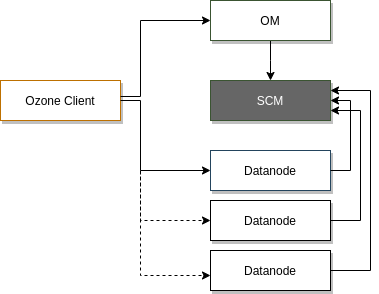

<!---
  Licensed to the Apache Software Foundation (ASF) under one or more
  contributor license agreements.  See the NOTICE file distributed with
  this work for additional information regarding copyright ownership.
  The ASF licenses this file to You under the Apache License, Version 2.0
  (the "License"); you may not use this file except in compliance with
  the License.  You may obtain a copy of the License at

      http://www.apache.org/licenses/LICENSE-2.0

  Unless required by applicable law or agreed to in writing, software
  distributed under the License is distributed on an "AS IS" BASIS,
  WITHOUT WARRANTIES OR CONDITIONS OF ANY KIND, either express or implied.
  See the License for the specific language governing permissions and
  limitations under the License.
-->

Storage Container Manager (SCM) 是*块空间管理*的 leader 节点，其主要职责是创建和管理[容器]()，而容器也是 Ozone 的主要复制单元。

## 主要职责

Storage Container Manager (SCM) 为 Ozone 集群提供了多项关键功能，承担了集群管理器、证书颁发机构、块管理器以及复制管理器的角色。

SCM 负责创建 Ozone 集群。当通过 `init` 命令启动 SCM 时，SCM 将创建担任证书颁发机构所需的集群 ID 和根证书。同时，SCM 负责管理集群中数据节点的整个生命周期。

1. SCM 作为块管理器，负责将块分配给相应的数据节点，客户端可以直接读写这些块；

2. SCM 负责跟踪所有块的副本，当有数据节点或磁盘掉线，SCM 侦测到后，会启动相应的数据节点复制缺失的块，以确保高可用；

3. **SCM 的证书颁发机构** 负责为集群中的每个服务颁发身份证书，这种证书架构可以很方便地在网络层启用双向认证（mTLS）。同时，Ozone 的块令牌也依赖于这种证书架构。

## 主要组件

针对 Storage Container Manager 的详细视图，本节提供有关网络服务和持久化数据的快速概述。

### Storage Container Manager 提供的网络服务:

 * 管道: 列出/删除/激活/停用
    * 管道是形成一组复制组的数据节点
    * SCM 负责划分 Raft group
 * 容器: 创建/列出/删除容器
 * 管控相关的请求
 * 安全模式的状态查看/修改
 * 复制管理器的启动/停止
 * 证书鉴权服务
 * 其他服务组件所需
 * 数据节点的心跳协议
   * 从数据节点到 SCM（默认是30秒）
   * 数据节点上报容器和节点的状态
   * SCM 可以添加命令到心跳回包中
   
 注意：客户端不能直接连接 SCM 。
 
### 持久化状态
 
 以下数据持久化在 Storage Container Manager 端的指定 RocksDB 目录中
 
 * 管道
   * 服务器的复制组，维护以用于查找新容器或块分配的组
 * 容器
   * 容器是基本的复制单元，数据用于防止复制不足或过度复制。
 * 删除块
   * 块数据在后台删除时，需要一个列表来跟踪进度
 * 有效证书，失效证书
   * 由内部证书颁发机构来授权其他 Ozone 服务

## 需要关注的配置选项

配置项 | 默认值 | 描述 
----|---------|------------
ozone.scm.container.size | 5GB | Ozone 使用的默认容器的大小
ozone.scm.block.size | 256MB |  数据块的默认大小
hdds.scm.safemode.min.datanode | 1 | 能够启动实际工作所需的最小数据节点数
ozone.scm.http-address | 0.0.0.0:9876 | SCM 服务端使用的 HTTP 地址
ozone.metadata.dirs | none | 存储持久化数据的目录（RocksDB）
