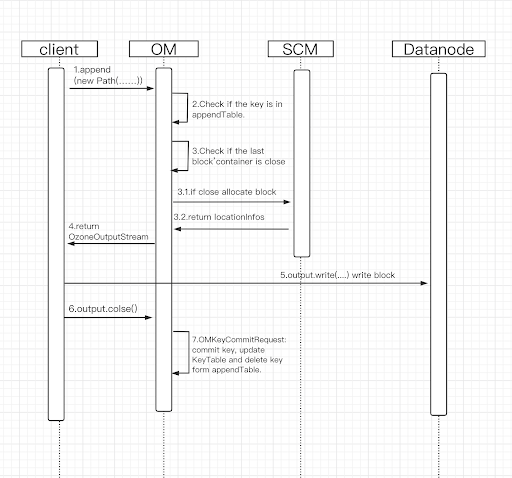

<!--
  Licensed under the Apache License, Version 2.0 (the "License");
  you may not use this file except in compliance with the License.
  You may obtain a copy of the License at
   http://www.apache.org/licenses/LICENSE-2.0
  Unless required by applicable law or agreed to in writing, software
  distributed under the License is distributed on an "AS IS" BASIS,
  WITHOUT WARRANTIES OR CONDITIONS OF ANY KIND, either express or implied.
  See the License for the specific language governing permissions and
  limitations under the License. See accompanying LICENSE file.
-->

## Introduction
This is a proposal to introduce append operation for Ozone, which will allow write data in the tail of an existing file.
 
## Goals
 OzoneClient and OzoneFS Client support append operation. 
 While the original key is appended to the write, the key needs to be readable by other clients.  
 After the OutputStream of the new Append operation calls close, other clients can read the new Append content. This ensures consistency of read operations.
## Non-goals
The operation of hflush is not within the scope of this design. Created HDDS-4353 to discuss this.
## Related jira
https://issues.apache.org/jira/browse/HDDS-4333
## Implementation
### Background conditions：
We can't currently open a closed Container. If append generates a new block every time, the key may have many smaller blocks less than 256MB(Default block size). Too many blocks will make the DB larger and also have an impact on read performance.

### Solution：
When Append occurs, determine if the container for the last block is closed. If it's closed, we create a new block. if it's open we append data to the last block. This can avoid creating new blocks as much as possible.
                                                                                                                                                                              
### Request process：

1.Client executes append key operation to OM
2.OM checks if the key is in appendTable; if so, the key is being called by another client append. Cannot be appended at this point. If not, add the key to the Append Table.
3. Check whether the last block of the key belongs to a closed container, if so, apply to SCM for a new block, if so, use the current block directly.
4. The output stream object that OM returns to Client a Block
5. Client writes data to this output stream. The Block output stream object internally invokes the send request command operation to write the actual Chunk file
6. Client closes, commitKey is called, keyTable is updated, and key is removed from appendTable.

### OM
When Om receives append( new path(...))，in OMKeyAppendRequest or OMFileAppendRequest omKeyInfo appendNewBlocks for existing Key. Before we finally call commitKey, we will only update AppendKeyTable. The omKeyInfo in the KeyTable is not updated until the new append operation closes, so the user can read the old data all the time in this process.  When the append operation closes, we need to remove omKeyInfo from AppendKeyTable.

We need to ensure that the same key can only be appended by one client at a time. Here we use AppendKeyTable to implement a key level lock.  When a new append Request is requested, it checks to see if the omKeyInfo is in AppendKeyTable. If it exists, it indicates that the key is being appended by another client, then the new request will not be executed and the exception needs to be returned to the client.


Once we get omKeyInfo in appendRequest, we need to find the last block. Through scmClient, we confirm whether the block belongs to the Container that is closed. If so, we need to allocate block. If it's open we'll just return it’s locationInfos and let the client do the append write.


### Related Proto:
```
message AppendFileRequest {
    required KeyArgs keyArgs = 1;
    optional uint64 clientID = 2;
}

message AppendKeyRequest {
    required KeyArgs keyArgs = 1;
    optional uint64 clientID = 2;
}
```
### Client
When the client reads the key, the client gets blocks of the key from OM, including block length. Then the client gets chunks of each block from Datanode.  The client maybe gets the chunks which should being appended, in this case, the client only reads the block length and ignores the other.
To write, we need to get the BlockOutputStream of the current block, close it when it's full, and then allocate a new block. Until the client calls the close method.
We can reuse most of the existing read and write logic throughout the client.


## Read and write Multi client
### Case 1
Client1 gets blocks from OM -> Client2 appending the same key -> Client2's outputStream has no close and does not update the KeyTable.  Then Clinet1 will only read the data before Append.
### Case 2
Client1 gets blocks from OM -> Client2 had appended the same key -> Client2's outputStream had closed and updated the KeyTable.  Then Clinet1 will read the data after Append.
