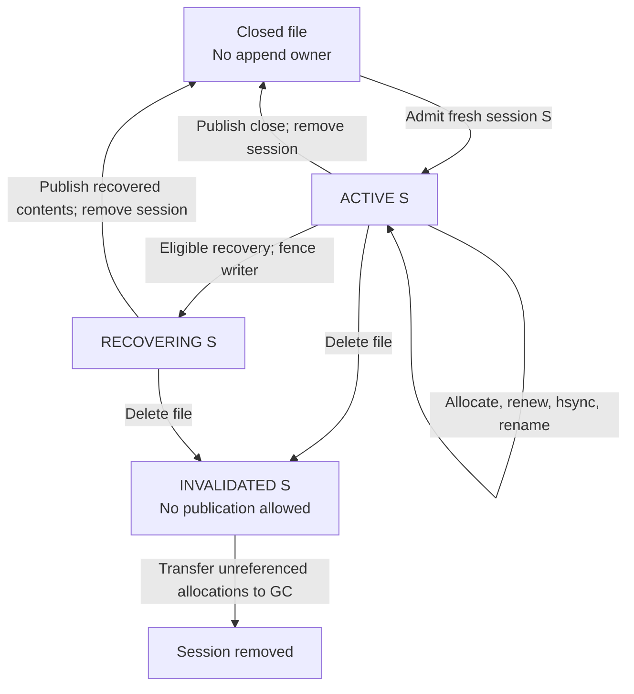
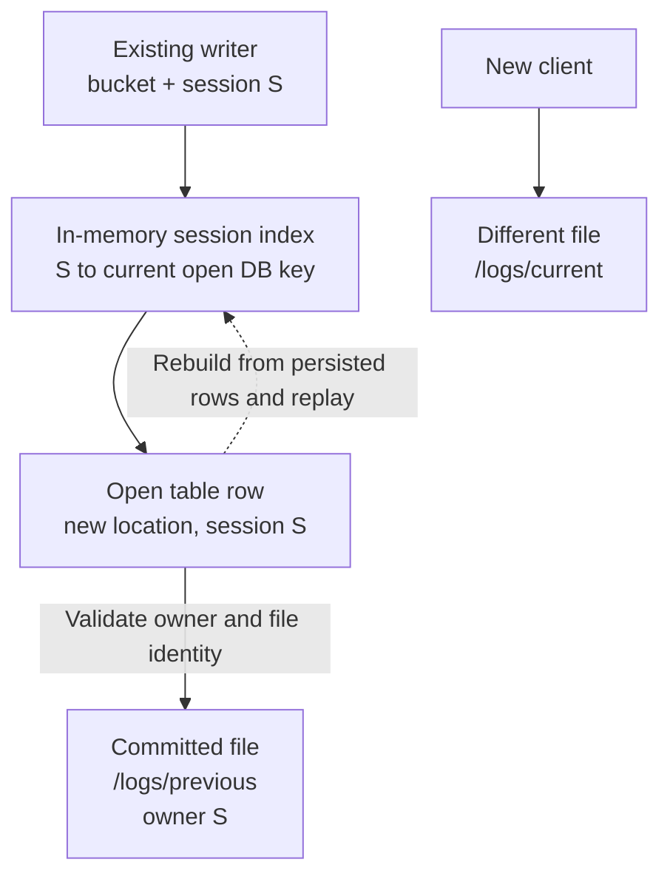
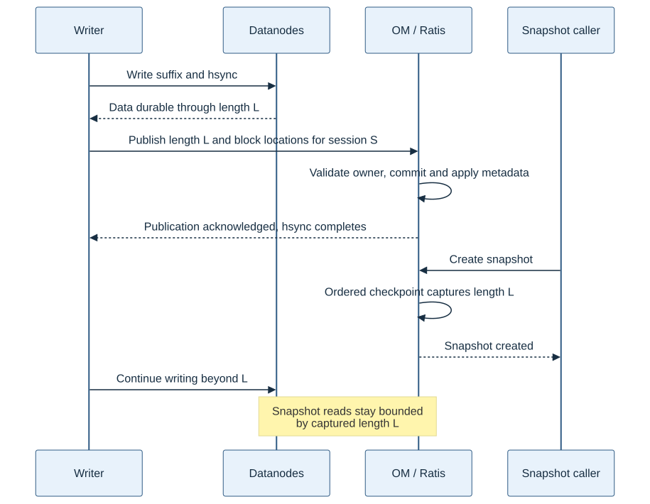
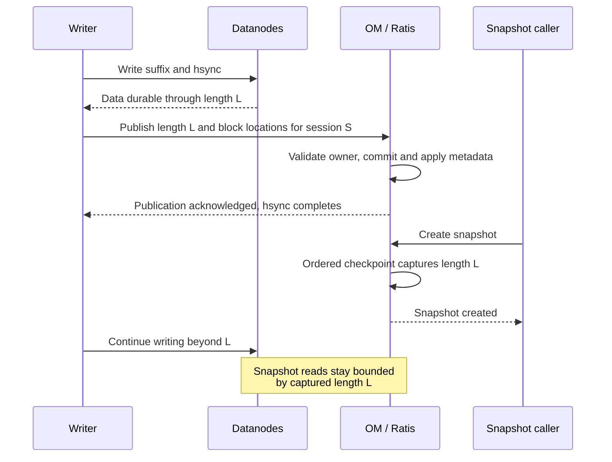
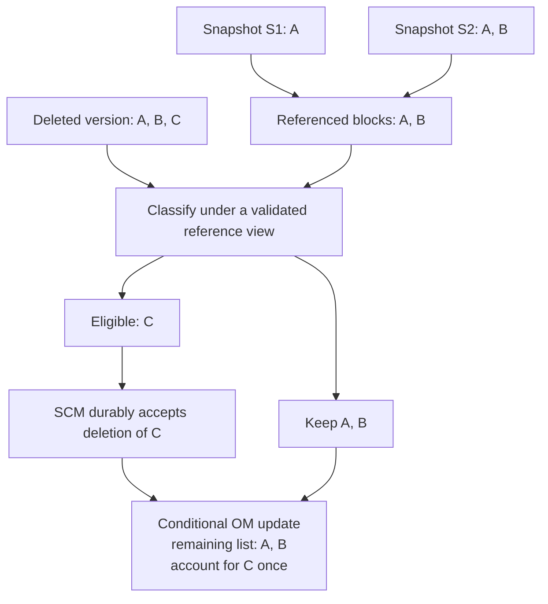

<!--
  Licensed to the Apache Software Foundation (ASF) under one or more
  contributor license agreements.  See the NOTICE file distributed with
  this work for additional information regarding copyright ownership.
  The ASF licenses this file to You under the Apache License, Version 2.0
  (the "License"); you may not use this file except in compliance with
  the License.  You may obtain a copy of the License at

      http://www.apache.org/licenses/LICENSE-2.0

  Unless required by applicable law or agreed to in writing, software
  distributed under the License is distributed on an "AS IS" BASIS,
  WITHOUT WARRANTIES OR CONDITIONS OF ANY KIND, either express or implied.
  See the License for the specific language governing permissions and
  limitations under the License.
-->

## Status and tracking

This is a proposal for discussion, not an implemented or accepted feature. The code baseline is Apache Ozone master
`29b9853270342eea4d065b1f14c332ad384f83e5`. The behavioral choices are specified below; remaining implementation details
and activation checks are listed in the [implementation plan](#implementation-plan-and-activation).

[HDDS-4333](https://issues.apache.org/jira/browse/HDDS-4333), "Ozone supports append operation", is the existing append
umbrella. Its design subtask is [HDDS-4373](https://issues.apache.org/jira/browse/HDDS-4373). The older combined append/truncate
issue is [HDDS-3714](https://issues.apache.org/jira/browse/HDDS-3714); its append subtask,
[HDDS-4240](https://issues.apache.org/jira/browse/HDDS-4240), was resolved as a duplicate with a pointer to HDDS-4333.
The earlier [design PR #1515](https://github.com/apache/ozone/pull/1515) was closed without merging.

This draft incorporates the useful requirements and review discussion from PR #1515, the new-block approach from
Wei-Chiu Chuang's later append proposal, and the review questions summarized below. It does not imply that the earlier
authors or reviewers endorse these new decisions.

Draft prepared with assistance from Codex (GPT-6 Astra) and Claude Code (Fable 5.1).

## Problem statement

OzoneFS currently rejects `FileSystem.append()`. Applications that reopen transaction logs or resume existing output files
cannot use that operation through `ofs://` or `o3fs://`. Applications may have additional requirements such as `truncate()`;
adding append alone does not establish compatibility with every HDFS application.

Reopen a closed file for one appender, keep its existing blocks immutable, and allocate new blocks for appended bytes.
Successful close publishes the extended file. Supported replicated streams also provide their existing `hflush`/`hsync`
behavior. EC append publishes on close and does not require implementing EC `hsync`.

```text
Before append:  file -> [A, B]
During append:  committed prefix [A, B]; session writes new block C
After close:   file -> [A, B, C]
```

The hard parts are session ownership, preserving the prefix through failure and cleanup, and retaining blocks referenced
by snapshots. These are prerequisites, not follow-up optimizations.

## Goals and non-goals

Goals:

- Support the ordinary Hadoop filesystem append API and append builder through both OzoneFS URI schemes.
- Preserve the existing prefix, file identity, attributes, replication configuration, and encryption information.
- Admit one appender, fence stale sessions, and make retry and recovery behavior explicit.
- Support RATIS, RATIS Streaming, and EC using existing writers and SCM allocation.
- Support snapshots, quotas, deletion, and recovery without reclaiming referenced data.
- Reuse layout-aware code for FSO and LEGACY rather than imposing an FSO-only restriction on the shared write path.

Non-goals:

- Reopening old blocks or closed containers, filling the previous partial block, or changing existing prefix bytes.
- `truncate`, `concat`, random writes, concurrent appender merging, or automatic small-block compaction.
- Native object or S3 append in OBJECT_STORE buckets.
- EC `hflush`/`hsync`, or reconstruction of an arbitrary uncommitted EC suffix after writer failure.
- A throughput guarantee for repeated small append/close cycles. Such cycles remain correct but may be expensive.

## Filesystem contract

Implement `append(Path, int, Progressable)` so the ordinary overloads and `appendFile(...).build()` use the same path.
Return an `FSDataOutputStream` positioned at the existing EOF. Append does not create a missing file or directory.
Reject directories, snapshot paths, unsupported layouts or options, and requests without write permission.
Preserve existing ACL checks, authentication, and block-token issuance.

An independently issued append cannot acquire ownership while another writer holds it, including in the same client.
Only renewable append sessions participate in automatic recovery within a bounded `FileSystem.append()` call. Ordinary
create/overwrite conflicts, including hsync-create streams, fail immediately and require application-directed recovery or
cleanup. [Session RPCs and retries](#session-rpcs-and-retries) specifies early conflicts, deadlines, and idempotent admission.
An explicit `recoverLease()` call remains available; no OM RPC waits indefinitely for a writer.

The committed prefix remains readable throughout append. Before any suffix publication, a reader opening the file sees
the original contents. A reader opening after successful close sees the extended contents. After a replicated append
hsync, a newly opened live reader can read at least the published contents and may discover additional datanode-visible
bytes in an already published under-construction suffix block. File status may therefore lag what a live reader can read.
Observing those extra bytes does not add a recovery guarantee before successful sync or close. This does not expose private
allocations absent from the published block list. An already-open reader is not required to discover later appends
automatically. EC remains close-only; snapshot reads remain bounded by their captured lengths.

An empty append preserves contents and length and does not retain a zero-length block. Allocate lazily when practical;
otherwise reclaim unused allocations through the existing cleanup mechanism after excluding the committed prefix.
Opening a session does not change the data modification time; successful publication of nonempty appended data does.

`CommonPathCapabilities.FS_APPEND` must reflect the supported path, layout, server version, and feature state. Append does
not imply `hflush` or `hsync`; those remain stream capabilities. Validate the Hadoop shell `-appendToFile` and HTTPFS path
where they delegate to the filesystem API. Unsupported append flags must fail explicitly.
`OzonePathCapabilities` currently reports `LEASE_RECOVERABLE` without checking the bucket layout, although server-side
lease recovery is FSO-only. That existing mismatch is not evidence of LEGACY recovery support; append capability reporting
must resolve the supported layout and server state rather than copying that unconditional result.

### Bucket layouts

| Layout | Metadata and scope |
| --- | --- |
| FSO | `fileTable` and `openFileTable`, addressed using parent IDs and file names. Existing public lease recovery is FSO-only. |
| LEGACY | `keyTable` and `openKeyTable`, addressed using full key names. Reuse the append/commit logic and add layout-aware recovery and namespace tests. |
| OBJECT_STORE | Reject filesystem append, consistent with the existing filesystem boundary. Native object append needs a separate API contract. |

Include LEGACY in the same implementation if its table addressing, recovery, and rename adaptations remain small. Do not
claim support merely because the write path works: the same failure and cleanup tests must pass. If LEGACY requires a
larger namespace change, document and review that split before narrowing the release scope. Do not change LEGACY path
normalization or the existing filesystem-path configuration as a side effect of this feature.
`OMRecoverLeaseRequest` currently uses FSO layout and `OmFSOFile`; its fencing/recovery flow needs layout-aware committed/open
key addressing and response handling for LEGACY.

### Replication and durability

| Stream | Publication and recovery |
| --- | --- |
| RATIS / RATIS Streaming | Close publishes the suffix. `hflush`/`hsync` retain the capabilities supported by that stream, replication factor, and configuration. Recovery preserves all guaranteed synchronized bytes and the original prefix. |
| EC | Write new EC block groups and publish on successful close. No new EC sync capability. Recover an uncommitted append by discarding its private suffix after fencing the session. |

An old partial EC stripe remains unchanged; a new block group starts with its own stripe layout. Reads and seeks across
that boundary must be tested. EC session cleanup must not call the replicated-block finalization algorithm.

EC has no intermediate durability guarantee: successful writes before close can all be discarded on recovery, regardless
of the suffix's size or age. EC append is unsuitable for WALs, Solr transaction logs, or applications requiring incremental
durability through hflush/hsync. Applications using close-only publication must bound their sessions to their loss budget.

If close committed but its response was lost, the suffix is committed data and must survive retry or recovery. Transport
failure is not evidence that commit failed. This proposal does not promise exactly-once application writes after a process
restart: an application must inspect the recovered file before deciding whether to append its payload again.

Append does not scan every old block for full replication. Missing one replica or a reconstructible EC fragment does not
by itself prevent writing new blocks. Append neither repairs nor certifies the old prefix. Known allocation/write errors
must fail normally; unreadable old data remains a read/repair failure and must never be silently skipped or truncated.

## OM ownership and metadata

Use the existing committed and open tables, bucket/key locks, OM Ratis transactions, and retry cache. A new append table
or a general block reference-count database is not proposed.

Ownership must be discoverable from the committed record and match the corresponding open record. It is independent of
whether `hsync` has occurred. Do not use `HSYNC_CLIENT_ID` as a universal append marker: existing readers, GC, and cleanup
interpret that marker as hsync state, and EC does not have that capability. Classify writer ownership separately from
sync visibility. If a replicated append publication also carries `HSYNC_CLIENT_ID`, it must identify the same session;
the append owner/session fields remain authoritative for its lease. Neither a snapshot's historical markers nor hsync
metadata alone grant renewable append ownership. Complete the [writer-state audit](#appendix-b-writer-state-audit) before activation.

### Metadata representation

Extend `OmKeyInfo`/`KeyInfo` with optional, server-owned append fields. Keep them separate from user-supplied key metadata.
Use the field names below as the initial schema proposal; assign protobuf numbers against the implementation branch.
Reuse the existing location lists and identity fields. The open record stores only allocations from this append session;
the committed record remains the authoritative source of the immutable prefix.

| Record | Fields and meaning |
| --- | --- |
| Committed file | Optional `appendOwnerSessionId`. Existing `objectID`, location fields, block list, and `dataSize` identify the file and its published contents. No owner means there is no append reservation; ordinary open writers must still be checked. |
| Open append record | Optional `appendSession`, whose presence distinguishes append from ordinary create. It contains `phase` (`ACTIVE`, `RECOVERING`, or `INVALIDATED`), immutable `prefixLength` and `prefixBlockCount`, `openedAt`, and `lastRenewedAt`. The existing session/file identities and location list hold only this session's suffix allocations, including any already published suffix blocks. |
| Retained prefix | The first `prefixBlockCount` locations in the current committed file, totaling `prefixLength`. Their identities and lengths remain immutable while the session owns the file, including an old partial final block. They are not copied into the open record. |
| Published suffix | Recorded in the committed file's current block list and length. It is a recovery lower bound and must not be treated as an unused private allocation. |
| Session index | Derived bucket-scoped session ID to open DB key mapping. It is rebuilt from active OM metadata and is not serialized as another table or record. |

At sync, close, or recovery publication, OM reads the committed prefix under the ownership lock and merges it with the
validated session suffix. Check prefix boundaries and preserve the previously published suffix lower bound. Clients send
suffix locations and total logical length; they do not replace or resend the prefix manifest. A returned file view may
include retained locations for compatibility, but those locations are never persisted as open-session allocations.

This keeps allocation and renewal row rewrites proportional to the session's suffix rather than the pre-existing file.
It does not make large suffix rows or full committed-file publication constant-size. Cleanup must still distinguish
published suffix blocks from private allocations; removing the prefix copy does not make every open-row block reclaimable.

Committed and open records use different `OmKeyInfo` codecs today. Preserve the append owner in committed records and
the session details in open records; do not accidentally drop either during serialization, rename, attribute updates,
checkpoint installation, or network translation. Snapshot copies preserve published content, but their owner/session
fields must never authorize a writer or cause snapshot readers to discover a live EOF.

The pair of file identity and fresh session ID identifies ownership. `updateID` remains the record's OM transaction
version; it changes on legitimate mutations and must not be compared unconditionally with its admission value on every
append RPC. `getGeneration()` currently returns `updateID`, and `expectedDataGeneration` checks are conditional-write
semantics, not an exclusive lease. Preserve those checks where applicable without using them as the sole writer fence.
An absent or invalidated old open record cannot authorize a commit after the file is recreated or another session closes.

### Single-writer lease

In this proposal, a renewable lease means an append owner matched to an open append session with `lastRenewedAt`.
Ordinary hsync-create streams use the existing recovery mechanism but do not renew this lease: same-block hsync can skip
OM, so an old modification time does not prove the writer is dead. Append must report an ordinary-writer conflict even
after its soft limit; the application may explicitly recover a confirmed-abandoned hsync stream before retrying append.
Ordinary non-hsynced writers retain age-based cleanup. No renewal requirement is added to either kind of ordinary writer.

The exclusive lease starts at admission, before allocation or the first sync, for every supported append stream.
Readers remain allowed. Do not hold a namespace lock for the lifetime of the stream or rely on a client-local lock. The
[OM state transitions](#om-state-transitions) define ownership checks and fencing; [RPC retry rules](#session-rpcs-and-retries)
distinguish a retransmitted admission from an independent append.

The lease belongs to the file/session, so rename preserves its owner and renewal time while updating the session index.
Neither rename nor unrelated attribute changes count as writer renewal. Keep lease activity separate from file data mtime
and creation time.

Reuse Ozone's existing lease eligibility, fencing, and recovery machinery where applicable, extending it to append before
hsync and to supported layouts. Existing recovery uses open-key modification time; append tracks lease activity separately.
Data writes go directly to datanodes, and unchanged-state append hsync may skip OM. Advancing append hsync always publishes
to OM, but data writes and unchanged-state sync calls cannot substitute for lease renewal. EC append must not require
hsync for renewal.

The client automatically renews the lease while the stream remains open, including idle periods, independently of data
publication. Successful, timely renewal keeps the lease valid without requiring data progress; an idle stream can retain
ownership indefinitely while renewing.
Validated OM operations may refresh the lease, with background renewal covering periods without such operations.
Persist renewal time in the existing open record through OM Ratis and acknowledge renewal only after the update is
committed and applied. Use the existing double buffer for RocksDB persistence; each renewal need not wait for a separate
DB flush. Expiry checks must use current applied lease state, and a replacement leader must recover committed renewals
before making recovery decisions. This design preserves acknowledged renewal times across failover; the leader-local
renewal [alternative](#alternatives) instead restarts the recovery timeout after takeover.
Reuse client scheduling and bounded batches through `RenewAppendLeases`. Set the interval with enough margin for scheduler
delays, clock uncertainty, and retryable failures before the configured soft limit. The existing
`ozone.om.lease.soft.limit` defaults to `60s`; the `7d` hard limit does not determine a safe renewal interval. Finalize
timing parameters through failure/load validation; the [performance examples](#performance-considerations) are not defaults.
Operators can trade slower abandoned-writer recovery for lower renewal load by increasing the soft limit and renewal
interval together, while retaining that safety margin. Increasing the soft limit alone does not reduce renewal traffic.
This soft limit is shared with ordinary hsync lease recovery, including HBase recovery. Keep its default unless the
recovery latency budget of every affected application permits an increase; do not raise it solely to reduce append load
on a WAL cluster. Evaluate a separate append timeout only if measurement establishes the need for independent tuning.

### Admission

1. Resolve the file and check its layout, permissions, feature gate, and writer/recovery state under the existing lock.
   Reject append while an earlier ordinary create/overwrite session targeting the file is active, including before its
   first hsync. Append must not cancel an active overwrite to acquire ownership.
2. Atomically reserve the committed file for the new client ID and create the open append record in the same OM
   transaction. Update the derived session index when applying the transaction. Keep the committed prefix block list and
   length unchanged. Readers must not see preallocated suffix blocks.
3. Preserve file identity, creation time, ACLs, encryption information, and replication. Use a separate session start time
   for expiry so an old file does not become an immediately expired new append.
4. Return the session ID, prefix boundaries, file attributes, and any new allocations. Track allocations that lose an
   admission race for cleanup; block allocation itself is not a distributed transaction with OM admission.

Make ordinary create/overwrite sessions discoverable during append admission, including sessions opened through other
APIs or older clients. Check for conflicts and reserve ownership atomically so a racing overwrite cannot slip between
the check and admission. Once the earlier writer completes or is terminated through recovery/cleanup, a retried append
resolves the current file and its EOF again; it must not reuse the contents observed before the overwrite. If the file
no longer exists, append fails normally. Fence terminated sessions at the server so a delayed commit cannot replace
appended data, even after the append has closed. Do not rely on clients opting into conditional generation checks.

Ordinary non-hsynced writes keep their existing age-based cleanup policy; append does not add renewable leases to them or
cancel their pending writes. `ozone.om.open.key.expire.threshold` defaults to `7d`, and
`ozone.om.open.key.cleanup.service.interval` to `24h`, with further delay possible from cleanup backlog. Eligibility uses
the stored creation time, which an overwrite can inherit; it is not a fresh seven-day timer starting at the crash.
`recoverLease()` cannot recover such a pending overwrite: the committed file may look closed because it has no hsync
owner. Consequently an abandoned ordinary overwrite can block append until cleanup. Report this as a writer conflict,
not recovery-in-progress with a promise of prompt completion. Once cleanup removes the open record, retry may admit append;
the old writer's late commit must fail. A never-published new file still fails append as missing.

Operators can inspect conflicts with `ozone admin om lof --json`; there is no supported per-session abort for ordinary
non-hsynced writers today. If the application permits a new name, confirm the failed writer has stopped, copy the committed
file to a fresh path, verify and close the copy, then redirect the application before appending there. This preserves only
committed contents, does not recover the failed writer's unpublished data, and does not unblock the original path. It is
not a general WAL-recovery procedure; applications requiring the original path must wait for cleanup or use a future abort.

This admission block preserves exclusive append ownership without cancelling earlier ordinary writers. An append-side
prefix check would not prevent an earlier ordinary writer from committing after append closes and replacing its contents.
That replacement could be valid under a last-commit-wins contract; this proposal excludes it. Allowing concurrent admission
while preserving the chosen contract would require broader fencing
of ordinary writers, including commits from older clients. The retained rule preserves ordinary-write behavior outside
append reservations, at the availability cost described above. Improving that delay is separate cleanup/lease work.

**Separate follow-up:** add an administrator-triggered abort for a confirmed-dead ordinary open writer. This is not part of
append v1. The operation must identify the exact open record, require authorization and an explicit destructive confirmation,
atomically fence the writer through OM Ratis, reject late allocation/commit, audit the action, and reuse the existing
block-deletion and snapshot-reference checks. It must be race-safe when the writer commits, closes, or changes before the
abort applies; exposing the background `DeleteOpenKeys` request directly is not sufficient.

Every independent successful reopen gets a fresh session ID. `OpenVersion` remains a block-location version selector,
not the writer identity or a required append counter; separating prefix and suffix does not require changing it.

Conflict detection must include applied cache entries as well as RocksDB rows, with cache tombstones overriding older DB
entries. The existing `listOpenFiles()` DB scan is not an admission check: it can miss a writer admitted but not flushed.
Use the resolved file's open-key prefix and a cache-aware lookup under the namespace lock, or an equivalent derived view
maintained from the same open records. Check every active conflicting session, including ordinary writes without an
append marker; an empty session-index lookup alone does not prove that append can acquire the file.

### OM state transitions

`CLOSED` means there is no append owner or live append record. `ACTIVE` permits writer mutations. `RECOVERING` retains the
reservation while fencing the original writer; helpers may resume the same recovery. `INVALIDATED` permits cleanup only,
for example after deletion. Closed or invalidated sessions never become active again; reopening creates a new session.
Map these phases onto the shared recovery/deletion helpers so append state and existing flags cannot disagree.



<details>
<summary>Mermaid source: session lifecycle</summary>


```mermaid
flowchart TB
    C["Closed file<br/>No append owner"] -->|"Admit fresh session S"| A["ACTIVE S"]
    A -->|"Allocate, renew, hsync, rename"| A
    A -->|"Publish close; remove session"| C
    A -->|"Eligible recovery; fence writer"| R["RECOVERING S"]
    R -->|"Publish recovered contents; remove session"| C
    A -->|"Delete file"| I["INVALIDATED S<br/>No publication allowed"]
    R -->|"Delete file"| I
    I -->|"Transfer unreferenced allocations to GC"| X["Session removed"]
```

</details>

Session removal does not imply immediate physical block deletion.

All guards below read current applied metadata under the existing lock. Successful transitions update table caches and
the derived index consistently during Ratis application, and persist the corresponding records in the OM DB batch.
The index is not part of that batch. Failed guards must leave ownership and published contents unchanged.
FSO allocation, sync, close, and recovery also require live ancestor reachability under the namespace lock. Renewal is a
timestamp-only exception. The [recursive-deletion rules](#recursive-deletion) define its checks and cleanup independently
of lease freshness; matching owner/open rows alone do not authorize data changes after recursive deletion.

| Operation | Guard and transition |
| --- | --- |
| Admit append | Existing file, feature finalized/enabled, permissions valid, no append reservation or active ordinary writer. Add the owner and `ACTIVE` open record, initialize prefix boundaries and lease times, and add the session-index entry. Keep published data and namespace usage unchanged. |
| Allocate suffix block | Matching owner and `ACTIVE` open record. Add only a new session allocation to the open record. Allocation prepared through SCM must be revalidated during OM application; an allocation losing this race goes through unused-allocation cleanup. |
| Renew | Matching file/session identity, committed owner, and `ACTIVE` open record. Advance `lastRenewedAt` monotonically without changing published bytes, file data mtime, or prefix boundaries. Skip the ancestor walk; renewal cannot prevent unreachable-session cleanup. A fenced, removed, or terminal session cannot renew. |
| Hsync | Matching owner and `ACTIVE` phase, supported stream, durable suffix, valid allocated locations, unchanged prefix, and no regression of published bytes. Update committed length/locations and quota delta while retaining ownership and the open record. Preserve concurrent attribute and renewal updates. |
| Close | Same ownership and data checks as publication. Publish final contents, account for the delta once, clear the owner, remove the open record and index entry, and enqueue only unused private allocations for cleanup. |
| Start recovery | Matching reservation and current recovery eligibility, including renewals already applied. Change `ACTIVE` to `RECOVERING` before datanode recovery begins. Keep the reservation; reject original-writer allocation, renewal, sync, and close. Repeated recovery joins the existing phase. |
| Complete recovery | Same fenced session still owns the same file and remains `RECOVERING`. Validate the recovered suffix and preserve the published lower bound, then publish, clear ownership, and remove the open record/index entry. EC preserves committed data and discards only its unpublished suffix. |
| Rename | Preserve owner and phase, move the committed/open rows together, update the session index and existing snapshot rename metadata. Do not refresh the lease merely because the file moved. |
| Delete | Remove the live namespace entry. Direct file deletion invalidates its open record and removes its index entry. Recursive deletion blocks descendant data operations through the reachability guard; timestamp renewal may continue until cleanup invalidates the session. Prevent late RPCs from recreating the file. Snapshot references still govern block reclamation. |
| Cleanup | Classify append sessions before ordinary expiry branches. Use `lastRenewedAt` and phase, never creation time or data mtime, for their inactivity-based eligibility. Re-read current applied state before fencing or recovery; process INVALIDATED rows regardless of age. Reclaim only allocations proven unreferenced by committed files, snapshots, and live sessions. |

SCM allocation and client-assisted datanode recovery remain outside Ratis state-machine application. Their results carry
the session identity back to OM, where ownership and phase are checked again. A concurrent delete, recovery completion,
or new admission can invalidate a result obtained earlier. A recovery flag in a request does not by itself authorize
publication into a different session.

### Writing and publication

`AllocateBlock`, sync, close, and recovery use the ownership guards above. Publication assembles the prefix from the
committed record and validates the submitted suffix against this session's allocations and published lower bound.

For supported append hsync operations, make the data durable at datanodes and publish the corresponding total length and
block locations in OM before returning success, including when the current block has not changed. Retain ownership.
A sync may omit redundant publication only when the same length and block metadata have already been confirmed for that
session. Datanode success followed by OM failure leaves hsync unsuccessful or awaiting an idempotent retry. Order publication
with snapshot creation through OM Ratis and the existing checkpoint/double-buffer barrier; see [Snapshot reads](#snapshot-reads).

The [filesystem contract](#filesystem-contract) defines live-reader visibility; neither live nor snapshot readers treat the
old final prefix block as under construction merely because append ownership exists. Close follows the transition table:
a failure leaves either the previous published state or the committed extended state, never a partially replaced prefix.
Repeated publication must not duplicate blocks or quota charges.

Merge publication with the current committed attributes so an append opened earlier does not undo concurrent ACL or
metadata updates. Preserve existing encryption information; invalidate or update cached whole-file checksums and content
metadata derived from the old bytes. Attribute-only updates must not accidentally release the writer reservation.

### Namespace operations and competing writes

Reject new create/overwrite while append owns the file. All commit paths, including previously opened writes and older
clients without append fields, must honor the reservation and applicable generation checks. Existing ordinary hsync
streams can be superseded by an overwrite commit, which marks the previous open key `OVERWRITTEN_HSYNC_KEY`.
Append instead reserves the file until close, recovery, or
deletion. This proposal preserves ordinary create/hsync overwrite behavior when no append reservation exists; sharing a
stream class does not make those sessions exclusive append owners. Test both behaviors and their admission races.

#### Rename while append is active

Allow rename while append is active, including moving an ancestor directory.
The vendored Hadoop contract test, `AbstractContractAppendTest.testRenameFileBeingAppended()`, explicitly renames before
closing the stream and expects the appended data at the destination. Rejecting rename would break that contract and can
make open-log applications fail or stall; it does not inherently corrupt data or affect applications that close first.
The [validation plan](#validation) adds the currently missing append contract subclass and enables its capability flag.

```text
append("/logs/current") -> session S
rename("/logs/current", "/logs/previous")
create("/logs/current") -> a different file
write/hsync/close(S) -> updates "/logs/previous" only
```

Current FSO rename rejects an hsync-open file. Its successful rename path updates the committed namespace and snapshot
rename tracking, not `openFileTable`. LEGACY rename similarly does not maintain an append session in `openKeyTable`.
Removing the FSO rejection alone is insufficient: the existing writer retains its opening path, and FSO allocation and
commit use `OmFSOFile` to resolve that path again.

For a direct file rename, use the committed record's append owner and current file location to read the corresponding open
entry under the existing namespace lock. No scan of the whole open table is needed; a file without an active owner needs
no append-session lookup. Preserve the session ID, prefix boundaries, suffix allocations, and recovery state. Update the
committed and open-session locations in one OM transaction, with matching cache changes and DB batch writes. Update the derived
session index when applying the transaction. Preserve the existing snapshot rename tracking in that batch.
Move the open row with the file: FSO uses parent ID, leaf name, and client ID; LEGACY uses the full key name and client ID,
within their respective volume/bucket prefixes.

Moving an open row is not enough to support an already-open stream. Allocation, sync, close, and in-progress recovery
must resolve its session to the current file location without trusting the original path. Repeated renames and OM
failover must preserve this association under the identity and ownership checks in [Metadata representation](#metadata-representation).
A new file at the old path must never receive the old writer's blocks. Path-based append or recoverLease requests resolve
the file currently at that path; only an existing session follows the renamed file.

Keep the existing open tables as the durable source of session locations. Their row keys contain the session ID and
current file location. Maintain a derived in-memory index from bucket-scoped session ID to current open DB key for direct
lookup after rename. No additional persistent locator table or alias records are required. The index contains only
locations; ownership, recovery state, and block lists remain in the committed and open records.

Update the index with successful admission, rename, and session-removal transactions under the same synchronization as
the corresponding OM cache changes. It must reflect applied metadata, including updates not yet flushed to RocksDB.
Repeated rename replaces the index target directly; do not build forwarding chains. A writer continues supplying the
same session handle, even when another client reuses its original path. Session authorization and index removal follow
the [OM state transitions](#om-state-transitions), including during recovery and cleanup.

Rebuild the index after startup or checkpoint installation from the active OM metadata and incorporate subsequent Ratis
replay. Define a consistent reconstruction boundary so cache updates and replay cannot be missed or applied twice.
Before serving session operations or running relevant recovery/cleanup work, ensure the index represents the current
applied state. A follower taking over must use an index caught up with that state. Do not reconstruct live sessions from
bucket snapshot views or trust an index that predates checkpoint replacement. Measure index memory and rebuild time at
large open-session counts and test failures between transaction application and DB flush.

The existing `snapshotRenamedTable` retains its separate role of recording historical names for snapshots and GC.



<details>
<summary>Mermaid source: session lookup after rename</summary>


```mermaid
flowchart TB
    W["Existing writer<br/>bucket + session S"] --> I["In-memory session index<br/>S to current open DB key"]
    I --> O["Open table row<br/>new location, session S"]
    O -->|"Validate owner and file identity"| F["Committed file<br/>/logs/previous<br/>owner S"]
    N["New client"] --> P["Different file<br/>/logs/current"]
    O -.->|"Rebuild from persisted rows and replay"| I
```

</details>

FSO ancestor-directory rename preserves directory object IDs, so descendant committed/open row keys based on those IDs
and their index entries do not need rewriting merely because an ancestor moved. Session RPCs must avoid resolving the
stale original full path, and cleanup/recovery must not rely on cached full paths. In LEGACY, both filesystem rename
iterators already rename affected keys individually; each operation must maintain the corresponding append session.
This does not make the whole LEGACY directory rename atomic. Apply the same ownership rules to bulk rename paths.

Update expiry and cleanup along with foreground RPCs. For example, `getExpiredOpenKeys()` currently derives a committed
DB key by stripping the client-ID suffix from the open DB key and constructs hsync commit requests using a stored full
path. Those assumptions must be adapted wherever the chosen lookup strategy or a directory rename invalidates them.
Revalidate background work against the current session state so a rename racing with recovery or cleanup cannot publish
at a stale location or reclaim blocks still referenced by the file. Keep rename authorization, destination checks, and
existing cross-bucket restrictions; session RPCs retain authentication and owner validation when using a handle.

#### Recursive deletion

FSO recursive deletion removes the ancestor directory from the live namespace before background cleanup visits its
descendants. A descendant's committed row, open row, and session-index entry can still exist during that interval.
Keep deletion asynchronous: reject allocation, publication, and recovery for unreachable files even if their open records
still say `ACTIVE` or `RECOVERING`. Do not enumerate and invalidate every descendant session in the delete transaction.

Validate reachability using current file and ancestor identities, including applied cache changes, when admitting any
allocation, sync, close, or recovery transition. Order the check and mutation with rename/delete through OM's
namespace locking and Ratis application. A renamed ancestor remains valid; a deleted ancestor blocks data operations.
Recreating the same pathname creates different identities and cannot revive the old session. Checking only the immediate
parent or resolving the writer's original path is insufficient.

Renewal skips the ancestor walk but still requires the identity, owner, and phase checks in the transition table. It may
advance a timestamp before cleanup discovers a deleted ancestor; that grants no permission to allocate or publish data.
It must not recreate removed rows or extend the lifetime of an unreachable session.

Specify the current-ancestor lookup using existing directory metadata, including rename, cache/tombstone handling, and
reconstruction after failover. Measure deep-path lookup cost as part of hsync latency. If a lookup fails, fail the data
operation without publishing; do not treat that error as proof that blocks are reclaimable.

Reuse `DirectoryDeletingService`'s bounded deleted-directory traversal to discover unreachable append sessions regardless
of lease freshness. `OMDirectoriesPurgeRequestWithFSO.applyMovedSubFiles()` already finds hsync owners of purged files and
marks their open records deleted; extend this handling to append owners and the session index. Discovery must occur before
the reclaimability filter: a snapshot can retain a descendant file and prevent it from reaching the purge request.
For those files, submit invalidation-only work without purging the retained file or its referenced blocks. Bound inspected
entries and resume traversal rather than adding a separate whole-open-table scan with ancestor walks.

Revalidate bucket/file/session identity and live unreachability against current active metadata under the namespace lock.
Historical snapshot owner fields alone cannot authorize invalidation. During Ratis application, mark the open session
`INVALIDATED` in the cache and remove its index entry; persist invalidation and retain durable cleanup work until allocations
are transferred through the existing deletion rules. Cleanup must process invalidated sessions without waiting for lease
expiry. In-flight datanode writes can still finish, but OM publication fails; snapshot retention and delayed-write cleanup
continue to govern reclamation.

### Recovery and cleanup

Update `getExpiredOpenKeys()` to classify append records before either generic non-hsync or hsync cleanup branch. A fresh
renewal protects an append session even when its creation time is older than the ordinary seven-day expiry threshold.
Apply the configured hard limit to `lastRenewedAt` for background expiry and the soft limit for foreground recovery,
rechecking current applied state before mutation. Expired append sessions enter append-aware recovery/cleanup; never move
a whole open suffix to deletion merely because it lacks `HSYNC_CLIENT_ID` or has an old creation time. Published and
snapshot-referenced suffix blocks remain protected. `INVALIDATED` sessions follow deletion independently of renewal time.

After the [recovery transition](#om-state-transitions), recover/finalize only the current replicated suffix using the
existing lease recovery protocol. Never treat retained prefix blocks as allocations of the new writer.

Append-triggered recovery and explicit `recoverLease()` share this state and the existing client-assisted recovery flow.
Other helpers must be able to resume it after the initiating caller disappears or OM fails over. Client waiting follows
the [bounded retry rules](#session-rpcs-and-retries); datanode recovery stays outside OM Ratis application.

The pre-append prefix and every byte guaranteed by a successful sync are a lower bound on the recovered contents. Unsynced
replicated bytes may be retained if existing recovery can validate them. The next append starts at the recovered EOF.
For EC, preserve the previously committed prefix and discard an unpublished append suffix without reconstructing it.

Apply the transition table's cleanup checks before reclaiming abandoned suffix allocations. Datanode token, finalization,
and container lifecycle rules must also handle delayed writes without allowing deleted allocations to reappear or leak
indefinitely; OM rejection of publication alone is insufficient.

Recovery must work before the first append `hsync`, including immediately after admission and before any new allocation.
This differs from creating a new file that has never been published. For a previously nonexistent path created without
hsync or close, preserve the current missing-committed-file behavior; append does not implicitly create an empty file there.

## Client and protocol changes

Add an `AppendFile` operation to the OM protocol and route both filesystem implementations through it, using the RPC fields
below. The admission response also preserves file attributes. Extend messages with optional fields where possible and
assign wire numbers during implementation.

### Session RPCs and retries

Only a renewable append owner can enter this automatic waiting/recovery path. Ordinary writers, including hsync-create
writers, return a conflict requiring the application's explicit recovery or cleanup procedure. A new append call fails
promptly if its OzoneFS `FileSystem` instance knows it owns an active stream for the file. This is a best-effort local
optimization, not a JVM-wide guarantee: separate instances, including distinct UGIs or disabled filesystem caching, can
fall back to remote waiting. OM enforces exclusive ownership in every case.

During remote waiting, compare OM's committed `lastRenewedAt` values from its applied state for the same session.
An advance causes an early writer-conflict error. This needs neither the owner's nor the waiting client's renewal interval.
Unchanged renewal state does not prove death; use server-reported eligibility and bounded read polling, never an inferred
missed heartbeat, to decide when to request recovery. Transport retries of an uncertain admission retain their invocation
identity and are not new append calls.

OM's append-conflict and status responses identify writer kind, session, phase, applied `lastRenewedAt`, and the
server-computed remaining duration until recovery eligibility. The default total wait is the initial duration plus a bounded
client recovery budget established by failure/load testing, measured with a monotonic client clock. An explicitly shorter caller
deadline caps this wait and may return a conflict before eligibility. Do not require matching client/server soft-limit
settings or reset the total deadline on each poll, renewal, or policy change. The server duration is advisory; eligibility
is revalidated during recovery. Honor interruption/cancellation and include datanode work and RPC retries in the deadline.
On expiry, distinguish a still-held lease from recovery timeout; preserve state for another caller. Report uncertain
admission after a lost response as such. Permanent errors fail immediately. Return a stream only after admission succeeds;
individual OM RPCs remain short and no waiting loop runs under a namespace lock or in Ratis application.

Use read polling for waiting, reusing the file-status path and `isFileClosed()` where applicable. The latter currently
checks only the hsync marker; extend it to recognize append ownership and recovery before first sync and for EC. Expose enough
lease/recovery status through the read path to distinguish append from ordinary hsync and decide when to attempt recovery;
a closed boolean alone cannot do that. Use current leader-applied status to assess renewal progress for early rejection.
Issue writes for admission and recovery progress, not for each status poll. A replacement helper must resume stalled
client-assisted recovery rather than only wait for the file to become closed. Read results are hints: OM revalidates
ownership, eligibility, and file identity atomically on every mutation, including after stale reads or namespace changes.
Current explicit `recoverLease()` propagates `KEY_UNDER_LEASE_SOFT_LIMIT_PERIOD`; it does not itself wait out the soft
limit. Automatic append recovery must not use `OZONE.CLIENT.RECOVER.LEASE.FORCE` to bypass eligibility.

| RPC | Required session information |
| --- | --- |
| `AppendFile` | Resolve volume, bucket, and path using the ordinary RPC request identity. On admission return session/file identity, prefix boundaries, published length, and suffix allocations. Conflict replies classify the writer and expose applied `lastRenewedAt` and server-computed remaining eligibility time for append owners. |
| Allocation, hsync, and close | Carry bucket scope and session ID; resolve the current open record through the session index and validate its file identity, committed owner, and live ancestor reachability. Append publication submits suffix locations and total length; OM supplies the prefix. Keep path fields for protocol compatibility and diagnostics, but an old path must not redirect the writer to a replacement file. |
| `RenewAppendLeases` | Carry a bounded list of bucket/session identities. Return a result per session so a concurrently closed or fenced stream does not prevent other sessions from renewing. Record successful renewal times through Ratis before returning success. |
| Lease recovery | The initial path-based request resolves the current file. Return the fenced session identity with the existing recovery information; completion refers to that session even if rename occurs while the helper contacts datanodes. Automatic initiation is restricted to append sessions; ordinary hsync streams require explicit recovery. |

Distinguish the open session ID from the Hadoop RPC client ID/call ID used by the Ratis retry cache. The session identifies
the writer across many operations; the invocation identity identifies one operation retried after a transport failure.
Transport retries retain the invocation identity and any admitted session ID. After a definitive append-owner or recovery
response that admitted no session, poll through the read path. A later admission/recovery-progress attempt uses a new
invocation rather than replaying the cached intermediate result.
An uncertain admission outcome must instead use the original invocation identity; it must not start a fresh admission.
Reuse the existing retry cache and the transition table's publication/accounting checks for matching requests.

The Ratis retry cache has finite retention. Define and validate the supported automatic retry window against that
retention before freezing the protocol, including leader failover and checkpoint installation. After close removes the
open record, its absence alone cannot distinguish a committed close with a lost response from an invalidated session.
Return success only when the matching result is known; otherwise return an error requiring the caller to inspect the
file. Do not automatically turn an uncertain close into a new append or promise indefinite exactly-once RPC results.
Admission retries whose result can outlive the existing cache need explicit deduplication before they can be supported;
cache eviction must not silently admit a second session for the same retried operation.

OM must supply renewal and recovery-decision timestamps in the replicated request; followers and replay must not sample
their own clocks to decide the same transition. Apply renewal times monotonically and recheck expiry against current
applied lease state. Specify clock-skew/backward-clock handling and the renewal/timeout margins with the configuration
defaults; these parameters require failure and load testing rather than arbitrary values in this proposal.

### Writer integration

Reuse `OpenKeySession`, `KeyOutputStream`, `KeyDataStreamOutput`, `ECKeyOutputStream`, and their stream-entry pools:

- Maintain the original prefix length separately from bytes written by this stream. The filesystem position starts at EOF;
  write/retry counters retain a consistent definition and never count retried bytes twice.
- Add only this append session's new allocations to writable stream entries. Do not send prefix blocks through write,
  flush, retry replacement, or unused-allocation cleanup.
- Supply suffix locations and total logical length on append commit/sync; OM supplies the retained prefix. Distinguish
  these append requests from ordinary commits, whose existing block-list semantics remain unchanged.
- Retain the admitted session handle across allocation, sync, close, and retries. Extend the relevant protocol fields and
  OM lookup helpers so file or ancestor-directory rename does not require the application to reopen its stream.
- Use the original replication configuration even if bucket defaults changed. EC allocates new groups of that same policy.
- Resume the encryption stream at the original logical EOF with the existing file encryption information. Test unaligned
  cipher/Ozone block offsets, changed bucket key defaults, repeated appends, recovery, and snapshot reads. Reject any mode
  that cannot resume correctly rather than producing an unreadable mixed stream.
- Preserve existing read/seek behavior for variable-length blocks and verify boundaries after repeated small appends.

For KMS-backed file encryption, use Hadoop's existing `CryptoOutputStream` constructor with `streamOffset` set to the
admitted prefix length. `RpcClient.createEncryptedOutputStream()` currently uses the constructor that starts at offset
zero; simply reusing it would restart encryption at the beginning of the keystream. Preserve the file's key version and
IV and count positions in logical file bytes. The separate GDPR cipher wrapper is not evidence that arbitrary cipher
modes support this offset behavior; reject unsupported modes before allocating suffix blocks, releasing any reservation.

## Snapshots, garbage collection, and accounting

Immutable prefix blocks are necessary but not sufficient for snapshot safety. After a snapshot captures `[A]` and the live
file is appended to `[A, B]`, deleting the live file must not reclaim A while the snapshot references it.

### Snapshot reads

A snapshot preserves a fixed published file view and length. Later append, sync, recovery, or deletion must not expose
additional bytes through that snapshot. Snapshot-path reads cannot follow live writer ownership or discover a later EOF
from datanodes. Apply this to snapshots taken before append and while a replicated suffix is under construction.

For an appended file version present at the snapshot capture point, preserve its committed prefix and include all bytes
covered by successful append `hsync()` calls that completed before the snapshot creation request. Concurrent sync and
snapshot operations must have a consistent ordering at the capture point; the snapshot cannot grow afterward. Unsynced
bytes have no inclusion guarantee. For EC, the corresponding publication guarantee applies to successfully committed
closes, not to unsupported sync calls. This publication guarantee applies to append sessions; changing ordinary create
streams' hsync publication behavior is outside this proposal and is not a prerequisite for enabling append.
The shared writer must branch on the admitted session type. This is an intentional difference from create-mode hsync;
measure append WAL latency, including representative HBase workloads, against the existing create path before claiming
application suitability. Snapshot read bounds are needed independently of how a stream publishes its length to OM.

Existing hsync can update datanodes without updating OM on every same-block sync. Live readers compensate: `KeyInputStream`
recognizes `HSYNC_CLIENT_ID` and marks the final block under construction; `BlockInputStream.initialize()` obtains block
metadata from a datanode and uses its current size. OM-backed file status can therefore report a smaller length than a
new reader can read. `TestHSync.testHSyncSeek()` explicitly covers this behavior. Discovering a live length later cannot
establish a fixed snapshot length: the block might already contain data written after capture.

[Writing and publication](#writing-and-publication) orders each advancing append hsync with snapshot creation in OM,
without querying or pausing every active writer at capture. Snapshot readers must enforce the captured lengths for read,
seek, and EOF even when datanodes report longer blocks. Recording the correct OM length alone is insufficient.



<details>
<summary>Mermaid source: hsync and snapshot ordering</summary>


```mermaid
sequenceDiagram
    participant W as Writer
    participant D as Datanodes
    participant O as OM / Ratis
    participant S as Snapshot caller
    W->>D: Write suffix and hsync
    D-->>W: Data durable through length L
    W->>O: Publish length L and block locations for session S
    O->>O: Validate owner, commit and apply metadata
    O-->>W: Publication acknowledged, hsync completes
    S->>O: Create snapshot
    O->>O: Ordered checkpoint captures length L
    O-->>S: Snapshot created
    W->>D: Continue writing beyond L
    Note over D,O: Snapshot reads stay bounded<br/>by captured length L
```

</details>

This sequence assumes no other publication before capture. Concurrent sync and snapshot requests follow their OM
transaction order; snapshot reads always use the resulting captured length.

### Block retention

`SnapshotUtils.isBlockLocationInfoSame()` normally requires equal block lists. Its special case for two hsync records
does not cover closed pre- and post-append versions. Normal close removes the hsync marker. `ReclaimableKeyFilter` therefore
needs append-aware retention rather than unchanged whole-list equality.

The initial implementation must reclaim unreferenced suffix blocks without waiting for snapshots of the prefix to be
deleted. For example, after snapshot S captures `[A]`, append adds B, and the live file is deleted, retain A for S and
reclaim B through normal background GC if no other snapshot references B.
If a later snapshot captures `[A, B]`, retain B until its final reference is removed. Live-file and active-session references
also prevent reclamation; absence from snapshots alone is not sufficient.

Extend the existing key-deletion and snapshot deep-clean path. `KeyDeletingService.processDeletedKeysForStore()` already
uses `ReclaimableKeyFilter` for both the active store and snapshot deleted tables. `KeyManagerImpl.getPendingDeletionKeys()`
separates reclaimable `OmKeyInfo` records from retained records in a `RepeatedOmKeyInfo`; the purge path persists the
remaining records using `keysToModify`/`keysToUpdate`. Reuse that lifecycle, SCM deletion acknowledgement, snapshot-chain
validation, and OM purge/update handling rather than adding another cleaner or a reference-count database.

The current filter returns a Boolean for an entire `OmKeyInfo`; an accepted record contributes all its blocks to deletion.
The algorithm below classifies partial overlap by physical block identity across live and historical views, retaining
unresolved blocks and persisting the remainder after SCM acknowledgement. Keep snapshot diff's content comparison separate
from reclamation eligibility. No byte-range truncation of shared blocks is proposed.

Open-session cleanup examines only session suffix allocations; the original prefix is absent from the open row. Exclude
published or snapshot-referenced suffix blocks before using the existing open-key deletion path. Blindly moving the whole
open row to the deleted table remains unsafe after hsync, even though it can no longer include the original prefix.

#### Partial reclamation algorithm

Process each `OmKeyInfo` version inside a `RepeatedOmKeyInfo` independently, but retain the enclosing deletion row until
all of its versions are exhausted. For a candidate version, let `D` be its remaining physical block identities, `R` the
members of `D` referenced by a retained file view or live session, and `E = D - R` the eligible set. Identify blocks by
container/local ID, not location-list length, BCSID, pathname, or file object ID alone. Treat an EC block group as one
reclamation unit. Any referenced byte retains the whole block/group.

For example, snapshot S1 contains `[A]`, S2 contains `[A, B]`, and the deleted live file contains `[A, B, C]`:



<details>
<summary>Mermaid source: partial block reclamation</summary>


```mermaid
flowchart TB
    S1["Snapshot S1: A"] --> R["Referenced blocks: A, B"]
    S2["Snapshot S2: A, B"] --> R
    D["Deleted version: A, B, C"] --> P["Classify under a validated reference view"]
    R --> P
    P --> K["Keep A, B"]
    P --> E["Eligible: C"]
    E --> Q["SCM durably accepts deletion of C"]
    Q --> U["Conditional OM update<br/>remaining list: A, B<br/>account for C once"]
    K --> U
```

</details>

The arrow from SCM means durable acceptance into its deletion log, not that every datanode has removed the bytes.
Deleting S2 later makes B eligible if no other view references it. A remains until S1 and every other reference are gone.

1. **Read a bounded candidate batch.** Retain the source store identity (active DB or snapshot UUID), bucket ID, deletion
   row key, and expected contents/version of that row. Build `D` from its remaining location lists, deduplicating physical
   IDs within the candidate. Do not treat a residual record as a newly deleted file or reset its historical identity.
2. **Resolve references before sending any deletion.** For the initial append implementation, examine all retained
   snapshots in the bucket chain that can reference the candidate, plus the relevant active committed file and live open
   sessions. For entries already in a snapshot's deleted table, include the owning snapshot's committed view and newer
   views unless the deletion-order invariant proves them irrelevant. Follow historical names through the existing rename
   metadata at each boundary, retaining the candidate's identity even if an intermediate name refers to a replacement.
   A different-length match contributes overlapping block IDs; a missing or different file at one snapshot is not an
   early-stop condition. Do not reuse `isBlockLocationInfoSame()` as the overlap predicate. If lookup is incomplete,
   retain the unresolved blocks and retry; never interpret an unavailable snapshot as an empty one.
3. **Stabilize the reference view.** Extend the current `SNAPSHOT_GC_LOCK`/snapshot-chain validation to cover every chain
   boundary used in classification. The existing previous-snapshot check alone does not validate a wider traversal.
   Coordinate with snapshot create/delete/move and rename propagation; a snapshot marked deleted is not proof that its
   references have already been transferred safely. Recheck current applied live/session state under the namespace lock
   and fence abandoned sessions before their private allocations become eligible. This proof must hold before the SCM
   call: rejecting a later OM purge cannot undo an unsafe deletion sent to SCM.
4. **Submit only `E`.** If empty, leave the record for a later pass. Otherwise reuse `deleteKeyBlocks()` and its existing
   deletion log. Keep the original deletion metadata until SCM acknowledges the complete submitted set for that row.
   On a failed or missing result, retain that row unchanged and retry; already accepted blocks may be submitted again.
   Reuse the current row-level failure grouping rather than adding a per-block acknowledgement table. Retry safety,
   including SCM/datanode accounting for duplicate block IDs, is a required integration check.
5. **Persist the remainder conditionally.** After acknowledgement, submit `keysToUpdate` containing only `D - E`, or purge
   the exhausted version. Preserve all other versions in the row. Carry the expected source row and chain context so a
   stale worker cannot overwrite newer deletion metadata, resurrect removed blocks, or remove new versions. Apply the
   remainder change and its accounting once through OM; a duplicate operation must not repeat the delta. If validation
   fails, rescan instead of forcing the old replacement value. A new snapshot may have moved the deletion work to another
   store, so the source UUID and chain context are part of the guard.

Preserve the existing lock ordering and `closeSnapshotDbHandles()` discipline: release snapshot DB read handles before
synchronously submitting OM work, while retaining the GC coordination needed through application. Otherwise the request
can wait for the double buffer while the double buffer waits for a snapshot DB write lock held by that same request.
Extending traversal must also extend the protected chain context; independent unlocked reads of each snapshot do not
form one validated reference view.

Use an explicit deletion-progress discriminator when a location list becomes a residual list. Preserve the original file
identity, historical path information, replication policy, original logical size, and committed-deletion provenance;
do not overwrite them with values inferred from the shorter list. Compute outstanding reclaimable bytes from the
remaining block descriptors. Keep this state in the existing deletion record, not in a new GC table. Distinguish
versions by their original deletion/version provenance and expected remaining contents; object ID or list position alone
is insufficient. Determine the exact optional codec fields with the purge request implementation.

The active DB update can batch retained metadata and accounting together. A snapshot deleted-table update and active OM
accounting use different RocksDB stores today; do not describe them as one atomic DB batch. Extend the existing snapshot
transaction/replay bookkeeping with an operation identity/progress check sufficient to redo the same remainder update and
finish the active-store accounting exactly once. In particular, a crash after the snapshot store changes but before the
active batch flushes must not make replay skip the still-needed accounting. Preserve the original operation's delta for
that replay. Full-row expected-state validation must use the current applied view, including in-flight purge updates.

Bound the work by records, blocks, request bytes, and snapshots visited. Retain unresolved candidates when a limit is hit
and resume traversal without treating the partial scan as proof of absence. Avoid rescanning the same chain prefixes
indefinitely; any cached traversal result needs a validated chain context. This favors correctness over the current
nearest-snapshot shortcut; optimize the traversal only after proving the append-specific reference invariant.

The no-reappearance invariant is essential: once blocks have no live/session reference and are handed to SCM, later
append/create operations cannot attach those old IDs, and a new snapshot cannot acquire them from a live file.
Retained deletion rows are cleanup work, not reader-visible references. Keep historical rename entries needed by residual
records until their reference resolution is complete; their current whole-file purge predicate also needs review.

#### Integration with deep clean and accounting

The following are required extensions to the existing path, not properties it already guarantees:

| Existing component | Append-specific change |
| --- | --- |
| `ReclaimableKeyFilter` | Produce retained/eligible block subsets and validated lookup context. Its Boolean whole-version result and two-snapshot window are insufficient for partial overlap. Keep snapshot diff's equality semantics unchanged. |
| `KeyManagerImpl.getPendingDeletionKeys()` | Build SCM groups from eligible blocks only; emit retained residual versions even when no whole `OmKeyInfo` is removed. Preserve all pending blocks if a group is not acknowledged. |
| `KeyDeletingService.submitPurgeKeysRequest()` | Keep each remainder update with its accounting delta when splitting requests at the Ratis byte limit. Pass complete source/expected-state guards and treat missing SCM results as unacknowledged work. |
| `OMKeyPurgeRequest` / response | Accept update-only requests: the current request handler rejects a request with no full-key or rename-entry deletion. Validate expected state, persist residuals, and handle active/snapshot-store replay without stale replacement or duplicate accounting. |
| Purge size accounting | Charge only the reclaimed block subset. `increaseBucketPurgeSize()` currently increments namespace for each purged version; partial reclamation must contribute zero namespace decrement until that version's final remainder is removed. Preserve existing committed-versus-private-allocation accounting. |
| Snapshot moves and rename cleanup | Carry residual metadata and deletion progress when work changes stores; preserve the rename history still needed to resolve references. A move cannot reset progress or make an old purge request apply to the wrong store. |

### Quota and snapshot accounting

Append does not consume another namespace entry. Charge newly published data using its replication configuration and the
existing allocation quota rules; do not charge the retained prefix again on each sync, close, or retry. Recovery and empty
append must not double-charge or subtract committed data.

Calculate EC replicated size per block group: sum `QuotaUtil.getReplicatedSize(groupLength, replicationConfig)` over the
actual groups. Each append starts a new group with its own partial-stripe overhead. With RS-3-2 and 1 MiB chunks, a 1 MiB
prefix followed by a separate 1 MiB append occupies 6 MiB of data and parity. Applying the helper once to their combined
2 MiB logical length gives 4 MiB and undercounts usage. `OmKeyInfo.getReplicatedSize()` currently uses that whole-file
formula; it cannot be reused unchanged for appended EC files.

Use the per-group calculation consistently for publication deltas, quota enforcement and repair, deletion/GC, and snapshot
replicated-byte accounting. Preserve the distinction between logical length and replicated size, and charge only the
change from the previously accounted contents. Reuse existing group lengths and size helpers; add a cached aggregate
only if measurement justifies it. Validate repeated partial groups and accounting after repair, retries, and reclamation.

Snapshot referenced/exclusive-size accounting must recognize shared blocks across versions of different lengths. Logical
snapshot size and physical block retention are different quantities. Preserve that distinction, update accounting after
partial reclamation, and test multi-snapshot deletion orders without counting shared physical blocks repeatedly.
Snapshot diff reports a modification when append publishes data, including append followed by rename.

## Feature gate, upgrade, and observability

Introduce `ozone.om.append.enabled`, disabled by default during rollout. Disabling it rejects new sessions but
allows admitted sessions to renew, allocate, sync, close, or recover and keeps append-aware reads, GC, and accounting active.
It does not shed existing-session or GC load. During OM pressure, reduce application concurrency and, where durability
requirements permit, sync frequency; gracefully close/drain append streams to stop their renewals. Use supported deletion
service work/concurrency limits to reduce GC load while monitoring backlog. Do not stop renewal as a load-control mechanism
or bypass retention checks; a stuck session needs the normal recovery path.

New clients must fail gracefully against OMs without `AppendFile`. Gate append on an OM layout feature: all relevant OMs
must support its persistent metadata and reclamation rules, and the layout feature must be finalized before admission.
Require both finalization and the runtime feature flag; setting the flag before finalization must still reject append.
Append remains unavailable during the pre-finalization rollback window. Append requires an updated OzoneFS client;
older clients still reject append even against an upgraded OM. Older clients can read closed
extended files using ordinary block lists, subject to compatibility tests; older writers still pass through server-side
ownership checks. Audit older readers of open append files before claiming broader compatibility.
Snapshot replies must suppress live under-construction interpretation and return captured block lengths. Current
`KeyInputStream` bounds ordinary reads by block length when the hsync marker is absent. Check seek, positioned reads,
retries, streaming, and encryption for each supported client version; gate versions that cannot enforce the bound.

After finalization, the metadata layout version must prevent an older OM that lacks append support from opening the
metadata store. Disabling the feature flag or draining sessions does not permit downgrade: appended snapshot histories
and partially reclaimed deletion records can remain. A downgrade/conversion procedure to a pre-append release is outside
this proposal. No new SCM allocation or datanode format is proposed for the basic new-block design; recovery and
delayed-write behavior still require validation.

Use existing client/OM metric conventions and the current OpenTelemetry integration.

Observability must make one append session diagnosable across client, OM, Ratis, SCM, and datanodes. Include the session ID,
file identity, bucket layout, client/invocation ID, OM term/index when available, and current phase in structured lifecycle
logs. Log admission, rename, renewal failure, fencing, recovery start/completion, advancing publication, close, cleanup,
and terminal failure with a stable outcome/reason code. Distinguish datanode success followed by OM publication failure,
lost responses, retry-cache replay, recovery timeout, and snapshot/GC deferral. Do not log block tokens, payloads, or full
location lists; rate-limit routine renewals and allocation messages.

Add counters and latency distributions for admission outcomes, active sessions, renewals, fencing, recovery attempts and
deadlines, advancing versus unchanged syncs, OM publication latency, publication failures, close-result uncertainty,
ordinary-writer conflicts, and append-triggered retries. Track suffix bytes/blocks, committed block-count distributions,
serialized metadata/request sizes, and session-index size/rebuild time. For partial GC, expose candidates and snapshot rows
examined, blocks/bytes retained or reclaimed, budget deferrals, SCM acknowledgements, remainder-update failures, and
backlog. Keep path, session, and client identifiers out of metric labels; expose them only in logs, traces, or bounded
debug responses.

An unavailable snapshot can stall every candidate whose reference proof needs it, potentially much of a bucket's append
deletion backlog. Emit a rate-limited warning and expose a bounded read-only per-bucket diagnostic naming the blocking
snapshot UUID and human-readable snapshot name on the same line, failure cause, blocked-since time, and last retry.
Expose aggregate blocked-work metrics without unbounded snapshot/path labels. Clear the signal after successful reference
checks; distinguish lookup failure from legitimate snapshot retention, and continue unrelated provably safe deletion work.

Extend `ozone admin om lof --json` (or a dedicated read-only view) to show append phase, session ID, owner identity,
prefix/published lengths, suffix block count, last renewal, recovery state, and the reason a session is blocked or retained.
Make the view safe for large tables through prefix, pagination, and bounded output. Add traces that connect the client
append/hsync/recovery span to OM publication and the asynchronous SCM/datanode work without making tracing a correctness
dependency.

[HDDS-10392](https://issues.apache.org/jira/browse/HDDS-10392) tracks a proposed Recon view for files with many small blocks.
Its discussion questions the warning threshold and asks for agreement on the design. Treat it as a possible follow-up,
not a prerequisite or an already-agreed warning policy. Never derive a safe file limit solely from RocksDB's value limit;
RPC, OM memory, serialized metadata, and read latency can impose earlier limits.

## Performance considerations

The following costs require implementation review and measurement before activation. The numerical examples describe
workloads, not measured capacity or supported limits. They do not change the ownership, snapshot, or recovery contracts.

- **Small blocks across append sessions.** Every successful nonempty append session adds at least one new block or EC
  block group. Writes and syncs within the same open session continue using its current block while capacity and pipeline
  state permit; they do not each require a new block. Ten thousand separate 4 KiB append/close cycles add at least 10,000
  block locations for about 39 MiB of data. Allocation, block-token handling, replica metadata, lookup responses, and
  per-block read initialization can dominate the payload cost. New blocks do not require new containers or pipelines on
  every append, and a small EC append does not reserve a full block group's data capacity. Measure small-session workloads
  separately from small writes to a long-lived stream, including EC partial-group overhead. Keeping a stream open is
  guidance, not an enforced workload restriction.
- **Publication latency and OM load.** Each advancing replicated append hsync requires OM RPC, Ratis commit, and application
  work after datanode synchronization, including same-block syncs that currently skip OM. Unchanged-state syncs may skip
  publication as specified above. This does not require an independent synchronous RocksDB flush for each acknowledgement,
  although double-buffer backpressure can affect latency. The added critical-path cost is the OM publication RPC, including
  the client-to-OM round trip, queueing, Ratis commit, and metadata application; it is not yet measured and can substantially
  exceed network latency. Compare equivalent same-block syncs against the existing OM-skipping path, holding payload,
  replication, and placement constant while varying concurrency, sync frequency, block-list size, and background OM load.
  Use deployment-representative client/OM placement. Report absolute and relative p50/p95/p99 sync latency, OM throughput,
  and interference with other namespace operations, with traces separating datanode sync from OM publication.
  No millisecond estimate or fixed latency multiplier is established by this proposal.
- **Metadata growth and write amplification.** Suffix-only open records and publication requests avoid copying the old
  prefix there, but OM still assembles and writes the complete committed block list at publication. Starting with an empty
  file, N sessions that each add one block and publish only on close serialize N(N+1)/2 committed locations cumulatively,
  before counting admission updates, retries, or storage-engine amplification. Allocation and renewal also rewrite the
  current session's suffix record. Measure serialized row/request sizes, OM CPU and heap, and RocksDB write amplification
  as both the committed file and session suffix grow. The user data itself is not rewritten.
- **Admission conflict lookup.** `PartialTableCache` uses a hash map, so filtering it by open-key prefix can scan the
  entire cache while holding the namespace lock. Specify a lookup whose work is limited to the target file's sessions,
  including ordinary create/overwrite sessions and applied but unflushed state. The append-session index alone is
  insufficient. Validate lock hold time under concurrent admissions and double-buffer backlog. Current-ancestor
  reachability checks also need measurement in the hsync latency budget for deep paths. Renewal skips that walk;
  benchmark its remaining batched ownership checks and avoid whole-directory scans per operation.
- **Snapshot GC traversal.** Partial reclamation can require reference checks across the bucket's snapshot chain. In the
  worst case, candidate versions times snapshots visited determines the number of lookups, with additional block-list
  comparison work. Retained remainders can repeat this cost on later passes. The current reclaimable-version batch limit
  does not bound all inspected rows. Specify inspection/time budgets and continuation across candidates and snapshots,
  with validated chain context and fair progress for ordinary deletions. Measure snapshot lookups, rows/blocks examined,
  reclaimed bytes, backlog, and Ratis traffic from remainder updates. Reaching a budget must defer unresolved work safely.
- **Replicated renewal load.** Batching reduces RPC and Ratis transaction counts, not the number or size of open-row
  updates. N idle sessions renewed every T seconds produce about N/T session updates/second. For clients owning N_i
  sessions and batches of at most B, the ideal RPC rate is `sum(ceil(N_i / B)) / T`; unrelated clients cannot share batches.
  For example, 100,000 sessions at 30 seconds produce about 3,333 updates/second: 100 clients with 1,000 sessions each and
  B=256 send about 13.3 batches/second, while one session per client produces about 3,333 batches/second. A 20-second interval
  produces 5,000 updates/second regardless of batching. These are workload examples, not timing defaults or measured capacity.
  Vary client distribution, batch size, interval, and suffix length; measure Ratis latency, OM apply/double-buffer throughput,
  DB write amplification, and interference with active writes, including many idle sessions.
  If suffix serialization dominates, evaluate a smaller persisted lease-timestamp representation. RocksDB does not update
  a field inside an encoded `OmKeyInfo` value independently; such a change needs codec/schema, replay, and cleanup review.
  Keep the existing record representation until measurements justify that change.
- **Session-index reconstruction.** Startup and checkpoint installation must read open metadata, which can include a large
  backlog of ordinary abandoned writers. Each entry holds a session ID and current open DB key plus map/string overhead;
  100,000 entries with 100-byte keys contain 10 MB of key payload before IDs and heap overhead. Scanned open records can be
  much larger because of suffix lists. Measure heap bytes per entry, bytes scanned, decoding/replay cost, and readiness time.
  A caught-up follower already maintains the index; a warm leader change need not perform another full scan. Exercise cold
  reconstruction and warm takeover separately rather than charging reconstruction to every failover.

Before enabling the feature, record hardware and configuration, measured operating ranges, and acceptable latency,
metadata-size, and recovery-time budgets. Include behavior near RPC and memory limits and the impact on unrelated OM
requests and deletion progress. Small-block warnings alone are not evidence that these costs are acceptable.
See [Appendix C](#appendix-c-solr-integration) for Solr workload analysis and required recovery integration.

## Validation

Append must pass the filesystem contract, failure/recovery, snapshot/GC, compatibility, application, and scale checks in
[Appendix A](#appendix-a-validation-details). Reuse existing test fixtures and validate the deployed application/dependency
combination. Implementation-backed formal verification and trace validation are required alongside those tests; record
assumptions, explored bounds, and results before activation.

## Alternatives

- Reopen the previous partial block: reduces small-block growth but adds container-state, finalization, fencing, and snapshot
  complexity. An open container does not prove a committed block is safe to reuse. Always using new blocks provides a
  simpler first implementation.
- Last-appender-wins: can discard an earlier successful append when writers start from the same prefix. Prefer a single
  owner; merging concurrent appends would require different offset, ordering, and retry semantics.
- Read and rewrite the complete file: can emulate append at application level but has cost proportional to existing data
  and requires concurrency control. It is not the proposed filesystem operation.
- Add a separate append table: duplicates the open-file lifecycle. Prefer extending existing tables and helpers.
- Keep renewal times only on the leader and give leases a fresh timeout after failover: a viable way to reduce replicated
  renewal traffic. HDFS uses in-memory renewals and renews all leases when becoming active. Ownership and fencing would
  still need replicated transitions, and every takeover would delay abandoned-writer recovery. This draft retains
  replicated renewal timestamps to preserve acknowledged activity without resetting the timeout on each takeover;
  validate its cost using the [performance model](#performance-considerations).
- Reject rename while append is open: would avoid the session index and match current FSO hsync-rename restrictions.
  It would also exclude applications that rename an open log. Overriding the Hadoop contract test would hide that
  limitation, not provide the required behavior. Rename support remains in scope, with index costs measured as above.
- Implement only RATIS or only FSO: can reduce an initial patch, but shared writer logic should not exclude EC or LEGACY
  without evidence. Separate capability differences explicitly rather than requiring hsync for all append.
- Retain a whole deleted file whenever any block overlaps a snapshot: a valid conservative safety design with less GC
  work initially. It can retain a large unreferenced suffix indefinitely while a small prefix snapshot exists. Partial
  reclamation remains an initial release requirement to avoid that space cost; it is not the only way to prevent data loss.
- Implement general block reference counting: adds metadata and lifecycle changes. First extend existing deep cleaning
  and deletion-entry updates to reclaim unreferenced blocks within an appended file version.

## Implementation plan and activation

### Implementation sequence

1. Submit the specified API, ownership, recovery, snapshot, and GC contracts for community review under HDDS-4333/HDDS-4373;
   neither issue's current status implies acceptance.
2. Add protocol/version gates and OM admission, ownership, commit, and cleanup handling with tests. Keep the feature disabled.
   Complete the [writer-state audit and classification tests](#appendix-b-writer-state-audit) alongside these changes.
3. Extend existing writers for retained prefixes and new suffix allocations, including EC close-time append and encryption.
4. Complete recovery, namespace operations, snapshot retention/diff, accounting, and old-client compatibility as one coherent
   feature. Include LEGACY when its required adaptations remain small; otherwise review the scope change explicitly.
   Partial reclamation may land in a separate follow-up patch while append remains disabled. It and snapshot accounting
   must pass validation before activation; this is patch sequencing, not deferral of the initial release requirement.
5. Run failure, contract, upgrade, application, and scale validation, together with implementation-backed formal verification
   and trace validation. Add metrics and operational guidance before enabling.

### Remaining implementation details

The implementation must supply and validate the following details while preserving this draft's ownership, ordinary-writer
admission, snapshot, and partial-reclamation contracts.

| Area | Remaining work |
| --- | --- |
| Protocol and metadata | Assign protobuf fields and codecs for sessions, writer-kind/status replies, and residual deletion records; implement compatible translation and retry handling. |
| Lookup and synchronization | Specify conflict lookup without a whole-cache scan, session-index reconstruction hooks, and current-ancestor reachability checks, including applied but unflushed state. |
| GC execution | Implement the specified reference/SCM/remainder ordering across locks and stores; define bounded traversal continuation and fairness, replay/accounting progress, and snapshot-pinned descendant invalidation. |
| Timing and budgets | Select renewal batches/intervals, clock-skew and backward-clock handling, recovery/retry deadlines, and GC work budgets from failure/load tests, respecting server eligibility and Ratis retry-cache retention. |
| Activation evidence | Verify supported LEGACY configurations, old-client and upgrade behavior, encryption, application integration, and implementation-backed formal verification. Record measured latency, metadata, recovery, and load limits from [Performance considerations](#performance-considerations); review any required release-scope change. |

## References

- [HDDS-4333: Ozone supports append operation](https://issues.apache.org/jira/browse/HDDS-4333)
- [HDDS-4373: Add append design documentation](https://issues.apache.org/jira/browse/HDDS-4373)
- [HDDS-3714: Ozone support append truncate operation](https://issues.apache.org/jira/browse/HDDS-3714)
- [HDDS-4240: Earlier append subtask](https://issues.apache.org/jira/browse/HDDS-4240)
- [Earlier append design PR #1515](https://github.com/apache/ozone/pull/1515)
- [HDDS-10392: Recon small-block warning proposal](https://issues.apache.org/jira/browse/HDDS-10392)
- [HDFS-265: Revisit append](https://issues.apache.org/jira/browse/HDFS-265)
- [Ozone Enhancement Proposal process]()

## Appendix A: Validation details

Add a concrete nested `AbstractContractAppendTest` subclass to `AbstractOzoneContractTest`, reusing its cluster fixture for
ofs/o3fs and supported layouts. `contract/ozone.xml` currently sets `fs.contract.supports-append=false`; enable it or the
corresponding test configuration only for enabled/finalized supported combinations, retaining disabled/unsupported cases.
Extend `TestHSync`, `TestLeaseRecovery`, client stream tests, and snapshot/GC suites using their existing fixtures.

| Area | Required cases |
| --- | --- |
| Basic append | Both URI schemes; empty and nonempty files; partial/full block and EC stripe boundaries; repeated append; correct EOF, content, mtime, checksums, and attributes. |
| Concurrent readers | Read the prefix before first suffix publication; reopen after close and verify the suffix. Publish length L, then automatically flush more bytes to datanodes before another OM publication: live reads may exceed L within the published suffix block, file status may remain L, and a snapshot captured at L must remain bounded by L. Never expose private block allocations or infer a recovery guarantee from observing extra bytes. Check an already-open reader without requiring automatic tail discovery. |
| Preconditions | Missing path, directory, snapshot path, permissions, OBS, feature disabled, unsupported options, and old OM. |
| Ownership | Two clients and two streams in one client; duplicate admission RPC; an earlier overwrite blocks append before its first hsync; retry appends at the resulting EOF after overwrite completion or cleanup; abandoned non-hsynced overwrite remains a conflict until its existing cleanup threshold and scan; ordinary overwrite of an hsync-create stream retains current behavior; simultaneous overwrite/append admission; other APIs and older clients; a terminated overwrite's late commit fails during and after append; late allocation/sync/close after recovery. |
| Lease lifecycle | Lease before first allocation/sync; idle and slowly writing streams retain ownership beyond the timeout through successful background renewal; loss of renewal permits recovery and fences the old writer; unchanged-state hsync without OM traffic; EC renewal independent of hsync; renewal racing with recovery/close/delete/rename; client disconnect/reconnect; OM failover; release of ownership and session-index entry after completion. |
| Replicated renewal | Leader failure after renewal acknowledgement and before DB flush; renewal applied while an expiry scan sees older DB state; lost renewal response and duplicate request; delayed renewal after fencing; batches containing completed or fenced sessions; renewal load with many idle streams. |
| Metadata and retry boundaries | Open/committed codec round trips; protected state surviving rename and attribute updates; admission seeing unflushed ordinary writers and cache tombstones; late allocation or recovery results after fencing; missing open record after a lost close response; retry-cache retention boundaries and failover; deterministic timestamp replay. |
| Suffix-only open metadata | Append to a large prefix without copying its locations into the open row or publication request. Verify server-side prefix assembly, repeated hsync, rename, failover, and cleanup before/after publication; published suffix blocks must survive open-session cleanup. |
| Empty append | No writes followed by close; no zero-length block retained; unused allocations cleaned; prefix and quota unchanged. |
| Recovery before sync | Create/write/close prefix, append/write/crash before first sync, recover, append again. Preserve prefix and resume at recovered EOF. Also test admission followed by crash before allocation. |
| Recovery after sync | For supporting streams, every successfully synchronized byte survives recovery; a stale stream cannot publish. |
| Sync publication | Each advancing append hsync publishes total length and block metadata to OM before returning; file status reflects the published length; unchanged-state sync avoids redundant publication; datanode success followed by OM failure or a lost OM response; retry accounting; repeated small-sync latency and OM load. |
| Append-triggered recovery | After an append-writer crash, one call waits through server-reported eligibility, drives recovery, and admits at recovered EOF. Known owners in the same filesystem instance fail promptly; separate instances in one JVM (distinct UGIs or disabled caching) use remote checks. Observed renewal progress ends waiting with a conflict. Ordinary hsync writers remain unfenced after the soft limit and require explicit recovery. Cover permanent errors, interruption, lost admission responses, retry-cache behavior, concurrent helpers, initiator loss, and failover. |
| Recovery read polling | Status reads classify ordinary hsync, append-before-hsync, and EC ownership. Polls do not submit AppendFile transactions; stalled recovery still progresses. Test different owner/waiter renewal intervals, unchanged versus advancing `lastRenewedAt`, an OM soft-limit change without client reconfiguration, a shorter explicit deadline, and no deadline reset on polls or renewal. Cover stale status, competing admission, rename/delete, and helper loss; OM revalidates every mutation. |
| Append expiry classification | Advance creation/data timestamps beyond ordinary expiry and the hard-limit duration while renewing RATIS-before/after-hsync and EC append sessions; none is cleaned by age. Then stop renewal and exercise append-aware recovery/cleanup. Cover stale DB scans versus applied renewals, INVALIDATED rows, and preservation of published/snapshot-referenced suffix blocks. |
| Never-published create | Create a previously nonexistent path, write without sync/close, attempt recovery and append; preserve current missing-file behavior. |
| EC | Close-time publication; partial final stripe followed by another group; abandoned suffix cleanup; committed suffix retained after lost close response; no implied hsync capability. |
| EC accounting | Repeated partial block groups, including two 1 MiB groups with RS-3-2 and 1 MiB chunks accounting for 6 MiB. Commit, quota enforcement/repair, delete/GC, and snapshot accounting agree; retries do not charge the prefix again and final reclamation removes the corresponding usage. |
| Namespace | Delete/recursive delete and overwrite races; FSO and supported LEGACY configurations. |
| Recursive deletion | Pause directory cleanup, delete an ancestor while append is active or recovering, and reject allocation/sync/close/recovery despite surviving rows. Renewal cannot prevent invalidation or resurrect removed rows. Cover ancestor rename, same-path recreation, and failover before DB flush. Retain the descendant in a snapshot so it is excluded from file-purge candidates; the bounded traversal must still invalidate its active append session and remove the index entry without deleting referenced blocks. Check continuation, invalidation replay, renewal races, and eventual cleanup. |
| Rename during append | Existing rename-before-close contract; rename before first sync and after sync; repeated file and ancestor-directory moves; create/append at the old path without affecting the original session; allocate/sync/close/recovery/cleanup racing with rename; OM failover after rename and lost rename response. Verify destination contents, ownership, open-entry cleanup, snapshot rename tracking, and GC for FSO and supported LEGACY configurations. |
| Session index | Rebuild from existing open tables after restart and checkpoint installation; follower takeover; rename/close applied before DB flush; replayed and retried transactions; deleted or fenced sessions; readiness before serving requests and cleanup; memory and rebuild time with many open sessions. |
| Snapshots | Before append, during append, after sync, and after close; retain the committed prefix and include completed pre-request append hsync, including repeated syncs within one block; order concurrent sync/capture consistently; fixed snapshot length; append-delete/overwrite; rename; multiple append/snapshot cycles; different snapshot deletion orders; GC and eventual reclamation. |
| Failures | OM failover/restart, SCM restart, datanode/pipeline failure, container close during suffix write, quota failure, encryption failure, lost admission/commit responses, and delayed writes after cleanup. |
| Degraded prefix | Missing replica and reconstructible/unreadable EC prefix cases; no prefix rewrite or truncation and no claim that append repairs old data. |
| Partial GC and accounting | Snapshot of prefix only: reclaim an unreferenced suffix after live-file deletion while retaining the prefix. Snapshot including suffix: retain it until its final reference is removed. Retry after SCM acknowledgement and before OM update; verify retained metadata, bytes/namespace accounting, shared partial blocks, and final reclamation. |
| Partial GC transactions | Update-only purge with no whole version removed; nearer snapshot with a replacement file while an older snapshot retains the prefix; repeated rename; partial/missing SCM results; chain changes and deletion-work moves; stale remainder updates; snapshot-store commit before active-store flush; duplicate requests; Ratis request splitting; GC/DB lock ordering; traversal limits and eventual progress. |
| Compatibility | New client/old OM rejection; old-client append remains unsupported against an upgraded OM; append rejected during mixed-version upgrade and before finalization even with the flag enabled; finalized feature still requires the flag; old-client reads of extended closed files; feature disable with active sessions; older OM startup rejected after finalization, including after sessions drain and append is disabled; shell and HTTPFS delegation. |
| Scale | Many small appends, increasing block-list sizes, metadata/RPC limits, read/seek latency, OM cost, recovery, and snapshot-chain retention checks. |
| Observability | Correlate session/stream mode across client/OM/Ratis/SCM/datanodes; verify bounded admin fields, metric cardinality, traces for datanode-success/OM-failure, deadlines, index rebuild, and GC deferrals. Make a required snapshot unreadable: no unsafe reclamation, a visible bucket/snapshot-specific blocked diagnostic, unrelated safe deletion progress, and signal clearing after successful reference checks. |

Application validation must state the tested application/version and required capabilities. In particular, an application
requiring `truncate` or EC `hsync` is not covered merely by passing a basic append test. Verify append-triggered recovery
with actual exception handling and retry behavior. For Solr, verify OzoneFS class loading with the deployed Hadoop jars,
reflective/typed helper selection, and soft-limit retries within a bounded deadline. Test crashes of create/hsync and reopened append tlogs
before and after eligibility. The former uses the required explicit recovery integration; the latter may use automatic
append recovery. Verify replay and transition to a new ingestion log. Inject timeout, interruption, and transport errors;
with the required Solr changes, startup must preserve the tlog and recoverable data without issuing a delete for those errors.

### Formal verification of the implementation

Use formal verification alongside unit and integration tests during implementation testing. Model the implemented append,
sync, recovery, snapshot, and partial-GC transitions, for example in TLA+ with TLC, including request retries, crashes,
OM failover, and the separation between applied and durably flushed metadata.

Check single-writer ownership, lease renewal/recovery races, and stale-writer fencing; preservation of the committed prefix
and synchronized data; the completed-sync snapshot guarantee and fixed snapshot contents; safe reclamation of only
unreferenced blocks; and
idempotent publication and accounting. Check recovery progress and eventual reclamation under explicit fairness and
availability assumptions. Include interactions with rename, recursive deletion before descendant cleanup, overwrite, and
delayed deletion acknowledgements. Distinguish live-read visibility from guaranteed recovery and fixed snapshot contents.

Validate traces emitted by the real implementation against the model so the exercise tests the implemented protocol,
not only the intended design. Turn model counterexamples into runnable implementation regressions where applicable and
repeat both trace validation and model checking after fixes. Record the implementation revision, model assumptions,
explored bounds, properties checked, and results; passing a bounded model check alone is not a proof of the Java code.

## Appendix B: Writer-state audit

Before enabling append, enumerate production uses of `HSYNC_CLIENT_ID`, `isHsync()`, and the new append fields at the
implementation revision, including the private `OMDirectoriesPurgeRequestWithFSO.getHsyncClientId()` helper.
Record each call site's adaptation or why its existing semantics remain correct.
Extend existing metadata/helpers for shared classification where useful; do not replace all marker checks with a generic
"is open" boolean. Ownership, renewal, publication visibility, and snapshot retention have different rules.

| Call-site group | Required audit |
| --- | --- |
| Metadata and commits | `OmKeyInfo`, its committed/open codecs, `OmKeyHSyncUtil`, and both `OMKeyCommitRequest` variants: distinguish ordinary hsync from append, validate any coexisting markers, and preserve fields across updates. |
| Expiry and recovery | `OmMetadataManagerImpl.getExpiredOpenKeys()`, `OpenKeyCleanupService`, and `OMRecoverLeaseRequest`: append renewal/phase takes precedence over generic age/hsync branches; ordinary hsync recovery stays explicit. |
| Rename and deletion | `OMKeyRenameRequestWithFSO`, ordinary/bulk rename paths, `OMKeyDeleteRequest`/`OMKeysDeleteRequest` and FSO variants, delete responses, and directory purge request/response: preserve or invalidate the matching session and index. |
| Reads and closed status | `KeyInputStream`, `BlockInputStream`, and both OzoneFS adapters' `isFileClosed()`: distinguish ownership from live-tail visibility and enforce snapshot length bounds, including EC and before first hsync. |
| Snapshots and GC | `SnapshotUtils.isBlockLocationInfoSame()`, `ReclaimableKeyFilter`, and `SnapshotDiffValueParser`: audit same-object/hsync shortcuts, historical markers, shared blocks, and append modifications. |
| Administration | `ListOpenFilesSubCommand` and open-session status responses: report writer kind and renewal/recovery state without classifying append-before-hsync or EC as abandoned ordinary writes. |

Cover ordinary non-hsync, ordinary hsync, append-before-hsync, replicated append-after-hsync, EC append, and snapshot copies.
Include both layouts, both markers where applicable, contradictory-marker rejection, and old-client requests. These tests
must demonstrate that a quiet ordinary hsync writer is not automatically fenced and a renewing append is not age-expired.

## Appendix C: Solr integration

The [Solr 8.11.4 HDFS update log](https://github.com/apache/lucene-solr/blob/releases/lucene-solr/8.11.4/solr/core/src/java/org/apache/solr/update/HdfsUpdateLog.java)
keeps the ingestion log stream open. Its
[transaction log](https://github.com/apache/lucene-solr/blob/releases/lucene-solr/8.11.4/solr/core/src/java/org/apache/solr/update/HdfsTransactionLog.java)
uses filesystem append when reopening existing logs during startup/recovery, rather than once per document or update
batch. This makes small-block growth and append lease traffic less prominent than in repeated reopen/close workloads.
The per-sync OM publication requirement in this proposal applies to append sessions; it does not change ordinary
create-mode ingestion. Normal Solr sync cost still matters: its FLUSH/FSYNC paths call hflush/hsync, and OzoneFS hflush
delegates to hsync.

An application that resumes writes to the same log through append pays OM publication on each advancing sync for that
session, even if its earlier create-mode stream skipped same-block OM updates. Include stream mode and reopen/recovery
timing in latency diagnostics and benchmarks. This is workload-dependent: in the inspected Solr 8.11.4 path,
`UpdateLog.recoverFromLog()` replays old tlogs, the replayer writes a final commit marker, and
`HdfsTransactionLog.writeCommit()` closes their output. `HdfsUpdateLog.ensureLog()` creates a new ingestion tlog. Do not
infer a lasting post-restart ingestion slowdown from append alone; verify the target application's actual log lifecycle.

Crash recovery needs additional compatibility work. Solr 8.11.4's
[lease helper](https://github.com/apache/lucene-solr/blob/releases/lucene-solr/8.11.4/solr/core/src/java/org/apache/solr/util/FSHDFSUtils.java#L49-L52)
skips non-`DistributedFileSystem` implementations, and its tlog constructor calls append once. `HdfsUpdateLog.init()`
catches a log-open failure and attempts to delete that tlog. Automatic waiting covers abandoned append sessions only;
an ordinary hsync-create tlog needs explicit Ozone-aware recovery before append.

Solr 8.11.4 [pins Hadoop 3.2.4](https://github.com/apache/lucene-solr/blob/releases/lucene-solr/8.11.4/lucene/ivy-versions.properties#L202),
which lacks the [`LeaseRecoverable` interface added in Hadoop 3.3.6](https://github.com/apache/hadoop/blob/rel/release-3.3.6/hadoop-common-project/hadoop-common/src/main/java/org/apache/hadoop/fs/LeaseRecoverable.java).
A helper built against that Solr dependency set must discover the OzoneFS public `recoverLease(Path)` and `isFileClosed(Path)`
methods reflectively, or use a build/runtime dependency combination that supplies the interface for typed calls. Reflection
only removes the helper's compile-time dependency: the selected OzoneFS jar must still load against the deployed Hadoop.
Current Hadoop 3 OzoneFS classes directly implement `LeaseRecoverable`; reflection cannot fix a missing interface at class
loading. Validate the deployed Hadoop libraries and OzoneFS artifact together before testing recovery. A Solr 9.x label is
insufficient: [Solr 9.0.0 pins Hadoop 3.3.2](https://github.com/apache/solr/blob/releases/solr/9.0.0/versions.lock#L136).

The helper must unwrap reflective invocation failures and treat `KEY_UNDER_LEASE_SOFT_LIMIT_PERIOD` as retryable. Use a
monotonic deadline covering the remaining soft-limit wait and recovery, honor interruption/cancellation, poll `isFileClosed()`
with bounded backoff, and retry `recoverLease()` when needed to drive progress. Do not enable force recovery or treat a
timeout as success. Solr's HDFS helper provides a polling pattern, but its warn-and-continue timeout behavior is insufficient.

Integration also requires error handling that preserves the tlog and fails or defers startup on timeout, writer conflict,
interruption, or transient access failure. Do not assume these application changes exist or treat those errors as corrupt
logs eligible for deletion. Validate both stream kinds and failure handling with the target release/downstream build before
claiming compatibility. HBase likewise needs version-specific recovery and error-handling checks.

Benchmark ingestion throughput and latency with realistic request batching and both sync modes, concurrent core
restart/recovery, large transaction logs, and deletion with the intended snapshot history.

## Appendix D: Earlier review coverage

All nine comment/suggestion threads in the later proposal, including their replies, map to the requirements below.
This records how the draft addresses them, not agreement from the original reviewers.

| Earlier questions | Design section |
| --- | --- |
| Missing replicas/EC fragments; EC append support | [Replication and durability](#replication-and-durability) |
| OBS rejection; disabling append; metrics and Recon warnings | [Bucket layouts](#bucket-layouts) and [feature gate and observability](#feature-gate-upgrade-and-observability) |
| Empty append and zero-byte allocations | [Filesystem contract](#filesystem-contract) |
| Concurrent appenders, including the same client; implicit recovery | [Single-writer lease](#single-writer-lease) and [Session RPCs and retries](#session-rpcs-and-retries) |
| Reusing recovery before hsync | [Recovery and cleanup](#recovery-and-cleanup) |
| Ordinary-writer conflicts; OpenVersion | [Admission](#admission) |
| Whether low-frequency append is enforced | [Performance considerations](#performance-considerations) |

Those comments did not address snapshot retention, accounting, encryption offsets, or rename-during-append. These are
additional requirements of this proposal.

### Earlier public proposal: PR #1515

The October 2020 proposal and sequence diagram used a separate append table and selected between a new block and the
existing final block based on container state. The review contains two unresolved threads with six comments. The PR was
[closed in December 2020](https://github.com/apache/ozone/pull/1515#issuecomment-741760700) pending a demonstrated need;
closure does not establish either community acceptance of the design or technical infeasibility.

| Proposal or review point | Disposition in this OEP |
| --- | --- |
| Old data remains readable; close publishes new contents | Retained in the [filesystem contract](#filesystem-contract), with supported hsync publication and concurrent-reader tests. |
| Reuse the final block in an open container; [immutability objection](https://github.com/apache/ozone/pull/1515#discussion_r513026161) | Rejected; see [Alternatives](#alternatives). |
| [Last-appender-wins](https://github.com/apache/ozone/pull/1515#discussion_r513025813) | Rejected; see [Alternatives](#alternatives). |
| [Reuse open-key metadata instead of appendTable](https://github.com/apache/ozone/pull/1515#discussion_r527517567) | Adopted in [OM ownership and metadata](#om-ownership-and-metadata). The author's reply did not update the old document/diagram and is not evidence of an implemented change. |
| Delayed truncate of the last block can race with a later append. | Preserve the compatibility constraint: append never writes to old blocks, including a block pending truncation. Truncate remains out of scope; any future implementation must serialize its metadata changes with append and account for snapshots before reclaiming blocks. Do not add the old toBeTruncated flag just for append. |
| hflush was excluded and native AppendKey was proposed alongside AppendFile. | This OEP specifies sync behavior per stream and the filesystem API only. Neither a separate hflush feature nor native object append is required for EC close-time append. |

The old client/OM/SCM/datanode division remains useful: OM controls metadata, SCM allocates blocks, and the client writes
to datanodes before committing to OM. Its diagram's append-table and existing-block branches are not carried forward.
Neither the old proposal nor its review threads analyze snapshot retention or GC; the snapshot section above supplies
additional design requirements.
