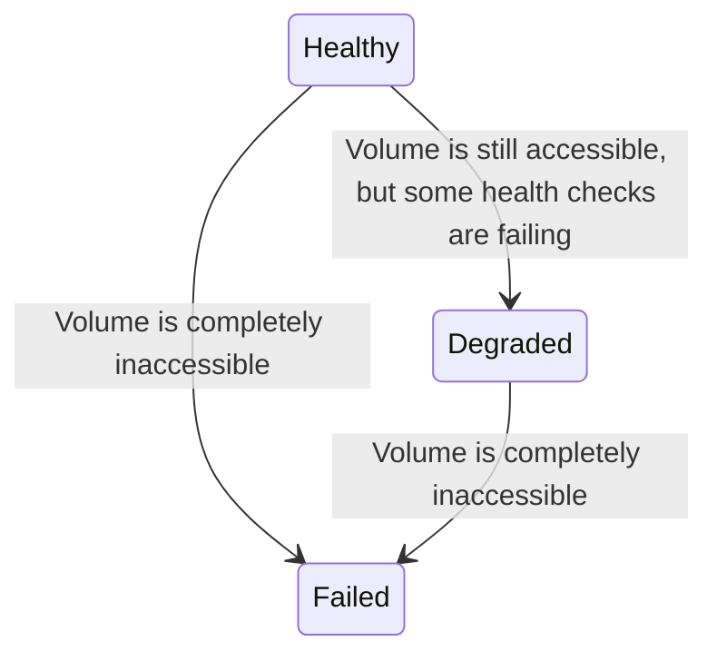

<!--
  Licensed under the Apache License, Version 2.0 (the "License");
  you may not use this file except in compliance with the License.
  You may obtain a copy of the License at

   http://www.apache.org/licenses/LICENSE-2.0

  Unless required by applicable law or agreed to in writing, software
  distributed under the License is distributed on an "AS IS" BASIS,
  WITHOUT WARRANTIES OR CONDITIONS OF ANY KIND, either express or implied.
  See the License for the specific language governing permissions and
  limitations under the License. See accompanying LICENSE file.
-->

# Improved Storage Volume Handling for Ozone Datanodes

## Background

Currently Ozone uses two health states for storage volumes: **healthy** and **failed**. A volume scanner runs on each datanode to determine whether a volume should be moved from a **healthy** to a **failed** state. Once a volume is failed, all container replicas on that volume will be removed from tracking by the datanode and considered lost. Volumes cannot return to a healthy state after failure without a datanode restart.

This model only works for hard failures in volumes, but in practice most volume failures are soft failures. Disk issues manifest in a variety of ways and minor problems usually appear before a drive fails completely. The current approach to volume scanning and health classification does not account for this. If a volume is starting to exhibit signs of failure, the datanode only has two options:
- Fail the volume
    - In many cases the volume may still be mostly or partially readable. Containers on this volume that were still readable would be removed by the system and have their redundancy reduced unecessarily. This is not a safe operation.
- Keep the volume healthy
    - Containers on this volume will not have extra copies made until the container scanner finds corruption and marks them unhealthy, after which we have already lost redundancy.

For the common case of soft volume failures, neither of these are good options. This document outlines a proposal to classify and handle soft volume failures in datanodes.

## Proposal

This document proposes adding a new volume state called **degraded**, which will give the system a chance to proactively make copies of data on volumes exhibiting issues before it is too late. This gives three volume health states: **healthy**, **degraded**, and **failed**. While a datanode is running, a volume can only progress to a worse state.

### Tools for Determining Volume Health State

#### Health Checks

Ozone has access to the following checks to determine volume health:

- **Directory Check**:
    - A directory exists at the specified mount point
    - Datanode process has adequte permissions on the filesystem
- **Database Check** (container volumes/ `HddsVolume` only): Check that a new read handle can be acquired for the RocksDB instance, in addition to the write handle the process is currently holding.
    - Corruption within individual SST files will only affect the keys in those files, so those errors are isolated to a per-container level and should be detected by the container scanner.
- **File Check**: Sync a file to the disk, read its contents, delete the file
- **IO Error Count**: Track how many on-demand volume scans have been requested for a volume.

**IO Error Count** would be a new check that can be used as part of this feature. Currently each time datanode IO encounters an error, we request an on-demand volume scan. This should include every time the container scanner marks a container unhealthy. We can keep a counter of how many IO errors have been reported on a volume over a given time frame, regardless of whether the corresponding volume scan passed or failed. This accounts for cases that may show up on the main IO path but may otherwise not be detected by the volume scanner. For example, numerous old sectors with existing container data may be unreadable. The volume scanner's **File Check** will only utilize new disk sectors so it will still pass with these errors present, but the container scanner may be hitting many bad sectors across containers, which this check will account for.

#### Sliding Window

All checks except the directory check may encounter intermittent issues, even on overall healthy drives, so we should not downgrade volume health state after just one error. The current volume scanner uses a counter based sliding window for intermittent failues, meaning the volume will be failed if `x` out of the last `y` checks failed, regardless of when they occurred. This approach works for background volume scanning, which is run at a fixed interval, but will not generalize well for on-demand volume scans, which may occur sporadicially but should also count towards the same window.

To improve this, we can use a time based sliding window to determine when a threshold of tolerable errors is crossed. For example, if this check has failed `x` times in the last `y` minutes, we should consider the volume degraded.

### Replication Based on Volume Health State

Healthy volumes do not require extra replication. Failed volumes cause all containers in the volume to be reported as missing by the datanode, and show up under-replicated to SCM. SCM will then make copies of the lost data. This is the current behavior of the system and it does not need modifications. The only new replication behavior we need to define is for degraded volumes.

Before SCM can act on degraded volumes, it must first be aware of the information. Datanodes currently report volume information to SCM using the [StorageReportProto](https://github.com/apache/ozone/blob/bba8a6783114bb2e9bd05755232e561274b74714/hadoop-hdds/interface-server/src/main/proto/ScmServerDatanodeHeartbeatProtocol.proto#L175). Currently health state is a boolean. It will need to be changed to an enum by deprecating the old field to allow datanodes to report degraded volumes. Currently SCM has no way of knowing the health of a volume for a given container. We will need to add the volume's UUID to the [ContainerReplicaProto](https://github.com/apache/ozone/blob/bba8a6783114bb2e9bd05755232e561274b74714/hadoop-hdds/interface-server/src/main/proto/ScmServerDatanodeHeartbeatProtocol.proto#L205) so SCM can look up the health state of a volume a container is on, and decide if it needs replication.

When replicating containers on degraded volumes, SCM should avoid using the degraded volume as a replication source if possible. Optionally, replication of containers on degraded volumes may be scheduled with lower priority than those for containers which are already at reduced redundancy. We should trigger on-demand scans of all containers after they have been imported for safety.

Containers on degraded volumes will still count towards the container's overall replication. For example, when a container has two replicas on healthy volumes and one replica on a degraded volume, it will not show up as under-replicated from replication manager's point of view or count towards the under-replicated count in `ozone admin container report`. This is because the replica still exists, may be healthy, and may be used for reads because client-side checksum validation on reads will avoid corrupted replicas if they are encountered. This is different from an under-replicated container where the replica is completely unavailable.

SCM will replicate the container in the background and delete the copy that is on the degraded volume once replication completes. Deletion from degraded volumes may fail. In this case the container may continue to show as over-replicated as long as the volume is still present in a **degraded** state. This should be harmless as long as SCM does not attempt to fix the over-replication by deleting a replica that is not on a **degraded** volume.

The sampling in `ozone admin container report` may be expanded to show the first 100 containers on degraded volumes, but we can also add this information to `ozone admin container info --json ` and `ozone admin datanode volume list/info`. The later will need to provide enough information to determine when all data on a degraded volume has been properly replicated and the volume can be removed, even if deleting the data to clear out the volume fails. A formal volume decommissioning feature could help in this case, but it is out of scope for this proposal.

### Determining Volume Health State on Restart

Currently on startup, volumes are **healthy** by default. If the volume's permissions are inadequate or a write handle for the RocksDB cannot be opened, the volume will be **failed**. This behavior to determine the **healthy** or **failed** states on startup can remain the same, so that issues like permissions can be fixed with a restart.

We only need to add special handling for the **degraded** state. Without persisting the degraded state, restarting a datanode with a degraded volume will cause the volume to be reported as **healthy** until the necessary checks complete, which may take some time. Meanwhile, data will be considered over-replicated and may be deleted, only to have to be re-replicated again later if the volume is again marked **degraded**.

When a volume moves to a **degraded** state, we can persist this information to the volume's `VERSION` file, so that the volume automatically starts up as **degraded**. If writing to this file fails, the volume state will still be **degraded** in memory and we can retry the write on each run of the volume scanner on a best effort basis. This is consistent with how a container replica's **UNHEALTHY** state is persisted by the container scanner.

Although the version file is human readable, we can also create a repair tool under the  `ozone repair datanode` subcommand which could automate edits to the file to force a volume out of the **degraded** state during a troubleshooting scenario.

### Specifying Each Volume Health State

With the above pieces in place, we can now define how volumes transition between health states and what actions need to be taken for each state.

#### Healthy 

Healthy is the default state for a volume. Volumes remain in this state until health tests fail and move them to a lower health state.

- **Enter**:
    - **On Startup**: If permissions are valid and a RocksDB write handle is successsfully acquired.
    - **While Running**: N/A. Volumes cannot transition into the healthy state after startup.
- **Exit**: When tests for one of the other states fail
- **Actions**: None

#### Degraded

Degraded volumes are still readable, but enough IO errors have been reported for the device that we should stop putting new data on it and begin proactively making new copies of the data it contains. The container scanner will continue to determine whether individual containers are healthy or not, and the volume scanner will still run to determine if the volume needs to be moved to **failed**. We do not need to block deletes from degraded volumes since this is operation is safe to fail without impacting data durability.

- **Enter**:
    - **On Startup**: If the `VERSION` file indicates that the volume is degraded.
    - **While Running**:
        - **File Check** fails enough times to cross the sliding window threshold
        - **IO Error Count** is triggered enough times to cross the sliding window threshold
- **Exit**:
    - When tests for **failed** state indicate the volume should be failed. This can also happen during startup.
- **Actions**:
    - Persist **degraded** state to the `VERSION` file
    - Existing containers are requested to be closed
    - No new container allocations or imports to this volume are allowed
    - Volume state in storage report to SCM updated
    - SCM proactively tries to make an extra copy of containers on this volume, while avoiding this Datanode as a source if possible
    - Container scanner continues to identify containers that are unhealthy individually
    - Volume scanner continues to run, but only needs to run checks for moving to the **failed** state

#### Failed

Failed volumes are completely inaccessible. We are confident that there is no way to retrieve any container data from this volume, and all replicas on the volume should be reported as missing.

- **Enter**:
    - **On Startup**: **Directory Check** fails or a RocksDB write handle cannot be acquired
    - **While Running**:
        - **Database Check** fails enough times to cross the sliding window threshold
        - **Directory Check** fails
- **Exit**:
    - On Datanode restart, conditions will be re-evaluated and the volume may become **healthy** or be **failed** again.
- **Actions**:
    - Container scanner stops running
    - Volume scanner stops running
    - All containers on the volume are removed from Datanode memory
    - All containers on the volume are reported missing to SCM

### Volume Health and Disk Usage

Ideally, volumes that are completely full should not be considered degraded or failed. Just like the rest of the datanode, the scanners will depend on the [VolumeUsage](https://github.com/apache/ozone/blob/2a1a6bf124007821eb68779663bbaad371ea668f/hadoop-hdds/container-service/src/main/java/org/apache/hadoop/ozone/container/common/volume/VolumeUsage.java#L97) API returning reasonably accurate values to assess whether there is enough space to perform checks. **File Check**, for example, can be skipped if there is not enough space to write the file. Additionally, volume checks will be dependent on the space reservation feature to ensure that the RocksDB instance has enough room to write files needed to be opened in write mode and do compactions.

In the future, we may want to handle completely full volumes by opening the RocksDB instance in read-only mode and only allowing read operations on the volume. While this may be a nice feature to have, it is more complicated to implement due to its effects on the delete path. This could have a ripple effect because SCM depends on replicas to ack deletes before it can proceed with operations like deleting empty containers. For simplicity the current proposal considers failure to obtain a DB write handle a full volume failure and delegates read-only volumes as a separate feature.

## Task Breakdown

This is an approximate task breakdown of the work required to implement this feature. Tasks are listed in order and grouped by focus area.

### Prepare the Volume Scanner

- Create a generic timer-based sliding window class that can be used for checks with intermittent failures.
    - Migrate existing sliding window checks to this new class.

- Determine default configurations for sliding windows and scan intervals
    - Sliding window timeouts and scan intervals need to be set accordingly so that background scanners alone have a chance to cross the check threshold even if no foreground load is triggering on-demand scans.
    - Minimum volume scan gap is currently 15 minutes. This value can likely be reduced since volume scans are cheap and the volume will move to a degraded state if many errors are reported, preventing being stuck in an indefinite queue of scans.

### Support Degraded Volume Health State in Datanodes

- Allow volume scanners to distinguish between **failed** and **degraded** states.
- Persist **degraded** health state and set volume health state on restart.
- Add necessary information to datanode heartbeats.
    - Add volume health state to `StorageReportProto`
    - Add volume UUID to `ContainerReplicaProto`
- Block writes to degraded volumes.
    - `MutableVolumeSet` should not return degraded volumes for container create or import operations
    - Deletes will still be allowed

### Add SCM Handling

- Replication Manager should replicate containers on degraded volumes, ideally avoiding the degraded volume as the source.

### Improve CLI

- Improve `ozone admin datanode volume list/info`
    - Show states of each volume
    - Show how many containers are on each volume
    - Show which degraded volumes have had their data sufficiently replicated elsewhere.
- `ozone admin container report` should show how many containers are on degraded volumes.
- `ozone admin container info --json` should show info about the volume each replica is on.

### Improve metrics

- Add metrics to volume scanners. They currently don't have any.
- Add metrics for degraded volumes, which can be used for alerting.

