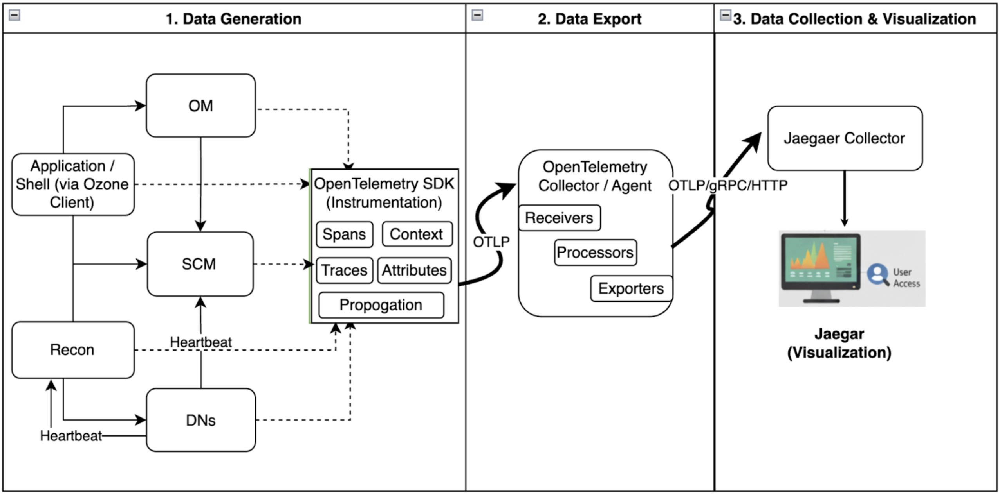
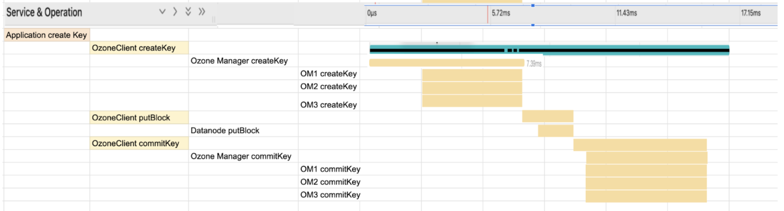

<!--
  Licensed under the Apache License, Version 2.0 (the "License");
  you may not use this file except in compliance with the License.
  You may obtain a copy of the License at

   http://www.apache.org/licenses/LICENSE-2.0

  Unless required by applicable law or agreed to in writing, software
  distributed under the License is distributed on an "AS IS" BASIS,
  WITHOUT WARRANTIES OR CONDITIONS OF ANY KIND, either express or implied.
  See the License for the specific language governing permissions and
  limitations under the License. See accompanying LICENSE file.
-->

# Distributed Tracing with OpenTelemetry

# 1. Introduction

Ozone currently utilizes OpenTracing with Jaeger for distributed
tracing. However, the OpenTracing project is deprecated and no longer
actively supported. This document proposes migrating from OpenTracing to
OpenTelemetry, which is a standardized and actively maintained project
supporting various tracing tools, including Jaeger.

The primary scope of this document is to detail the integration of
OpenTelemetry for traces within the Ozone ecosystem.

# 2. OpenTelemetry Integration

This section outlines key OpenTelemetry concepts and their application
within Ozone.

## 2.1. OpenTelemetry Concepts

### 2.1.1. Context

Context in OpenTelemetry keeps span and other information in the
context. Context is set to thread-local using `context.makeCurrent()`. And
the same can be retrieved using `context.current()`.

**Context Creation:**

-   Creating a span with noParent().
-   Importing a trace from an external request.
-   Manually creating a Context with parameters:

```
// Manual trace context creation
Context rootContext = Context.root();
Context newContextFromRoot = rootContext.with(myKey, "anotherValue");
```

**Inter-thread Transfer:** Context can be transferred between threads by
explicitly setting the context in the target thread using
context.makeCurrent().

**Inter-process Transfer**: Context needs to be retrieved and set to
headers for HTTP or message body in gRpc to transfer. Further details are
provided in **[Trace Propagation](#216-trace-propagation)**.

### 2.1.2. Span

An OpenTelemetry span represents a single, logical unit of work within a
distributed system. It captures essential details of an operation.

-   Name
-   Parent span ID (absent for root spans)
-   Start and End Timestamps
-   Span Context
-   Attributes
-   Span Events
-   Span Links
-   Span Status

A span is initiated with `startSpan()` and concluded with `end()`. Spans are
organized hierarchically within a context, allowing for the creation of
child spans. For a span to be active and allow the creation of child
spans, it must be set to the current context using `span.makeCurrent()`.

**Example Span Structure:**

| Field |  Description
|-------| -------------
| name  | The name of the operation.
| context | Contains trace_id and span_id.
| parent_id |  The ID of the parent span, or null for a root span.
| start_time | Timestamp when the span began.
| end_time   | Timestamp when the span ended.
| attributes | Key-value pairs providing additional details about the span.
| events  | An array of events that occurred during the span's lifetime. Each event has a name, timestamp, and optional attributes.

Upon completion (`end()`), span information is transmitted to the
OpenTelemetry Collector. This transmission occurs in batches for
performance optimization.

**Sample:**

```json
{
  "name": "hello",
  "context": {
    "trace_id": "5b8aa5a2d2c872e8321cf37308d69df2",
    "span_id": "051581bf3cb55c13"
  },
  "parent_id": null,
  "start_time": "2022-04-29T18:52:58.114201Z",
  "end_time": "2022-04-29T18:52:58.114687Z",
  "attributes": {
    "http.route": "some_route1"
  },
  "events": [
    {
      "name": "Guten Tag!",
      "timestamp": "2022-04-29T18:52:58.114561Z",
      "attributes": {
        "event_attributes": 1
      }
    }
  ]
}
```

### 2.1.3. Scope

Scope in OpenTelemetry defines which span is considered "active"
within a given thread or execution context.

-   `context.makeCurrent()` returns a Scope object, setting the context as thread-local. This context can be retrieved via `Context.current()`.

-   `span.makeCurrent() `returns a Scope object, setting the span within the context. This span can be retrieved via `Span.current()`.

It is crucial to close the `Scope` object to release associated memory from the context or thread-local storage.

```java
try (Scope scope = context.makeCurrent()) {
    Span span; // = get the space from context
    try (Scope spanScope = span.makeCurrent()) {
    }
}
```

### 2.1.4. Attributes

An OpenTelemetry span can include various attributes, which are
key-value pairs that provide additional information about the operation
being traced. Attributes enhance the observability of spans by adding
context and detail that are crucial for debugging and performance
analysis. They can represent anything from HTTP method and URL to
database query parameters and user IDs.

**Key Characteristics of Attributes:**

-   **Key-Value Pairs:** Attributes are always stored as key-value pairs. Keys are typically strings,
and values can be strings, booleans, numbers, or arrays of these types.

-   **Semantic Conventions:** OpenTelemetry defines a set of semantic conventions for common attributes (e.g., http.method,
db.statement, error.type). Adhering to these conventions ensures consistency and improves compatibility with various tracing backends.

-   **Immutability:** Once set on a span, attributes are generally immutable. While new attributes can be added,
existing ones are not typically modified.

**Usage:**

Attributes are typically added to a span during its creation or at any
point before it ends.

```java
Span span = tracer.spanBuilder("myOperation").startSpan();
try (Scope scope = span.makeCurrent()) {
    span.setAttribute("http.method", "GET");
    span.setAttribute("http.url", "/api/v1/data");
    span.setAttribute("user.id", "12345");
    // ... application logic ...
} finally {
    span.end();
}
```

Attributes are essential for filtering, querying, and analyzing traces
in a tracing visualization tool like Jaeger, allowing developers to
quickly pinpoint issues or understand the behavior of their distributed
applications.

### 2.1.5. Events

Events are timestamped messages that provide a more granular view of
what happened within a span's lifetime. They can be used to mark
significant moments, record errors, or capture specific data points
during an operation.

**Key Characteristics of Events:**

-   **Timestamped:** Every event is associated with a specific timestamp, indicating when it occurred within the span.

-   **Name:** Each event has a descriptive name that summarizes what happened (e.g., "Cache hit," "Database query started," "Error").

-   **Attributes (Optional):** Events can also include key-value attributes to provide additional context, similar to span attributes.

**Usage:**

Events are added to a span at the exact point in the code where the
notable occurrence happens.

```java
Span span = tracer.spanBuilder("myOperation").startSpan();
try (Scope scope = span.makeCurrent()) {
    // ... application logic ...
    span.addEvent("Processing started");
    // ... more application logic ...
    span.addEvent("Intermediate data generated", Attributes.of("data.size", 1024L));
    // ... further application logic ...
} finally {
    span.end();
}
```

Events are particularly useful for understanding the sequence of
operations within a span, especially when debugging complex workflows or
analyzing performance characteristics at a micro-level.

### 2.1.6. Trace Propagation

Trace propagation facilitates the transfer of trace context information
within and across service boundaries.

**Between Threads (within a single process):**

-   **Manual Transfer:** The Context object can be manually transferred to a new thread, and makeCurrent() can be called on that thread.

-   **Context Wrapping for Executor Services:** Context.taskWrapping() can be used to wrap an ExecutorService,
automatically propagating context to tasks executed by the service.

```java
ExecutorService wrappedExecutor =
Context.taskWrapping(Executors.newFixedThreadPool(1));
```

**Across a Network (between different services):**

-   **W3CTraceContextPropagator:** This standard mechanism encodes trace information (Trace ID, Span ID, etc.)
for transmission over a network, typically using HTTP headers. This can be used to write to StringBuilder or other output.

-   **gRPC Integration for Ozone:** For gRPC communications in Ozone, trace context can be encoded into a string and embedded within a
Proto field (e.g., "traceId"). The receiving server can then decode this string back into a `Context` object to continue the
trace using `W3CTraceContextPropagator`.

### 2.1.7. Trace Failure Handling

Failures within a traced operation can be recorded within the span by
setting its status. The `SpanStatus` enum provides predefined states like
`OK`, `ERROR`, and `UNSET`. Setting the status explicitly marks the span's
outcome, which is critical for quick identification of issues in tracing
UIs. `UNSET` status is treated as success.

Normally below can be done to report failure:

1.  **Adding Events:** `span.addEvent("Failure has occurred" + ex.getMessage)` can be used to log a specific failure
event with a descriptive message. This is timestamped information when failure occurred.

2.  **Setting Status:** `span.setStatus(StatusCode.ERROR)` explicitly marks the span as having encountered an error.

**Alternative**, `span.setStatus(StatusCode.ERROR, "error message")` can be used but it will lack the timestamp.

Correctly setting the span status helps in filtering and aggregating error traces, providing a clear overview
of system health and facilitating debugging efforts.

## 2.2. Integration with Ozone



The OpenTelemetry SDK is integrated with Ozone Manager, leveraging`Context`, `Span`, and `Scope` concepts,
and configured to send traces to a Collector.

Ozone utilizes OTLP (OpenTelemetry Protocol) to transmit traces to a Collector, which can be an OpenTelemetry Collector,
Jaeger, or any other collector supporting OpenTelemetry standards.

For Ozone, data can be **exported directly to the Jaeger collector**, as no processing is required.
But the above approach can help in exporting to different vendors in multiple formats for visualization and other purposes.

The following environment variables are used for Collector configuration:

-   OTEL_EXPORTER_OTLP_ENDPOINT: Specifies the endpoint of the OTLP receiver. Default: http://localhost:4317.
-   OTEL_TRACES_SAMPLER_ARG: Configures the trace sampler argument. Default: 1.0 (all traces are reported).

## 2.3. How OpenTelemetry Tracing Works

Tracing in OpenTelemetry involves a hierarchy of spans. A parent span
(e.g., span1) can contain one or more child spans (e.g., span2). Upon
completion, each span sends its details to the configured Collector
endpoint. This process is batched by the SDK for performance.

Scenarios:
- **Single-Node (Parent-Child):**

```java
span1.start()
    span2.start()
      // application code
    span2.end() → Sends span information to Collector (1)
span1.end() → Sends span information to Collector (2)
```             
 
- **Two-Node (Parent-Child with gRPC):**

> **Node 1:**
> ```
>  span1.start()
>    Generate trace context as String
>    Add to gRPC Message and send message, then wait
> ```
>> **Node 2:**
>> ```
>> Receive gRPC message and retrieve trace context as String
>> Convert to Context object and create span2 as child
>> 
>> span2.start()
>>        // application code
>> span2.end() → Sends span information to Collector (1)
>> ```
> **Node 1:**
> ```java
> span1.end() → Sends span information to Collector (2)
> ```

# 3. Tracing Hierarchy

The current tracing implementation in Ozone initiates traces for:

-   Every remote call from the Ozone client and shell.
-   Ozone Manager's `get blocks` calls to SCM.
-   Remote calls from the Ozone client to DataNode for put block.

This approach often results in disjoint traces or limited hierarchical
representation, which does not provide a comprehensive view of
end-to-end operational flows.

## 3.1. Goal for Enhanced Call Hierarchy

The objective is to unify disjoint remote calls into a single, cohesive
parent trace, providing a complete flow representation. Specific goals
include:

* Combining all disjoint remote calls from the client into a single parent trace (e.g., for file create, write, and commit operations).
* Including communication with SCM during file creation or allocation flows.
* Integrating DataNode write operations into the same end-to-end trace.


**Example End-to-End Trace Flow:**

1. Application starts "create key" operation
   1. Ozone client "create key"
      1.  Ozone Manager receives "create key"
          - Executed on all 3 Ozone Managers
   2. Ozone client "put block for write"
      - DataNode "put block"
   3. Ozone Client "commit key"
      1. Ozone Manager receives "commit key"
         - Executed on all 3 Ozone Managers 
2. Finishes "create key" operation



## 3.2. Integration of More Flows

For comprehensive performance analysis and debugging, tracing can be
extended to various additional flows:

-   **DataNode Heartbeat to SCM:** Trace recording should only occur when the DataNode initiates the trace context.
-   **Recon:** Trace all requests from the Recon UI to Ozone components, such as the Recon Server.
-   **Internal Services (e.g., OM connecting to SCM):** These calls, initiated under a timer thread, should also be traced.

For internal Ozone calls, the trace should be initiated by the caller as a `Client` span, not a `Server` span,
as these are not remote calls crossing service boundaries but rather operations controlled within Ozone components.

## 3.3. Use Case

This enhanced tracing capability can be integrated with applications such as HBase, Iceberg, and Impala, which support OpenTelemetry.
This enables detailed visualization of time taken at each step of an operation, facilitating the identification of performance bottlenecks.

# 4. OpenTelemetry Span Kind

When a span is created, it is assigned a `SpanKind` to provide context to
the tracing backend regarding how the trace should be assembled.

-   **Client:** Represents a synchronous outgoing remote call (e.g., an outgoing HTTP request or database query).
-   **Server:** Represents a synchronous incoming remote call (e.g., an incoming HTTP request or remote procedure call).
-   **Internal:** Represents operations that do not cross a process boundary (e.g., instrumenting a function call within the same service).
-   **Producer:** Represents the creation of a job that may be processed asynchronously later (e.g., enqueueing a message into a message queue).
-   **Consumer:** Represents the processing of a job initiated by a producer.

# 5. OpenTracing Control Level

Tracing of call flows can be categorized to enable fine-grained control:

-   **External Request Tracing:** Traces initiated by external remote servers, such as those originating from the Ozone Client or the Recon UI.
-   **Internal Requests:** Traces within Ozone components (e.g., OM to SCM), often initiated as part of a timer task.

A control flag is necessary to selectively enable tracing for external, internal, or other future categorizations, thereby managing the tracing overhead within Ozone services.

# 5. Dynamic Tracing Configuration

The following configuration property will control tracing:

-   Ozone.tracing.enabled (default: false)

Existing environment variables for OpenTelemetry configuration are:

-   OTEL_EXPORTER_OTLP_ENDPOINT: Specifies the OTLP receiver endpoint (default: http://localhost:4317/).
-   OTEL_TRACES_SAMPLER_ARG: Sampler argument for traces (default: 1.0, meaning every trace is reported).

Since environment variables cannot be updated dynamically, dedicated configuration properties will be provided for dynamic control:

-   ozone.tracing.endpoint
-   ozone.tracing.sampler

These `ozone.tracing` configurations can be dynamically updated for Ozone Manager (OM), Storage Container Manager (SCM), and DataNode (DN) via the Ozone CLI.

**Note:** Dynamic updates are not feasible for the Ozone client as it is part of application code.

# 6. Tracing Support for Client

The Ozone client needs the flexibility to either initiate a new span or continue an existing application-level trace by creating a child span.
A specific scenario arises when the Ozone client should only trace if it's explicitly enabled to continue an application's existing trace.

-   **Application with Active Trace:**
    -   The Ozone client checks for an active span from the application's context.
    -   If an active span is found, the Ozone client continues that trace as a child span, using the application's existing trace context.
-   **Application Without Active Trace:**
    -   If the application has not initiated a trace, the Ozone client will not create a new trace independently when `ozone.tracing.enabled` is false.

Typically, `ozone.tracing.enabled` is `false`, indicating that no tracing should occur by default. However, for Ozone clients, dynamically
updating this configuration based on the application's implementation is often not feasible.

To address this, the Ozone client will leverage the application's tracer to continue tracing as a child span.
This specific behavior will be controlled by an additional flag:

-   `ozone.tracing.client.application-aware` (default: true)

When Ozone.client.tracing.provider.application.enabled is true, the Ozone client will utilize tracers provided by the application context.
This allows the Ozone client to trace even if the ozone.tracing.enabled configuration is false, provided the application has configured and enabled its own tracing.

**Mechanism for Client-Side Trace Continuation:**

```java
// In a deep part of the code, get the current active span from the Context
Span currentSpan = Span.current();

// Get the tracer that created this span
Tracer tracer = currentSpan.getTracer();

// Using this tracer, a child span can be created and traced
// Example:
tracer.spanBuilder("OzoneClientOperation").setParent(currentSpan.getSpanContext()).startSpan();

```

### References
- [OpenTelemetry](https://opentelemetry.io/)

