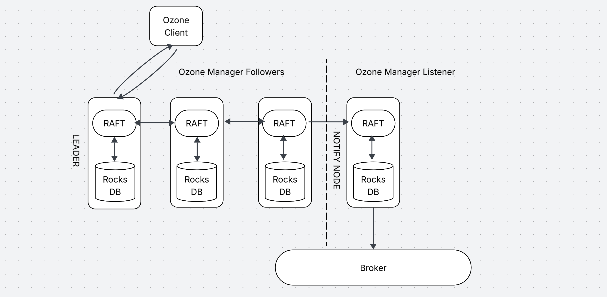

<!--
  Licensed under the Apache License, Version 2.0 (the "License");
  you may not use this file except in compliance with the License.
  You may obtain a copy of the License at

   http://www.apache.org/licenses/LICENSE-2.0

  Unless required by applicable law or agreed to in writing, software
  distributed under the License is distributed on an "AS IS" BASIS,
  WITHOUT WARRANTIES OR CONDITIONS OF ANY KIND, either express or implied.
  See the License for the specific language governing permissions and
  limitations under the License. See accompanying LICENSE file.
-->

# Abstract

Implement an event notification system for Apache Ozone, providing the ability for users to consume events occuring on the Ozone filesystem.
This is similar to https://issues.apache.org/jira/browse/HDDS-5984 but aims to encapsulate all events and not solely S3 buckets.  
This document proposes a potential solution and discusses some of the challenges/open questions.

# Introduction

Apache Ozone does not currently provide the ability to consume filesystem events, similar to how HDFS does with Inotify or S3 with bucket notifications.  
These events are an integral part of integration with external systems to support real-time, scalable, and programmatic monitoring of changes in the data or metadata stored in Ozone.  
These external systems can use notifications of objects created/deleted to trigger data processing workflows, replication and monitoring alerts.

# Goals

Provide support for all events across the Ozone filesystem for FSO and non FSO buckets, including renames and changes to acls.
Not impact with performance of client requests.
Guarantee at-least-once delivery.

# Non-Goals

Filtering of events or paths/buckets
Persistent storage of notification messages
Asynchronous delivery

# Supported OMRequests

OMDirectoryCreateRequest
OMKeyCommitRequest
OMKeyDeleteRequest
OMKeyRenameRequest
OMKeyAddAclRequest
OMKeyRemoveAclRequest
OMKeySetAclRequest
OMKeySetTimesRequest

# Design

## Overview

Introduce a new OzoneManager node in the ratis ring in LISTENER mode.  
The node will be defined up-front in ozone-site.xml.
This node will maintain metadata similar to the other OM nodes however it will generate notifications for events after they have been successfully commited.
This node will not be able to become a leader, so the notification process will not impact client requests.  



#### Component

Implementation of this feature requires changes to the OzoneManager:
    - Implement an agnostic notification interface
    - Add support for a LISTENER node
    - Add a hook in the OMRequest exection flow to generate notifications

#### Component

Introduces a new field on OMAdminProtocol.proto to identify the notify node:

```protobuf
message OMNodeInfo {
required string nodeID = 1;
required string hostAddress = 2;
required uint32 rpcPort = 3;
required uint32 ratisPort = 4;
optional NodeState nodeState = 5 [default=ACTIVE];
optional bool isNotifyNode = 6 [default=false];
}
```

## Performance

While this is a synchronous only approach any latency between notification target and OM should not impact the performance of client requests as the notification does not run on the leader.

## Configuration

This is the configuration to enable event notification on node on1.

```xml
<property>
  <name>ozone.event.notification.node</name>
  <value>on1</value>
</property>
```
Example configuration to provide a kafka instance:
```xml

<configration>
    <property>
        <name>kafka.bootstrap.server</name>
        <value></value>
    </property>
    <property>
        <name>kafka.topic</name>
        <value></value>
    </property>
    <property>
        <name>kafka.saslUsername</name>
        <value></value>
    </property>
    <property>
        <name>kafka.saslPassword</name>
        <value></value>
    </property>
    <property>
        <name>kafka.saslMechanism</name>
        <value></value>
    </property>
    <property>
        <name>kafka.clientTlsCert</name>
        <value></value>
    </property>
    <property>
        <name>kafka.clientTlsKey</name>
        <value></value>
    </property>
</configration>
```

### Metrics

In order to better monitor the performance of the Notify Node the key metric here is how far we are behind the leader node, this can be achieved by comparing the lastAppliedTxn of each node.

## Open questions

### Notification Schema

The S3 event notification schema https://docs.aws.amazon.com/AmazonS3/latest/userguide/notification-how-to-event-types-and-destinations.html#supported-notification-event-types is based around immutable objects which cannot be renamed.
In (AWS) S3 semantics renames are notified at the per-object level by sending a delete event on the old path and a create event on the new path.
However, in Ozone objects can be renamed via the "RenameKey" ratis event which is triggered for both file and directory renames.
In the context of a FSO directory rename we see a RenameKey ratis event for the directory name and not the granular objects.
This would allow us to emit an event to denote that a path or directory was renamed but:

It does not distinguish between file vs directory renames
It does not allow us to emit cascading delete / create events for all the child objects being deleted/created as a result of a directory rename operation (as would be expected by traditional S3 event semantics)

This leaves us with a gap with two potential solutions:

1. Add a bespoke/“extended” event S3 type for RENAME operations which simply conveys that the key has been renamed (as per the semantics of RenameKey ratis callback) and which then leaves it up to the event consumer to deem the context (file vs directory) themselves (e.g. by stat-ing the target path).  This is in-line with the semantics of HDFS inotify rename events:

https://hadoop.apache.org/docs/stable/api/org/apache/hadoop/hdfs/inotify/Event.RenameEvent.html

Pros:
* does not require any new processing on the OM side

Cons:
* non standard S3 event semantics

2. The Ozone manager has to somehow pull together the child objects impacted by directory RENAME and emit appropriate remove/create events for the source/destination paths.

Pros:
* standard S3 event semantics

Cons:
* required additional processing on the OM side to gather the necessary child objects impacted and emit events for RENAME operations.

As with RENAMEs there is no concept for ACL events in S3.  If we stay with S3 semantics we could extend the schema similar to how Ceph has here: https://docs.ceph.com/en/latest/radosgw/s3-notification-compatibility/#event-types
Or we if we took a HDFS Inotify view of the schema that already has inbuilt support for ACLs

### At-least-once delivery

At-least-once delivery cannot be guaranteed without some form of persistence, however we want to avoid persisting the notification messages themselves. One approach to achieving this is by "replaying" the proposals.
If we persist the lastAppliedTxn after each notification is sent successfully, on a restart we could reset the lastAppliedTxn on the state machine and replay proposals in a "non-committal" mode in order to generate any missing notifications up to the current proposal.
Non-committal mode would not update metadata state but would be able to tell if a proposal had succeeded by comparing it the actual metadata i.e. if we see a delete proposal and the file does not exist we can assume it was successful and send the notification.


# Testing

Unit testing of individual components.

Integration tests with Kafka/RabbitMQ.

Will provide a docker compose env with kafka and a notification node in ozone-dist.