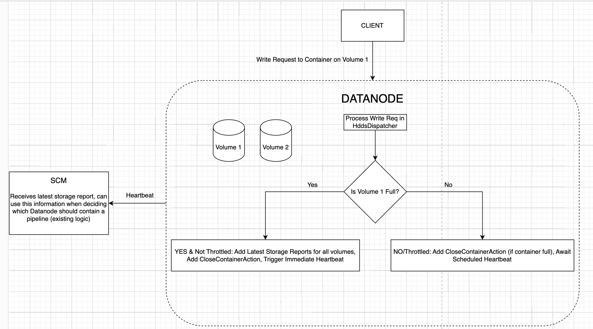

<!--
  Licensed under the Apache License, Version 2.0 (the "License");
  you may not use this file except in compliance with the License.
  You may obtain a copy of the License at

   http://www.apache.org/licenses/LICENSE-2.0

  Unless required by applicable law or agreed to in writing, software
  distributed under the License is distributed on an "AS IS" BASIS,
  WITHOUT WARRANTIES OR CONDITIONS OF ANY KIND, either express or implied.
  See the License for the specific language governing permissions and
  limitations under the License. See accompanying LICENSE file.
-->

## Summary
On detecting a full Datanode volume during write, immediately trigger a heartbeat containing the latest storage 
report for all volumes.

## Problem
When a Datanode volume is close to full, the SCM may not be immediately aware of this because storage reports are only
sent to it every one minute (`HDDS_NODE_REPORT_INTERVAL_DEFAULT = "60s"`). We would like SCM to know about this as 
soon as possible, so it can make an informed decision when checking the volumes in that Datanode for deciding whether a 
new pipeline can contain that Datanode (in `SCMCommonPlacementPolicy.hasEnoughSpace`).

Additionally, SCM only has stale
information about the current size of a container because container size is only updated when an Incremental Container
Report (event based, for example when a container transitions from open to closing state) is received or a Full
Container Report (`HDDS_CONTAINER_REPORT_INTERVAL_DEFAULT = "60m"`) is received. This can lead to the SCM
over-allocating blocks to containers on a full DN volume. When the writes eventually fail, performance will drop
because the client will have to request for a different set of blocks. We will discuss how we tried to solve this, 
but ultimately decided to not go ahead with the solution.

### The definition of a full volume
A volume is considered full if the following (existing) method returns true.
```java
  private boolean isVolumeFull(Container container) {
    boolean isOpen = Optional.ofNullable(container)
        .map(cont -> cont.getContainerState() == ContainerDataProto.State.OPEN)
        .orElse(Boolean.FALSE);
    if (isOpen) {
      HddsVolume volume = container.getContainerData().getVolume();
      StorageLocationReport volumeReport = volume.getReport();
      boolean full = volumeReport.getUsableSpace() <= 0;
      if (full) {
        LOG.info("Container {} volume is full: {}", container.getContainerData().getContainerID(), volumeReport);
      }
      return full;
    }
    return false;
  }
```

It accounts for available space, committed space, min free space and reserved space:
```java
  private static long getUsableSpace(
      long available, long committed, long minFreeSpace) {
    return available - committed - minFreeSpace;
  }
```

In the future (https://issues.apache.org/jira/browse/HDDS-12151) we plan to fail a write if it's going to exceed the 
min free space boundary in a volume.

## Non Goals
The proposed solution describes the complete solution. HDDS-13045 will add the Datanode side code
for triggering a heartbeat on detecting a full volume + throttling logic.

Failing the write if it exceeds the min free space boundary (https://issues.apache.org/jira/browse/HDDS-12151) is not 
discussed here.

## Proposed Solution

### What does the Datanode do currently when a volume is full?

In `HddsDispatcher`, on detecting that the volume being written to is full (as defined previously), we add a 
`CloseContainerAction` for that container:

```java
  private void sendCloseContainerActionIfNeeded(Container container) {
    // We have to find a more efficient way to close a container.
    boolean isSpaceFull = isContainerFull(container) || isVolumeFull(container);
    boolean shouldClose = isSpaceFull || isContainerUnhealthy(container);
    if (shouldClose) {
      ContainerData containerData = container.getContainerData();
      ContainerAction.Reason reason =
          isSpaceFull ? ContainerAction.Reason.CONTAINER_FULL :
              ContainerAction.Reason.CONTAINER_UNHEALTHY;
      ContainerAction action = ContainerAction.newBuilder()
          .setContainerID(containerData.getContainerID())
          .setAction(ContainerAction.Action.CLOSE).setReason(reason).build();
      context.addContainerActionIfAbsent(action);
    }
  }

```
This is sent to the SCM in the next heartbeat and makes the SCM close that
container. This reaction time is OK for a container that is close to full, but not if the volume is close to full.

### Proposal for immediately triggering Datanode heartbeat
This is the proposal, explained via a diagram.



On detecting that a volume is full, the Datanode will get the latest storage reports for all volumes present on the 
node. It will add these to the heartbeat and immediately trigger it. If the container is also full, the 
CloseContainerAction will be sent in the same heartbeat.

#### Throttling
Throttling is required so the Datanode doesn't cause a heartbeat storm on detecting that some volumes are full in multiple write calls.
The Datanode can throttle by ensuring that only one unplanned heartbeat is sent every heartbeat interval or 30 seconds,
whichever is lower. Throttling should be enforced across multiple threads and different volumes.

Here's a visualisation to explain this. The letters (A, B, C etc.) denote events and timestamp is the time at which 
an event occurs.
```
Write Call 1:
/ A, timestamp: 0/-------------/B, timestamp: 5/

Write Call 2, in-parallel with 1:
------------------------------ /C, timestamp: 5/

Write Call 3, in-parallel with 1 and 2:
---------------------------------------/D, timestamp: 7/

Write Call 4:
------------------------------------------------------------------------/E, timestamp: 35/

Events:
A: Last, regular heartbeat
B: Volume 1 detected as full, heartbeat triggered
C: Volume 1 again detected as full, heartbeat throttled
D: Volume 2 detected as full, heartbeat throttled
E: Volume 3 detected as full, heartbeat triggered (30 seconds after B) 
```
For code implementation, see https://github.com/apache/ozone/pull/8492.

## Preventing over allocation of blocks in the SCM
Trying to prevent over-allocation of blocks to a container is complicated. We could track how much space we've 
allocated to a container in the SCM - this is doable on the surface but won't actually work well. That's because SCM 
is asked for a block (256MB), but SCM doesn't know how much data a client will actually write to that block file. The 
client may only write 1MB, for example. So SCM could track that it has already allocated 5 GB to a container, and will 
open another container for incoming requests, but the client may actually only write 1GB. This would lead to a lot of 
open containers when we have 10k requests/second.

At this point, we've decided not to do anything about this.

### Regularly sending open container reports
Sending open container reports regularly (every 30 seconds for example) can help a little bit, but won't solve the 
problem. We won't take this approach for now.

## Benefits
SCM will not include a Datanode in a new pipeline if all the volumes on it are full. The logic to do this already 
exists, we just update the volume stats in the SCM faster.

## Implementation Plan
1. HDDS-13045: Code for including node report, triggering heartbeat, throttling.
2. HDDS-12151: Fail a write call if it exceeds min free space boundary (not discussed in this doc).
