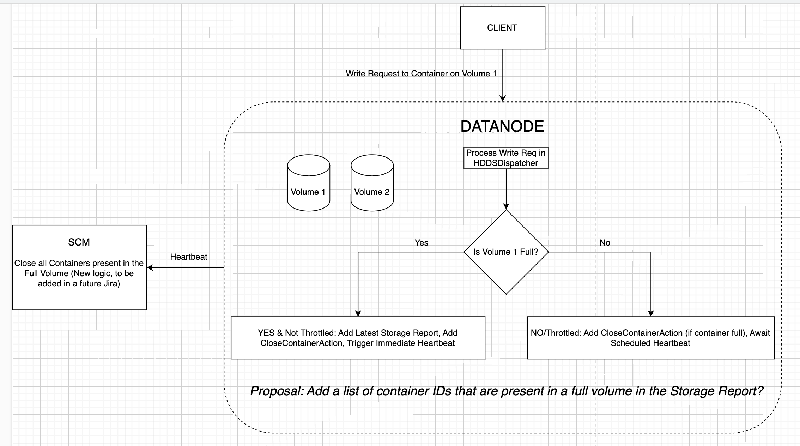

<!--
  Licensed under the Apache License, Version 2.0 (the "License");
  you may not use this file except in compliance with the License.
  You may obtain a copy of the License at

   http://www.apache.org/licenses/LICENSE-2.0

  Unless required by applicable law or agreed to in writing, software
  distributed under the License is distributed on an "AS IS" BASIS,
  WITHOUT WARRANTIES OR CONDITIONS OF ANY KIND, either express or implied.
  See the License for the specific language governing permissions and
  limitations under the License. See accompanying LICENSE file.
-->

## Summary
On detecting a full Datanode volume during write, immediately trigger a heartbeat containing the latest storage report.

## Problem
When a Datanode volume is close to full, the SCM may not be immediately aware because storage reports are only sent 
to it every thirty seconds. This can lead to the SCM allocating multiple blocks to containers on a full DN volume, 
causing performance issues when the write fails. The proposal will partly solve this problem.

In the future (https://issues.apache.org/jira/browse/HDDS-12151) we plan to fail a write if it's going to exceed the min free space boundary in a volume. To prevent this from happening often, SCM needs to stop allocating blocks to containers on such volumes in the first place.

## Non Goals
The proposed solution describes the complete solution at a high level, however HDDS-12929 will only add the initial Datanode side code for triggering a heartbeat on detecting a full volume + throttling logic.

Failing the write if it exceeds the min free space boundary is not discussed here.

## Proposed Solution

### What does the Datanode do currently?

In HddsDispatcher, on detecting that the volume being written to is close to full, we add a CloseContainerAction for
that container. This is sent to the SCM in the next heartbeat and makes the SCM close that container. This reaction time
 is OK for a container that is close to full, but not if the volume is close to full.

### Proposal
This is the proposal, explained via a diagram.

Throttling is required so the Datanode doesn't cause a heartbeat storm on detecting that some volumes are full in multiple write calls.

## Benefits
1.  SCM will not include a Datanode in a new pipeline if all the volumes on it are full. The logic to do this already exists, we just update the volume stats in the SCM faster.
2. Close to full volumes won't cause frequent write failures.

## Alternatives
Instead of including the list of containers present on the full volume in the Storage Report, we could instead add the volume ID to the Container Replica proto. In the SCM, this would imply that we need to do a linear scan through all the Container Replica objects present in the system to figure out which containers are present on the full volume, which is slow. Alternatively we could build and maintain a map to do this, which is more complex than the proposed solution.

## Implementation Plan
1. HDDS-12929: Initial code for including node report, triggering heartbeat, throttling.
2. HDDS-12151: Fail a write call if it exceeds min free space boundary
3. Future Jira: Handle full volume report on the SCM side - close containers.
4. HDDS-12658: Try not to select full pipelines when allocating a block in SCM.