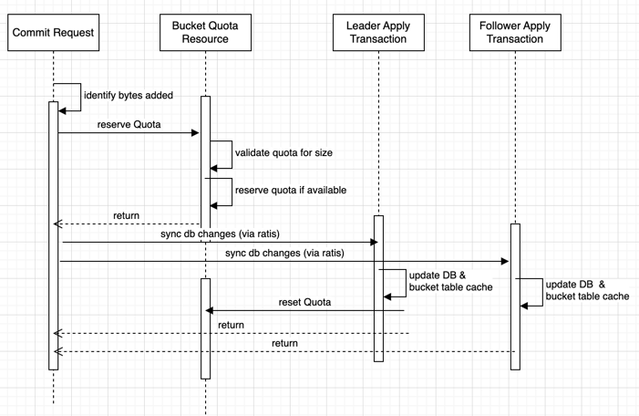

<!--
  Licensed under the Apache License, Version 2.0 (the "License");
  you may not use this file except in compliance with the License.
  You may obtain a copy of the License at

   http://www.apache.org/licenses/LICENSE-2.0

  Unless required by applicable law or agreed to in writing, software
  distributed under the License is distributed on an "AS IS" BASIS,
  WITHOUT WARRANTIES OR CONDITIONS OF ANY KIND, either express or implied.
  See the License for the specific language governing permissions and
  limitations under the License. See accompanying LICENSE file.
-->

# Background

Here is the summary of the challenges:

- The current implementation depends on consensus on the order of requests received and not on consensus on the processing of the requests.
- The double buffer implementation currently is meant to optimize the rate at which writes get flushed to RocksDB but the effective batching achieved is 1.2 at best. It is also a source of continuous bugs and added complexity for new features.
- The number of transactions that can be pushed through Ratis currently caps out around 25k.
- The Current performance envelope for OM is around 12k transactions per second. The early testing pushes this to 40k transactions per second.

## Execution at leader node needs deal with below cases
1. Parallel execution: ratis serialize all the execution in order. With control, it is possible to execute the request in parallel which are independent.
2. Optimized locking: Locks are taken at bucket level for both read and write flow. Here, focus to remove lock between read and write flow, and have more granular locking.
3. Cache Optimization: Cache are maintained for write operation and read also make use of same for consistency. This creates complexity for read to provide accurate result with parallel operation.
4. Double buffer code complexity: Double buffer provides batching for db update. This is done with ratis state machine and induces issues managing ratis state machine, cache and db updates.
5. Request execution flow optimization: Optimize request execution flow, removing un-necessary operation and improve testability.
6. Performance and resource Optimization: Currently, same execution is repeated at all nodes, and have more failure points. With leader side execution and parallelism, need improve performance and resource utilization.

### Object ID generation
Currently, the Object ID is tied to Ratis transaction metadata. This has multiple challenges in the long run.

- If OM adopts multi Ratis to scale writes further, Object IDs will not longer be unique.
- If we shard OM, then across OMs the object ID will not be unique.
- When batching multiple requests, we cannot utilize Ratis metadata to generate object IDs.

Longer term, we should move to a UUID based object ID generation. This will allow us to generate object IDs that are globally unique. In the mean time, we are moving to a persistent counter based object ID generation. The counter is persisted during apply transaction and is incremented for each new object created.

## Prototype Performance Result:

| sno | item                                     | old flow result               | leader execution result |
|-----|------------------------------------------|-------------------------------|------------------------|
| 1   | Operation / Second (key create / commit) | 12k+                          | 40k+                   |
| 2   | Key Commit / Second                      | 5.9k+                         | 20k+ (3.3 times)       |
| 3   | CPU Utilization Leader | 16% (unable to increase load) | 33%                    |
| 4   | CPU Utilization Follower | 6% above                      | 4% below               |

Refer [performance prototype result](performance-prototype-result.pdf)

# Leader execution


Client --> OM --> Gatekeeper ---> Executor --> Batching (ratis request) --{Ratis sync to all nodes}--> apply transaction {db update}


### Gatekeeper
Gatekeeper act as entry point for request execution. Its function is:
1. orchestrate the execution flow
2. granular locking
3. execution of request
4. validate om state like upgrade
5. update metrics and return response
6. handle client replay of request
7. managed index generation (remove dependency with ratis index for objectId)

### Executor
This prepares context for execution, process the request, communicate to all nodes for db changes via ratis and clearing up any cache.

### Batching (Ratis request)
All request as executed parallel are batched and send as single request to other nodes. This helps improve performance over network with batching.

### Apply Transaction (via ratis at all nodes)
With new flow as change,
- all nodes during ratis apply transaction will just only update the DB for changes.
- there will not be any double buffer and all changes will be flushed to db immediately.
- there will be few specific action like snapshot creation of db, upgrade handling which will be done at node. 

## Description

### Index generation

In old flow, ratis index is used for `object Id` of key and `update Id` for key update.
For new flow, it will not depend on ratis index, but will have its own **`managed index`**.

Index initialization / update:
- First time startup: 0
- On restart (leader): last preserved index + 1
- On Switch over: last index + 1
- Request execution: index + 1
- Upgrade: Last Ratis index + 1


#### Index Persistence:

Index Preserved in TransactionInfo Table with new KEY: "#KEYINDEX"
Format: <timestamp>#<index>
Time stamp: This will be used to identify last saved transaction executed
Index: index identifier of the request

Sync the Index to other nodes:
Special request body having metadata: [Execution Control Message](leader-execution.md#control-request).


#### Step-by-step incremental changes for existing flow

1. for increment changes, need remove dependency with ratis index. For this, need to use om managed index in both old and new flow.
2. objectId generation: need follow old logic of index to objectId mapping.

### No-Cache for write operation

In old flow, a key creation / updation is added to PartialTableCache, and cleanup happens when DoubleBuffer flushes DB changes.
Since DB changes is done in batches, so a cache is maintained till flush of DB is completed. Cache is maintained so that OM can serve further request till flush is completed.

This adds complexity during read for the keys, as it needs ensure to have the latest data from cache or DB.
Since there can be parallel operation of adding keys to cache, removal from cache and flush to db, this induces bug to the code if this is not handled properly.

For new flow, partial table cache is removed, and changes are visible as soon as changes are flushed to db.
For this to achieve,
- granular locking for key operation to avoid parallel update till the existing operation completes. This avoids need of cache as data is available only after changes are persisted.
- Double buffer operation removal for the flow, flush is done immediately before response is returned. This is no more needed as no need to serve next request as current reply is not done.
- Bucket resource is handled in such a way that its visible only after db changes are flushed. This is required as quota is shared between different keys operating parallel.
Note: For incremental changes, quota count will be available immediately for read for compatibility with older flow till all flows are migrated to new flow.

### Quota handling (Bucket Quota)

Earlier, bucket level lock is taken, quota validation is performed and updated with-in lock in cache in all nodes.
During startup before persistence to db, request is re-executed from ratis log and bucket quota cache is prepared again.
So once bucket quota is updated in cache, it will remain same (As recovered during startup with same re-execution).

Now request is getting executed at leader node, so bucket case will not be able to recover if crash happens. So it can be updated in BucketTable cache only after its persisted.



For bucket quota in new flow,
- When processing key commit, the quota will be `reserved` at leader.
- Bucket quota changes will be distributed to all other nodes via ratis
- At all nodes, key changes is flushed to DB, during that time, quota change will be updated to BucketTable, and quota reserve will be reset.
- On failure, reserve quota for the request will be reset.

`Bucket Resource Quota` will store quota information with respect to `index` also and same will be used to reset on request handling,
- At leader node after request is send to ratis in success and failure path (as default always) with `request index`
- At all nodes on apply transaction, quota is reset with request index.
  So in all cases, reserved quota can be removed in processing of request.

Cases:
1. Quota is reserved at leader node but sync to other nodes fail, quota will be reset always
2. Quota is updated at leader node in apply transaction, it will reset quota to avoid double quota increase
3. Quota is updated at follower node in apply transaction, reset as no impact as `Bucket Quota resource` will not have any entry for the the request

### Granular locking
Gateway: Perform lock as per below strategy for OBS/FSO
On lock success, trigger execution of request to respective executor queue

#### OBS Locking
refer [OBS locking](obs-locking.md)

#### FSO Locking
TODO

Challenges compared to OBS,
1. Implicit directory creation
2. file Id depends on parent directory /<volId>/<bucketId>/<parent ObjectId>/<file name>
So due to hierarchy in nature and parallel operation at various level, FSO locking is more complicated.

#### Legacy Locking:
Not-in-scope

### Optimized new flow

Currently, a request is handled as:
- Pre-execute: does request static validation, authorization
- validateAndUpdateCache: locking, handle request, update cache
- Double buffer to update DB using cache happening in background

Request execution Template: every request handling need follow below template of request execution.

- preProcess: basic request validation, update parameter like user info, normalization of key
- authorize: perform ranger or native acl validation
- lock: granular level locking
- unlock: unlock locked keys
- process: process request like:
  - Validation after lock like bucket details
  - Retrieve previous key, create new key, quota update, and so on
  - Record changes for db update
  - Prepare response
  - Audit and logging
  - Metrics update
- Request validator annotation: similar to existing, where compatibility check with ozone manager feature version and client feature version, and update request to support compatibility if any.

Detailed request processing:
OBS:
- [Create key](request/obs-create-key.md)
- [Commit key](request/obs-commit-key.md)

### Execution persist and distribution


#### Change recorder

When a request is executed, the changes to be persisted needs to be captured and send to all nodes to persist to DB.
To abstract how the changes are cached and transferred with respect to request execution, Change recorder will provider below interfaces,
1. add(table, key, value)
2. remove(table, key, value)
3. addBucketQuota(index, bucketInfo, incBytes, incNamespace)
4. ...

#### Change distribution to nodes

There are multiple features having different api. Handling of those api at leader and other nodes can differ, like:
- key creation: key can be prepared to operate at leader and the changes only needs to be updated to db at all nodes.
- key deletion: key needs to be moved to deleted table for soft delete, so preparation can be done at leader, but movement to be done in db for all nodes.
- snapshot creation: involves rocksdb checkpoint creation, which needs to be executed only at all nodes. This can have basic preparation at leader side.
- upgrade: all nodes need update bookkeeping for the operation at all nodes.

So based on different nature and optimization of request, flexibility is required for handling such request at leader and to the nodes.

#### Control Request

Control request provides capability for flexibility to the other nodes for way of further execution for cases given above.
This is additional information send with request send to other nodes via ratis. This can be further extended for various purpose on need basis.

Example:
1. DBPersisRequest; This will hold information about data changes to be persisted to db directly, like table, key, value for add
2. Control Request: This will provide additional information such as index, client request info for replay handling

```
message ExecutionControlRequest {
  repeated ClientRequestInfo requestInfo = 1;
}

message ClientRequestInfo {
  optional string uuidClientId = 1;
  optional uint64 callId = 2;
  optional unint64 timestamp = 5;
  optional OMResponse response = 3;
}
```

This control message and request can be embedded to same Proto request body:
```
OMRequest.Builder omReqBuilder = OMRequest.newBuilder()

// control message
.setExecutionControlRequest(controlReq.build())

// db change message
.setPersistDbRequest(reqBuilder.build())
.setCmdType(OzoneManagerProtocolProtos.Type.PersistDb)
.setClientId(lastReqCtx.getRequest().getClientId());
```


request Command Type (message to be send to all nodes via ratis):
- PersistDb
- CreateSnapshot
- DeleteSnapshot
- UpgradePrepare
- UpgradeCancel

#### DB Persist Request capturing db changes to send via ratis

DB persist message will capture:
- table record add and delete
- move of record from one table to other table
- bucket quota changes

Message format
```
message PersistDbRequest {
  repeated PersistDbInfo info = 1;
}

message PersistDbInfo {
  optional int64 index = 1;
  repeated DBTableUpdate tableUpdates = 2;
  repeated DBTableMove tableMoves = 3;
  repeated DBBucketQuotaUpdate bucketQuotaUpdate = 4;
}

message DBBucketQuotaUpdate {
required string volName = 1;
required string bucketName = 2;
required int64 diffUsedBytes = 3;
required int64 diffUsedNamespace = 4;
optional uint64 bucketObjectId = 5;
}
message DBTableMove {
  optional string srcTableName = 1;
  optional string destTableName = 2;
  optional string srcKey = 3;
  optional string destKey = 4;
}
message DBTableUpdate {
  required string tableName = 1;
  repeated DBTableRecord records = 2;
}
message DBTableRecord {
  required bytes key = 1;
  optional bytes value = 2;
}
```

### Replay of client request handling

In old flow, request is submitted to ratis directly with ClientId and CallId (From HadoopRPC callback), and same used by ratis to handle request replay (or retry).
If ratis finds the another request with same ClientId and CallId, it returns response of last request itself matching.
Additionally, mapping of ClientId and CallId is present in memory and gets flushed out on restart, so it does not have consistent behaviour for handling same.

For new flow, since only db changes are added to ratis, so this mechanism can not be used. To handle this, need to have similar mechanism, and improve over persistence for replay.

`Client Request --> Gatekeeper --> check for request exist in cache for ClientId and CallId
--> If exist, return cached response
--> Else continue request handling`

#### Client request replay at leader node
- When request is received at leader node, it will cache the request in replayCache immediately
- When request is received again with same ClientId and CallId, it will check replayCache and if entry exist,
    - If response in cache is not available (request handling in progess), wait for availability and timeout - 60 sec
    - If response available, return immediately
- If entry does not exist, it will process handling request normally


#### Replay cache distribution to other nodes
Request - response will be cached to other node via ratis distribution
- It will be added to memory cache with expiry handling
- Also will be added to DB for persistence for restart handing

Below information will be sync to all nodes via ratis:
```
message ClientRequestInfo {
  optional string uuidClientId = 1;
  optional uint64 callId = 2;
  optional unint64 timestamp = 5;
  optional OMResponse response = 3;
}
```

Refer [Execution Control Message](leader-execution.md#control-request) for format.

DB Persistence:
```
New rocksDB table: ClientRequestReplyTable
Key: String: ClientId#CallId
Value: ClientRequestInfo
```

#### Memory caching:
```
Memory Map: ClientId#CallId Vs Response
Expiry: 10 minute (as current default for ratis)
```

Memory expiry handling:
```
Handling cleanup of expired entry:
Timer: 30 sec
RequestReply Bucket Map:
Time vs List<ClientId#CallId>, where Time is with granularity of 10 sec
```

Steps:
- Retrieve all bucket for time < (currTime - 10min as expiry)
- Delete from DB and Map for the entry

### Testability framework

With rework on flow, a testability framework for better test coverage for request processing.

Complexity in existing framework for request:
1. Flow handling is different 1 node / 3 node HA deployment
2. Check for double buffer cache flush
3. cache related behaviour testing
3. Ratis sync and failure handling
4. Too much mocking for unit testing

Proposed handling:
Since execution is leader side and only db update is synchronized to all other nodes, so unit test will focus behavior, but not on env.

1. Test data preparation
  - Utility to prepare Key, File, volume, bucket
  - Insert to DB to different table
2. Short-circuit for db update (without ratis)
3. simplified mocking for ranger authorization (just mock a method)
4. behavior test from End-to-End perspective

This will have the following advantages:
- Speed of test scenarios (sync wait and double buffer flush wait will be avoided)
- optimized test cases (avoid duplicate test cases)
- test code complexity will be less

TODO: With echo, define test utils and sample test cases
- Capture test cases based on behavior.

## Step-by-step integration of existing request (interoperability)

Leader side execution have changes for all flows. This needs to be done incrementally to help better quality, testability.
This needs below integration points in current code:
1. dependency over ratis index removal (for old flow also)
2. bucket quota handling integration (such that old flow have no impact)
3. Granular locking for old flow, this ensures `no cache` for new flow do not have impact
4. OmStateMachine integration for new flow, so that both old and new flow can work together
5. Request segregation for new flow which is incrementally added.

With above, Enable for old and new flow execution will be done with Feature flag, to switch between them seamlessly.
And old flow can be removed with achieving quality, performance and compatibility for new flow execution.

## Impacted areas
1. With Leader side execution, metrics and its capturing information can change.
   - Certain metrics may not be valid
   - New metrics needs to be added
   - Metrics will be updated at leader side now like for key create. At follower node, its just db update, so value will not be udpated.
