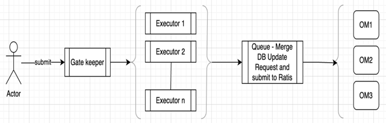

# Problem Statement

Execution at leader node needs deal with below cases:
1. Parallel execution: ratis serialize all the execution in order. With control, it is possible to execute the request in parallel which are independent.
2. Optimized locking: Locks are taken at bucket level for both read and write flow. Here, focus to remove lock between read and write flow, and have more granular locking.
3. Cache Optimization: Cache are maintained for write operation and read also make use of same for consistency. This creates complexity for read to provide accurate result with parallel operation.
4. Double buffer code complexity: Double buffer provides batching for db update. This is done with ratis state machine and induces issues managing ratis state machine, cache and db updates.
5. Request execution flow optimization: Optimize request execution flow, removing un-necessary operation and improve testability.
6. Performance and resource Optimization: Currently, same execution is repeated at all nodes, and have more failure points. With leader side execution and parallelism, need improve performance and resource utilization.

# Leader execution flow

Client --> OM --> Gatekeeper ---> Executor --> Batching (ratis request) --{Ratis sync to all nodes}--> apply transaction {db update}

### Gatekeeper
Gatekeeper act as entry point for request execution. Its function is:
1. orchestrate the execution flow
2. granular locking
3. execution of request
4. validate om state
5. update metrics and return response
6. handle client replay of request
7. leader side index generation

### Executor
This prepares context for execution, process the request, communicate to all nodes for db changes via ratis and clearing up any cache.

### Batching (Ratis request)
All request as executed parallel are batched and send as single request to other nodes. This helps improve performance over network with batching.

### Apply Transaction (via ratis at all nodes)
With new flow, all nodes during ratis apply transaction will just only update the DB for changes. There will be few specific action like snapshot creation of db, upgrade handling which will be done at node.
As change, there will not be any double buffer and all changes will be flushed to db immediately.

## Design consideration

### Index generation
refer [index generation and usages](index-generation-usages.md)

### Keep No-Cache for write operation

In old flow, a key creation / updation is added to PartialTableCache, and cleanup happens when DoubleBuffer flushes DB changes.
Since DB changes is done in batches, so a cache is maintained till flush of DB is completed. Cache is maintained so that OM can serve further request till flush is completed.

This adds complexity during read for the keys, as it needs ensure to have latest data from cache or DB.
Since there can be parallel operation of adding keys to cache, removal from cache and flush to db, this induces bug to the code if this is not handled properly.

For new flow, partial table cache is removed, and changes are visible as soon as changes are flushed to db.
For this,
- granular locking for key operation to avoid parallel update till the existing operation completes. This avoids need of cache as data is available only after changes are persisted.
- Double buffer operation removal for the flow, flush is done immediately before response is returned. This is no more needed as no need to serve next request as current reply is not done.
- Bucket resource is handled in such a way that its visible only after db changes are flushed. This is required as quota is shared between different keys operating parallel.
Note: For incremental changes, quota count will be available immediately for read for compatibility with older flow till all flows are migrated to new flow.

### Quota handling

Earlier, bucket level lock is taken, quota validation is performed and updated with-in lock in cache in all nodes.
During startup before persistence to db, request is re-executed from ratis log and bucket quota cache is prepared again.
So once bucket quota is updated in cache, it will remain same (As recovered during startup with same re-execution).

Now request is getting executed at leader node, so bucket case will not be able to recover if crash happens. So it can be updated in BucketTable cache only after its persisted.

For bucket quota in new flow,
- When processing key commit, the quota will be `reserved` at leader.
- Bucket quota changes will be distributed to all other nodes via ratis
- At all nodes, key changes is flushed to DB, during that time, quota change will be updated to BucketTable, and quota reserve will be reset.
- On failure, reserve quota for the request will be reset.

### Execution persist and distribution

refer [request-process-distribution](request-persist-distribution.md)

### Replay of client request handling

refer [request-replay-handling](request-replay.md)

### Granular locking

### Optimized new flow

Currently, a request is handled as:
- Pre-execute: does request static validation, authorization
- validateAndUpdateCache: locking, handle request, update cache
- Double buffer to update DB using cache happening in backgound

Request execution Template: every request handling need follow below template of request execution.

- preProcess: basic request validation, update parameter like user info, normalization of key
- authorize: perform ranger or native acl validation
- lock: granular level locking
- unlock: unlock locked keys
- process: process request like:
  - Validation after lock like bucket details
  - Retrieve previous key, create new key, quota update, and so on
  - Record changes for db update
  - Prepare response
  - Audit and logging
  - Metrics update
- Request validator annotation: similar to existing, where compatibility check with ozone manager feature version and client feature version, and update request to support compatibility if any.

### Step-by-step integration of existing request

Leader side execution have changes for all flows. This needs to be done incrementally to help better quality, testability.
This needs below integration points in current code:
1. dependency over ratis index removal (for old flow also)
2. bucket quota handling integration (such that old flow have no impact)
3. Granular locking for old flow, this ensures `no cache` for new flow do not have impact
4. OmStateMachine integration for new flow, so that both old and new flow can work together
5. Request segregation for new flow which is incrementally added.

## Impacted areas
1. With Leader side execution, metrics and its capturing information can change.
   - Certain metrics may not be valid
   - New metrics needs to be added
   - Metrics will be updated at leader side now like for key create. At follower node, its just db update, so value will not be udpated.

