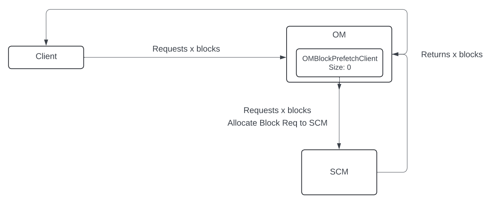

<!--
  Licensed under the Apache License, Version 2.0 (the "License");
  you may not use this file except in compliance with the License.
  You may obtain a copy of the License at
   http://www.apache.org/licenses/LICENSE-2.0
  Unless required by applicable law or agreed to in writing, software
  distributed under the License is distributed on an "AS IS" BASIS,
  WITHOUT WARRANTIES OR CONDITIONS OF ANY KIND, either express or implied.
  See the License for the specific language governing permissions and
  limitations under the License. See accompanying LICENSE file.
-->

## Introduction

Whenever a write operation occurs, OM calls into SCM for allocateBlock. This adds overhead to each create request, including added latency to reach the create and allocateBlock request, as well as resource starvation since the thread in OM is blocked for the duration SCM responds to the call.

Frequent RPC calls to SCM can become a performance bottleneck under heavy workloads. To address this, what if we could prefetch (preallocate) blocks from SCM asynchronously and cache them within OM to reduce this dependency on SCM?

This design proposes a mechanism to preallocate blocks in OM and cache them for future use. This will reduce the number of network RPC calls to SCM and improve the overall performance of writes.

#### Current Write Flow

#### New Write Flow

## Proposed Approach

#### 1. Empty Cache on Initialization:

- The cache starts with no pre-allocated blocks (0 cache size). 
- Blocks are fetched and cached only upon the completion of a client write request (ref: Figure 1).

#### Figure 1

#### 2. Block Pre-Fetching:

- For every client write request made, we see if the cache size falls below the minimum threshold (configurable property: ozone.om.prefetch.blocks.min), if yes - the background thread is triggered to asynchronously prefetch blocks from SCM while adhering to a maximum cache size limit (configurable property: ozone.om.prefetch.blocks.max).
- Example: A client write request for x blocks with an empty cache size results in max_threshold blocks (max_threshold - cache_size) being cached asynchronously in the background once the actual client request is through (ref: Figure 2).

#### Figure 2

#### 3. Block Usage and Refilling:

- Cached blocks are used for the request if available.
- If the cache has fewer blocks than requested, we leave the cache as is and fallback to a synchronous RPC call to SCM.
  - Example (ref: Figure 3): If the client requests x blocks (where x < min_threshold), and min_threshold blocks remain cached, x of the min_threshold cached blocks are utilized for the request. Post this step, Step 2. is repeated to refill the cache asynchronously (if needed).

   #### Figure 3
   

  - Example (ref: Figure 4): If the client requests x blocks (where x > min_threshold), and min_threshold blocks remain cached, all x blocks are fetched from SCM synchronously and returned to the client (leaving the cache untouched). Post this step, Step 2. is repeated to refill the cache asynchronously (if needed).
  #### Figure 4
  

#### 4. Time-Based Expiration:

- Each cached block entry has a short expiration duration (configurable setting: ozone.om.prefetched.blocks.periodic.expiry.interval).
- Since OM created the cache, some containers where blocks were allocated may have closed. OM must maintain a valid set of cached blocks, hence whenever an expired block has been encountered, it is polled from the cache without the need for explicit invalidation.

#### Alternate Approaches for Cache Invalidation
- **SCM Notifying Events:** SCM can notify OM about the closure of containers and/or other events, and OM can invalidate the block cache based on this information.
  - Drawback: Complexity in implementation.

- **ExcludeList Logic:** OM cache can utilise the client-populated ExcludeList to scan cached blocks and invalidate cache entries based on filtered pipeline IDs, container IDs, or nodes. 
  - Drawback: ExcludeList-based invalidation alone cannot handle all cases.

#### Current Behavior - Discussion Points
- **Allocated Block Management:** 
  - SCM does not track individual block IDs but only maintains the next ID to be assigned, using the sequenceIdGen.getNextId(LOCAL_ID) method.
  - If an allocated block is not utilized, it does not pose any issues, as there’s no record or space reserved for it on the DNs. Therefore, it's safe to discard unused blocks without needing to explicitly delete them.
  - Moreover, SCM has a significantly high upper limit for block IDs (long value), making the number of available blocks pretty much inexhaustible.

- **Container Closure After Block Allocation:**
  - When an open container approaches 5GB or becomes unhealthy, its DN will notify the SCM, which will then attempt to close the container (in Ratis). For EC, SCM will either lazily close pipelines/containers (one pipeline - one container) when an allocateBlock request has been received and the container is found to not have enough space (or) wait for the DN to communicate closure (based on other predefined conditions).
  - Currently, when a block is received, it is possible that the container in which the block was allocated in has already been closed, requiring the client to retry the entire allocateBlock process (as implemented in KeyOutputStream#handleWrite).
  - If the client encounters any exceptions related to a specific container location, we provide a different location during the retry process based on the current health of the cluster, which involves making a separate RPC call to SCM. 

#### Implementation Details

- The `OMBlockPrefetchClient` implements a background thread for block prefetching and manages the cached queue of allocated blocks per replication configuration. It initializes with OM startup and stops during shutdown.
- When a client machine's address is specified in the allocateBlock request, DNs in the pipelines are sorted by distance cost relative to the client. Since this logic has already been moved to OM as part of [HDDS-9343](https://issues.apache.org/jira/browse/HDDS-9343), it is utilized here while returning the block to the client.

#### Advantages
1. **Simplicity:** The cache requires minimal logic for management.
2. **Efficiency:** Handles high-throughput scenarios efficiently with either no or significantly fewer calls to the SCM for block allocation.
3. **Cleanup:** Time-based expiration removes the need for explicit invalidation logic.

#### Percentage Improvement
When the performance numbers were run using a pure write workload of 1 million zero-byte objects (`ockrw` tool) on an in-house cluster, the following improvement was seen:
- **Single-threaded Scenario**: 
  - **Before:** Write throughput was `368.61` calls/second.
  - **After:** Write throughput is `449.23` calls/second.
  - **Improvement:** ~`22%` improvement in performance.

- **Multi-threaded Scenario (10 threads)**: 
  - **Before:** Write throughput was `3831.86` calls/second.
  - **After:** Write throughput is `4445.06` calls/second.
  - **Improvement:** ~`16%` improvement in performance.

#### Future Enhancements
- Support adaptive prefetching based on metrics introduced.
- Strategy to distribute the block prefetching load over a defined period, ensuring that the ongoing writes are not adversely impacted by it.

