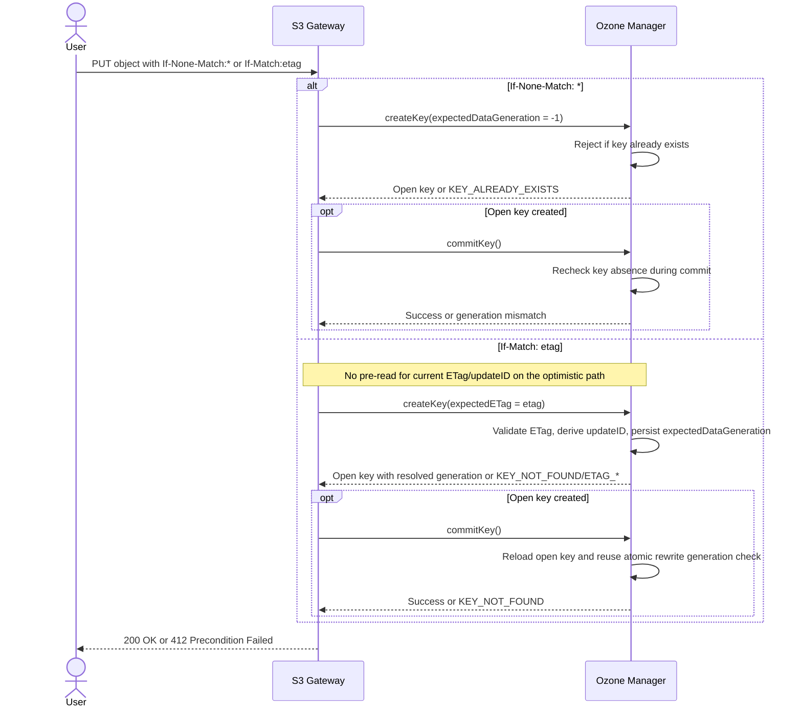
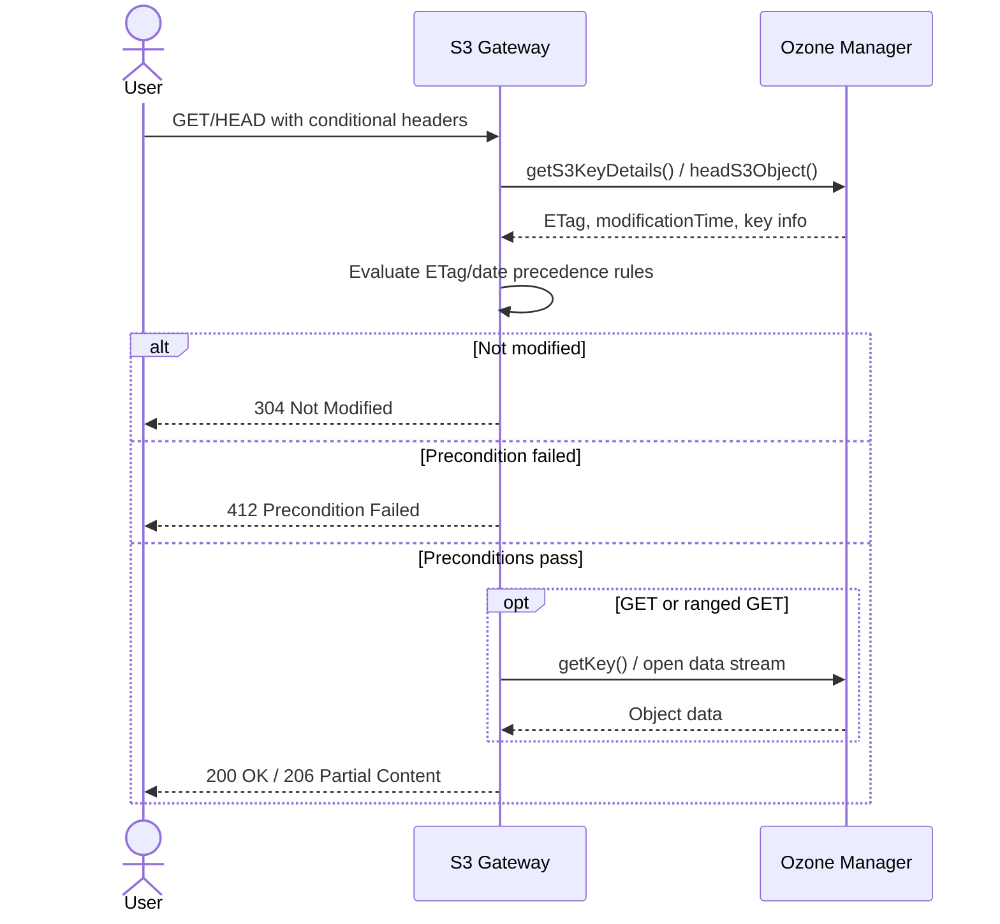
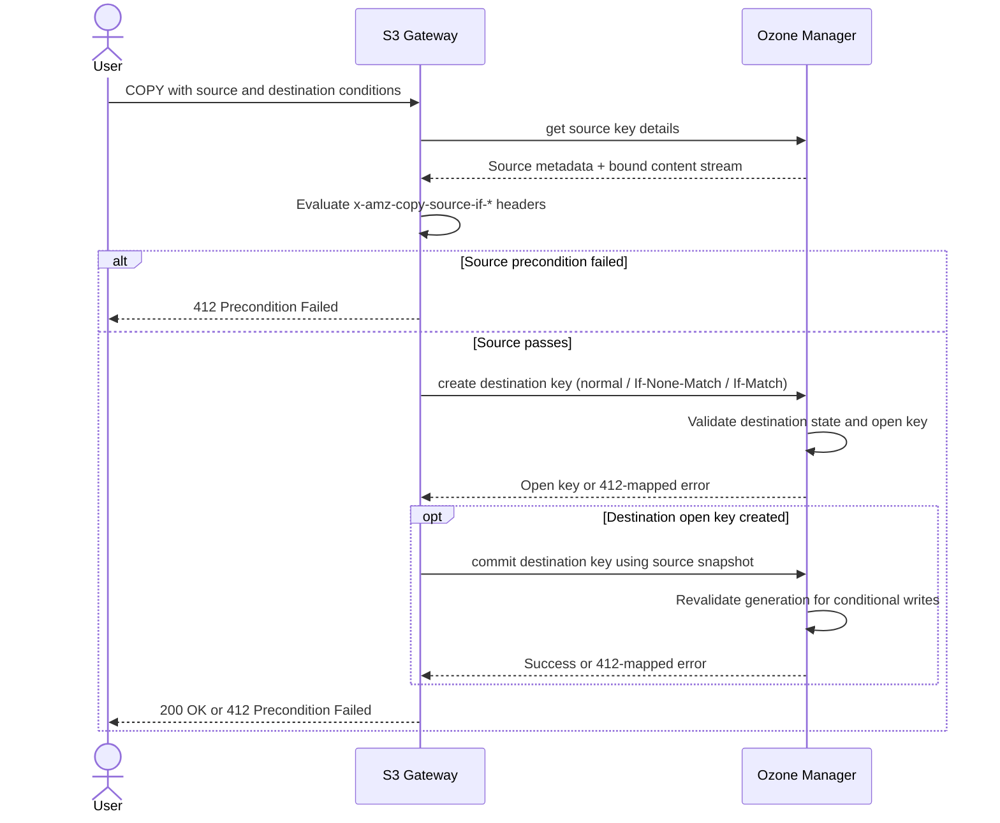
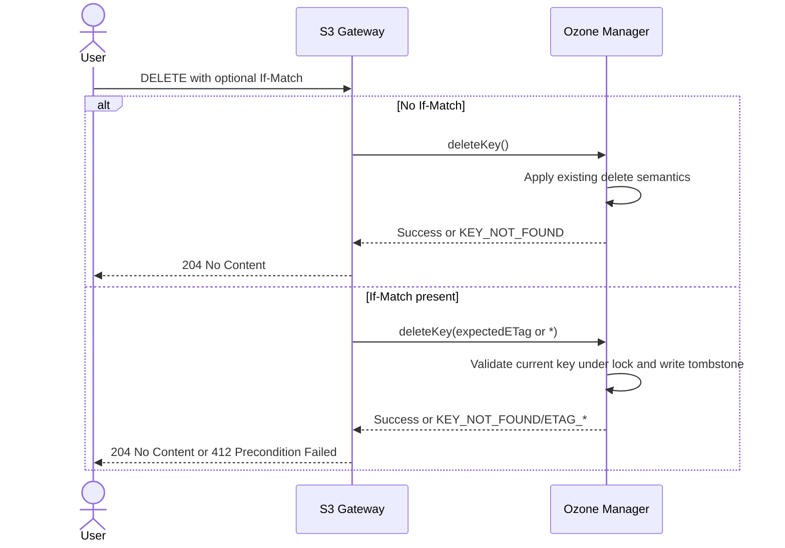

<!--
  Licensed under the Apache License, Version 2.0 (the "License");
  you may not use this file except in compliance with the License.
  You may obtain a copy of the License at

   http://www.apache.org/licenses/LICENSE-2.0

  Unless required by applicable law or agreed to in writing, software
  distributed under the License is distributed on an "AS IS" BASIS,
  WITHOUT WARRANTIES OR CONDITIONS OF ANY KIND, either express or implied.
  See the License for the specific language governing permissions and
  limitations under the License. See accompanying LICENSE file.
-->

# S3 Conditional Requests Design

## Background

AWS S3 supports conditional requests using HTTP conditional headers,
enabling atomic operations, cache optimization, and preventing race
conditions. This includes:

- **Conditional Writes** (PutObject): `If-Match` and `If-None-Match` headers for atomic operations
- **Conditional Reads** (GetObject, HeadObject): `If-Match`,
  `If-None-Match`, `If-Modified-Since`, `If-Unmodified-Since` for cache
  validation
- **Conditional Copy** (CopyObject): Conditions on both source and destination objects
- **Conditional Deletes** (DeleteObject): `If-Match` for delete-if-exists
  and delete-if-unchanged semantics

### Current State

- HDDS-10656 implemented atomic rewrite using `expectedDataGeneration`
- OM HA uses single Raft group with single applier thread (Ratis StateMachineUpdater)
- S3 gateway doesn't expose conditional headers to OM layer

## Use Cases

### Conditional Writes

- **Atomic key rewrites**: Prevent race conditions when updating existing objects
- **Create-only semantics**: Prevent accidental overwrites (`If-None-Match: *`)
- **Optimistic locking**: Enable concurrent access with conflict detection
- **Leader election**: Implement distributed coordination using S3 as backing store

### Conditional Reads

- **Bandwidth optimization**: Avoid downloading unchanged objects (304 Not Modified)
- **HTTP caching**: Support standard browser/CDN caching semantics
- **Conditional processing**: Only process objects that meet specific criteria

### Conditional Copy

- **Atomic copy operations**: Copy only if source/destination meets specific conditions
- **Prevent overwrite**: Copy only if destination doesn't exist

### Conditional Deletes

- **Delete-if-unchanged**: Delete only when the caller still sees the
  expected object ETag
- **Delete-if-exists**: Require the key to exist by sending
  `If-Match: *`
- **Race prevention**: Avoid deleting an object that was replaced by a
  concurrent writer

## Specification

### AWS S3 Conditional Write Specification

#### Supported Headers

|   |   |   |
|---|---|---|
|**Header**|**Meaning**|**Failure result**|
|`If-None-Match: "*"`|Write succeeds only if the object does not exist (put-if-absent semantics).|`412 Precondition Failed` if the object already exists.|
|`If-Match: "<etag>"`|Write succeeds only if the object exists and its ETag matches (atomic update / compare-and-swap).|`412 Precondition Failed` if the object does not exist or the ETag does not match.|

#### Restrictions

- Cannot use both headers together in the same request.
- No additional charges for failed conditional requests.

### AWS S3 Conditional Read Specification

Conditional reads apply to `GetObject` and `HeadObject`. They do not mutate object state; they only decide whether the
current representation should be returned.

#### Supported Headers

|   |   |   |
|---|---|---|
|**Header**|**Meaning**|**Failure result**|
|`If-Match: "<etag>"`|Return the object only if the current ETag matches|`412 Precondition Failed`|
|`If-None-Match: "<etag>"`|Return the object only if the current ETag does not match|`304 Not Modified`|
|`If-Modified-Since: <http-date>`|Return the object only if it has been modified since the supplied time|`304 Not Modified`|
|`If-Unmodified-Since: <http-date>`|Return the object only if it has not been modified since the supplied time|`412 Precondition Failed`|

`HeadObject` uses the same validators and status codes as `GetObject`; the only difference is that the successful
response has no body.

#### Header Combination Rules

AWS S3 documents two precedence rules that are important for compatibility:

- If both `If-Match` and `If-Unmodified-Since` are present, and the ETag comparison succeeds while the time check
  fails, S3 still returns success.
- If both `If-None-Match` and `If-Modified-Since` are present, and the ETag comparison fails while the time check
  succeeds, S3 returns `304 Not Modified`.

Operationally, this means the ETag-based headers take precedence over the date-based headers within each pair.

#### Additional Notes

- Conditional evaluation happens before any response body is streamed.
- `Range` and `partNumber` do not change validator semantics; they are applied only after the conditional checks pass.
- Missing objects still follow the normal `NoSuchKey` / `404` behavior rather than returning `304` or `412`.

### AWS S3 Conditional Copy Specification

Conditional copy combines two independent sets of preconditions:

1. **Source-side read conditions**, evaluated against the object named by `x-amz-copy-source`
2. **Destination-side write conditions**, evaluated against the destination key being written

Both sets must pass for the copy to proceed.

#### Source Object Headers

|   |   |   |
|---|---|---|
|**Header**|**Meaning**|**Failure result**|
|`x-amz-copy-source-if-match: "<etag>"`|Copy only if the source ETag matches|`412 Precondition Failed`|
|`x-amz-copy-source-if-none-match: "<etag>"`|Copy only if the source ETag does not match|`412 Precondition Failed`|
|`x-amz-copy-source-if-modified-since: <http-date>`|Copy only if the source was modified since the supplied time|`412 Precondition Failed`|
|`x-amz-copy-source-if-unmodified-since: <http-date>`|Copy only if the source was not modified since the supplied time|`412 Precondition Failed`|

AWS S3 documents the same precedence pattern for source conditions as for conditional reads:

- `x-amz-copy-source-if-match` takes precedence over `x-amz-copy-source-if-unmodified-since`
- `x-amz-copy-source-if-none-match` takes precedence over `x-amz-copy-source-if-modified-since`

#### Destination Object Headers

`CopyObject` also supports the destination-side write headers already used by conditional `PutObject`:

|   |   |   |
|---|---|---|
|**Header**|**Meaning**|**Failure result**|
|`If-Match: "<etag>"`|Copy only if the destination object exists and its ETag matches|`412 Precondition Failed`|
|`If-None-Match: "*"`|Copy only if the destination object does not already exist|`412 Precondition Failed`|

Restrictions and notes:

- `If-Match` and `If-None-Match` must not be used together.
- Destination conditions are evaluated with the same semantics as conditional writes.
- Source and destination conditions are conjunctive: a request succeeds only when both sides pass.
- `UploadPartCopy` uses the same source-side header family and should follow the same source validation rules.

### AWS S3 Conditional Delete Specification

For the scope of [HDDS-14907](https://issues.apache.org/jira/browse/HDDS-14907),
we target `DeleteObject`.

AWS also supports conditional batch delete through `DeleteObjects`, but
that is a separate API surface and is out of scope for this first step.

#### Supported Header

|   |   |   |
|---|---|---|
|**Header**|**Meaning**|**Failure result**|
|`If-Match: "<etag>"`|Delete only if the current ETag matches|`412 Precondition Failed`|
|`If-Match: "*"`|Delete only if the object currently exists|`412 Precondition Failed`|

On success, `DeleteObject` still returns `204 No Content`.

#### Scope Notes

- Directory-bucket-only headers `x-amz-if-match-last-modified-time` and
  `x-amz-if-match-size` are out of scope.
- Ozone S3 gateway currently behaves like a non-versioned object store
  for this operation, so the design evaluates the current committed key
  only. AWS delete-marker and object-version semantics are not modeled
  here.
- Conditional delete changes only the meaning of requests that carry
  `If-Match`. Unconditional delete keeps the existing S3-compatible
  "delete missing key succeeds" behavior.

## Implementation

### AWS S3 Conditional Write Implementation

The implementation aims to minimize redundant RPCs while ensuring
strict atomicity for conditional operations.

- **If-None-Match** utilizes the atomic "Create-If-Not-Exists"
  capability ([HDDS-13963](https://issues.apache.org/jira/browse/HDDS-13963)).
- **If-Match** reuses the same open-key plus commit workflow as normal
  writes, but converts the caller's ETag into
  `expectedDataGeneration` during `createKey`. The gateway sends the
  caller's ETag directly to OM, OM validates it, resolves the current
  `updateID`, and then reuses the existing atomic rewrite mechanism from
  [HDDS-10656](https://issues.apache.org/jira/browse/HDDS-10656). This
  avoids an extra read RPC to fetch the current ETag and generation
  before opening the key.

#### Request Sequence



#### If-None-Match Implementation

This implementation ensures strict create-only semantics by utilizing a specific generation ID marker.

In `OzoneConsts.java`, add the `-1` as a constant for readability:
```java
/**
 * Special value for expectedDataGeneration to indicate "Create-If-Not-Exists" semantics.
 * When used with If-None-Match conditional requests, this ensures atomicity:
 * if a concurrent write commits between Create and Commit phases, the commit
 * fails the validation check, preserving strict create-if-not-exists semantics.
 */
public static final long EXPECTED_DATA_GENERATION_CREATE_IF_NOT_EXISTS = -1L;
```

##### S3 Gateway Layer

1. Parse `If-None-Match: *`.
2. Use a dedicated client API such as `RpcClient.createKeyIfNotExists()`.
3. The client populates `expectedDataGeneration =
   OzoneConsts.EXPECTED_DATA_GENERATION_CREATE_IF_NOT_EXISTS` in the
   outgoing `KeyArgs`.

##### OM Create Phase

1. OM receives request with `expectedDataGeneration == OzoneConsts.EXPECTED_DATA_GENERATION_CREATE_IF_NOT_EXISTS`.
2. **Pre-check**: If key is already in the OpenKeyTable or KeyTable, throw `KEY_ALREADY_EXISTS`.
3. If not exists, proceed to create the open key entry.

##### OM Commit Phase (Atomicity)

1. During the commit phase (or strict atomic create), the OM validates that the key still does not exist.
2. If a concurrent client created the key between the Create and Commit
   phases, the transaction fails with a generation-mismatch error.

##### Race Condition Handling

Using `OzoneConsts.EXPECTED_DATA_GENERATION_CREATE_IF_NOT_EXISTS = -1`
ensures atomicity. If a concurrent write (Client B) commits between
Client A's Create and Commit, Client A's commit fails the
`CREATE IF NOT EXISTS` validation check, preserving strict
create-if-not-exists semantics.

> **Note**: This ability will be added along with
> [HDDS-13963](https://issues.apache.org/jira/browse/HDDS-13963)
> (Atomic Create-If-Not-Exists).

#### If-Match Implementation

`If-Match` should be treated as a compare-and-swap rewrite, not as a
read-then-write sequence in the gateway. The intent is to piggyback on
the existing atomic rewrite machinery without adding a gateway-side
metadata fetch:

1. The caller sends the ETag it previously observed.
2. The gateway forwards that ETag to OM in the create/open request.
3. OM validates the ETag against the current committed key while
   holding the normal bucket/key lock.
4. If the ETag matches, OM extracts the current `updateID` and stores it
   as `expectedDataGeneration` in the open key created by `createKey`.
5. The create response returns that open-key state to the client, so the
   subsequent `commitKey` request carries the resolved generation rather
   than the original ETag predicate.
6. The commit phase then reuses the existing atomic rewrite validation
   to detect races before the new object becomes visible.

This is the optimistic CAS fast path: successful requests avoid an
extra `GetS3KeyDetails` round trip to fetch the current ETag and
`updateID` before issuing the write. Instead, the gateway sends only
the client-supplied ETag, and OM resolves the generation internally as
part of the normal write path.

##### S3 Gateway Layer

1. Parse `If-Match: "<etag>"` header.
2. Call a dedicated client API such as `RpcClient.rewriteKeyIfMatch()`
   with the parsed `expectedETag`.
3. The client populates `KeyArgs.expectedETag` and sends the create
   request to OM.
4. The gateway does not issue a pre-flight metadata lookup to fetch the
   current ETag or `updateID`.
5. Once OM returns the open key with resolved
   `expectedDataGeneration`, the normal output-stream commit path carries
   that generation on `commitKey`.

##### OM Create Phase

Validation is performed within the `validateAndUpdateCache` method to
ensure atomicity within the Ratis state machine application.

1. **Locking**: The OM acquires the write lock for the bucket/key.
2. **Key Lookup**: Retrieve the existing key from `KeyTable`.
3. **Validation**:
    - **Key Not Found**: If the key does not exist, throw `KEY_NOT_FOUND` (maps to S3 412).
    - **No ETag Metadata**: If the existing key (e.g., uploaded via
      OFS) does not have an ETag property, throw
      `ETAG_NOT_AVAILABLE` (maps to S3 412). The precondition cannot
      be evaluated, so we must fail rather than silently proceed.
    - **ETag Mismatch**: Compare `existingKey.ETag` with
      `expectedETag`. If they do not match, throw `ETAG_MISMATCH`
      (maps to S3 412).
4. **Extract Generation**: If ETag matches, extract
   `existingKey.updateID`.
5. **Bridge to Atomic Rewrite**: Create the open key entry with
   `expectedDataGeneration = existingKey.updateID`, so the remainder of
   the flow uses the same atomic rewrite invariant as HDDS-10656.
6. **Return Resolved State**: The create response returns the open-key
   metadata containing that generation, so the later `commitKey` request
   can carry the same resolved rewrite condition.

##### OM Commit Phase

The commit phase reuses the existing atomic rewrite validation logic
from HDDS-10656:

1. Read open key entry (contains `expectedDataGeneration` set during
   create phase from the ETag-validated key).
2. Read current committed key from `KeyTable`.
3. Validate `currentKey.updateID == openKey.expectedDataGeneration`.
4. If match, commit succeeds. If mismatch (concurrent modification),
   throw `KEY_NOT_FOUND` (maps to S3 412).
5. Clear the conditional fields before persisting the final committed
   key so they remain open-key state only.

This approach ensures end-to-end atomicity: even if another client
modifies the key between Create and Commit phases, the commit will
fail. The gateway never needs to fetch `updateID` itself; OM derives it
from the matched ETag during `createKey`, and the rest of the write then
rides on the standard atomic rewrite path.

#### Error Mapping

|   |   |   |   |
|---|---|---|---|
|**OM Error**|**S3 Status**|**S3 Error Code**|**Scenario**|
|`KEY_ALREADY_EXISTS`|412|PreconditionFailed|If-None-Match failed (key exists)|
|`KEY_NOT_FOUND`|412|PreconditionFailed|If-Match failed (key missing or concurrent modification)|
|`ETAG_NOT_AVAILABLE`|412|PreconditionFailed|If-Match failed (key has no ETag, e.g., created via OFS)|
|`ETAG_MISMATCH`|412|PreconditionFailed|If-Match failed (ETag mismatch)|

## AWS S3 Conditional Read Implementation

Conditional reads can be implemented fully in the S3 gateway. Unlike conditional writes, no OM write-path changes are
required because the operation is read-only and the gateway already fetches object metadata before streaming the body.

### Request Sequence



### Gateway Flow

1. Parse `If-Match`, `If-None-Match`, `If-Modified-Since`, and `If-Unmodified-Since` from the request.
2. Fetch object metadata using the existing read path:
   - `getS3KeyDetails()` for `GetObject`
   - `headS3Object()` for `HeadObject`
3. Evaluate the conditional headers against:
   - `OzoneConsts.ETAG` for ETag-based checks
   - `modificationTime` for date-based checks
4. If evaluation returns `Not Modified`, return `304` immediately without opening the data stream.
5. If evaluation returns `Precondition Failed`, return `412` immediately without opening the data stream.
6. Only when all preconditions pass should the gateway continue with `Range`, `partNumber`, and body streaming.

### ETag Availability

Date-based validators work for all keys because `modificationTime` is always available. ETag-based validators need more
care because keys written outside the S3 gateway may not have `OzoneConsts.ETAG` metadata.

The proposed behavior is:

- `If-Match` fails with `412` when the key has no ETag metadata, because the gateway cannot prove equality.
- `If-None-Match` is treated as "not matched" when the key has no ETag metadata, so the read may proceed.

This keeps the implementation conservative for positive matches while still allowing Ozone-native keys to participate
in cache-validation flows based on modification time.

### Reusable Evaluator

It is worth introducing one shared helper in the S3 gateway, for example in `EndpointBase`, that evaluates the
combination rules once and returns one of three outcomes:

- `PROCEED`
- `NOT_MODIFIED`
- `PRECONDITION_FAILED`

`GetObject` and `HeadObject` can use this helper directly, while `CopyObject` can reuse the same logic for its
source-side validation and remap `NOT_MODIFIED` to `PRECONDITION_FAILED`, matching AWS copy semantics.

## AWS S3 Conditional Copy Implementation

Conditional copy should reuse both halves of this design:

- the source-side read validator from conditional `GET` / `HEAD`
- the destination-side atomic write path from conditional `PUT`

### Request Sequence



### Source Validation

The current gateway implementation already fetches source metadata before a copy. The proposed change is to make that
metadata lookup authoritative for the entire copy flow:

1. Resolve the source object into one `OzoneKeyDetails`.
2. Evaluate all `x-amz-copy-source-if-*` headers against that snapshot.
3. If the source preconditions fail, return `412` before any destination key is opened.
4. Reuse `sourceKeyDetails.getContent()` for the copy stream instead of performing a second `getKey()` lookup by name.

Step 4 is important. `OzoneKeyDetails` already captures the `OmKeyInfo` used for validation and exposes a content
supplier bound to that snapshot. Reusing it avoids a time-of-check / time-of-use gap where the source key could be
re-resolved to a different generation after the precondition checks have already passed.

### Destination Validation

Destination conditions should reuse the conditional write APIs introduced for `PutObject`:

- no destination header: `createKey`
- `If-None-Match: *`: `createKeyIfNotExists`
- `If-Match: "<etag>"`: `rewriteKeyIfMatch`

This gives `CopyObject` the same atomic destination guarantees as conditional `PutObject`:

1. Validate the current destination state during the open/create phase.
2. Persist the expected destination generation in the open key.
3. Revalidate the generation during commit so concurrent overwrites fail atomically.

In practice, once conditional `PUT` support exists, most destination-side copy work stays in the gateway and simply
selects the correct client API, exactly as `PutObject` multiplexes between normal create and conditional create/rewrite.

### Metadata, Tags, and Multipart Copy

Conditional support should remain orthogonal to the existing metadata/tagging directives:

- source preconditions are evaluated first
- metadata and tag directives are resolved next
- destination creation mode is selected last

`UploadPartCopy` can reuse the same source-side evaluator. It does not need the destination `If-Match` /
`If-None-Match` handling because the destination is a multipart upload part rather than a committed object key.

### Error Mapping

|   |   |   |   |
|---|---|---|---|
|**Failure point**|**OM/Gateway result**|**S3 Status**|**Scenario**|
|Source validator|Gateway precondition failure|412|Source ETag/date condition failed|
|Destination validator|`KEY_ALREADY_EXISTS`|412|`If-None-Match` failed at destination|
|Destination validator|`KEY_NOT_FOUND`|412|`If-Match` failed because destination is missing or changed|
|Destination validator|`ETAG_NOT_AVAILABLE`|412|Destination key has no ETag metadata|
|Destination validator|`ETAG_MISMATCH`|412|Destination ETag mismatch|

This initial design intentionally reuses the `412` mapping already described for conditional writes. If Ozone later
wants to distinguish in-flight destination races with a dedicated `409 ConditionalRequestConflict`, that can be added
without changing the overall structure above.

## AWS S3 Conditional Delete Implementation

Conditional delete is simpler than conditional write or copy because the
delete path is already a single OM transaction. There is no open-key /
commit split, so atomicity comes from validating the precondition and
applying the tombstone while holding the normal delete lock in one
request.

### Request Sequence



### Gateway Flow

1. Parse the optional `If-Match` header.
2. If absent, continue to call the existing delete path.
3. If present, call a conditional delete client API, or extend the
   existing delete request to carry the expected match value.
4. Map conditional failures to `412 Precondition Failed` instead of the
   unconditional delete behavior of returning `204` on missing keys.

The gateway should not pre-read the object to validate the ETag. Doing
so would add an avoidable round trip and reintroduce a race. As with
conditional `PUT`, the validation should happen in OM under the bucket
write lock.

### OM Validation

The delete request already acquires the bucket write lock and resolves
the target key inside `validateAndUpdateCache`. Conditional delete can
reuse that path with one extra validation step before the tombstone is
written.

The proposed behavior is:

1. Look up the current key in `KeyTable`.
2. If `If-Match` is absent, keep the existing behavior.
3. If `If-Match` is `"*"`, require that the key exists.
4. If `If-Match` contains an ETag, require that the key exists and that
   `OzoneConsts.ETAG` matches the supplied value.
5. If the key has no ETag metadata, fail the request rather than
   deleting an object whose precondition cannot be evaluated.
6. If validation succeeds, continue with the normal delete flow:
   update `updateID`, write the tombstone, and account for quota
   release.

Because this all happens in one OM request under lock, there is no need
for an extra generation field or a second-phase revalidation.

### Reuse of Conditional Write Fields

If `expectedETag` is added to `KeyArgs` for conditional `PUT`, the same
field can be reused by `DeleteKeyRequest`. The `If-Match: *` case can be
represented either as the literal `*` in `expectedETag` or by a separate
boolean marker. The simpler design is to reuse the literal header value
and interpret it in OM.

### Error Mapping

|   |   |   |   |
|---|---|---|---|
|**Failure point**|**OM/Gateway result**|**S3 Status**|**Scenario**|
|Conditional delete|`KEY_NOT_FOUND`|412|`If-Match` present but the key does not exist|
|Conditional delete|`ETAG_NOT_AVAILABLE`|412|Key exists but has no ETag metadata|
|Conditional delete|`ETAG_MISMATCH`|412|Supplied ETag does not match current object|

One gateway nuance is important: today `DeleteObject` maps
`KEY_NOT_FOUND` to `204 No Content` for unconditional deletes. That
mapping must stay conditional on the absence of `If-Match`; otherwise
`If-Match: *` would incorrectly succeed on missing keys.

## References

- [AWS S3 Conditional Requests](https://docs.aws.amazon.com/AmazonS3/latest/userguide/conditional-requests.html)
- [AWS S3 Conditional Deletes](https://docs.aws.amazon.com/AmazonS3/latest/userguide/conditional-deletes.html)
- [AWS S3 DeleteObject API](https://docs.aws.amazon.com/AmazonS3/latest/API/API_DeleteObject.html)
- [RFC 7232 - HTTP Conditional Requests](https://tools.ietf.org/html/rfc7232)
- [HDDS-10656 - Atomic Rewrite Key](https://issues.apache.org/jira/browse/HDDS-10656)
- [HDDS-13963 - Atomic Create-If-Not-Exists](https://issues.apache.org/jira/browse/HDDS-13963)
- [HDDS-14907 - Conditional Delete (DeleteObject)](https://issues.apache.org/jira/browse/HDDS-14907)
- [Leader Election with S3 Conditional Writes](https://www.morling.dev/blog/leader-election-with-s3-conditional-writes/)
- [An MVCC-like columnar table on S3 with constant-time deletes](https://simonwillison.net/2025/Oct/11/mvcc-s3/)
