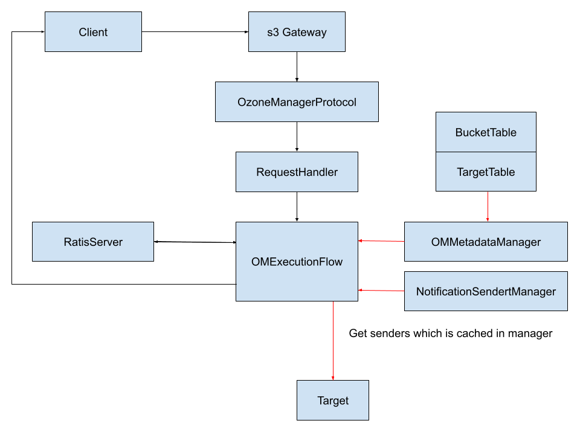

<!--
  Licensed under the Apache License, Version 2.0 (the "License");
  you may not use this file except in compliance with the License.
  You may obtain a copy of the License at
   http://www.apache.org/licenses/LICENSE-2.0
  Unless required by applicable law or agreed to in writing, software
  distributed under the License is distributed on an "AS IS" BASIS,
  WITHOUT WARRANTIES OR CONDITIONS OF ANY KIND, either express or implied.
  See the License for the specific language governing permissions and
  limitations under the License. See accompanying LICENSE file.
-->

# S3 Event Notifications
## Overview

This document proposes the design of an event notification system for Apache Ozone. The goal is to enable external consumers to subscribe to and consume events that occur within the Ozone cluster. This requirement closely resembled the functionality provided by ([AWS S3 Event Notifications](https://docs.aws.amazon.com/AmazonS3/latest/userguide/EventNotifications.html)).

## Motivation

Apache Ozone doesn’t support event notifications, which limits its integration with downstream systems like real-time data pipelines, auditing tools, or metadata indexers. Adding this feature will enable external services to react to key operations (e.g., PUT, DELETE) in near real-time, supporting use cases such as analytics, compliance, and monitoring. It also helps bring Ozone closer to feature parity with object stores like Amazon S3.

## Use Cases

- **Triggering downstream data processing:** e.g., trigger a Spark or Flink job on object creation.
- **Data Backup and Replication**
- **Monitoring and Alerts**

## Design Principles

- **Cloud-Agnostic Integration:** Inspired by MinIO and Ceph, this design avoids dependence on managed services like AWS SNS/SQS, and instead supports self-managed targets (e.g., Kafka, RabbitMQ).
- **Separation of Concerns:** Event delivery is decoupled from core Ozone operations. Ozone handles event generation and persistence; external systems handle delivery and processing.

## Goals & Non-Goals

These design choices are guided by two main considerations:

1. Refer to MinIO and Ceph: The design favors deployment in on-premises or cloud-agnostic environments by avoiding reliance on managed cloud services.
2. Decoupling event delivery from Ozone internals.

### Goals

- Provide Java APIs to configure bucket-level notifications and target configurations.
- Support CLI tools to manage notification settings.
- Support initial delivery targets: Kafka and RabbitMQ.
- Enable filtering of notifications via object prefixes.
- Support event types: object creation, deletion, and tagging.
- Support for AWS-compatible REST APIs (e.g., GET/PUT Bucket Notification).

### Non-Goals

- Only a subset of Ozone-supported events can be configured for notifications.
- The design does not guarantee any delivery semantics (except for synchronous failure responses).

## Event Types

### Support

Currently, Apache Ozone can publish notifications for the following events:
- New object created events
- Object removal events
- Object tagging events

### Not Support

Those can be published by Amazon S3 but are not supported in Ozone. See [S3 Event Notification](https://docs.aws.amazon.com/AmazonS3/latest/userguide/EventNotifications.html#notification-how-to-overview).

- Reduced Redundancy Storage (RRS) object lost events
- Replication events
- Restore object events
- S3 Lifecycle expiration/transition events
- S3 Intelligent-Tiering automatic archival events
- Object ACL PUT events

### Mapping Table
Here is the mapping between OM audit actions and S3 event types.

| Ozone Manager Action           | S3 Event Type                            | Notes                          |
|-------------------------------|------------------------------------------|--------------------------------|
| COMMIT_KEY (via PUT/Copy)     | `s3:ObjectCreated:Put`, `Copy`           | No distinction between them    |
| COMPLETE_MULTIPART_UPLOAD     | `s3:ObjectCreated:CompleteMultipartUpload`|                                |
| DELETE_KEY                    | `s3:ObjectRemoved:Delete`                |                                |
| PUT_OBJECT_TAGGING            | `s3:ObjectTagging:Put`                   |                                |
| DELETE_OBJECT_TAGGING         | `s3:ObjectTagging:Delete`                |                                |

---

## Design

### Overview

A callback is introduced post-Ratis commit and pre-client response to handle event notification logic.

#### Component

The implementation of this S3 trigger feature needs both S3 gateway and OzoneManager support.
- **S3 gateway**: Provide get and put notification s3 apis
- **Ozone Manager**: Provide get and put notification Java apis
Provide get and put target configuration Java apis
Persist notification & target configuration into DB
Notify OM each operation that may trigger an event notification.

#### Java Apis

This is the group of api to access target config:

```java
public List<TargetInfo> listTargetInfo ();
public void putTargetInfo(String volumeName, String bucketName, TargetInfo targetInfo);
public TargetInfo getTargetInfo(String volumeName, String bucketName, String targetId);
```

This is the group of api to add/delete/list event notifications from a bucket

```java
public String addS3Notification (String bucketName, Event event, String targetId, String prefix);
public List<TargetInfo> listS3NotificationInfo (String bucketName);
public void deleteS3Notification (String bucketName, String targetId);
```

### Details

The following diagram illustrates a write flow originating from the S3 Gateway. The red lines highlight the newly introduced steps added by this event notification design. The design introduces a callback in the execution flow, which is triggered after the request is sent to Ratis but before responding to the client. This callback is responsible for handling event notification logic.
Add `NotificationInfo` to determine which event should be notified and where to send.


#### BucketTable

Add NotificationInfo to the Bucket table. It is used to determine which event should be notified and where to send (refer to [Rpc Message](#rpc-message)).

#### TargetTable

A new table in rocksDB to store the details of the target.
- **Key**: A target ID corresponds to TargetConfig.
- **Value**: TargetConfig (refer to [Rpc Message](#rpc-message))

#### NotificationSenderManager

The NotificationSenderManager is responsible for caching client instances for different targets to avoid unnecessary resource wastage caused by repeatedly creating new client instances.

#### Rpc message

This is the structure to determine which event should be sent and where to send.

```protobuf
message NotificationInfo {
required string targetId = 1;
required Event event = 2;
}


enum Event {
S3TEST = 1;
S3ObjectCreate = 2;
S3ObjectCreatePut = 3;
S3ObjectCreatePost = 4;
S3ObjectCreateCopy = 5;
S3ObjectCreateCompleteMultipartUpload = 6;
S3ObjectRemovedDelete = 7;
S3ObjectTagging = 8;
S3ObjectTaggingPut = 9;
S3ObjectTaggingDelete = 10;
}
```


This is the structure to store the details of the target.
```protobuf
message TargetConfig {
required Target target = 1;
optional KafkaNotificationConfig kafkaNotificationConfig = 3;
optional RabbitMQNotificationConfig rabbitMQNotificationConfig = 4;
}


enum Target {
Kafka = 1;
RabbitMQ = 2;
}


message KafkaNotificationConfig {
repeated string endpoints = 1;
required string topic = 2;
optional string saslUsername = 3;
optional string saslPassword = 4;
optional string saslMechanism = 5;
optional string tlsSkipVerify = 6;
optional string clientTlsCert = 7;
optional string clientTlsKey = 8;


}


message RabbitMQNotificationConfig {
required string url = 1;
required string exchange = 2;
required string exchangeType = 3;
required string routingKey = 4;
}
```

## Performance

The performance impact of this design comes mainly from two things:

### OM Metadata Read Overhead

This design introduces additional read operations to OM's RocksDB metadata store. However, since most of the metadata is cached, the performance impact on OM is expected to be minimal.

### Notification Delivery

The speed of notification delivery directly affects performance, especially when operating in synchronous mode. This design plans to support both synchronous and asynchronous delivery options:
- **Asynchronous mode (default)**: Notifications are enqueued and handled by a background thread. This minimizes impact on client-facing operations. However, as delivery only occurs once the client has received a response, any notification failures (e.g. target unavailable or delivery timeout) will not affect the original operation and may therefore go unnoticed by the client. 
- **Synchronous mode**: Notifications are delivered before completing the client request. If the delivery target (e.g., Kafka or RabbitMQ) is slow or unavailable, it may increase the end-to-end latency of the original operation. Providing both modes allows users to balance between reliability and performance according to their use case.

Furthermore, the creation and reuse of notification client instances (such as Kafka or RabbitMQ producers) within the Ozone Manager must be carefully controlled. Poor resource management in this area could increase memory or thread usage and degrade OM performance over time.

### Metrics

To help monitor the performance and reliability of the S3 event notification system, the following metrics are proposed. These metrics are grouped into two major points.

OM Metadata Read Metrics:

- **Notification config lookup latency**:
Latency of reading notification configuration from the BucketTable.
- **Target config lookup latency**:
Latency of reading target configuration from the TargetTable.
- **Total number of notification evaluations**

Senders Metrics:
Each client implementation for the supported targets (e.g., Kafka, RabbitMQ) will expose a set of metrics to monitor, debug, and tune. These metrics will help users understand the behavior and efficiency of the notification system under various conditions. 

## Configuration

This is the configuration to enable event notification.

```xml
<property>
  <name>ozone.s3.event.notification.enabled</name>
  <value>true</value>
</property>
```

## Compatibility & Migration

This design introduces a new feature that does not impact existing system behavior or data structures.

## Testing Plan

- **Unit Testing**:
Unit tests will be developed to verify the core logic of the new feature. These tests will focus on individual components and ensure that each part of the feature functions correctly in isolation.
- **Integration Testing**:
Once the individual components have been tested, integration testing will be performed to ensure that the new feature integrates smoothly with existing systems and components.
A Kafka & RabbitMQ test server will be required to validate that notifications are correctly delivered to targets.
In addition, when using synchronous notification delivery, the system must ensure that clients receive an appropriate response if a notification fails to be delivered.
- **Performance Testing**
To validate notification behavior in a production environment, system tests will be extended based on the existing om-bucket-read-write-key-ops. Additional parameters will be introduced to enable and configure event notifications as part of key operations.

## Future Works 
### Moving Callback to S3 Gateway

Once Apache Ozone supports read from follower OM, the notification logic (currently located in the OM) can be moved to the S3 Gateway. This shift offers several benefits:
Reduce workloads on the OM leader.


Better reflects S3 behavior. As the S3 Gateway handles S3 protocol requests, it is the ideal place to send notifications related to S3 operations.

### Strengthening Delivery Semantics

While the current design provides delivery, it does not persist notifications until they are sent. To support stronger semantics, such as guaranteed at-least-once delivery, it is necessary to persist each notification to durable storage.

## References

[AWS S3 Event Notifications](https://docs.aws.amazon.com/AmazonS3/latest/userguide/EventNotifications.html))
