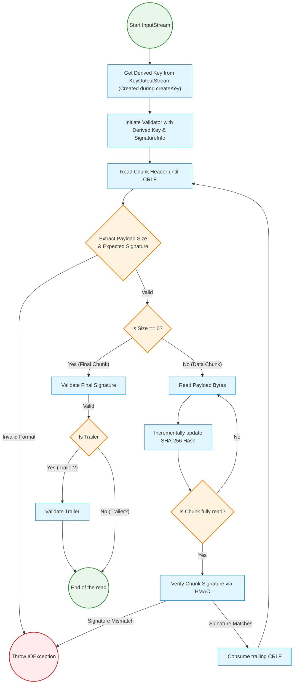

<!--
  Licensed under the Apache License, Version 2.0 (the "License");
  you may not use this file except in compliance with the License.
  You may obtain a copy of the License at

   http://www.apache.org/licenses/LICENSE-2.0

  Unless required by applicable law or agreed to in writing, software
  distributed under the License is distributed on an "AS IS" BASIS,
  WITHOUT WARRANTIES OR CONDITIONS OF ANY KIND, either express or implied.
  See the License for the specific language governing permissions and
  limitations under the License. See accompanying LICENSE file.
-->

# Context & Motivation

Ozone S3 Gateway (S3G) currently utilizes SignedChunksInputStream to handle aws-chunked content-encoding for AWS Signature V4. However, it doesn’t do any signature verification now. This proposal aims to complete the existing SignedChunksInputStream to make sure signature verification is correct and minimize performance overhead.

# Goal & Non-Goal

## Goal

Support signature verification for AWS Signature Version 4 streaming chunked uploads with the following algorithms:
- STREAMING-AWS4-HMAC-SHA256-PAYLOAD
- STREAMING-AWS4-HMAC-SHA256-PAYLOAD-TRAILER

## Non-Goal

The following algorithms are out of scope for this proposal. We may consider supporting them in the future if there is demand, but there is not any use case for them currently in Ozone.
- STREAMING-AWS4-ECDSA-P256-SHA256-PAYLOAD
- STREAMING-AWS4-ECDSA-P256-SHA256-PAYLOAD-TRAILER

# Proposed Solution

Currently, the SignedChunksInputStream successfully parses the S3 chunked upload payload but lacks the actual signature verification. This proposal enhances the existing stream to perform real-time signature verification, while ensuring the output remains fully compatible with Ozone's native, high-throughput write APIs.

## Secret Key

Currently, the AWS Secret Keys are securely stored and managed exclusively within the Ozone Manager (OM). To enable the S3 Gateway (S3G) to independently verify chunked payloads, it requires access to verification materials. We propose adding a new internal OM API specifically for S3G to retrieve this data.

From a security perspective, this new API **will not expose the raw AWS Secret Key** to the S3G. Instead, S3G will provide the request context (Date, Region, Service), and OM will compute and return the **Derived Key**. This architectural choice provides significant security benefits:
- **Defense in Depth:** Even in the unlikely event that an S3G instance is compromised or the internal network is intercepted, the Secret Key remains safely isolated within OM.
- **Limited Blast Radius:** The exposed Derived Key is strictly scoped to a specific date, region, and service. An attacker cannot use it to forge arbitrary requests for other days or different services.

## HMAC-SHA256 Implementation

We add `ChunksValidator` to handle related verification tasks, such as updating hashing, building `strToSign`, and verifying signatures. To achieve this with minimal overhead, we will extract the reusable SigV4 HMAC logic currently embedded in `AWSV4AuthValidator` into a shared utility module that both `ozone-manager` and `s3gateway` can depend on.
The current `AWSV4AuthValidator` class is package-private and lives in the `ozone-manager` module, so `SignedChunksInputStream` must not depend on it directly. Instead, the refactoring will move common operations such as signing-key derivation and signature calculation into a buildable shared component, while `AWSV4AuthValidator` and `SignedChunksInputStream` each call that shared code from their respective modules. 
This still allows `SignedChunksInputStream` to compute the derived key strictly once per request, avoiding expensive HMAC recalculations per chunk and preserving reuse of the existing highly-optimized `ThreadLocal Mac`-based implementation.

## SignedChunksInputStream flow

# Trade-offs

## Verification in S3 Gateway (Fail-Fast vs. Backend Processing)

Rather than offloading the verification to the backend Ozone cluster or introducing complex asynchronous pre-fetching, we decided to maintain the current stream-based architecture and execute the verification process entirely within the S3 Gateway (S3G). The primary reasons for this architectural choice are:

- Fail-Fast: This allows us to immediately reject requests with invalid signatures at the edge, preventing malformed data from consuming DataNode I/O, network bandwidth, and storage capacity.
- Stateless Scalability: Signature verification is a CPU-intensive task. Since the S3 Gateway is stateless and horizontally scalable, offloading the verification computations to S3G prevents the backend Ozone Managers (OM) or DataNodes (DN) from becoming CPU bottlenecks. S3G instances can be scaled out independently as compute demands increase.

## Incremental Hashing

To maintain a low memory footprint during the continuous buffering process, the system utilizes incremental hashing (e.g., MessageDigest.update()) on the incoming byte streams to calculate the payload digest on the fly. This prevents allocating massive temporary byte arrays and avoids Garbage Collection (GC) spikes during large multi-gigabyte uploads. The computed digest is then used to construct the required StringToSign, which dictates the final signature calculation.

# Performance

To ensure that introducing the real-time signature verification process does not significantly degrade the overall upload throughput, the architecture is designed with the following optimizations in mind. Furthermore, we plan to conduct simple benchmarks in the future to validate these performance expectations:

- Constant Memory: Incremental hashing processes byte streams on the fly. This prevents large memory allocations and avoids GC spikes during massive uploads.
- CPU Offloading & Scalability: Verification computation is isolated in the stateless, horizontally scalable S3G instances. This allows verification throughput to scale easily by adding more S3G nodes, protecting backend OM and DataNodes from CPU bottlenecks.

# Compatibility

A core principle of this design is to introduce robust security enhancements without breaking existing workflows or requiring modifications from end-users. The proposed architecture ensures seamless integration with current S3 clients and minimal impact on Ozone's internal backend components.

- Client Compatibility: Standard S3 clients (e.g., AWS SDK) require no changes to use the signature verification.
- Backend Compatibility: No changes to existing Ozone data layouts or core RPC protocols. Only a lightweight OM API is added for S3G to retrieve the key.

# Test

To guarantee the correctness, stability, and security of the newly introduced chunk verification logic, a comprehensive testing strategy will be executed. This plan covers both granular unit testing for the stream parsing logic and end-to-end integration testing using official AWS SDKs.

- Unit Tests: 
  - There is an existing test class for SignedChunksInputStream.
  - We would likely add TestChunkSignatureValidator to cover various scenarios, including:
    - Validating correct signatures for both HMAC algorithms.
    - Simulating signature verification failures due to signature doesn't match.
- Integration Tests: 
  - We would likely add TestS3SDKInSecureCluster to cover tests for S3 signed APIs in a secure cluster.
