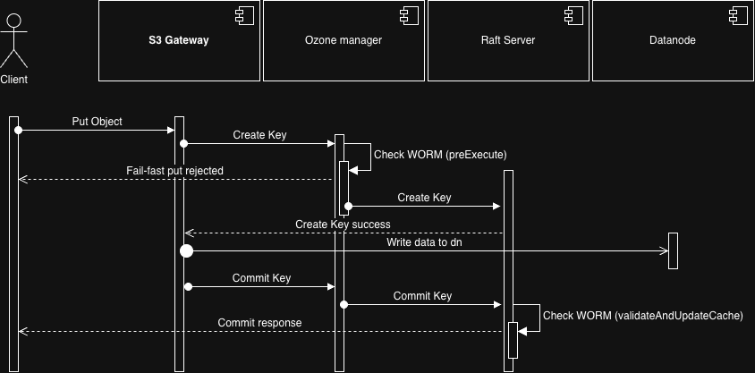

<!--
  Licensed under the Apache License, Version 2.0 (the "License");
  you may not use this file except in compliance with the License.
  You may obtain a copy of the License at

   http://www.apache.org/licenses/LICENSE-2.0

  Unless required by applicable law or agreed to in writing, software
  distributed under the License is distributed on an "AS IS" BASIS,
  WITHOUT WARRANTIES OR CONDITIONS OF ANY KIND, either express or implied.
  See the License for the specific language governing permissions and
  limitations under the License. See accompanying LICENSE file.
-->

# S3 Object Lock Design Doc

## Summary

This design document aims to plan and implement the Object Lock mechanism for OBS buckets integrated with Ranger.
The primary objective is to provide data immutability and tamper-proof protection through the object locking feature.

## Problem statement

With growing demands for data security and compliance, ensuring that critical data stored in OBS (Object Storage) is
protected from accidental or malicious deletion and overwriting has become an essential system protection requirement.
To establish a more rigorous data protection mechanism, we plan to introduce the Object Lock feature.

Considering the current system architecture and access control strategies,
this design integrates with existing Apache Ranger to manage Object Lock permissions on OBS buckets.
Meanwhile, to accelerate core feature delivery, we have decided to exclude complex multi-version locking (Versioning Lock) 
and legacy FSO buckets from this initial release. In addition, support for Native ACLs is excluded; Native ACLs typically grant permissions 
at the granular bucket or object level, whereas Object Lock permission management favors broad, role-based authorization,
creating a conflict in design philosophies. Narrowing the scope allows us to focus on the core functionality and ensure a rapid, 
stable rollout of baseline tamper-proof protection.

**Goal:**

* Implement the Object Lock feature on standard OBS buckets, fully integrated with Ranger for permission and access control. 
* Support single-version objects only.

## Non-Goal

* Versioning Lock: Support for locking across multiple object versions is deferred (multi-version core features are currently under development).
* FSO Legacy Buckets: Object Lock support for legacy FSO buckets is excluded.
* Native ACL Support: Native ACLs will not be used for access control or advanced configuration such as Retention Mode (Governance); access management is centralized exclusively via Ranger.

## 5. Technical Description

### Terminology

**Legal Hold**

* **Definition**: Applies an indefinite lock status to an object. The object remains protected until an administrator explicitly removes the lock (Remove Legal Hold). 
* **Restricted Operations**:
  * Put Object 
  * Delete Object 
  * Multipart Initial / Complete
* **Allowed Operations**:
  * Get Object
  * Get Legal Hold 
  * Put Legal Hold (Depends on permission)

**Retention**

* Definition: Configures a fixed retention duration (specified in days or years) for an object and applies a specific retention mode. 
* Retention Modes:
  * Compliance Mode: The strictest protection tier. Once applied, no user (including root/admin) can remove the lock, shorten the duration, or overwrite the object before the retention period expires. 
  * Governance Mode: A flexible protection tier. Standard users are restricted by locking rules, but users with bypassgovernance permissions can bypass restrictions to perform modifications or deletions.
* Restricted Operations:
  * Put Object 
  * Delete Object 
  * Multipart Initial/Complete 
  * Set Retention Period
* Allowed Operations:
  * Get Object

> _**Note**:
> * Background & Root Cause: A prerequisite for enabling WORM (Write Once, Read Many) in AWS S3 is that Object Versioning must be enabled. Under S3 architecture, executing a Put on a locked object generates a new version without affecting the protected prior version; thus, S3 Object Lock primarily restricts Delete Object. 
> * Ozone Implementation Status: Because Ozone's versioning feature is still under development, to guarantee absolute immutability during the lock period, Ozone will directly block and reject all overwrite operations (such as any form of Put or overwrite) on locked objects.

### Table Changes

**Bucket Table**

Two new fields: objectLockEnabled & defaultRetention.

```protobuf
  message BucketInfo {
  // ... existing fields
  required bool objectLockEnabled = 24 [default = false];
  optional RetentionConfig defaultRetention = 25;
  }
  
  message RetentionConfig {
  optional RetentionMode retentionMode = 23;
  optional uint64 retainUntilDate = 24;
  }
  
  enum RetentionMode {
    GOVERNANCE = 1;
    COMPLIANCE = 2;
  }
```


**Key Table**

Two new fields: retentionConfig & legalHold.

```protobuf
  message KeyInfo {
  // ... existing fields
  optional RetentionConfig retentionConfig = 23;
  optional bool legalHold = 24 [default = false];
  }
```


### Ranger Access Control

* **Legal Hold**: Introduces three new Access Types—GET_LEGAL_HOLD, PUT_LEGAL_HOLD, and CLEAR_LEGAL_HOLD—and adds them to accessTypeRestrictions for Keys.
* **Retention**: Introduces the BYPASS_GOVERNANCE Access Type and adds it to accessTypeRestrictions for Volumes. 

### New Ozone APIs

**ObjectStore**

```java
   public void addRetentionConfig(OzoneObj obj, RetentionArgs retentionArgs);
   public void addLegalHold(OzoneObj obj, bool hold);
```

**OzoneBucket**

```java
public void enableObjectLock(boolean enableObjectLock);
public void setRetentionConfig(RetentionArgs retentionArgs);
```

### Supported S3 APIs

To ensure seamless integration with existing S3 clients (e.g., AWS CLI, Boto3) and applications, the Ozone S3 Gateway (S3G) will translate and support the following standard AWS S3 Object Lock APIs:

**Bucket-Level APIs:**
* `GetBucketObjectLockConfiguration`: Retrieves the Object Lock status and the default retention configuration (if any) for a specified OBS bucket.
* `PutBucketObjectLockConfiguration`: Maps to the new Ozone API to enable Object Lock and configure default retention rules for an existing bucket.

**Object-Level APIs:**
* `PutObjectRetention`: Places a retention configuration on an object, specifying the retention mode (COMPLIANCE or GOVERNANCE) and the `RetainUntilDate`.
* `GetObjectRetention`: Retrieves the current retention configuration applied to an object.
* `PutObjectLegalHold`: Applies or removes a Legal Hold configuration to the specified object.
* `GetObjectLegalHold`: Retrieves the current Legal Hold status of an object.

**Impacted Standard APIs:**
Standard data mutating APIs will intercept the Object Lock state and return the `403 Access Denied` (or specifically `WORMProtectionException`) if a modification is attempted on a locked object:
* `PutObject` / `CopyObject` (Overwrites will be rejected)
* `DeleteObject` / `DeleteObjects` (Deletions will be rejected)
* `CreateMultipartUpload` / `CompleteMultipartUpload` / `UploadPart` (Uploads will be rejected if the object is locked)


> _**Note**:
> AWS S3 supports enabling Object Lock and configuring RetentionConfig directly during bucket creation. 
> In Apache Ozone's current design, these settings must be configured via dedicated API calls after the bucket has been created.


### Impact on Write and Delete Flows

**Impact on Put Object Flow**



During the Create Key phase, the system executes a preliminary WORM check in `preExecute` to enforce a fail-fast mechanism:

1. Linearizability does not need to be guaranteed at this stage. 
2. It avoids Raft consensus overhead, conserving system resources.

During the Commit Key phase, the system performs final WORM validation in `validateAndUpdateCache`:

1. It guarantees linearizability, ensuring only one write request can succeed simultaneously on a WORM-protected object. 
2. Keys that fail to commit remain in an Open Key state, and their associated metadata and content will be reclaimed periodically by system background cleanup. 

**Impact on Multipart Upload Flow**

Multipart Upload adopts the same design logic as Put Object to ensure operational consistency:
1. Similar to the creation key flow, WORM checks during the Initiate Multipart Upload and Put Part phases are executed in `preExecute` for fail-fast behavior (linearizability is not yet required, minimizing consensus overhead).
2. Similar to the commit key flow, WORM check during the Complete Multipart Upload phase is executed in `validateAndUpdateCache` to guarantee linearizability for writes under locked states.

**Impact on Delete Object Flow**

All delete operations must perform WORM validation during the `validateAndUpdateCache` phase to preserve linearizability and prevent accidental deletion of protected data.

## Performance

Introducing WORM validation into critical execution paths (such as Create Key and Commit Key) incurs minor overhead.
To minimize impact, this design employs a two-phase validation strategy: preliminary filtering in `preExecute` provides fail-fast pruning to prevent invalid requests from reaching the consensus layer, followed by atomic validation in `validateAndUpdateCache` for linearizability.
Preliminary assessments indicate that the additional metadata lookups impose an acceptable impact on overall system throughput and latency. Metrics will be continuously monitored and tuned as necessary.

## Security

Centralized access control via Ranger ensures all Object Lock operations (such as Retention Policy configuration and Legal Hold management) are enforced under strict access permissions. Dedicated Access Types (BYPASS_GOVERNANCE, PUT_LEGAL_HOLD, etc.) enforce the Principle of Least Privilege, preventing unauthorized tampering or removal of locks and enhancing data immutability.

### Trusted Boundary and Compliance Scope

While AWS S3 can guarantee absolute immutability across all levels because its infrastructure is entirely managed and abstracted from users, Apache Ozone is a self-managed, software-defined storage system. It is important to define the trusted boundary to understand the scope of data protection and compliance.

**Trusted Boundary:**
The trusted boundary for this Object Lock design is defined at the **Application API Level**.
* All data and metadata operations routed through the Ozone Java API, S3 Gateway, RPC interfaces, and standard Ozone clients are strictly governed by the Object Lock validation (`validateAndUpdateCache`) and Ranger access policies.
* Within this boundary, immutability is strictly enforced. Unless explicitly authorized with specific privileged permissions (e.g., s3:BypassGovernanceRetention), even cluster administrators using standard client tools cannot overwrite or delete locked objects until the retention period expires or the legal hold is removed.

**Out of Scope (Infrastructure Level bypass):**
Since Ozone runs on customer-managed infrastructure, operations executed with OS-level `root` privileges or physical access to the server nodes bypass the application-level API boundary. The following scenarios are not protected by Ozone Object Lock:
* **Direct Database Tampering:** Modifying or deleting key metadata directly from the underlying RocksDB instances while the node is offline.
* **Low-Level DR Tools:** Using disaster recovery tools like `ozone repair` to explicitly restore the OM's DB directory from an older Ratis snapshot (taken before the lock was applied) or running `skip-ratis-transaction` to skip retention state entries.
* **Storage Level Deletion:** Directly deleting block files from the DataNode filesystems.

**Compliance Recommendation:**
To achieve strict regulatory compliance (e.g., SEC 17a-4 or FINRA WORM requirements) in an on-premise deployment, Ozone's Object Lock must be complemented with strict infrastructure security measures. This includes enforcing rigid OS-level RBAC/IAM, restricting SSH/root access to OM/DN nodes, and continuously forwarding Ozone audit logs to a tamper-evident, external SIEM system to detect manual offline interventions.

## Compatibility

Because this design alters the schemas of Bucket Table and Key Table, OM (Ozone Manager) version leveling will be introduced to maintain forward and backward compatibility across rolling upgrades.

## Testing

All Ranger integration capabilities are currently verified via Smoke Tests. We plan to add dedicated test suites under the Smoke Test framework to validate S3 WORM functionality across diverse permission scenarios.

## Future Work

Once S3 Versioning support matures, future efforts will focus on ensuring compatibility with S3 multi-version object locking.
