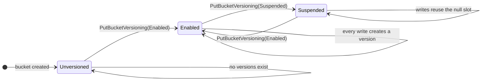
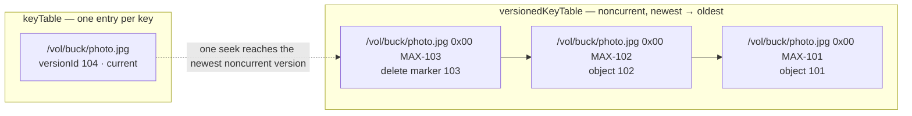
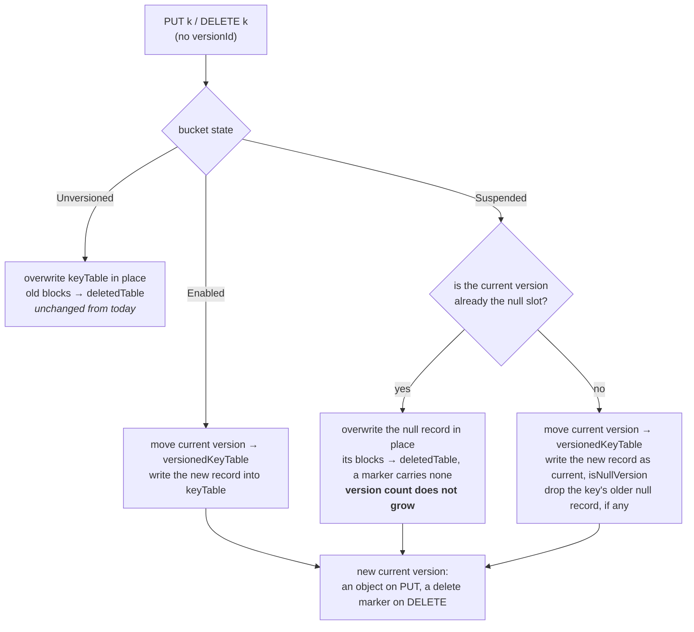
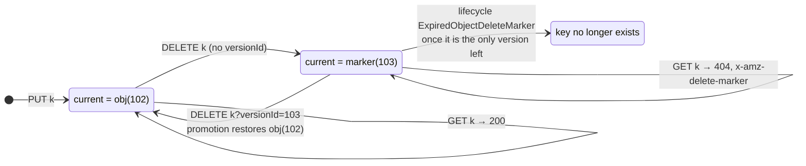
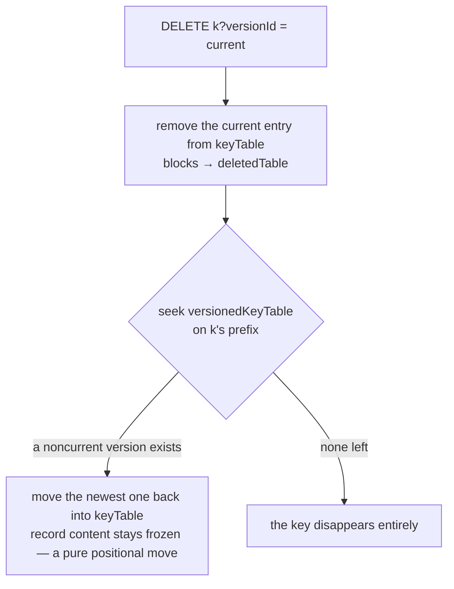
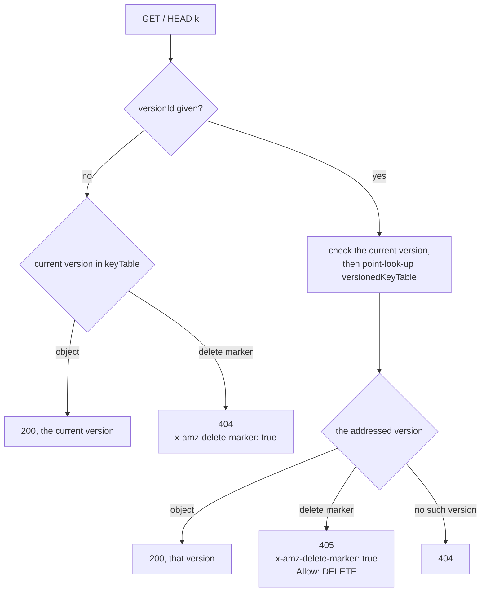

<!--
  Licensed under the Apache License, Version 2.0 (the "License");
  you may not use this file except in compliance with the License.
  You may obtain a copy of the License at
   http://www.apache.org/licenses/LICENSE-2.0
  Unless required by applicable law or agreed to in writing, software
  distributed under the License is distributed on an "AS IS" BASIS,
  WITHOUT WARRANTIES OR CONDITIONS OF ANY KIND, either express or implied.
  See the License for the specific language governing permissions and
  limitations under the License. See accompanying LICENSE file.
-->

# Summary

Add S3-compatible object versioning to Ozone: the full three-state bucket state
machine (Unversioned / Enabled / Suspended), per-key version chains with delete
markers and null versions, the S3 versioning APIs on the S3 Gateway, and version
reclamation expressed as lifecycle rules on the lifecycle engine Ozone already
has — with O(1) metadata cost per version operation and zero regression on
non-versioned paths.

# Status

Defined in the markdown header.

# Problem statement (Motivation / Abstract)

Amazon S3 provides bucket-level object versioning: a single key can retain multiple
versions, so users can recover objects that were accidentally overwritten or
deleted. A large part of the S3 ecosystem (backup software, data lake components,
DR tooling) depends on the versioning APIs (`PutBucketVersioning`,
`ListObjectVersions`, object operations with a `versionId`). Ozone exposes an
S3-compatible API through the S3 Gateway but does not support object versioning
today: the bucket-level `isVersionEnabled` boolean cannot express the Suspended
state, `OmKeyInfo.keyLocationVersions` tracks block locations within one record
rather than object versions, and the gateway has no versioning endpoints.

This proposal implements versioning with S3-compatible semantics, usable by
standard S3 clients (AWS CLI / SDKs) without modification. The metadata cost of a
version operation is decoupled from the number of versions (one extra small KV
write per operation).

Reclamation is a first-class part of the feature rather than an afterthought. The
S3 troubleshooting guide documents list degradation and throttling on keys with
millions of versions and leaves the fix to user-configured Lifecycle rules that
are often forgotten. Ozone already has a lifecycle engine (HDDS-8342, in master),
so versioning does not need a reclamation mechanism of its own: it adds the three
version-aware actions S3 defines to that engine, the lifecycle service becomes
enabled by default, and a bucket-level `maxVersions` backstop bounds version
growth on a versioned bucket that carries no rule at all.

# Non-goals

- **MFA delete** — depends on the AWS IAM/MFA device ecosystem; Ozone has no
  counterpart infrastructure. The `MfaDelete` field of `PutBucketVersioning`
  returns NotImplemented.
- **Version-aware lifecycle transitions** (`NoncurrentVersionTransition`, and
  `Transition` generally) — Ozone has no storage-class tiering to transition to.
- **Version-aware cross-cluster replication.**
- **Versioning for FSO / LEGACY bucket layouts** — the first version supports
  OBJECT_STORE buckets only; enabling versioning on other layouts returns
  NotImplemented. Combining FSO's directory/rename semantics with per-key version
  chains is disproportionately complex, and S3 tooling scenarios essentially use
  the OBS layout. FSO support can be evaluated as an independent follow-up.
- **Coexistence with Ozone snapshots on the same bucket** — the version-aware
  reclamation and the version-aware diff the combination needs are deferred past
  the first version, so OM rejects the combination outright rather than leaving it
  to convention. The snapshot section below states the enforcement and what lifts
  it.

# Technical Description (Architecture and implementation details)

## Bucket state machine



There is no edge back to Unversioned. Once a bucket has been Enabled it can only
move between Enabled and Suspended, so no single state change can silently
destroy the versions the bucket already holds — S3's data-protection promise. OM
enforces this on `SetBucketProperty` and rejects a transition to `UNVERSIONED`
with `INVALID_REQUEST`.

A `BucketVersioningStatusProto` enum (`UNVERSIONED` / `VERSIONING_ENABLED` /
`VERSIONING_SUSPENDED`) is added as an optional field on `BucketInfo` and
`BucketArgs`. The legacy `isVersionEnabled` boolean is kept and maintained in
two-way sync (`ENABLED → true`, otherwise `false`; records without the enum are
interpreted via the boolean), so old and new clients/OMs coexist during rolling
upgrades.

## Metadata layout: keyTable (current) + versionedKeyTable (noncurrent)

A new column family, **versionedKeyTable**, splits responsibilities with keyTable:

- **keyTable** (existing, semantics unchanged) always holds each key's **current
  version** — a regular object or a delete marker. Plain GET / HEAD / ListObjects
  read paths are unchanged.
- **versionedKeyTable** (new) holds all **noncurrent** versions (including
  noncurrent delete markers), each as a complete `OmKeyInfo`. The RocksDB key is

  ```
  /{volume}/{bucket}/{keyName}\x00{Long.MAX_VALUE - versionId}
  ```

  (fixed-width hex suffix; the separator is `0x00` rather than `/` because OBS key
  names contain `/` verbatim, which would interleave a key's versions with those of
  keys nested under it), so all versions of a key are physically adjacent and
  ordered newest to oldest.



Because the suffix is `MAX - versionId`, a single `seek` on the key's prefix lands
on the newest noncurrent version: `ListObjectVersions` and version promotion are a
seek plus a sequential read, never a scan-and-sort. The table is registered in
`OmMetadataManagerImpl.getTableBucketPrefix` alongside the other key tables, so
bucket-prefixed iteration and SST filtering resolve its prefix.

`OmKeyInfo` gains three optional proto fields (old records deserialize
compatibly): `versionId` (int64, assigned once at version creation, then frozen),
`isDeleteMarker` (a marker is a record with this flag and no data blocks — no
datanode storage), and `isNullVersion` (the single overwritable "null version"
slot per key). Keys written before versioning was enabled are interpreted as null
versions on read — **zero migration**, matching S3's "enabling versioning does
not change existing objects".

Every keyTable ↔ versionedKeyTable update rides OM's existing atomic
multi-table WriteBatch commit (the same double-buffer pattern used today for
keyTable + deletedTable on overwrite): no new transaction mechanism and no
cross-table consistency problem. The new column family is introduced under the OM
layout feature / finalization framework (`OMLayoutFeature.OBJECT_VERSIONING`):
before finalization, requests carrying a versioning status are rejected.

## How a key's versions evolve

The two mechanisms that are hardest to read out of prose — the delete marker and
the null version — are easiest to follow as one continuous story of a single key
`k`. `obj(n)` is a data version with versionId `n`, `marker(n)` a delete marker,
and `null` marks the record occupying the key's null slot.

| # | Operation | Bucket state | keyTable (current) | versionedKeyTable (newest → oldest) |
|---|---|---|---|---|
| 0 | `PUT k` | Unversioned | `obj(—)` no versionId | – |
| 1 | `PutBucketVersioning(Enabled)` | Enabled | `obj(—)` read as the null version | – |
| 2 | `PUT k` | Enabled | `obj(101)` | `obj(—)` |
| 3 | `PUT k` | Enabled | `obj(102)` | `obj(101)`, `obj(—)` |
| 4 | `DELETE k` | Enabled | `marker(103)` | `obj(102)`, `obj(101)`, `obj(—)` |
| 5 | `DELETE k?versionId=103` | Enabled | `obj(102)` **promoted back** | `obj(101)`, `obj(—)` |
| 6 | `PutBucketVersioning(Suspended)` | Suspended | `obj(102)` | `obj(101)`, `obj(—)` |
| 7 | `PUT k` | Suspended | `obj(104, null)` | `obj(102)`, `obj(101)` |
| 8 | `PUT k` | Suspended | `obj(105, null)` overwritten in place | unchanged |
| 9 | `DELETE k` | Suspended | `marker(106, null)` overwritten in place | unchanged |
| 10 | `PutBucketVersioning(Enabled)`, `PUT k` | Enabled | `obj(107)` | `marker(106, null)`, `obj(102)`, `obj(101)` |

Three things to read out of it:

- **A delete marker is an ordinary version that happens to carry no blocks**
  (step 4). It becomes the current version, so a plain `GET` returns 404 with
  `x-amz-delete-marker: true` while every earlier version stays intact and
  addressable by versionId. Deleting the marker by versionId (step 5) is exactly
  S3's "restore an object": the newest remaining version is promoted back into
  keyTable.
- **Suspended does not stop versioning, it stops *accumulating*** (steps 7–9).
  Each write lands in the key's single null slot: the first suspended write pushes
  the previous current version down into versionedKeyTable and drops the key's
  older null record (step 7); every later suspended write overwrites the null slot
  in place, so the version count stops growing. Versions accumulated while Enabled
  are never touched.
- **The null version is a slot, not a reserved id** (step 7 onwards). It carries a
  normally generated versionId like any other version and is marked by
  `isNullVersion`. Pinning it to a fixed low id would misorder a null created
  between two versioned writes, which is the middle version of the key, not its
  oldest. Step 10 shows a null delete marker sliding into the noncurrent chain in
  its correct chronological position once the bucket is Enabled again.

### Where a write lands

The table above is one trace; the rule behind it is the same for every write that
carries no versionId. Suspended is the branch worth reading twice: it does not
stop versioning, it collapses every write into the key's one null slot, which is
why the version count stops growing while the versions accumulated under Enabled
stay untouched.



### The life of a delete marker

A delete marker is not a tombstone the read path has to special-case away — it is
an ordinary version that carries no blocks, and it occupies the current slot like
any other. That single fact produces all of its externally visible behaviour:



Deleting the marker by versionId is exactly S3's "restore an object": nothing is
rewritten, the newest remaining version is moved back into keyTable.

### Version promotion

The invariant is that keyTable always holds a key's current version. When a
permanent delete removes the current version, promotion restores the invariant in
the same WriteBatch, under the bucket write lock:



## VersionId generation

`versionId` generation is abstracted behind a `VersionIdGenerator` interface,
chosen per cluster by class name (`ozone.om.versioning.version-id-generator`), so
a deployment can plug in its own. The generator is cluster-wide and may be changed
on a running cluster; it is not recorded in bucket metadata. Every generator must
satisfy, **for itself**: strictly increasing within a key (a later version's id is
always greater than every earlier version's id of that key); frozen once assigned;
`0` and `1` never handed out (`0` is the unset value of the optional field, `1` is
the first-version sentinel).

The identifier is deliberately **not** derived from OM's Ratis transaction index.
The versionId is persisted, externally referenced, and part of the S3 API surface;
tying it to the replication log would export an internal counter into a public
identity and pin the feature to one execution model, when the OM execution path is
itself an abstraction (`ExecutionContext` already carries an index whose term may
be absent).

Numbering a version by when it was written is what S3-compatible stores generally
do: a GCS `generation` is a microsecond timestamp, an Azure Blob version id is an
ISO-8601 instant, and RocksDB's user-defined timestamps order the versions of a key
by a `key + timestamp` suffix — the same encoding the versionedKeyTable dbKey
already uses. RocksDB is also the precedent for the split below: it orders by the
timestamp but leaves keeping them monotonic to the caller.

The shape matches SCM's `SequenceIdGenerator` — a cheap local allocation plus a
floor that guarantees monotonicity. SCM's class itself is not reusable here: it
lives in `server-scm` on `SCMHAManager` / `@Replicate`, so it would couple OM's
write path to SCM across a module boundary. It also needs machinery this does not,
because `localId` has to increase globally while a `versionId` only has to increase
within one key, whose floor is already persisted as that key's current version. SCM
does show the migration path if a persisted sequence is ever wanted:
`upgradeToSequenceId` seeds one from a future timestamp in this same encoding.

- **`UniqueIdVersionIdGenerator` (default)** — the same time-based scheme Ozone
  already uses to mint block local IDs (`hdds.utils.UniqueId`): the id is
  `currentTimeMillis << 16 | counter`, a 16-bit counter disambiguating ids minted
  within the same millisecond. It needs no allocator, no persistent state and no
  coordination; values are small positive longs, so `MAX_VALUE - versionId`
  ordering in versionedKeyTable stays plain signed arithmetic; and the id sorts by
  creation time, which is what the version chain wants anyway.
- **`PinnedFirstVersionIdGenerator` (opt-in)** — only the first version is
  special: it takes the reserved sentinel `FIRST_VERSION_ID = 1`, below any minted
  id, so it sorts oldest and can be referenced without listing the key's versions
  first. All later versions are minted normally. First versions are detected by "no
  current version in keyTable", reusing the lookup the write path performs anyway.
  Known trade-off: if every version of a key is permanently deleted and the key is
  recreated, the new first version takes the sentinel again; only deployments that
  accept this should configure this generator.

**How the id appears on the wire.** `x-amz-version-id`, `?versionId=` and
`ListObjectVersions` carry the id as its decimal digits, the way a GCS
`generation` is rendered: `117121056706265088` for a minted version, `1` for a
pinned first version. Decimal digits cannot collide with `null`, the identifier
S3 reserves for a key's null version, so both share the parameter without
escaping. Clients should still treat the value as opaque. The digits of a minted
id do decode to the millisecond of the write, but that is a property of this
generator rather than of the API, and ids are ordered only within one key —
comparing them across keys means nothing.

**Where the id is minted.** The generator runs on the leader in `preExecute` and
the id is stamped into the request that goes into the replication log, so every OM
applies an identical value; nothing is minted during apply. The one apply-time
decision is the pinned sentinel, which is a constant and is therefore deterministic
on its own: if the pinned generator is configured and the key has no current
version at apply time, the version takes `FIRST_VERSION_ID` instead of the minted
candidate.

**Why a minted id is only a floor.** A time-based id is monotonic within one OM
process, not across a leader change onto a node whose clock lags, and the "strictly
increasing within a key" guarantee binds one generator rather than a sequence of
them. So a minted id is a proposal, and the id a version is applied with is the
later of that proposal and the id after the key's current version:

```
versionId = max(mintedVersionId, currentVersionId + 1)
```

The write path already holds the current version, so this costs no read, and it
reads no other key and no global state: it is a pure function of the replicated
request and the state every OM already shares, so all of them settle on the same id
without coordinating. A current version predating versioning carries no id, and a
key in that state has no other versions to order against, so it takes the minted
value unchanged — no versionedKeyTable lookup in any case.

Ordering therefore never rests on the clock being trustworthy, and neither does it
rest on one generator having minted every id of a key. Under a clock regression, or
after a change of generator, the ids of an affected key climb by one until minted
values overtake them again: the versions stay correctly ordered, and only the id's
reading as a time degrades — the right one of the two to give up. An earlier draft
instead rejected such a commit with `INVALID_REQUEST`; that is dropped, because it
fails a client write over an operational clock problem the client can neither see
nor fix.

## Request handling

- **PUT (Enabled)**, atomic in one WriteBatch: move the current version (if any)
  into versionedKeyTable; write the new record into keyTable as current.
- **PUT (Suspended)**: the new record takes the null slot and becomes the current
  version — if the null slot is already the current version, overwrite it in place;
  otherwise move the current version into versionedKeyTable, write the new record
  into keyTable as current, and delete the old null record (if any) from
  versionedKeyTable, blocks to deletedTable in both cases. Versions accumulated
  while Enabled are unaffected.
- **PUT (Unversioned)**: unchanged from today.
- **GET/HEAD**: without versionId, read keyTable; a current delete marker returns
  404 with `x-amz-delete-marker: true`. With versionId, check the current version
  first, then point-look-up versionedKeyTable; if the addressed version is a delete
  marker, current or not, the gateway returns 405 with `x-amz-delete-marker: true`
  and `Allow: DELETE`.



The 404/405 split is S3's, and it follows from the marker being addressable: an
unaddressed read steps over the marker and reports the key absent, while a read
that names the marker gets told the version exists but has no body to return.
- **DELETE without versionId (Enabled)**: move current into versionedKeyTable and
  write a delete marker as the new current. (Suspended: the marker takes the null
  slot exactly as a suspended PUT does.) **DELETE ?versionId=x**: permanently
  delete that version (blocks to deletedTable); if it was current, trigger version
  promotion as shown above.
- **ListObjects**: scans keyTable only, skipping keys whose current version is a
  marker — list scan volume is not amplified by versions (an advantage over S3's
  single-namespace implementation). **ListObjectVersions**: merges keyTable and
  versionedKeyTable in key order (both are key-name prefixed, so the merge is
  naturally ordered), with `key-marker` / `version-id-marker` pagination.

## Reclamation: version-aware lifecycle rules

Version reclamation is expressed as **lifecycle rules on the lifecycle engine
already in master** (HDDS-8342: `OmLifecycleConfiguration`, `KeyLifecycleService`,
and the three S3 lifecycle endpoints), not as a service of its own. The engine
already provides everything version reclamation needs — per-bucket rule storage
and validation, prefix/tag filters, a resumable background scan with saved scan
state, batched deletes through Ratis, metrics, and `suspend`/`resume` admin
commands. Versioning contributes the three actions that the feature documentation
currently lists as unsupported, and each maps 1:1 onto an S3 element:

| S3 lifecycle element | Effect on a versioned bucket |
|---|---|
| `NoncurrentVersionExpiration.NoncurrentDays` | permanently deletes a noncurrent version once it has been noncurrent that long |
| `NoncurrentVersionExpiration.NewerNoncurrentVersions` | keeps at most N noncurrent versions of a key, reclaiming oldest-first |
| `Expiration.ExpiredObjectDeleteMarker` | removes a delete marker, and the key with it, once it is the only version left |
| `Expiration.Days` / `.Date` (existing action) | on a versioned bucket, inserts a delete marker instead of deleting the object, as S3 does |

Concretely: `LifecycleAction` gains a `noncurrentVersionExpiration` field and
`LifecycleExpiration` an `expiredObjectDeleteMarker` field — both optional
additions to existing messages — and `LifecycleActionTask` gains a
versionedKeyTable scan next to its keyTable scan, reusing the same batching, scan
state and metrics. Expiration counts from the moment the version that superseded
this one was committed, as `NoncurrentDays` does, not from when the version itself
was written.

Two deliberate departures from stock S3:

- **The lifecycle service is enabled by default.** `ozone.lifecycle.service.enabled`
  flips from `false` to `true`. A rule that never runs is worse than no rule, and
  versioning is the first feature that depends on reclamation for correct operation
  rather than for tidiness. OM rejects `PutBucketVersioning(Enabled)` while the
  lifecycle service is disabled, so a bucket cannot enter a state where versions
  accumulate with nothing able to reclaim them.
- **A bucket-level `maxVersions` backstop (default 100, 0 = unlimited).** It bounds
  version growth on a versioned bucket that carries no lifecycle configuration at
  all, which is the failure mode the S3 troubleshooting guide describes. It is
  enforced by the same lifecycle scan and behaves exactly like
  `NewerNoncurrentVersions` — markers count toward the limit, reclamation is
  oldest-first and asynchronous, so the cost of a version write never grows with
  the number of versions the key already has. An explicit `NewerNoncurrentVersions`
  rule on the bucket overrides it. It is documented as an Ozone extension over S3
  semantics.

An earlier draft also offered a `REJECT` policy that failed the write once
`maxVersions` was reached; it is dropped. S3 has no error code for the condition
and no client retries on it, so a default limit enforced that way would break
unmodified S3 tooling after `maxVersions` overwrites of one key — and reclaiming is
what S3's own lifecycle rules do.

## Quota and observability

All versions count against the bucket space quota. Version count, marker count,
and noncurrent bytes are exposed via `ozone sh bucket info` and Recon, and the
version-aware lifecycle actions report through the existing
`KeyLifecycleServiceMetrics`.

## Interaction with Ozone snapshots

OM rejects the combination on the same bucket, in both directions:

* a snapshot can only be created on a bucket whose versioning status is
  UNVERSIONED;
* versioning can only be enabled on a bucket that has no snapshot.

This is enforced rather than documented as a convention. Snapshots are not
restricted to any bucket layout in code — `TestOmSnapshotObjectStore` covers OBS
buckets explicitly — so nothing but enforcement keeps the two apart, and the
combination has a real gap behind it: snapshot diff is keyed by objectID, which all
versions of a key share, so a bucket carrying both would present a diff that cannot
describe what changed. What makes a hard rejection cheap in practice is that the
two features barely overlap today: snapshots are overwhelmingly used on FSO buckets
for filesystem-style workloads, while versioning in this first phase is OBS-only.
The rejection is applied to the source of a linked bucket and evaluated at apply
time so the two directions cannot race, and a dev-only configuration key lifts it
for testing. It is lifted for good once version-aware snapshot reclamation and a
version-aware diff land as follow-up work.

## S3 Gateway and native API surface

New endpoints: `PutBucketVersioning`, `GetBucketVersioning`,
`ListObjectVersions`. Extended: GET/HEAD/DELETE with `?versionId=` (including the
literal `null`), `x-amz-version-id` / `x-amz-delete-marker` response headers,
per-entry version semantics in batch `DeleteObjects`, `CopyObject` versioning
behavior, and version-id headers on `PutObject` / `CompleteMultipartUpload`. The
native interfaces (`ozone sh`, `OzoneBucket` API) are extended in parallel so
versions are manageable outside the S3 path.

## Compatibility and upgrade

Wire protocol changes are limited to optional proto fields, so old records and
old clients are unaffected. The new column family and request surface are gated
by `OMLayoutFeature.OBJECT_VERSIONING`; before cluster finalization, enabling
versioning is rejected with `NOT_SUPPORTED_OPERATION_PRIOR_FINALIZATION`.
Snapshots taken before the feature is used are unaffected, and snapshot
interaction is covered above. Buckets without versioning behave exactly as today
(verified by benchmarks).

# Alternatives

- **Single-record layout** (versions embedded in the existing
  `keyLocationVersions` list): every PUT/DELETE becomes a full read-modify-write
  of one growing RocksDB value — write amplification linear in the version count
  (hundreds of KB per write at ~100 versions of a large key), degraded
  compaction, and no per-version object metadata (size / mtime / ETag) without
  rebuilding an object record inside the location structure. Rejected in favor of
  the two-table design, where each version operation writes one small KV (O(1))
  and each version is a complete `OmKeyInfo`.
- **A two-state model** (dropping Suspended): "disabled after being enabled" must
  retain historical versions anyway — otherwise a single state change silently
  destroys data — yet the bucket would present itself as never-versioned and
  `GetBucketVersioning` could not answer `Suspended`. Since the semantics are
  unavoidable, keep the standard three states and full S3 compatibility.
- **The OM Ratis transaction index as the versionId**: free, allocator-less and
  monotonic by construction, and it was the earlier default. Rejected because it
  makes a public, persisted identifier a projection of the replication log: it
  couples the S3 API surface to one execution model, and a log that was reset or
  rolled back would silently hand out ids that had been used before. The
  `UniqueId` scheme gives the same properties without the coupling, and taking the
  minted id as a floor at commit covers the residual clock risk.
- **A dedicated reclamation service (`VersionCleanupService`)**: the earlier
  design's own background service, following the `KeyDeletingService` pattern.
  Rejected once lifecycle landed in master — it would duplicate rule storage,
  filters, resumable scanning, batching, metrics and admin controls that the
  lifecycle engine already implements, and it would express reclamation in
  Ozone-specific bucket properties where S3 users expect `NoncurrentVersionExpiration`.
- **Reusing `objectID` as the version identity**: code verification showed the
  overwrite path (`OMKeyRequest.prepareFileInfo`) reuses the existing record via
  `toBuilder()`, so objectID is intentionally stable across overwrites — snapshot
  diff relies on it to distinguish "modified" from "deleted + recreated".
  **Reusing `updateID`**: hsync re-commits the same version repeatedly, so it
  drifts, while a version identity must be frozen at creation. Hence the
  dedicated `versionId` field.
- **S3-style random version IDs**: equivalent for reuse-prevention, but they
  destroy the temporal clustering of versionedKeyTable — version promotion would
  degrade from one seek to a scan-and-sort (with mtime tiebreak problems), and
  `GET ?versionId=` from a point lookup to a prefix scan. Unpredictability, the
  only remaining benefit, is provided by the external encoding layer instead.
- **A per-key sequential counter** for readable first versions: requires a
  persistent allocator and reuses IDs after full deletion of a key. Replaced by the
  pinned-first generator, which special-cases only the first version and needs no
  allocator.
- **A version-level snapshot diff** (reporting noncurrent versions created or
  removed between two snapshots): the diff is keyed by objectID, which a key's
  versions share, so it would need a different identity and a version dimension
  in the report; versionedKeyTable would also have to join
  `RocksDBCheckpointDiffer.COLUMN_FAMILIES_TO_TRACK_IN_DAG`, paying
  compaction-log and SST retention cost for information already reachable through
  the snapshot's own version listing. Deferred; it is one of the two pieces that
  lift the snapshot exclusion.
- **Pinning the generator into bucket metadata** (so a bucket keeps the generator
  it was created with): removes the risk of a mid-life generator change, but adds a
  proto field, a write path in both bucket create and set-property, and leaves the
  generator un-changeable even when an operator legitimately wants to switch.
  Replaced by taking the minted id as a floor at commit, which absorbs a generator
  change into the key's own ordering — the affected key's ids climb by one until
  minted values overtake them — and costs no persistent state.

# Plan

Implemented as one umbrella Jira with eleven tasks (36 sub-tasks, each roughly one
PR), in dependency order `T1 → T2 → T3 → T4 → T5 → T6 → T7 → (T8 ∥ T9) → T10 → T11`
(reclamation and the snapshot exclusion both land before the S3 endpoints, so
versioning is never exposed without a way to reclaim versions, nor with snapshots
left unguarded).

| Task | Scope |
|---|---|
| T1 Metadata foundation | proto three-state enum + legacy-boolean sync, set-property state machine, `OmKeyInfo` version fields, versionedKeyTable column family, layout feature gate |
| T2 VersionId generator framework | `VersionIdGenerator` interface with class-name configuration, `UniqueId`-based default minted in `preExecute`, commit-time ordering floor, pinned-first generator |
| T3 ENABLED write paths | PUT two-table update, DELETE marker insertion, quota accounting |
| T4 Read / permanent delete / promotion | `?versionId=` reads including null-slot addressing, reporting a delete-marker-addressed read as a condition distinct from not-found; permanent delete by versionId with quota accounting; version promotion |
| T5 SUSPENDED semantics | null-slot overwrite, null markers, zero-migration legacy keys |
| T6 Version-aware lifecycle | `NoncurrentVersionExpiration` (`NoncurrentDays`, `NewerNoncurrentVersions`) and `ExpiredObjectDeleteMarker` actions, delete-marker semantics for `Expiration` on a versioned bucket, versionedKeyTable scan in `LifecycleActionTask`, `maxVersions` backstop, lifecycle service enabled by default |
| T7 Snapshot exclusion | OM-side rejection matrix for snapshot creation and versioning state transitions, applied to the source of a linked bucket and enforced at apply time so the two directions cannot race; dev-only opt-in config key |
| T8 S3 Gateway endpoints | bucket versioning endpoints, object `versionId` support, batch delete |
| T9 ListObjectVersions | OM merged listing, protocol plumbing, gateway `?versions` |
| T10 Quota and observability | quota edges + QuotaRepair, Recon / metrics |
| T11 Wrap-up | upgrade validation, robot tests, benchmarks, docs |

Testing follows three tracks: unit/integration tests per sub-task acceptance
criteria (state machine, two-table atomicity, promotion, null-slot semantics,
`maxVersions` boundaries, the version-aware lifecycle actions, the full
snapshot-exclusion rejection matrix); S3 compatibility via the smoketest/s3 robot
suite and the versioning subset of ceph/s3-tests; performance benchmarks asserting
no regression with versioning off and O(1) write latency with it on.

Open questions tracked for implementation: whether an operator should be able to
cap `maxVersions` cluster-wide, over and above the per-bucket setting and the
cluster default; whether rejecting `PutBucketVersioning(Enabled)` while the
lifecycle service is disabled is the right coupling, or whether a warning suffices;
obfuscation of the external versionId encoding, and how a pinned first version is
rendered; whether changing `ozone.om.versioning.version-id-generator` should take
effect without an OM restart, and the operational procedure for keys already
written under the previous generator; `PutBucketVersioning(Suspended)` on a
never-versioned bucket (align via s3-tests); whether `ListObjectVersions` against a
snapshot is worth adding once the feature has landed; interaction with hsync/append
writes (appends apply to the current version and create no new one); multipart
uploads — the version is created at `CompleteMultipartUpload` commit and parts stay
invisible, but until that lands an MPU overwrite on a versioned bucket neither
reclaims the previous version's blocks nor records a version for them, so those
blocks leak; this has to be closed before multipart is declared supported.

# References

- [AWS S3 Versioning User Guide](https://docs.aws.amazon.com/AmazonS3/latest/userguide/Versioning.html)
- [AWS S3 troubleshooting: performance degradation with many versions](https://docs.aws.amazon.com/AmazonS3/latest/userguide/troubleshooting-by-symptom.html)
- [S3 Object LifeCycle Management](s3-object-lifecycle-management.md) — HDDS-8342, the lifecycle engine this proposal extends
- [ceph/s3-tests](https://github.com/ceph/s3-tests) — versioning test subset
