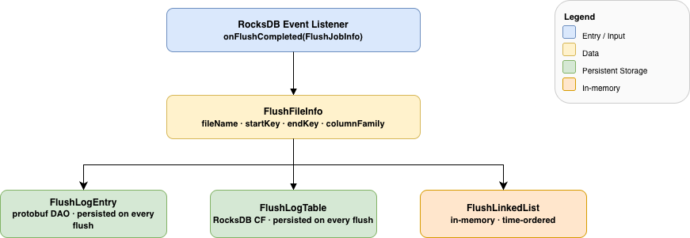
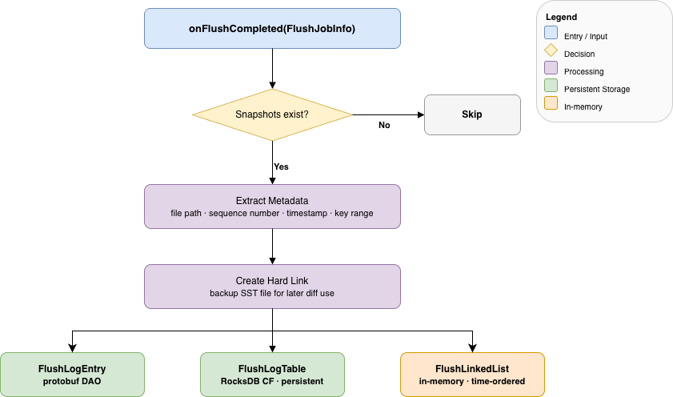
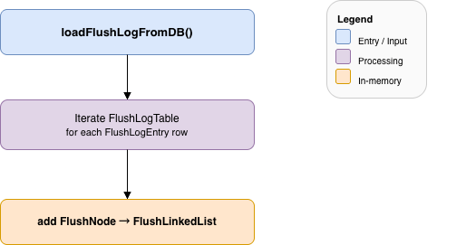
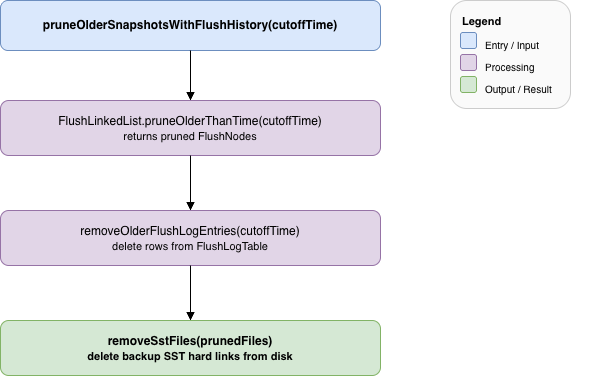

<!--
  Licensed under the Apache License, Version 2.0 (the "License");
  you may not use this file except in compliance with the License.
  You may obtain a copy of the License at

   http://www.apache.org/licenses/LICENSE-2.0

  Unless required by applicable law or agreed to in writing, software
  distributed under the License is distributed on an "AS IS" BASIS,
  WITHOUT WARRANTIES OR CONDITIONS OF ANY KIND, either express or implied.
  See the License for the specific language governing permissions and
  limitations under the License. See accompanying LICENSE file.
-->

# Snapshot Diff via Flush Tracking

# 1. Introduction

Ozone's snapshot feature allows users to take point-in-time snapshots of buckets and later compute the diff between two snapshots.
Internally, snapshot diffing relies on identifying which SST files in RocksDB have
changed between two snapshot generations.

The previous implementation tracked this through a **Compaction DAG** (`SnapshotCompactionDag`), modelling the input-to-output file relationships in RocksDB compaction events as a Directed Acyclic Graph.
As Ozone's snapshot usage grew, the compaction DAG approach was found to be overly complex and difficult to maintain.

This document describes the replacement design: a **flush-based linked list** (`FlushLinkedList`) that tracks RocksDB **flush** events instead of compaction events.
Flush events are simpler, atomic, and sufficient for identifying changed SST files between two snapshots.

# 2. Background

## 2.1. RocksDB Compaction vs. Flush

RocksDB writes data first to an in-memory structure called a **memtable**.
When the memtable is full, RocksDB **flushes** it to disk as a Level-0 (L0) SST file.
Independently, RocksDB runs **compaction** in the background to merge and reorganize SST files across levels (L0 → L1 → L2 …) for read performance and space efficiency.

| Operation  | Trigger          | Input            | Output      | Complexity         |
|------------|------------------|------------------|-------------|--------------------|
| **Flush**  | Memtable full    | One memtable     | One L0 file | Simple, atomic     |
| **Compaction** | Background/manual | Multiple SST files | Multiple SST files | Complex, multi-level |

## 2.2. Snapshot Diff Requirements

When computing the diff between snapshot A and snapshot B, Ozone must determine which keys have been created, modified, or deleted between the two points in time.
At the RocksDB level, this reduces to finding which SST files were written between the two snapshot generations (represented as DB sequence numbers).

A file present in snapshot B but **not** in snapshot A is a "changed" file and must be fully compared.
A file present in both snapshots is "unchanged" and can be skipped.

## 2.3. Problems with the CompactionDag Approach

The old `SnapshotCompactionDag` tracked compaction events to answer the above question.
This introduced significant complexity:

1. **Two-phase listener:** Compaction events require both an `onCompactionBegin()`
   and an `onCompactionCompleted()` callback, with intermediate state kept in a
   concurrent map to handle race conditions.

2. **Graph traversal:** Determining successors of a given SST file required
   traversing the full DAG (built on Guava's `MutableGraph`), which is
   computationally expensive and hard to reason about.

3. **Missing-file edge cases:** Compacted files are deleted; the DAG had
   to handle cases where referenced files no longer existed on disk.

4. **Heavyweight structure:** The DAG grew over time and required careful
   pruning to prevent unbounded memory growth.

# 3. New Design: Flush-Based Tracking

The new design observes that tracking **flush** events is sufficient for snapshot diffing.
Every key written between two snapshots must pass through a flush before it becomes visible in an SST file.
Therefore, by recording each L0 file produced by a flush, Ozone can identify all new SST files
between any two snapshots.

## 3.1. Core Insight

All flushes happen in **strict chronological order**, indexed by the RocksDB DB sequence number (snapshot generation).
This means:

- The diff between two snapshots reduces to a **set difference** of their SST file sets: files in src-but-not-dest (and vice versa) are "changed"; files in both are "unchanged".
- A simple **time-ordered linked list** replaces the complex DAG for tracking flush history (used for startup recovery, pruning, and observability).
- A single `onFlushCompleted()` listener replaces the two-phase compaction listeners.

## 3.2. Component Overview



# 4. Key Components

## 4.1. FlushFileInfo

`FlushFileInfo` is the core data object representing a single SST file
produced by a flush.

| Field          | Type    | Description                                         |
|----------------|---------|-----------------------------------------------------|
| `fileName`     | String  | The L0 SST file name                               |
| `startKey`     | String  | Smallest key in the SST file                       |
| `endKey`       | String  | Largest key in the SST file                        |
| `columnFamily` | String  | RocksDB column family (table) that was flushed     |
| `pruned`       | boolean | Whether the backup SST file has been deleted       |

`FlushFileInfo` is serializable to/from protobuf (`FlushFileInfoProto`) for persistence in the `FlushLogTable`.

## 4.2. FlushLogEntry

`FlushLogEntry` bundles a `FlushFileInfo` with metadata about the flush event itself.
It is the unit of persistence written to the `FlushLogTable`.

| Field                | Type         | Description                                  |
|----------------------|--------------|----------------------------------------------|
| `dbSequenceNumber`   | long         | RocksDB sequence number when flush occurred  |
| `flushTime`          | long         | Wall-clock timestamp in milliseconds         |
| `fileInfo`           | FlushFileInfo | SST file metadata                           |
| `flushReason`        | String       | Reason reported by RocksDB (e.g., `MemoryLimitReached`) |

**Contrast with `CompactionLogEntry`:**

- A compaction entry contained a list of input files and a list of output files.
- A flush entry contains exactly **one** output file and no input files, reflecting the simpler nature of flush events.

## 4.3. FlushNode

`FlushNode` is the in-memory counterpart of `FlushLogEntry`, stored inside `FlushLinkedList`.
It extends `SstFileInfo` and adds:

- `snapshotGeneration` — the DB sequence number at flush time
- `flushTime` — the wall-clock flush timestamp

Nodes in the list are always maintained in **ascending order of `snapshotGeneration`**, which enables efficient range queries and early-exit pruning.

## 4.4. FlushLinkedList

`FlushLinkedList` is the central in-memory index of all tracked flushes.
It provides:

- A `LinkedList<FlushNode>` ordered by snapshot generation (oldest → newest).
- A `ConcurrentMap<String, FlushNode>` for O(1) lookup by file name.

**Key operations:**

| Method | Complexity | Description |
|--------|-----------|-------------|
| `addFlush(fileName, snapshotGeneration, flushTime, startKey, endKey, columnFamily)` | O(1) | Append a new flush (always newest) |
| `getFlushNode(fileName)` | O(1) | Look up a flush by SST file name |
| `getFlushNodesBetween(fromGen, toGen)` | O(N) | Get all flushes in a generation range |
| `pruneOlderThan(generation)` | O(K) | Remove all flushes before a generation (K = removed count, stops early) |
| `pruneOlderThanTime(cutoffTime)` | O(K) | Remove all flushes before a timestamp |
| `getOldest()` / `getNewest()` | O(1) | Peek at the head or tail of the list |

Because the list is time-ordered, `pruneOlderThan()` stops as soon as it
encounters a node newer than the cutoff — giving O(K) time where K is the
number of removed entries, not O(N) over the full list.

# 5. Data Flow

## 5.1. Flush Event Recording

When RocksDB flushes a memtable to an L0 SST file, the `onFlushCompleted()` listener in `RocksDBCheckpointDiffer` fires:



## 5.2. Snapshot Diff Calculation

When a user requests the diff between snapshot A (generation `fromGen`) and snapshot B (generation `toGen`), `internalGetSSTDiffListUsingFlush` is called:

1. **Query flush history (observability):** `FlushLinkedList.getFlushNodesBetween(dest.gen, src.gen)` is called to collect the set of file names flushed in that generation range. This is logged for debugging but does **not** drive the classification below.
2. **Set intersection → sameFiles:** Iterate over `srcSnapFiles`; any file also present in `destSnapFiles` goes to `sameFiles`.
3. **Set difference → differentFiles:** Any file only in `srcSnapFiles` (not in `destSnapFiles`) goes to `differentFiles`. Then iterate `destSnapFiles`; any file not already classified goes to `differentFiles`.

In other words, the diff is a straightforward **SST file set difference** between the two snapshots. The `FlushLinkedList` range query serves as an observability hook (debug log) rather than the branching logic itself.

**Contrast with the old DAG approach:**

| Step | Compaction DAG (old) | Flush list (new) |
|------|---------------------|------------------|
| Core question | Which compaction successors of src-SSTs appear in dest? | Which SST files are in src but not dest (and vice versa)? |
| Mechanism | Recursive graph traversal | Set intersection / set difference |
| FlushLinkedList role | N/A | Startup recovery, pruning, observability |

## 5.3. OM Startup: Loading Flush History

On OM startup, `RocksDBCheckpointDiffer` rebuilds the in-memory `FlushLinkedList` from the persisted `FlushLogTable`:



This ensures the in-memory index is consistent with disk state after a restart.

## 5.4. Pruning Old Flush Entries

A periodic background task (`pruneOlderSnapshotsWithFlushHistory`) removes flush entries that are no longer needed (i.e., older than all existing snapshots):



# 6. Persistence: FlushLogTable

The `FlushLogTable` is a new RocksDB column family (registered under the constant `FLUSH_LOG_TABLE`) added to the OM metadata database.
Each row stores a serialized `FlushLogEntryProto`.

**Schema:**

| Key                              | Value                                      |
|----------------------------------|--------------------------------------------|
| `<paddedSequenceNumber>-<flushTime>` | `FlushLogEntryProto` (serialized protobuf) |

- `<paddedSequenceNumber>` — the DB sequence number **left-padded with zeros** to `LONG_MAX_STR_LEN` (19) characters, ensuring correct **lexicographic ordering** when iterating the column family.
- `<flushTime>` — the wall-clock flush timestamp in milliseconds, appended to avoid key collisions when two flushes share the same sequence number.

The column family handle is set on `RocksDBCheckpointDiffer` during `RDBStore` initialization and is used for both writes (on flush events) and reads (on startup).

## 6.1. Protobuf Definitions

```protobuf
message FlushFileInfoProto {
    required string fileName = 1;
    optional string startKey = 2;
    optional string endKey = 3;
    optional string columnFamily = 4;
    optional bool pruned = 5;
}

message FlushLogEntryProto {
    required uint64 dbSequenceNumber = 1;
    required uint64 flushTime = 2;
    required FlushFileInfoProto fileInfo = 3;
    optional string flushReason = 4;
}
```

Note that `FlushLogEntryProto.fileInfo` is a **singular** field (not repeated), because a single flush always produces exactly one L0 SST file.

# 7. Comparison: Old vs. New

| Aspect | CompactionDag (old) | FlushLinkedList (new) |
|--------|--------------------|-----------------------|
| Tracked event | Compaction (multi-input → multi-output) | Flush (memtable → one L0 file) |
| Listener callbacks | `onCompactionBegin()` + `onCompactionCompleted()` | `onFlushCompleted()` only |
| Data structure | Guava `MutableGraph` (DAG) | `LinkedList` + `ConcurrentMap` |
| Diff query | DAG traversal (recursive successor search) | Linear range scan |
| Pruning | Graph node removal (complex) | Head-truncation of ordered list (O(K)) |
| Race conditions | In-flight compaction map required | None (flush is a single atomic event) |
| Memory growth | Unbounded without careful pruning | Bounded by active snapshot range |
| Persistence | `CompactionLogTable` | `FlushLogTable` |

# 8. Backward Compatibility

The in-memory `CompactionDag` (and `CompactionNode`) have been **removed**. The `CompactionLogTable` and legacy text log-file loading path (`addEntriesFromLogFilesToDagAndCompactionLogTable`) are retained for the following limited purpose:

- On startup, if legacy compaction log **text files** are present, they are read and their entries are written into `CompactionLogTable`, then the files are deleted. This is a one-time migration step.
- The `CompactionLogTable` data itself is **not** used to reconstruct any in-memory DAG; it is kept on disk for audit/recovery purposes only.

Snapshot diff for **all** deployments (old and new) is now served exclusively by `FlushLinkedList` populated from `FlushLogTable`. An existing cluster that upgrades will start accumulating flush log entries from the moment of upgrade; snapshots created before the upgrade may fall back to full diff if no flush history is available.

### References
- [HDDS-13874](https://issues.apache.org/jira/browse/HDDS-13874)
- [RocksDB Flush Overview](https://github.com/facebook/rocksdb/wiki/RocksDB-Basics#writes)
