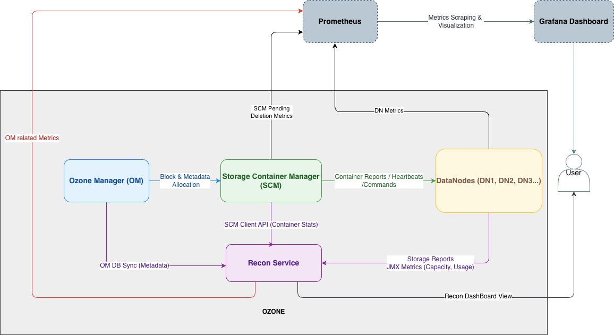

<!--
  Licensed under the Apache License, Version 2.0 (the "License");
  you may not use this file except in compliance with the License.
  You may obtain a copy of the License at

      http://www.apache.org/licenses/LICENSE-2.0

  Unless required by applicable law or agreed to in writing,
  software distributed under the License is distributed on an
  "AS IS" BASIS, WITHOUT WARRANTIES OR CONDITIONS OF ANY KIND,
  either express or implied. See the License for the specific
  language governing permissions and limitations under the License.
-->

# Abstract
Ozone currently lacks a unified interface to monitor and analyze storage distribution across its cluster components. This makes it difficult to:

- Understand data distribution across the cluster
- Debug storage reclamation issues
- Monitor pending deletion progress
- Analyze utilization patterns
- Identify potential bottlenecks and imbalances

This proposal introduces a comprehensive **Storage Capacity Distribution Dashboard** in Recon to address these challenges.
This initiative significantly enhances operational insight, capacity planning accuracy, and system observability in large-scale Ozone deployments.

## Approach 1: Recon-based

### Architectural Overview

The dashboard operates as an extension to **Recon**, leveraging existing telemetry from:

- **Ozone Manager (OM)** - namespace-level and key-level metadata.
- **Storage Container Manager (SCM)** - container, block, and replication metrics.
- **DataNodes (DNs)** - raw storage usage and pending deletion data.

All metrics are aggregated, and exposed through a **RESTful API (/storagedistribution)** for recon dashboard.


### Data Flow Summary

- OM → Recon
  - Periodic synchronization happens between OM db to Recon.
- OM -> SCM
  - Block deletion request sent by OM to SCM carries block size and replicated size.
- SCM → Recon
  - SCM aggregates the blocks in the block deletion request into DeletedBlocksTransaction with aggregated block size and replicated size, persisted into DB.
  - SCM maintains and updates a deletion transaction summary for newly created/deleted transactions. Summary is exposed through metrics, API, and also persisted.
  - Recon gets the deletion transaction summary using SCM client whenever required.
- SCM → Datanode
  - Block deletion transaction sent by SCM to DN carries block size.
- DataNode → Recon
  - Exposes TotalPendingDeletionBytes via JMX through BlockDeletingService.
  - Recon fetches this data for node-level pending deletion tracking.
- Recon
  - Consolidates all component-level data.
  - Computes global storage, namespace usage, and pending deletion metrics.
  - Exposes results via RestFull API /storagedistribution.

### Recon API Design

#### 1. Get Storage Distribution Information

**Endpoint:** `GET /storageDistribution`

**Description:** Retrieves comprehensive storage metrics including global capacity, namespace usage, and per-DataNode storage breakdown.

**Parameters:** None

**Responses:** 200 OK

**Response Structure:**

| Field              | Type             | Description                            |
|--------------------|------------------|----------------------------------------|
| globalStorage      | Object           | Overall storage capacity metrics.      |
| globalNamespace    | Object           | Overall namespace (key) usage metrics. |
| usedSpaceBreakdown | Object           | Detailed breakdown of used space.      |
| dataNodeUsage      | Array of Objects | Per-DataNode storage usage.            |

**Response Objects:**

##### globalStorage Object
| Field          | Type | Description                                       |
|----------------|------|---------------------------------------------------|
| totalUsedSpace | Long | Total used space across all DataNodes in bytes.   |
| totalFreeSpace | Long | Total free space across all DataNodes in bytes.   |
| totalCapacity  | Long | Total raw capacity across all DataNodes in bytes. |

##### globalNamespace Object
| Field          | Type | Description                                             |
|----------------|------|---------------------------------------------------------|
| totalUsedSpace | Long | Total used space for namespace objects (keys) in bytes. |
| totalKeys      | Long | Total number of keys in the namespace.                  |

##### usedSpaceBreakdown Object
| Field                      | Type | Description                                            |
|----------------------------|------|--------------------------------------------------------|
| openKeyBytes               | Long | Bytes currently held by open keys (not yet committed). |
| committedKeyBytes          | Long | Bytes committed to existing keys.                      |
| preAllocatedContainerBytes | Long | Pre-allocated space for open containers.               |

##### dataNodeUsage Array (Per-DataNode Metrics)
Each object represents the storage metrics for a single DataNode.

| Field            | Type   | Description                                    |
|------------------|--------|------------------------------------------------|
| dataNodeUuId     | String | Unique identifier for the DataNode             |
| hostName         | String | Hostname of the DataNode                       |
| capacity         | Long   | Total capacity of the DataNode in bytes.       |
| used             | Long   | Used space on the DataNode in bytes.           |
| remaining        | Long   | Remaining free space on the DataNode in bytes. |
| committed        | Long   | Bytes committed to keys on this DataNode.      |
| minimumFreeSpace | Long   | Configured minimum free space in bytes.        |
| reserved         | Long   | Configured reserved space in bytes.            | 

**Example Response:**

```json
{
  "globalStorage": {
    "totalUsedSpace": 15744356352,
    "totalFreeSpace": 3002519420928,
    "totalCapacity": 3242976054744
  },
  "globalNamespace": {
    "totalUsedSpace": 5242880000,
    "totalKeys": 10
  },
  "usedSpaceBreakdown": {
    "openKeysBytes": 0,
    "committedBytes": 5242880000,
    "preAllocatedContainerBytes": 0
  },
  "dataNodeUsage": [
    {
      "datanodeUuid": "31300d56-f6f8-46f4-9d1e-862ac82066f8",
      "hostName": "ozone-datanode-2.ozone_default",
      "capacity": 1080992018248,
      "used": 5248118784,
      "remaining": 1000839806976,
      "committed": 0,
      "minimumFreeSpace": 1080992000
    },
    {
      "datanodeUuid": "d211a430-6363-4882-a4b5-5d3275652e5a",
      "hostName": "ozone-datanode-3.ozone_default",
      "capacity": 1080992018248,
      "used": 5248118784,
      "remaining": 1000839806976,
      "committed": 0,
      "minimumFreeSpace": 1080992000
    },
    {
      "datanodeUuid": "70fd6c8c-b3f3-43ad-83ac-4e0dc6e9d74d",
      "hostName": "ozone-datanode-1.ozone_default",
      "capacity": 1080992018248,
      "used": 5248118784,
      "remaining": 1000839806976,
      "committed": 0,
      "minimumFreeSpace": 1080992000
    }
  ]
}
```

#### 2. Get Pending Deletion Bytes

**Endpoint:** `GET /pendingDeletion`

**Description:** Retrieves pending deletion metrics across different Ozone components (OM, SCM, and DataNodes).

**Parameters:**
- `component` (required): Component type - `om`, `scm`, or `dn`

**Responses:**
- **200 OK:** Data is available or task is running
- **202 Accepted:** No data available yet but task is in progress

**Response Schemas by Component:**

##### a) Ozone Manager (OM) - `GET /pendingDeletion?component=om`

| Field                | Type | Description                          |
|----------------------|------|--------------------------------------|
| totalSize            | Long | Total pending bytes across all items |
| pendingDirectorySize | Long | Total pending bytes for directories  |
| pendingKeySize       | Long | Total pending bytes for keys         |

Example:-
```json
{
  "totalSize": 0,
  "pendingDirectorySize": 0,
  "pendingKeySize": 0
}
```
##### b) Storage Container Manager (SCM) - `GET /pendingDeletion?component=scm`

| Field                    | Type | Description                                    |
|--------------------------|------|------------------------------------------------|
| totalBlocksize           | Long | Total pending bytes for unreplicated blocks    |
| totalReplicatedBlockSize | Long | Total pending bytes for replicated blocks      |
| totalBlocksCount         | Long | Total number of pending blocks                 |

Example:-
```json
{
  "totalBlocksize": 0,
  "totalReplicatedBlockSize": 0,
  "totalBlocksCount": 0
}
```

##### c) DataNodes (DN) - `GET /pendingDeletion?component=dn`

| Field                      | Type             | Description                                        |
|----------------------------|------------------|----------------------------------------------------|
| status                     | String           | Status of the background metrics collection task   |
| totalPendingDeletion       | Long             | Sum of pending deletion bytes across all DataNodes |
| pendingDeletionPerDataNode | Array of Objects | Per-DataNode pending deletion metrics              |
| totalNodesQueried          | Long             | Total number of JMx Queries                        |
| totalNodeQueriesFailed     | Long             | Number of Jmx queries failed                       |

**pendingDeletionPerDataNode Array (Per-DataNode Metrics):**
Each object contains pending deletion information for a single DataNode.

| Field            | Type   | Description                              |
|------------------|--------|------------------------------------------|
| hostName         | String | Hostname of the DataNode                 |
| datanodeUuid     | String | Unique identifier for the DataNode       |
| pendingBlockSize | Long   | Total pending bytes on this DataNode     |

Example:-
```json
{
  "status": "FINISHED",
  "totalPendingDeletionSize": 0,
  "pendingDeletionPerDataNode": [
    {
      "hostName": "ozone-datanode-2.ozone_default",
      "datanodeUuid": "002d69fa-ce3e-4d66-bd23-ac235f599fc6",
      "pendingBlockSize": 0
    },
    {
      "hostName": "ozone-datanode-3.ozone_default",
      "datanodeUuid": "d5946743-3496-4f6d-834f-374cebae2159",
      "pendingBlockSize": 0
    },
    {
      "hostName": "ozone-datanode-1.ozone_default",
      "datanodeUuid": "35e850c7-9824-4098-8818-7e95f4ccce0e",
      "pendingBlockSize": 0
    }
  ],
  "totalNodesQueried": 3,
  "totalNodeQueriesFailed": 0
}
```

### Backend Implementation

The backend implementation will involve collecting data from various Ozone components, and also we need to add few code changes to get pending deletion and replicated sizes in different components.

#### Ozone Manager (OM)

Ozone Manager will be the key data source for most of the data. But SCM doesn't have the data and we need to include block size information in Deleted Block and pass it to SCM

Previously, the key block deletion requests sent from the Ozone Manager (OM) to the Storage Container Manager (SCM) only contained BlockIDs, lacking any size information. Consequently, the SCM was unable to accurately monitor the total space designated for cleanup and pending reclamation.

The new implementation will include the block size and replicated size in the key block deletion requests sent out by OM to SCM, so that SCM will know the size of each block under request to delete.

#### Storage Container Manager (SCM)

##### Persist Block Size in Delete Transactions (SCM)

SCM currently tracks pending deleted blocks by transaction metadata but lacks reliable, aggregated visibility into **how much space** (raw and replicated) those blocks occupy while they await deletion. This limits operational insights (metrics/CLI) and complicates capacity-related decisions. The design introduces block size persistence at the transaction level and an SCM-side summary to expose accurate, real-time totals.

##### Goals

- Persist **total raw size** and **total replicated size** for each DeletedBlocksTransaction.[](https://github.com/apache/ozone/pull/8845)
- Maintain an SCM-side **DeletedBlocksTransactionSummary** with totals for: transaction count, block count, total size, and total replicated size.
- Expose the summary via **metrics**, **API** and **CLI** for operators.
- Provide a safe **upgrade path** so legacy transactions do not pollute the new counters.

#### Data Node (DNs)

To enhance storage visibility, a new metric will be introduced: the total bytes consumed by blocks pending deletion. Previously, only the count of blocks awaiting deletion was tracked, providing an incomplete understanding of reclaimable disk space. This change aims to offer a more accurate and comprehensive view of storage in the process of being freed.

The core idea involves:

- **Measuring Deleted Data Size:** The system will now measure the total size in bytes of deleted items, rather than just counting them.
- **Integrating into Existing Systems:** This new size measurement will be incorporated into the current data deletion service and container data structures.
- **Calculating Size During Deletion:** Mechanisms will be implemented to accurately capture the byte size of blocks as they are marked for deletion and it will be exposed via metrics.

DataNodes currently provide storage reports, which Recon consumes regularly. However, these reports lack information about pending deletion bytes. To address this, we propose publishing TotalPendingBytes as a metric via BlockDeletingService, which Recon can then consume via JMX. This approach is more reliable and performs better than alternative solutions, such as including pending deletion information in the storage report. 

#### Recon

A new REST API endpoint, `/storagedistribution`, has been introduced to provide a consolidated view of storage distribution across the cluster. This endpoint offers various storage-related insights, including used capacity, pending deletions, and overall data distribution within Ozone components.**Key Functionalities**

Recon exposes consolidated metrics regarding storage usage and distribution, drawing data from the following sources:

- **OMDBInsightEndpoint:** Retrieves Ozone Manager (OM)-level data, such as bucket-level usage, namespace size, and used capacity.
- **SCMClient:** Fetches pending deletion metrics from the Storage Container Manager (SCM). This includes block-level metadata like size and replicated size, crucial for accurate estimation of reclaimable space.
- **Datanode Storage Reports and Metrics:** Gathers current storage usage statistics from individual datanodes. This information helps determine used versus available capacity and facilitates the classification of data distribution based on node-wise storage usage.

The pending deletion bytes are calculated and updated within the BlockDeletionService metrics, which are then exposed via JMX. This allows direct access to these metrics by monitoring tools. While this approach introduces a dependency on JMX (a minor concern in some deployments), its primary advantage is avoiding unnecessary data transfer to SCM and the associated processing overhead in the Datanode when iterating and calculating pending deletions from the container data list, as would be required with the Storage Report approach.

### New HDDS Layout and Upgrade

A new HDDS layout feature, STORAGE_SPACE_DISTRIBUTION, has been introduced to handle upgrade and downgrade scenarios correctly and ensure accurate persistence of pending deletion metrics.

#### Why a New Layout Feature Is Needed

Although rolling upgrades are not supported in Ozone (meaning OM and SCM should never run different versions simultaneously), SCM and Datanodes may persist aggregated size metrics in their databases during the upgrade process.
If these metrics are written before the cluster is finalized, and later the cluster is downgraded and re-upgraded, the old values can become stale or inaccurate since old code won't update them correctly.

To prevent such inaccuracies, SCM and DNs must only start persisting the aggregated pending deletion data once the layout feature is finalized.

#### Behavior Before STORAGE_SPACE_DISTRIBUTION Finalization

- SCM does not collect or expose DeletedBlocksTransactionSummary.
- DNs do not report TotalPendingBytes.
- Recon must handle the case where SCM and DN do not expose storage distribution data.

#### Behavior After STORAGE_SPACE_DISTRIBUTION Finalization

- SCM aggregates block sizes for new transactions, updates DeletedBlocksTransactionSummary, and exposes these metrics.
- DNs handle both legacy and new transactions, calculate pending deletion bytes for new ones, and report them.
- The persisted counters in SCM and DN reflect only data deleted after finalization, ensuring accuracy even across upgrade/downgrade cycles.

#### Known Limitations
For an existing Ozone cluster updating, if there are existing pending deletion transactions in SCM and DN, these transactions will not be covered in the new data/metrics exposed by SCM and DN. 
So the data shown by Recon UI can vary a lot from the real total pending deletion size. The gap will reduce gradually after existing old transactions are executed and finished.

## Approach 2: CLI-based (Not Proceeding)

A CLI-based approach was evaluated to compute detailed usage and pending deletion breakdown by analyzing offline OM and SCM database checkpoints and querying DataNodes.
While it offers precise, up-to-date results and independence from Recon, it introduces significant operational overhead.

This approach requires generating and processing large metadata snapshots, which can take hours in large-scale clusters.
Given its complexity, dependency on manual execution, and high resource consumption, we have chosen not to proceed with the CLI-based solution and instead focus on enhancing Recon for better usability and integration.

## Metrics Exposure and Time-Series Tracking

While Recon provides a point-in-time view of pending deletions and storage distribution, it is equally important to track these metrics over time to understand trends and validate reclamation progress.  
To enable this, components should expose metrics that can be scraped by Prometheus and visualized in Grafana.

### Component-wise Metrics

- **Ozone Manager (OM)**
  - Recon has already methods that are available to calculate the following information.
    - open key used space
    - committed key used space 
    - pending deletion 
  - In every OM db syncing, we can update these metrics values.

- **Storage Container Manager (SCM)**
  - The DeletedBlockLogStateManager is enhanced to aggregate these block sizes in-memory, providing a DeletedBlocksTransactionSummary that includes total transaction count, total block count, total block size, and total replicated block size for pending deletions. 
  - This summary is rebuilt from persisted transaction data upon SCM startup or leader election.
  - New metrics are introduced in ScmBlockDeletingServiceMetrics to expose the aggregated deletion statistics (transaction count, block count, total size, total replicated size). This provides better operational visibility into the SCM's block deletion queue.

- **DataNodes (DN)**
  - Pending deletion bytes per node. This can be exposed as metrics in BlockDeletingService of DataNode
  - Pending deletion count per node. This can be exposed as metrics in BlockDeletingService of DataNode

### Dashboard

- **Recon UI** → Point-in-time snapshot for immediate debugging
- **Grafana** → Time-series visualization of trends such as:
  - Pending deletion backlog reduction
  - Growth of open key space
  - Utilization vs reclamation rates over time

By combining both, operators gain:
- **Real-time visibility** (via Recon)
- **Historical context** (via Grafana)

# Summary

The proposed dashboard improves visibility into cluster storage dynamics, providing deeper insights for effective debugging and informed decision-making.  
Recon is the ideal place to host the point-in-time overview, while exposing metrics enables Prometheus and Grafana to track long-term trends.  
Together, these complementary approaches give operators a unified and powerful view of both current cluster state and historical storage patterns.
