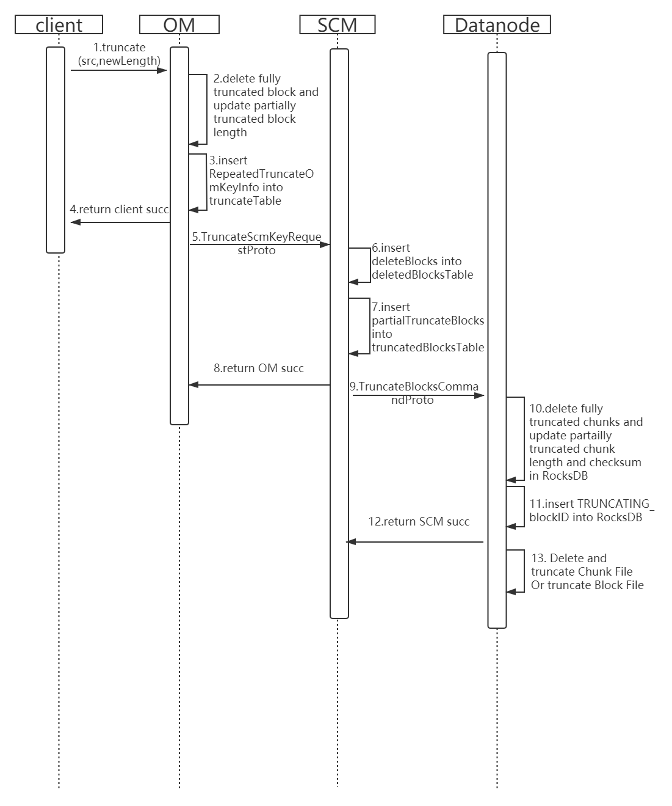

<!--
  Licensed under the Apache License, Version 2.0 (the "License");
  you may not use this file except in compliance with the License.
  You may obtain a copy of the License at

   http://www.apache.org/licenses/LICENSE-2.0

  Unless required by applicable law or agreed to in writing, software
  distributed under the License is distributed on an "AS IS" BASIS,
  WITHOUT WARRANTIES OR CONDITIONS OF ANY KIND, either express or implied.
  See the License for the specific language governing permissions and
  limitations under the License. See accompanying LICENSE file.
-->


# Abstract

This is a proposal to introduce truncate operation for Ozone, which will allow removing data from the tail of a file.
 
The use cases for truncate include
1. Transaction, journal handling for external systems. Transactions are appended to a   Ozone file while they succeed. When a transaction fails it is aborted and the file is truncated, which rolls it back to the previous successful transaction.
2. Ability to truncate incomplete data added to the file as a result of a failed write. This particularly enables users to reuse the same files after a failed create or append.
3. Allow users to remove data they accidentally appended.
4. Improved support for FUSE and NFSv3 connectors to Ozone.

In proposed approach `truncate` is performed only on a closed key. If the key is opened for write, an attempt to truncate fails.

# Implementation

## Timing diagram

This timing diagram omit the delete block between SCM and Datanode.


## OM

When OM receives `truncate(key, newLength)`,in the `keyTable`, OM deletes the blocks which are fully truncated, and updates the block length which is partially truncated.  

OM stores `<key, RepeatedTruncateOmKeyInfo>` in truncateTable, and returns succ to client.  The `TruncateKey` in `RepeatedTruncateOmKeyInfo` represents one truncate key operation, so the list of `TruncateKey` allows us to store a list of truncate operations related to one key.

OM starts a background thread to select a certain number of entries from `truncateTable`, and sends these entries to SCM by the `TruncateScmKeyRequestProto`.

### Related New Class
```
// include a list of truncate operation
public RepeatedTruncateOmKeyInfo {
    private final String volumeName;
    private final String bucketName;
    // name of key client specified
    private String keyName;
    public List<TruncateKey> truncateKeyList;
}
```

### Related New Proto
```
/**
 * A truncate key request sent by OM to SCM, it contains
 * multiple number of keys (and their blocks needed to be deleted and truncated).
 */
message TruncateScmKeyRequestProto {
     repeated TruncateKey truncateKeys = 1;
}

/**
 * A truncated key and its blocks needed to be deleted and the  block needed to be partially truncated.
 */
message TruncateKey {
     required string key = 1;
     repeated BlockID deleteBlocks = 2;
     repeated PartialTruncateBlock partialTruncateBlocks = 3;
}

// A partially truncated block, including the newLength
message PartialTruncateBlock {
    required BlockID truncateBlock = 1;
    required uint64 newLength = 2;
}
```

## SCM
When scm receives `TruncateScmKeyRequestProto`, for the `deleteBlocks`, scm has already implemented the code.

For the `partialTruncateBlocks`, we process it as a transaction like `deleteBlocks`, store `<transactionId, TruncatedBlocksTransaction>` in `truncatedBlocksTable`, and return succ to OM.  

We abstract the code related to delete block transaction, so that truncate and delete blocks can share the abstract code.

SCM starts a background thread to send `TruncateBlocksCommandProto` to the datanode.

### Related New Proto
```
// HeartBeat response from SCM, contains a list of block truncate transactions.
message TruncateBlocksCommandProto {
  repeated TruncatedBlocksTransaction truncatedBlocksTransactions = 1;
  required int64 cmdId = 2;
}

// The truncated blocks which are stored in truncatedBlock.db of scm.
message TruncatedBlocksTransaction {
     required int64 txID = 1;
     required int64 containerID = 2;
     repeated PartialTruncateBlock blocks = 3;
     // the retry time of sending truncating command to datanode.
     required int32 count = 4;
}
```

## Datanode
When Datanode receives `TruncateBlocksCommand`, in the RocksDB, Datanode deletes the chunks which are fully truncated, and updates the chunk length and checksum which is partially truncated. Datanode puts `<TRUNCATING_blockID, newLength>` in RocksDB, and returns succ to SCM.

Datanode starts a background thread to process `<TRUNCATING_blockID, newLength>`.
If it is `FilePerBlock`, we use `FileChannel.truncate` to truncate file to newLength directly.  If it is `FilePerChunk`, we delete the files of the fully truncated chunks, and use `FileChannel.truncate` to process the partially truncated file.  Then, in RocksDB, Datanode delete `<TRUNCATING_blockid, newLength>`, and put `<TRUNCATED_blockid, newLength>`.

## Client
When the client reads the key, the client gets blocks of the key from OM, including block length. Then the client gets chunks of each block from Datanode.  The client maybe gets the chunks which should be fully or partially truncated, in this case, the client only reads the block length and ignores the other.

## Multi Client
### Read When Truncate
#### Case 1

Client1 gets blocks from OM -> Client2 truncates the same file but datanode has not truncated blocks of the file -> Datanode truncates block of the file->  Client1 reads block from Datanode.  Then Client1 will find inconsistency, for example, the block’s length Client1 obtained from OM is 128M, then Client2 truncates the block to 127M, so Client1 reads only 127M rather than 128M. In this case, Client1 throws an exception.
#### Case 2

Client1 gets blocks from OM -> Client2 truncates the same file but datanode has not truncated blocks of the file ->  Client1 finishes reading block from Datanode -> Datanode truncates block of the file.  So Client1 can read succ.

Both 2 cases are acceptable, HDFS also does not guarantee the behavior of the read client.

### Truncate When Truncate

When multi clients truncate at the same time, the BUCKET_LOCK can avoid inconsistency.

### Truncate when Append

Append mean ozone client can append some content to the tail of some key. So if Client1 truncates the file but datanode has not truncated blockN -> Client2 appends some content to the tail of blockN -> Datanode truncates blockN, then error happens. To avoid this, OmKeyLocationInfo add a new flag, i.e. toBeTruncated, to mark the block need to be truncated in the future. When Client2 appends, Client2 finds blockN with toBeTruncated flag, Client2 will allocate a new block, and append the content to the new block.

## Why not implement truncate like HDFS ?

HDFS can truncate blocks synchronously, but in ozone if we truncate blocks synchronously, we must depend on ratis’s pipeline, but closed container can not be modified by pipeline, so we can not truncate blocks synchronously.
