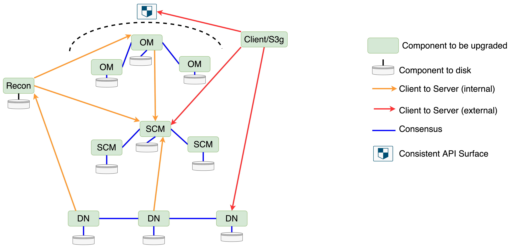

# Zero Downtime Upgrade (ZDU)

## The Goal

The goal of Zero Downtime Upgrade (ZDU) is to allow the software running an existing Ozone cluster to be upgraded while the cluster remains operational. There should be no gaps in service and the upgrade should be transparent to applications using the cluster.

Ozone is already designed to be fault tolerant, so the rolling restart of SCM, OM and Datanodes is already possible without impacting users of the cluster. The challenge with ZDU is therefore related to wire and disk compatibility, as different components within the cluster can be running different software versions concurrently. This design will focus on how we solve the wire and disk compatibility issues.

## Component Upgrade Order

To simplify reasoning about components of different types running in different versions, we should reduce the number of possible version combinations allowed as much as possible. Clients are considered external to the Ozone cluster, therefore we cannot control their version. However, we already have a framework to handle client/server cross compatibility, so rolling upgrade only needs to focus on compatibility of internal components. For internal Ozone components, we can define and enforce an order that the components must be upgraded in. Consider the following Ozone service diagram:

Here the arrows represent client to server interactions between components, with the arrow pointing from the client to the server. The red arrow is external clients interacting with Ozone. The shield means that the client needs to see a consistent API surface despite leader changes in mixed version clusters so that APIs do not seem to disappear and reappear based on the node serving the request. The orange lines represent client to server interactions for internal Ozone components. For components connected by this internal line, **we can control the order that they are upgraded such that the server is always newer and handles all compatibility issues**. This greatly reduces the matrix of possible versions we may see within Ozone and mostly eliminates the need for internal Ozone components to be aware of each other’s versions, as long as servers remain backwards compatible. This order is:

1. Upgrade all SCMs to the new version  
2. Upgrade Recon to the new version  
3. Upgrade all Datanodes to the new version  
4. Upgrade all OMs to the new version  
5. Upgrade all S3 gateways to the new version

Note that in this ordering, Recon will still have a new client/old server relationship with OM for a period of time. The OM sync process in Recon is the only API that needs to account for this, and it is not on the main data read, write, delete, or recovery path. Recon should be upgraded with the SCMs because its container report processing from the datanodes shares SCM code, so we do not want Recon to handle a different version matrix among datanodes than SCM.

## Software Version Framework

The previous section defines an upgrade order to handle API compatibility between internal components of different types without the need for explicit versioning. For internal components of the same type, we need to provide stronger guarantees when they are in mixed versions:

* Components of the same type must persist the same data  
* Components of the same type must expose a consistent API surface

To accomplish these goals, we need a versioning framework to track component specific versions and ensure components of the same type operate in unison. Note that this versioning framework will not extend beyond Ozone into lower level libraries like Ratis, Hadoop RPC, gRPC, and protobuf. We are dependent on these libraries providing their own cross compatibility guarantees for ZDU to function.

### Versioning in the Existing Upgrade Framework

Before discussing versioning in the context of ZDU, we should first review the versioning framework currently present which allows for upgrades and downgrades within Ozone, and cross compatibility between Ozone and external clients of various versions.

Ozone components currently define their version in two classes: ComponentVersion and LayoutFeature. Any change to the on-disk format increments the Layout Feature/Version, which is internal to the component. You can see examples of the Layout Version in classes such as HDDSLayoutFeature, OMLayoutFeature and ReconLayoutFeature. Any change to the API layer which may affect external clients will increment the ComponentVersion. Component versions are defined in classes like OzoneManagerVersion and DatanodeVersion. One change may have an impact in both areas and need to increment both versions.

The existing upgrade framework uses the following terminology:

**Component version**: The logical versioning system used to track incompatible changes to components that affect client/server network compatibility. Currently it is only used in communication with clients outside of Ozone, not within Ozone components itself. The component version is hardcoded in the software and does not change. We currently use the following component versions:
- **OM Version**: Provided to external clients communicating with OM in case a newer external client needs to handle compatibility.
- **Datanode Version**: Provided by Datanodes to external clients in case a newer external client needs to handle compatibility.
- **Client Version**: Provided by external clients to internal Ozone components (OM and Datanode) in case a newer Ozone server needs to handle compatibility.

**Layout Feature/Version:** The logical versioning system used to track incompatible changes to components that affect their internal disk layout. This is used to track downgrade compatibility. We currently use the following layout features:
- **OM Layout Feature**: Used to track disk changes within the OM
- **HDDS Layout Feature**: Used to track disk changes within SCM and Datanodes. One shared version is required so that SCM can orchestrate Datanode finalization.

**Software Layout Version (SLV):** The highest layout version within the code. When the cluster is finalized, it will use this layout version.

**Metadata Layout Version (MLV):** The layout version that is persisted to the disk, which indicates what format the component should use when writing changes. This may be less than or equal to the software layout version. 

**Pre-finalized:** State a component enters when the MLV is less than the SLV after an upgrade. At this time existing features are fully operational. New features are blocked, but the cluster can be downgraded to the old software version. Pre-finalized status does not affect component version, which always reflects the version of the software currently running.

**Finalized:** State a component enters when the MLV is equal to the SLV. A component makes this transition from pre-finalized to finalized when it receives a finalize command from the admin. At this time all new features are fully operational,  but downgrade is not allowed. Finalized status does not affect component version, which always reflects the version of the software currently running.

In the existing upgrade framework, OM and SCM can be finalized in any order. SCM will finalize before instructing datanodes to finalize. Recon currently has no finalization process, and S3 gateway does not need finalization because it is stateless.

### Versioning in the New Upgrade Framework

In practice, tracking network and disk changes separately has proven difficult to reason about. Developers are often confused about whether one or both versions need to be changed for a feature, and each version’s relationship with finalization. Before adding complexity to the upgrade flow with ZDU, it will be beneficial to simplify the two versioning schemes into one version that gets incremented for any incompatible change. This gives us the following new definitions:

**Component version**: The logical versioning system used to track incompatible changes to a component, regardless whether they affect disk or network compatibility between the same or different types of components. This will extend the existing component version framework. We will use the following component versions:
- **OM Version**: Used within the Ozone Manager ring and provided to external clients in case a newer external client needs to handle compatibility.
- **HDDS Version**: Used within SCM and Datanodes and provided to external clients in case a newer external client needs to handle compatibility. One shared version is required so that SCM can orchestrate Datanode finalization.
- **Client Version**: Provided by external clients to internal Ozone components in case a newer Ozone server needs to handle compatibility.

**Software version:** The Component Version of the bits that are installed. This is always the highest component version contained in the code that is running.

**Apparent version:** The Component Version the software is acting as, which is persisted to the disk. The apparent version determines the API that is exposed by the component and the format it uses to persist data.

**Pre-finalized:** State a component enters when the apparent version on disk is less than the software version. At this time all other machines may or may not be running the new bits, new features are blocked, and downgrade is allowed.

**Finalized:** State a component enters when the apparent version is equal to the software version. A component makes this transition from pre-finalized to finalized when it receives a finalize command from the admin. At this time all machines are running the new bits, and even though this component is finalized, different types of components may not be. Downgrade is not allowed after this point.

This simplified version framework lets us enforce **three invariants** to reason about the upgrade process among internal components (OM, SCM, Datanode):

* **Internal components of the same type will always operate at the same apparent version.**  
* **At the time of finalization, all internal components must be running the new bits.**  
* **For internal client/server relationships, the server will always finalize before the client.**

The following table demonstrates this in a Ratis group of 3 OMs who are being upgraded from software version 100 to software version 105. Each component's version is indicated using the notation `<apparent version>/<software version>`. Versions in bold are running the new software. Note that the apparent versions of the OMs always match.

| OM1         | OM2         | OM3         | Status                                                                                          |
| ----------- | ----------- | ----------- | ----------------------------------------------------------------------------------------------- |
| 100/100     | 100/100     | 100/100     | All OMs are finalized in the old version                                                        |
| **100/105** | 100/100     | 100/100     | OM1 is stopped and started with the new version                                                 |
| **100/105** | **100/105** | 100/100     | OM2 is stopped and started with the new version                                                 |
| **100/105** | **100/105** | **100/105** | New version has been deployed on all OMs, but they have not yet finalized to use new features.  |
| **105/105** | **105/105** | **105/105** | Finalize command has been sent over Ratis. All OMs move to the new apparent version atomically. |

Later sections on upgrade flow and ordering will detail how these invariants are enforced. Note that external clients can be in any version and we will support full client/server version cross compatibility between internal components and external clients.

### Usage of the Versioning Framework During Upgrades

When a cluster is running, its version will be stored on disk as the apparent version. An upgrade is triggered when a process is started with a newer version than the apparent version written to disk. On startup, the process can read the apparent version from disk and notice that its software version is higher. Since it has not been finalized, it will then “act as” this earlier apparent version until it is later finalized. In this state, the code must be implemented such that the API surface, the API behaviour and the on-disk format of persisted data are identical to the older versions. Even though the new version can have new features, APIs, and persist different data to disk, they must all be feature gated and unavailable until the upgrade is finalized. This will maintain a consistent API surface for clients despite internal components having different versions. This will be the case for ZDU upgrades and non-rolling upgrades.

For external clients, the apparent version is what will be communicated from the server to provide their view of the server’s version. This differs from the current model where clients receive the static component version which is always defined by the latest version the software supports. While a client from another cluster could in theory attempt to use some of the new features, which would result in an error, this is unlikely to happen as the Ozone clients are version aware and should similarly be coded so they don’t attempt incompatible calls supported by newer versions.

For internal components, the “new client old server” invariant makes version passing among internal components of different types mostly unnecessary. For example, SCM does not need to worry about whether the OM client it is communicating with has the new bits or whether the OM has been finalized. SCM’s server will always be newer and finalized before OM. Therefore it can remain backwards compatible and will work with the OM in either case. One exception is that datanodes will need to add their software and apparent versions to SCM heartbeats so SCM can instruct them to finalize if needed, or fence them out of the cluster if they are running the wrong software version at the time of finalization.

### Migrating to the New Unified Component Version Framework

The existing component version enum will be the basis of the new unified versioning framework. This is because it is shared with external clients who can be in any version and may contact the cluster at any time. The existing layout feature enum is internal to components, and therefore easier to control during the migration.

To migrate to one single layout version, we will add a new software version “100” to each existing component version enum. Version 100 will universally indicate the first version that is ZDU ready, and the point from which this unified version will be used to track all changes through the existing component version enum.

Note that the version number we use for this migration must be larger than both the largest existing component version and largest existing layout version to prevent either one from appearing to go back in time before the migration is finalized. 100 was chosen as an easily identifiable number that can be used across all components to indicate the epoch from which they all have migrated to the unified framework and support rolling upgrade.

This migration will be transparent in client/server interactions for network changes. This will simply appear as a new larger version with all the previous versions in the existing component version enum still intact.

This migration will need some handling for disk changes. When the upgraded component starts up with software version 100 and sees a version less than that persisted to the disk, it must use the old LayoutFeature enum to look up that version until the cluster is finalized. After finalization, version 100 will be written to the disk and all versions from here on can be referenced from ComponentVersion.

##  Strategy To Achieve ZDU

###  Prerequisites

Before an Ozone cluster can use ZDU in an upgrade, the initial version being upgraded must also support ZDU. All software versions from 100 onward will be ZDU ready, and any Ozone changes after version 100 have to be made in a ZDU compatible way. We can say that version 100 is the minimal eligible version for ZDU. For example, a cluster would need to be upgraded from version 5 version to 105 with the existing non-rolling upgrade process. All upgrades starting from version 105 could then optionally be done with ZDU or non-rolling upgrades.

###  Invariants

This is a summary of invariants for internal components outlined in earlier sections which will be maintained during the upgrade flow. These provide a framework for developers to reason about changes during the upgrade:

* Internal components of different types will always have the server in the same or newer version as the client.  
  * The only exception is Recon to OM communication.  
* Internal components of the same type will always operate at the same apparent version.  
  * This implies that they expose the same API surface and persist data in the same format.  
* At the time of finalization, all internal components must be running the new bits.  
* Internal components of different types will always have the server side finalize before the client side.

###  Order of Operations During the Upgrade

1. Deploy the new software version to SCM and rolling restart the SCMs.  
2. Deploy the new software version to Recon and restart Recon.  
3. Deploy the new software version to all datanodes and rolling restart the DNs.  
4. Deploy the new software version to all OMs and rolling restart the OMs.  
5. Deploy the new software and rolling restart all client processes like S3 Gateway, HTTPFS, Prometheus etc. These processes are all Ozone clients and sit somewhat outside of the core Ozone cluster.  
   1. At this stage, the cluster is operating with the new software version, but is still “acting as” the older apparent version. No data will be written to disk in a new format, and new features will be unavailable.  
6. The finalize command is sent to SCM by the admin \- this is what is used to switch the cluster to act as the new version. Upon receipt of the finalize command:  
   1. SCM will finalize itself over Ratis, saving the new finalized version.  
   2. It will notify datanodes over the heartbeat to finalize.  
   3. After all healthy datanodes have been finalized, OM can be finalized. To do this, OM will have been polling SCM periodically to see if it should finalize. Only after SCM and all datanodes have been finalized will OM get a “ready to finalize” response from the poll. The OM leader will then send a finalize command over Ratis to all OMs.  
   4. As OM is the entry point to the cluster for external clients, finalizing OM unlocks any new features in the upgraded version.

Before the cluster is finalized, it is possible to downgrade to the previous version by stopping the cluster and restarting it with the older software version. No data in a new format will have been persisted that the older software version will not understand. The restart with the downgraded software can either be done non-rolling, or rolling by restarting components in the reverse of the order outlined above.

During the upgrade, the cluster’s fault tolerance will not change. As nodes are being restarted with the new versions, we still require 2 OMs and SCMs active at all times to remain available. If any nodes fail to start in the new version, our existing fault tolerance accounts for this. The node should be brought online either by resolving the issue or downgrading it before others are restarted. Note that all nodes must be running the newest software version for finalization to begin, but the cluster remains fully operational with existing features until then.

Initially, this design considered pausing some background operations to remove risk during upgrade. Snapshots are an area with complex storage requirements that must be mirrored across the OMs. However a ZDU can take several days and removing the ability to take or delete snapshots during that time would impact backup and disaster recovery schedules which would not be acceptable. Similarly block deletion was considered and similar concerns were uncovered around freeing space on clusters with capacity issues. It would also not be wise to suspend replication for an extended period.

DIsk and datanode balancing could be safely suspended if required. For disk balancing, the process is all within the same datanode process, so mixed component versions are not a concern. Cross node balancing uses the container replication mechanism internally, and we would not gain much by pausing it during upgrades either.

##  The Finalization Process Per Component

After a cluster has all components started with the new software version, the cluster will be operating without any of the features in the new version until it is finalized. The finalization process is started when an administrator issues a “finalize” command to the cluster. This will be received by SCM, which will coordinate the process for the whole cluster. The existing OM Finalize command will be deprecated and become a no-op for compatibility. The cluster will make best effort checks that the admin has properly updated the software of all components before processing the finalization command, but if they have not done so it is user error and the result is ultimately undefined.

Also note that finalization is asynchronous. Not all components can be updated simultaneously so the cluster will be finalized a short time after the command has been issued.

###  SCM

The first component to finalize is SCM. This will unlock any new APIs in SCM, but these will not be called until other components who are clients of SCM are also finalized. To coordinate between all SCM instances and ensure they switch to any new behaviour simultaneously, the finalize command is sent over Ratis, and hence will be replayed on the followers alongside other commands in the correct order.

When SCM receives a finalize command, it will perform best effort verifications to ensure that other components are running the latest software version before it proceeds. This can potentially catch cases where an admin has incorrectly updated the software before running finalize and some components are still in the old version, but is not guaranteed in all cases.

1. SCM will make sure that all registered datanodes are heartbeating a software version that matches the latest datanode component version shipped with the SCM code.  
   1. If SCM’s node set contains any nodes with an older software version, finalization will fail.  
   2. Datanodes which are dead/offline during finalization and are running an old software version will need to be updated to the new software version before SCM allows them to re-register.  
2. SCM will check that the other SCMs in its Ratis ring are running the same software version.  
   1. Before submitting the finalize request to Ratis, the leader SCM will call the same “finalization status” API used by clients on each SCM to get their software versions. If these do not match its version, it will fail the request.  
   2. Note that this is a best effort check. It is possible that a finalize request is applied to the log in one version and the SCM is restarted in a different version and then the request is applied.  
3. When applying the finalize transaction through Ratis, SCM will verify that the software version in the request matches its own software version.  
   1. If the version matches, SCM can safely apply the request.  
   2. If the version is less than SCM’s software version, it will no-op the request.  
      1. This would happen if finalize was sent from an SCM running the old bits. We cannot crash this SCM in this case because it would never recover trying to apply the transaction.  
      2. In this case the leader and follower still have matching apparent versions so it is safe to keep running.  
   3. If the version is greater than SCM’s software version, it will terminate itself.  
      1. To recover, the SCM must be restarted with the new software version which will match the leader issuing the request.  
      2. We cannot no-op this request because the leader and follower would then have different apparent versions, violating one of our upgrade invariants.

The following table shows what would happen if finalize is incorrectly sent to SCMs before they are all on the same software version.

| Leader | Follower 1 | Follower 2 | Outcome |
| :---- | :---- | :---- | :---- |
| Apparent ver: 100Software ver: 105 | Apparent ver: 100Software ver: 105 | Apparent ver: 100Software ver: 105 | Finalize should succeed and move all SCMs’ apparent versions move to 105 atomically |
| Apparent ver: 100Software ver: 100 | Apparent ver: 100Software ver: 105 | Apparent ver: 100Software ver: 105 | Finalize ignored on leader. Passed to followers and ignored there too. |
| Apparent ver: 100Software ver: 105 | Apparent ver: 100Software ver: 105 | Apparent ver: 100Software ver: 100 | Finalize will fail on follower 2 and it should exit. It must be upgraded to version 105 to proceed. |
| Apparent ver: 105Software ver: 105 | Apparent ver: 105Software ver: 105 | Apparent ver: 105Software ver: 105 | Cluster is already finalized, but the command can be forwarded in case there are any lagging followers and get ignored on the followers. |

###  Datanodes

Unlike SCM, all datanodes are not in a Ratis ring together and therefore it is impossible to finalize all datanodes at the same time. SCM will issue the finalize command to datanodes after it has been finalized over the Datanode heartbeat. SCM will not consider the datanodes as finalized until all registered DNs have reported success.

Any Datanodes that are offline (dead) need not be considered as they will need to re-register. If the cluster is finalized and the Datanode is not finalized, its registration will be rejected and it will be instructed to finalize and register again before it can join the cluster.

If a Datanode attempts to register with a software version greater than the max DatanodeVersion known to SCM, then it will be rejected. This can only occur if the Datanode has been upgraded to a version newer than the SCM version. As the ZDU requirement is for SCM to be upgraded first, Datanodes having a higher version is invalid.

If a Datanode attempts to register and its software version is less than the one known by SCM, it indicates that Datanode is still running the old software version. If SCM is unfinalized, it is expected that datanodes can register with the older version, as the DNs will be upgraded after SCM. If SCM is finalized, any Datanodes attempting to register at an older software version should be rejected permanently until the datanode is upgraded so that the versions match.

The following table captures the states SCM can be in and how it will respond to different Datanode versions:

| SCM State | Datanode State |  |
| :---- | :---- | :---- |
| Software version 100 Apparent version: 100 | Software Version: 100Apparent Version: 100 | This is the expected state of a cluster where upgrade is not ongoing. |
| Software version 105 Apparent version: 100 | Software Version: 100Apparent Version: 100 | This is an expected state. SCM software has been upgraded and the datanode has not. It is expected the datanode will upgrade later. |
| Software version 105 Apparent version: 105 | Software Version: 100Apparent Version: 100 | SCM is upgraded and finalized and the datanode is still at the old version. This should only happen when the datanode was offline during the upgrade. As it has an older software version, SCM will block it from registering until its software has been updated. |
| Software version 105 Apparent version: 100 | Software Version: 105Apparent Version: 100 | SCM is upgraded and not finalized, as is the datanode. This is an expected state until all datanodes reach this condition and SCM receives a finalize command from the admin. |
| Software version 105 Apparent version: 105 | Software Version: 105Apparent Version: 100 | SCM is upgraded and finalized and the datanode is upgraded but not finalized. This can only happen if the datanode is offline during the finalization process. SCM will instruct the Datanode to finalize upon registration and it will not be able to register until it does. |
| Software version 105 Apparent version: 100 | Software Version: 110Apparent Version: 100 | SCM is upgraded and not finalized. The datanode is upgraded, but to a greater version than SCM.SCM should reject the datanode on registration as its version is newer than SCM. |
| Software version 105 Apparent version: 105 | Software Version: 110Apparent Version: 100 | SCM is upgraded and finalized. The datanode is upgraded, but to a greater version than SCM.SCM should reject the datanode on registration as its version is newer than SCM. This should only happen if the datanode was offline during the SCM finalization process. |
| Software version 105 Apparent version: 105 | Software Version: 110Apparent Version: 105 | SCM is upgraded and finalized. The datanode is upgraded, and finalized to the same version as SCM, but its software version is greater than SCM.SCM should reject the datanode on registration as its version is newer than SCM. |

On each heartbeat, a Datanode will report its software version and apparent version. When the datanode software version matches the max Datanode Software version known to SCM, SCM knows that datanode is running the latest software version.

When a datanode is reporting the same software and apparent version, and that version matches the max datanode version known to SCM, SCM knows the datanode is running the latest version and is finalized.

SCM will not allow the finalize command to be passed to any datanode (or finalize itself) until all DNs are running the latest version.

SCM will consider Datanode finalization complete when all healthy datanodes are reporting the correct software version and report a matching Apparent Version.

####  Mixed Datanode Versions During Write

As Datanodes potentially finalize at different times, there will be a period where clients will be writing to a pipeline with a mixture of finalized and unfinalized Datanodes. Coupling the version to pipelines and/or subgroups of nodes becomes difficult to manage at scale, and the upgrade framework’s current method of closing all pipelines and containers on finalization will not work in a ZDU scenario.

To ensure that all datanodes in a write pipeline execute a write with the same version, they will need to learn the version to use from the client. They cannot learn it from peer datanodes because datanode peers do not communicate on the erasure coding write path. Clients already learn the component version of the datanodes in the pipeline (which will be their apparent version in the new framework) in the datanode details for the pipeline they get back from SCM, which is propagated through OM.

Due to the finalization requirement, nodes will always have the code to execute things at a lower component version than their software version. This means that even if a datanode is finalized, it is still able to execute writes as a lower version if required. SCM is tracking the finalization status of all registered datanodes, so it knows the lowest apparent version among all datanodes in a pipeline. SCM can give this out as the component version in the datanode details, which clients will forward to datanodes so they all use the same version when doing writes for that client. Deciding the version to use by taking the minimum apparent version of all datanodes in a pipeline should be done server side by SCM. This means clients are only doing a simple passthrough of an integer to the datanodes, and gives us freedom to change how this version is calculated in future Ozone versions without worrying about the logic in older clients.

Consider this example where we want to move from datanode component version 100 to 105:

1. SCM is giving out block allocations tagged with DN version 100 because not all datanodes have been finalized to version 105\.  
2. Clients pass this version to the datanodes they interact with.  
   * If anything on the write path needs to make a switch based on this version, it can. For many features it won't though, so this is just a no-op pass through.  
3. SCM sends the finalize command to all datanodes.  
   * It still only hands out block allocations in version 100 since this is the lowest common version among all DNs.  
4. SCM learns that all live datanodes have been finalized, meaning the lowest common version among all DNs is now 105\.  
5. SCM begins handing out block allocations tagged with version 105\.

Old clients from versions before the first one with rolling upgrade support (v100) will not pass a version to the datanodes. If a datanode does not receive a version from the client, it needs to execute the request as version 100 (the first component version to support rolling upgrade) to be safe. In practice this should not be much of an issue. Version changes that affect the write path are going to be rare, like a new container schema. For example, say we are on version 105, and versions 100 to 105 don't require special handling when writing data. Then no code on the write path will check them and clients less than v100 will have exactly the same effect on the server as those in the range v100-105.

It was considered to have SCM give clients the finalized version instead of the minimum version to pass to datanodes after SCM sends the finalize command to datanodes. In this case, datanodes would finalize as soon as they get the write request if they have not already from the heartbeat, and then begin processing the request. This approach does not provide much benefit over the current proposal:

* Datanode finalization is already designed to be asynchronous within each datanode, because the finalize request can come in from the SCM heartbeat at any time. Adding a blocking element to the write is therefore not necessary for correctness.  
* Slow clients who allocated blocks before datanodes finalized and took a long time to get back to the datanode to actually write them will still write using the older version anyways.

    Significantly, it has one security drawback: Rogue/custom clients could instruct a datanode to finalize with just a block token. Block tokens are the only way clients authenticate to the datanode. They are scoped to the current block and are not intended to permit node-wide changes like finalization. A client with permissions to write a block could use the token to create a command  with a higher version and get the datanode to finalize ahead of SCM, causing the datanode to be fenced out of the cluster. To get around this, we would need to add a new \[Access Mode\](https://github.com/apache/ozone/blob/a534ac2f38891a088bfa8c821e8c228b16864a82/hadoop-hdds/interface-client/src/main/proto/hdds.proto\#L394) to the block token to specifically permit finalization, which does not seem worth it given the marginal value this feature would provide.

####  Mixed Datanode Versions During Replication

Datanodes act in a client server relationship between themselves for replication. In general the replication process is quite simple \- commands are sent to a datanode hosting a container replica, and it is told to push the data to another node. Therefore incompatible changes are unlikely. However they can be handled in a similar way to above. 

The Datanode’s apparent version can be sent along with the replication request. If the server is at a newer version (e.g. source/client is at 100 and server/target is at 105\) then the server can process the request as of version 100\. 

If the client is ahead of the server, this would trigger the finalize command on the receiving server Datanode, as it needs to finalize anyway. There is no initial handshake in the container replication process for the new client to learn the old server’s version and downgrade its request to match. After the datanode server finalizes, it will begin processing the request with the new version that matches the client. Note that the datanode sending the replica possesses a container token, which is internal to the cluster and therefore sufficient to permit finalization, unlike block tokens.

###  OM

When OM is started in a pre-finalized state, it will poll a new SCM endpoint periodically to see if it should finalize. This will be a small metadata based RPC call that does not need to run very frequently, perhaps once a minute. SCM will only reply OK after SCM has finalized and all Datanodes have finalized. 

At this stage the HDDS layer of the cluster is ready for any new features or on-disk formats. As clients learn the cluster version from OM, OM must be finalized before any of the new features are unlocked.

Upon receiving the “ok to finalize” reply from SCM, OM will finalize and send the finalize command to all followers over Ratis. This ensures that all OMs will replay the finalize request in the correct order with other commands and ensure consistency across the cluster. The software version the OMs are finalizing too will be sent with the finalize command and the same logic can be applied as in the [SCM table](#scm) to determine what to do if some OMs are not at the correct version. Once all OMs are finalized, OM will stop polling the SCM endpoint.

###  S3G

S3 Gateway can be considered a client of the Ozone cluster itself. It is stateless and interacts with the wider Ozone cluster via the usual Ozone client. Since it does not write anything to disk, it does not have a finalization framework and hence is not able to version its APIs using the same mechanism as the stateful components and will always act as its latest known software version. It also uses the Ozone client to make its calls to the cluster, which is version aware. This means S3G will be able to return clean errors if an API is used before finalization, and it cannot affect consistency inside the core Ozone cluster. 

Most changes to S3G will be additive in nature \- adding new APIs or fields / options that can be passed over existing APIs. A backwards incompatible change to the REST API side of S3 gateway would imply an incompatible change to the S3 spec itself. To use any of these new features requires some external service to send requests to S3G using the new features. Users of S3G should therefore not make calls to “new features” until the upgrade is complete, otherwise they will get errors. This means that it will be OK for the version of S3G to be updated and called by existing clients during the upgrade and the new features will simply not get used.

If a customer has more complex requirements there are options to keep some S3G instances running at the old version and direct all traffic to them at the load balancer. This would be similar to blue-green deployments in more traditional applications.

###  Recon

Recon acts as both a client and server. It makes requests to both SCM and OM and Datanodes heartbeat to it in a similar way as to SCM. In the upgrade flow, Recon will be upgraded at the start along with SCM. This keeps things simple for the Datanodes, as they will be heartbeating to both SCM and Recon, which will both be at the same version. Similar to SCM, Recon will need to be able to handle any new and old format heartbeats from datanodes, as the datanodes will be at mixed versions as the upgrade progresses.

Recon also makes outgoing calls to OM via a Rest API and to SCM using RPC calls. It will need to be able to handle any old or new version responses from those APIs. OM will initially be at the older version before being finalized. For the Recon to SCM call, SCM and Recon are both upgraded at the same time, but SCM would be “acting as” the older version until it is finalized. So again Recon must handle both old and new format responses.

Recon currently doesn’t have a finalization framework, so it does not have the ability to “act as” an older version. If we come across a situation where Recon needs the finalization framework, it can be added. Recon could then finalize in a similar way to OM, by polling the SCM finalization endpoint. Until that time it is proposed to avoid complicating it by adding a finalization framework.

In the worst case scenario, Recon will write something to disk in a new format, and the upgrade is aborted and rolled back. Then the older software will be unable to read the new format data. In that case, if the change cannot be easily undone manually, Recon can be reconstructed from scratch using a fresh OM snapshot.

##  Development Practices to Ensure Compatibility

At any point in the upgrade flow, we can have the pre and post upgrade external client version talking to a pre and post upgrade server version. Additionally the post upgrade server version can be finalized or not.

If the server is not finalized, then it should be “acting as” the pre upgrade version and its exposed API and Apparent Software Version returned to any clients will represent the pre-upgrade server version. In that respect, the unfinalized upgrade software version can be considered the same as the pre-upgrade version from a client’s perspective.

Additionally a server must also be able to handle older client requests, as it is possible an older client version from outside the cluster will continue using the cluster, even after the upgrade completes. This is already the case in Ozone and backward compatibility for clients is already supported.

For both client and server, the onus is only on the newest version to make decisions about compatibility. Any old version has no knowledge of the new feature, and it cannot enforce decisions about future unknowns.

###  Client Behaviour

Client changes can be categorized into two areas. Adapting an existing API, or making calls to a new API. In either case, the client gets to know the current OM version when it is initialized. Using that version it can make decisions about which APIs to call, or which fields to pass in an API call.

For an existing API, if a new field is made available at OM, then the client should only pass it if OM is reporting an Apparent Version that is greater than the version which introduced the field.

For something like Atomic Rewrite, which added an extra field to an existing API, expecting different server behaviour if passed, then the client should give an error to the user if an attempt to use the feature occurs before OM can support it.

As an older OM version would happily accept unknown fields in the protobuf messages, the onus is on the client to ensure it doesn’t expect behaviour which the server cannot yet support.

These practices should already be used when making client side changes, and therefore there isn’t much change to development on the client side.

###  Server Behaviour

During an upgrade, the server processes must have the ability to “act as” the pre-upgrade version. This means that any change to an API behaviour, expected fields or resulting data persisted by the server process must be feature gated using the version framework, and the old logic retained. Only if the server’s Apparent Version is equal or greater than the feature gate version should the new behaviour be permitted.

In general, no attempt should be made to use a new feature by an Ozone client, as it has its own feature gates. If something slips through due to a bug in the client, the server should return an error if it can. The only way the server could return an error is by running at the latest version but in an unfinalized state, so it knows of the new feature, but it’s not yet available.

As with the clients, this is not a drastic departure from current development techniques, as the need to support older clients requires care when changing existing APIs. It may mean more frequent additions to the component versions than before, because any extension of the API will require a version so the API surface remains consistent during the rolling upgrade.

####  Handling Apply Transaction in Mixed OM Versions

The current upgrade process requires a "prepare for upgrade” step before the OMs are stopped in the old version and started in the new version. This flushes all Ratis transactions from the log to the state machine and puts the OM in a read-only mode, which it can leave when all the OMs are restarted in the new version. This prevents OMs from applying requests from the Ratis log in different versions and potentially diverging their state machines, but the read-only requirement will not work for ZDU.

The long term mitigation for this is to complete the leader execution project, which will ensure that all OMs make the same state machine changes as the leader regardless of their version. This project is going to take a while to complete and we do not want to block ZDU on its completion. Instead, we can use the unified versioning framework inside the OM apply transaction methods. Any time a change is made to a request’s apply transaction processing that changes what would be written to the state machine across versions, it needs to be behind a version flag. In the short term, this will result in more use of version flags than we currently have in the OM request processing. However, in the long term these flags can be removed for each request after it is migrated to leader execution. We can also consider adding a combination of AI and/or manual inspection protocols before releases to assess whether any apply transaction versioning was missed.

###  Removing Old Code

If we want to support rolling upgrades from any past version to any current version of Ozone, old processing code with disk or network compatibility concerns cannot be removed. This code will be required to run before its replacement while the last apparent version is being used during the upgrade. If we would like to remove old processing code, we will need to create a mandatory version that all upgrades must pass through, which would be the last one to contain such code. The next release after this version may then remove the code. See [Leader Execution](#leader-execution) for a case where this may be desirable.

###  Testing

Ozone has existing test tools that can be used for compatibility testing at both the unit, integration, and acceptance test levels. These would only require minimal extension to work with ZDU and the new versioning system.

Unit and integration tests are run by a single Java process in the same version as the code being tested, so it is not possible to have truly mixed versions in this environment. The current approach used for client cross compatibility and disk compatibility testing is allowing tests to inject a custom component version or layout version into the client or server to see how it responds. This will remain the approach with the new versioning framework.

Acceptance tests currently use docker to pull past releases and orchestrate an upgrade and downgrade between those and the version under test while reading and writing data and possibly testing new features specific to a release. This framework was designed to support [pluggable methods for upgrading](https://github.com/apache/ozone/blob/de5c0a385ed873425ae94245d8b5b28040ab99ef/hadoop-ozone/dist/src/main/compose/upgrade/upgrades), so we will add a new driver that orchestrates a rolling upgrade while running the defined tests at each stage.

###  Examples From Past Development To Ensure Compatibility

This section talks about some changes made to Ozone over the recent past, and how they have been handled for compatibility. This should help the reader understand the approach to developing changes compatible with ZDU. In looking at these examples, it becomes clear that the current approach to development is already performed in a mostly compatible way, so we just need to be more rigorous in reviews to ensure that remains the case.

####  Container Reports Adding the isEmpty flag

At some point in the past a new flag was added to the Full Container Reporting from datanodes to SCM. This flag, “is Container Empty” was to counter a bug in SCM, where it marked containers as empty erroneously. Fixing the bug required a change in two places:

1. The Datanode producing the container report  
2. Container report processing in SCM

Consider whether this change needs a software or layout upgrade.

Protobuf is forward and backwards compatible. This means that if a newer client produces a message containing a new field (isEmpty), and the server receives this message, the server will not fail. It simply does not know the field exists and it gets ignored in the message. In this case, while the datanode has been upgraded to a version that fixes the bug, SCM has not and the bug is still present until SCM is upgraded.

In a similar way, if the server is newer than a client sending a message, then the server needs to check if the new field is present, and have fallback handling if it is not. With the currently proposed ZDU framework, this is always the case.

In this example, the safe approach would be for SCM to default to setting isEmpty to false if it is not passed in the container report, knowing that a datanode with a matching software version would always explicitly send the field. As the new SCM version knows there is a problem with empty container handling it is safe for it to assume the containers are non-empty until told otherwise.

Considering this example, I don’t believe that this scenario requires a specific “version gate” flag. Many protobuf field additions are like this, where the server can simply default to the “old handling” if the expected field is not passed. Or in the case of a bug, do the best thing for safety provided it doesn’t change persisted data.

Each case must be considered on its own merits and there isn’t a hard rule aside from “do not change persisted data”.

####  Atomic Key Rewrite

Atomic Key Rewrite was added to OM to allow Tiering to replace keys in the cluster only if they had not been modified since some previous read of the key.

This change involved:

1. A new field, expectedDataGeneration passed from the client to server when writing a key  
2. Persisting that field in the openKey entry in the open key table  
3. Checking the previously stored field on key commit against the latest version of the key to ensure it had not changed.

This problem **does need** a version gate flag from two perspectives.

1. If a new client is talking to a pre-atomic rewrite OM, then the old OM would happily accept the expectedDataGeneration in the existing create key protobuf message. However, it would not know to check for its existence and simply ignore it. The client would therefore believe it is performing “atomic rewrites” when it is not. Unlike with the isEmpty flag example, the old OM ignoring the flag can do some harm (the client could overwrite a newer version of a key than it intended).  
2. There is a change to the persisted disk data. If a new version client sends a message to a new version OM, it will persist the new expectedDataGeneration field in the database. If this transaction is replayed on an older OM, it would not persist the field as it does not know about it. This can result in database mismatches between OM. If a failover occurred to the old version OM before the key is committed, then the atomic overwrite cannot be checked as the field is not replicated, and the code is not there to check it anyway.

In this case, it is essential that OM “acts as of” its old version and rejects any requests from a client which contain the expectedDataGeneration field. A client should ideally also fail to allow the new API to be used at the client side as it can ask OM what its current version is. The client check is somewhat optional in this case provided integrity is enforced at the server level. However in other cases, the client can decide which API to call depending on the server version returned.

####  List Keys Light

List Keys Light was added to combat a GC problem which caused OM to struggle when returning large file listings.

This is a read only API and there are no concerns about calls to it modifying data on OM.

When running an Ozone client with a version that knows about listKeys Light, it will attempt to use it rather than the legacy version. However, if the OM is older, it will not know about the new API and it would fail to process requests from the new client.

Therefore a OM version was added called LIGHTWEIGHT\_LIST\_STATUS. When the Ozone client is started, it first sends an RPC to OM to get its version. Then it can decide to use List Keys Light if it is available, or fall back to the old version if it is not.

With the proposal in this document, we would also tag List Keys Light in OM so that it is not available until OM is “acting as” a version which is greater or equal to when List Keys Light was introduced. This is not strictly necessary from a data integrity standpoint, but it brings consistency to the availability of new APIs across OM leader changes and makes it clear to developers that all such APIs should be version gated for ZDU. It also should not be possible to call the new API from the client, because the OM version returned to the client during upgrade would be the “acting as” version, rather than the latest version of the component the software supports.

###  Examples From Future Development To Ensure Compatibility

This section covers a few features that may land in Ozone after rolling upgrade support is added, and how the new framework is equipped to handle them

####  Leader Execution {#leader-execution}

Leader execution makes a switch in the Ozone Manager request processing (and potentially SCM after that) to compute the changes to the Ratis state machine (RocksDB) on the leader before submitting the request to Ratis, and using Ratis to reach consensus on those changes. This differs from the current model where the request is submitted to Ratis for consensus, and while applying it to the state machine, all OMs compute the required DB changes independently.

Leader execution is being designed with a switch so that requests can be migrated one by one, and flows can be switched from the old to the new at the beginning of request processing. This is the place where we would put a check for the OM’s apparent version. If our apparent version supports leader execution, we would use the leader execution flow. Until then, the old flow must be used. This supports downgrade so that older OMs can still read the entries from the Ratis log. Note that finalization itself goes through Ratis on the OMs, so they would all switch to the new flow simultaneously.

####  Event Notification

Event notification adds support for plugins to read a ledger of events stored in the OM and push them to various other services. The ledger is a new RocksDB column family. This will need a component version to block plugins from running until finalization, otherwise events may seem to appear and disappear as OM leader changes while the software is being upgraded. An action bound to the finalization event can start the plugins when the version is finalized.  The component version must also block writing of events to the OM DB until finalization, because before this point the OMs may be in mixed software versions and older OMs could end up with different ledgers.

This is an example of a feature where rolling upgrade imposes stricter versioning requirements than non-rolling upgrade. If only non-rolling upgrade is supported, this feature would require no versioning. This is because all the OMs would gain or lose the support for writing and pushing events at the same time, and the old OM on downgrade would simply ignore the extra ledger column family.

####  New Container Schema

Container schemas refer to the layout of individual container replicas stored on the datanodes. We are currently on our third container schema since Ozone’s inception, and it’s likely that there will be more in the future. Ozone’s approach has been to leave existing data in a backwards compatible format and do any migration as an optional background process after the upgrade is complete. This will not change with rolling upgrades.

Datanodes will choose which container schema to use based on the Datanode component version supplied by the client at the time of write to ensure that all replicas of the container have the same schema. Once a container is created, all writes to that container will use its schema version, regardless of the version the client passes. The finalization process outlined in this design ensures that all datanodes are in an apparent version that can handle this schema version at the time it is written. Note that container schemas currently only affect storage format and are invisible to clients reading and writing data from those containers.

