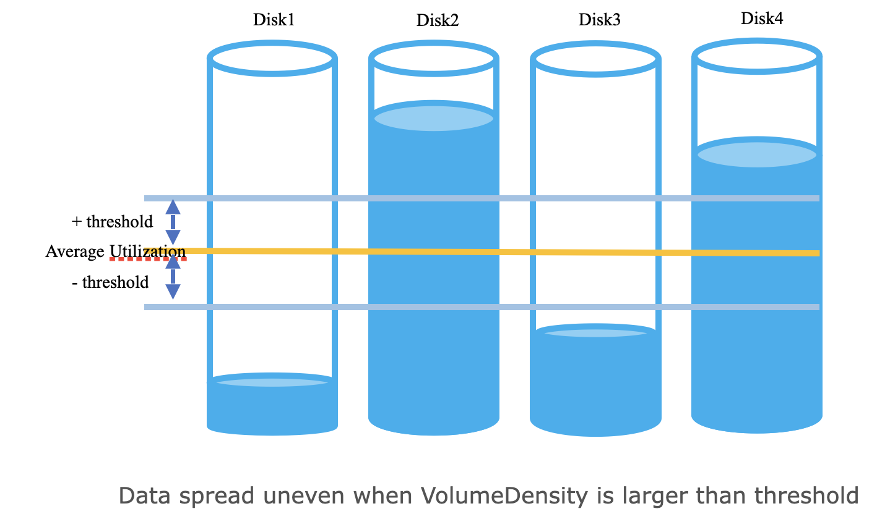

<!---
  Licensed to the Apache Software Foundation (ASF) under one or more
  contributor license agreements.  See the NOTICE file distributed with
  this work for additional information regarding copyright ownership.
  The ASF licenses this file to You under the Apache License, Version 2.0
  (the "License"); you may not use this file except in compliance with
  the License.  You may obtain a copy of the License at

      http://www.apache.org/licenses/LICENSE-2.0

  Unless required by applicable law or agreed to in writing, software
  distributed under the License is distributed on an "AS IS" BASIS,
  WITHOUT WARRANTIES OR CONDITIONS OF ANY KIND, either express or implied.
  See the License for the specific language governing permissions and
  limitations under the License.
-->

## Overview
**Apache Ozone** works well to distribute all containers evenly across all multiple disks on each Datanode.
This initial spread ensures that I/O load is balanced from the start. However, over the operational lifetime of a
cluster **disk imbalance** can occur due to the following reasons:
- **Adding new disks** to expand datanode storage space.
- **Replacing old broken disks** with new disks.
- Massive **block** or **replica deletions**.

This uneven utilisation of disks can create performance bottlenecks, as **over-utilised disks** become **hotspots** 
limiting the overall throughput of the Datanode. As a result, this new feature, **DiskBalancer**, is introduced to
ensure even data distribution across disks within a Datanode.

A disk is considered a candidate for balancing if its
`VolumeDataDensity` exceeds a configurable `threshold`. DiskBalancer can be triggered manually by **CLI commands**.




## Feature Flag

The Disk Balancer feature is introduced with a feature flag. By default, this feature is disabled.

The feature can be **enabled** by setting the following property to `true` in the `ozone-site.xml` configuration file:
`hdds.datanode.disk.balancer.enabled = false`

### Authentication and Authorization

DiskBalancer commands communicate directly with datanodes via RPC, requiring proper authentication and authorization configuration.

#### Authentication Configuration

In secure clusters with Kerberos enabled, the datanode must have its Kerberos principal configured for RPC authentication in `ozone-site.xml`:

```xml
<property>
  <name>hdds.datanode.kerberos.principal</name>
  <value>dn/_HOST@REALM.TLD</value>
  <description>
    The Datanode service principal. This is typically set to
    dn/_HOST@REALM.TLD. Each Datanode will substitute _HOST with its
    own fully qualified hostname at startup. The _HOST placeholder
    allows using the same configuration setting on all Datanodes.
  </description>
</property>
```

**Note**: Without this configuration, DiskBalancer commands will fail with authentication errors in secure clusters.
The client uses this principal to verify the datanode's identity when establishing RPC connections.

#### Authorization Configuration

Each datanode performs authorization checks using `OzoneAdmins` based on the `ozone.administrators` configuration:
- **Admin operations** (start, stop, update): Require the user to be in `ozone.administrators` or belong to a group in `ozone.administrators.groups`
- **Read-only operations** (status, report): Do not require admin privileges - any authenticated user can query status and reports

#### Default Behavior

By default, if `ozone.administrators` is not configured, only the user who launched the datanode service can start, stop,
or update DiskBalancer. This means that in a typical deployment where the datanode runs as user `dn`, only that user has
admin privileges for DiskBalancer operations.

#### Enabling Authorization for Additional Users

To allow other users to perform DiskBalancer admin operations (start, stop, update), configure the `ozone.administrators` property in `ozone-site.xml`:

**Example 1: Single user**
```xml
<property>
  <name>ozone.administrators</name>
  <value>scm</value>
</property>
```

**Example 2: Multiple users**
```xml
<property>
  <name>ozone.administrators</name>
  <value>scm,hdfs</value>
</property>
```

**Example 3: Using groups**
```xml
<property>
  <name>ozone.administrators.groups</name>
  <value>ozone-admins,cluster-operators</value>
</property>
```

**Note**: `ozone-admins` and `cluster-operators` are example group names. Replace them with actual
group names from your environment. After updating the `ozone.administrators` configuration,
restart the datanode service for the changes to take effect.

## Command Line Usage
The DiskBalancer is managed through the `ozone admin datanode diskbalancer` command.

**Note:** This command is hidden from the main help message (`ozone admin datanode --help`). This is because the feature
is currently considered experimental and is disabled by default. The command is, however, fully functional for those who wish to enable and use the feature.

### Command Syntax

**Start DiskBalancer:**
```bash
ozone admin datanode diskbalancer start [<datanode-address> ...] [OPTIONS] [--in-service-datanodes]
```

**Stop DiskBalancer:**
```bash
ozone admin datanode diskbalancer stop [<datanode-address> ...] [--in-service-datanodes]
```

**Update Configuration:**
```bash
ozone admin datanode diskbalancer update [<datanode-address> ...] [OPTIONS] [--in-service-datanodes]
```

**Get Status:**
```bash
ozone admin datanode diskbalancer status [<datanode-address> ...] [--in-service-datanodes] [--json]
```

**Get Report:**
```bash
ozone admin datanode diskbalancer report [<datanode-address> ...] [--in-service-datanodes] [--json]
```

### Command Options

| Option                              | Description                                                                                                                                                                                                                                                                                                                                                            | Example                                        |
|-------------------------------------|------------------------------------------------------------------------------------------------------------------------------------------------------------------------------------------------------------------------------------------------------------------------------------------------------------------------------------------------------------------------|------------------------------------------------|
| `<datanode-address>`                | One or more datanode addresses as positional arguments. Addresses can be:<br>- Hostname (e.g., `DN-1`) - uses default CLIENT_RPC port (19864)<br>- Hostname with port (e.g., `DN-1:19864`)<br>- IP address (e.g., `192.168.1.10`)<br>- IP address with port (e.g., `192.168.1.10:19864`)<br>- Stdin (`-`) - reads datanode addresses from standard input, one per line | `DN-1`<br>`DN-1:19864`<br>`192.168.1.10`<br>`-` |
| `--in-service-datanodes`            | It queries SCM for all IN_SERVICE datanodes and executes the command on all of them.                                                                                                                                                                                                                                                                                   | `--in-service-datanodes`                       |
| `--json`                            | Format output as JSON.                                                                                                                                                                                                                                                                                                                                                 | `--json`                                       |
| `-t/--threshold-percentage`        | Volume density threshold percentage (default: 10.0). Used with `start` and `update` commands.                                                                                                                                                                                                                                                                          | `-t 5`<br>`--threshold-percentage 5.0`         |
| `-b/--bandwidth-in-mb`              | Maximum disk bandwidth in MB/s (default: 10). Used with `start` and `update` commands.                                                                                                                                                                                                                                                                                 | `-b 20`<br>`--bandwidth-in-mb 50`              |
| `-p/--parallel-thread`              | Number of parallel threads (default: 1). Used with `start` and `update` commands.                                                                                                                                                                                                                                                                                      | `-p 5`<br>`--parallel-thread 10`               |
| `-s/--stop-after-disk-even`         | Stop automatically after disks are balanced (default: true). Used with `start` and `update` commands.                                                                                                                                                                                                                                                                  | `-s false`<br>`--stop-after-disk-even true`    |

### Examples

**Start DiskBalancer:**
```bash
# Start DiskBalancer on multiple datanodes
ozone admin datanode diskbalancer start DN-1 DN-2 DN-3

# Start DiskBalancer on all IN_SERVICE datanodes
ozone admin datanode diskbalancer start --in-service-datanodes

# Start DiskBalancer with configuration parameters
ozone admin datanode diskbalancer start DN-1 -t 5 -b 20 -p 5
# Or using the long form:
ozone admin datanode diskbalancer start DN-1 --threshold-percentage 5 -b 20 -p 5

# Read datanode addresses from stdin
echo -e "DN-1\nDN-2" | ozone admin datanode diskbalancer start -

# Start DiskBalancer with json output
ozone admin datanode diskbalancer start DN-1 --json
```

**Stop DiskBalancer:**
```bash
# Stop DiskBalancer on multiple datanodes
ozone admin datanode diskbalancer stop DN-1 DN-2 DN-3

# Stop DiskBalancer on all IN_SERVICE datanodes
ozone admin datanode diskbalancer stop --in-service-datanodes

# Stop DiskBalancer with json output
ozone admin datanode diskbalancer stop DN-1 --json
```

**Update Configuration:**
```bash

# Update multiple parameters
ozone admin datanode diskbalancer update DN-1 -t 5 -b 50 -p 10

# Update on all IN_SERVICE datanodes
ozone admin datanode diskbalancer update --in-service-datanodes -t 5
# Or using the long form:
ozone admin datanode diskbalancer update --in-service-datanodes --threshold-percentage 5

# Update with json output
ozone admin datanode diskbalancer update DN-1 -b 50 --json
```

**Get Status:**
```bash
# Get status from multiple datanodes
ozone admin datanode diskbalancer status DN-1 DN-2 DN-3

# Get status from all IN_SERVICE datanodes
ozone admin datanode diskbalancer status --in-service-datanodes

# Get status as JSON
ozone admin datanode diskbalancer status --in-service-datanodes --json
```

**Get Report:**
```bash
# Get report from multiple datanodes
ozone admin datanode diskbalancer report DN-1 DN-2 DN-3

# Get report from all IN_SERVICE datanodes
ozone admin datanode diskbalancer report --in-service-datanodes

# Get report as JSON
ozone admin datanode diskbalancer report --in-service-datanodes --json
```

## **DiskBalancer Configurations**

The DiskBalancer's behavior can be controlled using the following configuration properties in `ozone-site.xml`.

| Property                                                    | Default Value                                                                          | Description                                                                                                                                                               |
|-------------------------------------------------------------|----------------------------------------------------------------------------------------|---------------------------------------------------------------------------------------------------------------------------------------------------------------------------|
| `hdds.datanode.disk.balancer.enabled`                       | `false`                                                                                | If false, the DiskBalancer service on the Datanode is disabled. Configure it to true for diskBalancer to be enabled.                                                    |
| `hdds.datanode.disk.balancer.volume.density.threshold.percent` | `10.0`                                                                                 | A percentage (0-100). A datanode is considered balanced if for each volume, its utilization differs from the average datanode utilization by no more than this threshold. |
| `hdds.datanode.disk.balancer.max.disk.throughputInMBPerSec` | `10`                                                                                   | The maximum bandwidth (in MB/s) that the balancer can use for moving data, to avoid impacting client I/O.                                                                 |
| `hdds.datanode.disk.balancer.parallel.thread`               | `5`                                                                                    | The number of worker threads to use for moving containers in parallel.                                                                                                    |
| `hdds.datanode.disk.balancer.service.interval`              | `60s`                                                                                  | The time interval at which the Datanode DiskBalancer service checks for imbalance and updates its configuration.                                                          |
| `hdds.datanode.disk.balancer.stop.after.disk.even`          | `true`                                                                                 | If true, the DiskBalancer will automatically stop its balancing activity once disks are considered balanced (i.e., all volume densities are within the threshold).        |
| `hdds.datanode.disk.balancer.volume.choosing.policy`        | `org.apache.hadoop.ozone.container.diskbalancer.policy.DefaultVolumeChoosingPolicy`    | The policy class for selecting source and destination volumes for balancing.                                                                                              |
| `hdds.datanode.disk.balancer.container.choosing.policy`     | `org.apache.hadoop.ozone.container.diskbalancer.policy.DefaultContainerChoosingPolicy` | The policy class for selecting which containers to move from a source volume to destination volume.                                                                       |
| `hdds.datanode.disk.balancer.service.timeout`               | `300s`                                                                                 | Timeout for the Datanode DiskBalancer service operations.                                                                                                                 |
| `hdds.datanode.disk.balancer.should.run.default`            | `false`                                                                                | If the balancer fails to read its persisted configuration, this value determines if the service should run by default.                                                    |

