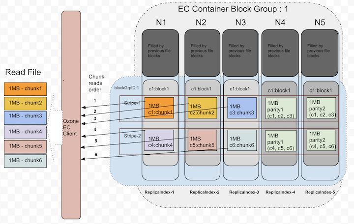
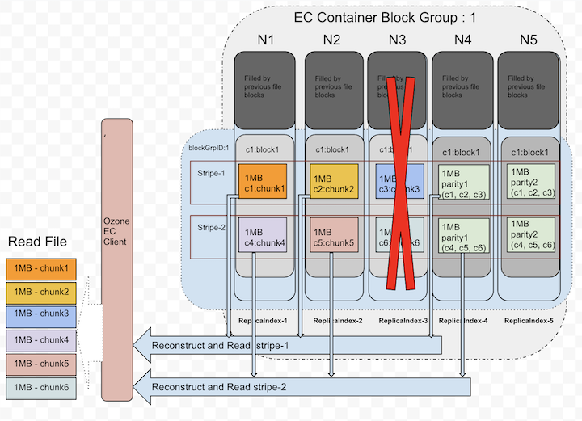

<!---
  Licensed to the Apache Software Foundation (ASF) under one or more
  contributor license agreements.  See the NOTICE file distributed with
  this work for additional information regarding copyright ownership.
  The ASF licenses this file to You under the Apache License, Version 2.0
  (the "License"); you may not use this file except in compliance with
  the License.  You may obtain a copy of the License at

      http://www.apache.org/licenses/LICENSE-2.0

  Unless required by applicable law or agreed to in writing, software
  distributed under the License is distributed on an "AS IS" BASIS,
  WITHOUT WARRANTIES OR CONDITIONS OF ANY KIND, either express or implied.
  See the License for the specific language governing permissions and
  limitations under the License.
-->

## Background

Distributed systems basic expectation is to provide the data durability.
To provide the higher data durability, many popular storage systems use replication
approach which is expensive. The Apache Ozone supports `RATIS/THREE` replication scheme.
The Ozone default replication scheme `RATIS/THREE` has 200% overhead in storage
space and other resources (e.g., network bandwidth).
However, for warm and cold datasets with relatively low I/O activities, additional
block replicas are rarely accessed during normal operations, but still consume the same
amount of resources as the first replica.

Therefore, a natural improvement is to use Erasure Coding (EC) in place of replication,
which provides the same level of fault-tolerance with much less storage space.
In typical EC setups, the storage overhead is no more than 50%. The replication factor of an EC file is meaningless.
Instead of replication factor, we introduced ReplicationConfig interface to specify the required type of replication,
either `RATIS/THREE` or `EC`.

Integrating EC with Ozone can improve storage efficiency while still providing similar
data durability as traditional replication-based Ozone deployments.
As an example, a 3x replicated file with 6 blocks will consume 6*3 = `18` blocks of disk space.
But with EC (6 data, 3 parity) deployment, it will only consume `9` blocks of disk space.

## Architecture

The storage data layout is a key factor in the implementation of EC. After deep analysis
and several technical consideration, the most fitting data layout is striping model.
The data striping layout is not new. The striping model already adapted by several other
file systems(Ex: Quantcast File System, Hadoop Distributed File System etc) successfully before.

For example, with the EC (6 data, 3 parity) scheme, the data chunks will be distributed to first 6 data nodes in order
and then client generates the 3 parity chunks and transfer to remaining 3 nodes in order.
These 9 chunks together we call as "Stripe". Next 6 chunks will be distributed to the same first 6 data nodes again
and the parity to remaining 3 nodes. These 9 data nodes stored blocks together called as "BlockGroup".

If the application is continuing to write beyond the size of `6 * BLOCK_SIZE`, then client will request new block group from Ozone Manager.

### Erasure Coding Write

The core logic of erasure coding writes are placed at ozone client.
When client creates the file, ozone manager allocates the block group(`d + p`)
number of nodes from the pipeline provider and return the same to client.
As data is coming in from the application, client will write first d number of chunks
to d number of data nodes in block group. It will also cache the d number chunks
to generate the parity chunks. Once parity chunks generated, it will transfer the
same to the remaining p nodes in order. Once all blocks reached their configured sizes,
client will request the new block group nodes.

Below diagram depicts the block allocation in containers as logical groups.
For interest of space, we assumed EC(3, 2) Replication Config for the diagram.


Let's zoom out the blockID: 1 data layout from the above picture, that showed in the following picture.
This picture shows how the chunks will be layed out in data node blocks.


Currently, the EC client re-used the data transfer end-points to transfer the data to data nodes.
The XceiverClientGRPC client used for writing data and putBlock info.
The datanode side changes are minimal as we reused the same existing transfer protocols.
The EC data block written at the datanode is same as any other block in non-EC mode.
In a single block group, container id numbers are same in all nodes. A file can have multiple block groups.
Each block group will have `d+p` number of block and all ids are same.

**d** - Number of data blocks in a block group

**p** - Number of parity blocks in a block group

### Erasure Coding Read

For reads, OM will provide the node location details as part of key lookup.
If the key is erasure coded, Ozone client reads it in EC fashion. Since the data layout
is different(see the previous section about write path), reads should consider the layout and do the reads accordingly.

The EC client will open the connections to DNs based on the expected locations. When all data locations are available,
it will attempt to do plain reads chunk by chunk in round robin fashion from d data blocks.

Below picture shows the order when there are no failures while reading.



Until it sees read failures, there is no need of doing EC reconstruction.

#### Erasure Coding On-the-fly Reconstruction Reads

When client detects there are failures while reading or when starting the reads,
Ozone EC client is capable of reconstructing/recovering the lost data by doing the EC decoding.
To do the EC decoding it needs to read parity replicas. This is a degraded read as it needs to do reconstruction.
This reconstruction is completely transparent to the applications.

Below picture depicts how it uses parity replicas in reconstruction.



 ### Erasure Coding Replication Config

 Apache Ozone built with the pure 'Object Storage' semantics. However, many big data
 eco system projects still uses file system APIs. To provide both worlds best access to Ozone,
 it's provided both faces of interfaces. In both cases, keys/files would be written into buckets under the hood.
 So, EC Replication Configs can be set at bucket level.
 The EC policy encapsulates how to encode/decode a file.
 Each EC Replication Config defined by the following pieces of information:
  1. **data:** Data blocks number in an EC block group.
  2. **parity:** Parity blocks number in an EC block group.
  3. **ecChunkSize:** The size of a striping chunk. This determines the granularity of striped reads and writes.
  4. **codec:** This is to indicate the type of EC algorithms (e.g., `RS`(Reed-Solomon), `XOR`).

To pass the EC Replication Config in command line or configuration files, we need to use the following format:
*codec*-*num data blocks*-*num parity blocks*-*ec chunk size*

Currently, there are three built-in EC Replication Configs supported: `RS-3-2-1024k`, `RS-6-3-1024k`, `XOR-2-1-1024k`.
The most recommended option is `RS-6-3-1024k`. When a key/file created without specifying the Replication Config,
it inherits the EC Replication Config of its bucket if it's available.

Changing the bucket level EC Replication Config only affect new files created within the bucket.
Once a file has been created, its EC Replication Config cannot be changed currently.

Deployment
----------
### Cluster and Hardware Configuration

EC places additional demands on the cluster in terms of CPU and network.
Encoding and decoding work consumes additional CPU on both Ozone clients and DataNodes.
EC requires a minimum of as many DataNodes in the cluster as the configured EC stripe width. For the EC Replication Config `RS` (6,3), we need
a minimum of 9 DataNodes.

Erasure Coded keys/files also spread across racks for rack fault-tolerance.
This means that when reading and writing striped files, most operations are off-rack.
Network bisection bandwidth is thus very important.

For rack fault-tolerance, it is also important to have enough number of racks,
so that on average, each rack holds number of blocks no more than the number of EC parity blocks.
A formula to calculate this would be (data blocks + parity blocks) / parity blocks, rounding up.
For `RS` (6,3) EC Replication Config, this means minimally 3 racks (calculated by (6 + 3) / 3 = 3),
and ideally 9 or more to handle planned and unplanned outages.
For clusters with fewer racks than the number of the parity cells, Ozone cannot maintain rack fault-tolerance,
but will still attempt to spread a striped file across multiple nodes to preserve node-level fault-tolerance.
Due to this reason, it is recommended to setup racks with similar number of DataNodes.

### Configurations

EC Replication Config can be enabled at bucket level as discussed above.
Cluster wide default Replication Config can be set with EC Replication Config by using
the configuration keys `ozone.server.default.replication.type` and `ozone.server.default.replication`.

```XML
<property>
   <name>ozone.server.default.replication.type</name>
   <value>EC</value>
</property>
```

```XML
<property>
   <name>ozone.server.default.replication</name>
   <value>RS-6-3-1024k</value>
</property>
```

Please note, the above configurations will be used only when client does not pass
any replication config or bucket does not have any default values.

#### Setting EC Replication Config On Bucket

We can set the bucket EC Replication Config via ozone sh command. The EC Replication Config options can be passed while creating the bucket.

```shell
ozone sh bucket create <bucket path> --type EC --replication rs-6-3-1024k
```

We can also reset the EC Replication Config with the following command.

```shell
ozone sh bucket set-replication-config <bucket path> --type EC --replication rs-3-2-1024k
```

Once we reset, only newly created keys will take effect of this new setting. Prior created keys in the bucket stay with same older setting.

#### Setting EC Replication Config While Creating Keys/Files

We can pass the EC Replication Config while creating the keys irrespective of bucket Replication Config.

```shell
ozone sh key put <Ozone Key Object Path> <Local File> --type EC --replication rs-6-3-1024k
```

When using ofs/o3fs, we can pass the EC Replication Config by setting the configuration keys `ozone.replication.type` and `ozone.replication`.

```XML
<property>
   <name>ozone.replication.type</name>
   <value>EC</value>
</property>
```

```XML
<property>
   <name>ozone.replication</name>
   <value>rs-3-2-1024k</value>
</property>
```

In the case bucket already has default EC Replication Config, there is no need of passing EC Replication Config while creating key.

#### Calculating EC Pipeline Limits

The target number of open EC pipelines SCM aims to maintain is calculated dynamically for each EC replication configuration (e.g., RS-6-3, RS-3-2). The calculation is based on the following two properties, with the final target being the greater of the two resulting values.

*   `ozone.scm.ec.pipeline.minimum`
    *   **Description**: The guaranteed minimum number of open pipelines to maintain for each EC configuration, regardless of other factors.
    *   **Default Value**: `5`

*   `ozone.scm.ec.pipeline.per.volume.factor`
    *   **Description**: A factor used to calculate a target number of pipelines based on the total number of healthy volumes across all datanodes in the cluster.
    *   **Default Value**: `1.0`

**Calculation Logic:**

SCM first calculates a volume-based target using the formula:
`(<pipeline.per.volume.factor> * <total healthy volumes>) / <required nodes for EC config>`

The final target number of pipelines is then determined by:
`max(<volume-based target>, <pipeline.minimum>)`

**Example:**

Consider a cluster with **200 total healthy volumes** across all datanodes and an EC policy of **RS-6-3** (which requires 9 nodes).
*   `ozone.scm.ec.pipeline.minimum` = **5** (default)
*   `ozone.scm.ec.pipeline.per.volume.factor` = **1.0** (default)

1.  The volume-based target is: `(1.0 * 200) / 9 = 22`
2.  The final target is: `max(22, 5) = 22`

SCM will attempt to create and maintain approximately **22** open, RS-6-3 EC pipelines.

**Production Recommendation:**

The default values are a good starting point for most clusters. If you have a very high number of volumes and a write-heavy EC workload, you might consider slightly increasing the `pipeline.per.volume.factor`. Conversely, for read-heavy workloads, the default minimum of 5 pipelines is often sufficient.

### Enable Intel ISA-L

Intel Intelligent Storage Acceleration Library (ISA-L) is an open-source collection of optimized low-level functions used for
storage applications. Enabling ISA-L allows significantly improve EC performance.

#### Prerequisites

To enable ISA-L you will also require Hadoop native libraries (libhadoop.so). 

#### Installation
Both libraries should be placed in the directory specified by the java.library.path property or set by  `LD_LIBRARY_PATH` environment variable.
The default value of java.library.path depends on the OS and Java version. For example, on Linux with OpenJDK 8 it is `/usr/java/packages/lib/amd64:/usr/lib64:/lib64:/lib:/usr/lib`.

#### Verification

You can check if ISA-L is accessible to Ozone by running the following command:

```shell
ozone debug checknative
```


