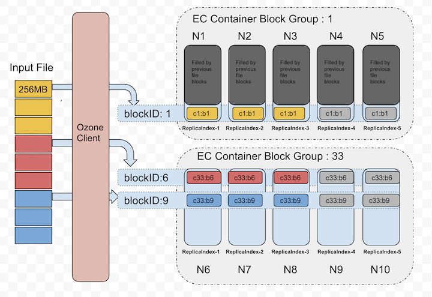

<!---
  Licensed to the Apache Software Foundation (ASF) under one or more
  contributor license agreements.  See the NOTICE file distributed with
  this work for additional information regarding copyright ownership.
  The ASF licenses this file to You under the Apache License, Version 2.0
  (the "License"); you may not use this file except in compliance with
  the License.  You may obtain a copy of the License at

      http://www.apache.org/licenses/LICENSE-2.0

  Unless required by applicable law or agreed to in writing, software
  distributed under the License is distributed on an "AS IS" BASIS,
  WITHOUT WARRANTIES OR CONDITIONS OF ANY KIND, either express or implied.
  See the License for the specific language governing permissions and
  limitations under the License.
-->

## 背景
分布式系统的基本目标是提供数据可靠性。
许多储存系统会透过复制来提高可靠性，像 Ozone 支援 `RATIS/THREE` 的复制方法，但复制方法需要耗费较多的额外资源。
例如，Ozone 预设的 `RATIS/THREE` 复制架构，在原本的资源需求（包含储存空间和网路带宽等）之外，还需要消耗额外的两倍资源。
然而，对于部分低 I/O 的资料集来说，很少需要用到额外的资料副本，但依然要消耗同等的储存空间。

一个改进方法是用纠删码（Erasure Coding，简称 EC）来取代副本。纠删码可以提供同样的容错能力，但需要的额外储存空间较小。
在典型的纠删码设定中，需要的额外储存空间不超过原本空间的 50%。
因此，Ozone 引入了 ReplicationConfig 接口来指定需要的复制类型，选项有 `RATIS/THREE` 和 `EC`。

在 Ozone 中使用纠删码可以提高储存效率，并维持原本的可靠性保证。
举例来说，某个档案包含 6 个 block，并需要 3x 个副本，在备份模式下需要 6*3 = `18` 个 block。但若使用纠删码机制（6 个数据块，3 个校验块），只需要 6+3 = `9` 个 block。

## 架构
在纠删码的实现中，数据布局是关键因素。在一些技术考量和深度分析后，最合适的方法是条带化(striping)。
条带化并不是很新的技术，目前已经被一些资料系统（例如 Quantcast File Sysytem 和 Hadoop Distributed File System 等）采用并获得成功。

举例来说，使用 6 个数据块、3 个校验块的纠删码架构中，数据切片(data chunk)会被依序分配到前 6 个资料节点，接著客户端生成 3 个校验切片(parity chunk)并存到剩下的三个节点，我们把这 9 个切片统称为条带(Stripe)。
接下来的 6 个数据切片会再被依序分到前 6 个资料节点，并产出 3 个校验切片分配到末三个节点。
这 9 个资料节点被统称为块组(BlockGroup)。

如果应用程式写入超过 `6 * BLOCK_SIZE` 的大小，客户端会和 Ozone Manager 请求新的块组。

### 资料写入
在纠删码的写入过程中，核心逻辑被放在 Ozone 客户端。
当客户端新增文件，Ozone Manager 会从管线提供者(pipeline provider)分配大小为 `d + p` 的块组，并将此返回给客户端。客户端将前 d 个数据切片写入前 d 个资料节点，并缓存这些资料块以产生校验切片。在校验切片生成后，便会被依序传送到剩下的 p 个节点。
当所有块都存满后，客户端会请求新的块组节点。

下图将容器中的块分配视为逻辑组。出于篇幅考量，我们以 (3,2) 的纠删码模式来做示例。



让我们放大检视上图中 blockID:1 的部分。下图显示了数据切片在块中会被如何安排。


目前，纠删码的客户端在传输数据的过程中，会重复使用数据传输端点。
XceiverClientGRPC 客户端会用于写入数据。
因为我们会重复使用已存在的传输协定，因此 datanode 的变化很小，且纠删码写入和非纠删码写入模式是相同的。
在单个块组中，container ID 在所有节点中都相同。一个文件可以有多个块组，每个块组有 `d+p` 个块，所有块的 ID 都一样。

**d** - 块组中资料块的数量

**p** - 块组中校验块的数量

### 资料读取
在读取中，OM 会在搜寻键时，一并提供节点的位置讯息。
如果该键是采用纠删码机制，就会以纠删码方式进行读取。
由于数据布局不同（参见上节的写入机制），读取需要考虑使用的数据布局并进行相应动作。

EC 客户端会根据位置资讯连结 datanode。当所有和 datanode 的连结都可用时，便会开始从 d 個数据块中以 round robin 方式依序读取。

下图是没有读取失败时的读取状况。


除非出现读取失败，否则不需要用纠删码进行资料重建。

### 即时重建的资料读取
当客户端在开始读取前或读取中检测到故障时，Ozone EC 客户端能透过 EC 解码，重建并恢复遗失的数据。
EC 解码需要读取校验副本。由于需要进行资料重建，这个过程是降解读取(degraded read)。
此重建过程对应用程式来说是完全透明的。

下图描述了如何用校验块进行资料重建。


### 纠删码副本配置
Apache Ozone 使用物件储存模式。然而，许多大数据生态系统依然使用文件系统模式的 API。
为了提供更好的文件取得模式，Ozone 提供物件储存和档案系统两种介面。不管使哪种模式，文件最后都会被写进 bucket 中。
因此，EC 配置可以在 bucket 层级设定。
EC 配置概括了如何去编译／解码文件。每个 EC 配置都包含下列几项：
   1. **data**：EC 块组中的数据块数量
   2. **parity**：EC 块组中的校验块数量
   3. **ecChunkSize**：条带化切片(striping chunk)的大小，这会决定读写的颗粒度
   4. **codec**：EC 使用的演算法（例如：`RS`(Reed-Solomon)、`XOR`）。

如果想要在命令行或配置文件中做 EC 副本配置，下面是指定格式：
*codec*-*num data blocks*-*num parity blocks*-*ec chunk size*

Ozone 目前支援下列三种内建的 EC 副本配置：`RS-3-2-1024k`、`RS-6-3-1024k`、`XOR-2-1-1024k`，最推荐的选项是 `RS-6-3-1024k`。若在新增文件时没有做 EC 副本配置，则会继承 bucket 中的 EC 配置。

更改 bucket 级别的 EC 副本设定只会影响在该 bucket 底下的新文件。一旦文件建立完成，EC 的副本设置便无法修改。

部署
----------
### 集群与硬体设置
EC 对集群提出了额外的 CPU 和网路需求，编译和解译动作会在 Ozone 的客户端和 datanode 上消耗额外的 CPU。
EC 要求集群中 datanode 的数量至少和带宽数量相等，因此对于 (6, 3) 的 EC 配置，我们最少需要 9 个 datanode。

在纠删码机制中，文件会分布在不同几架，以实现机架层级的容错。
这表示在读取和写入条带化文件时，大多数操作都是在机架外进行的。
因此网路的对分带宽(bisection bandwidth)非常重要。

为了机架层级的容错度，拥有足够数量的机架很重要。
平均来说，每个机架拥有的块数不超过 EC 校验块的数量。
机架数计算公式如下：(数据块+校验块)/校验块，并把計算結果四捨五入。
对于 `RS` (6,3) 的 EC 配置，最少需要 3 个机架（计算过程是 (6 + 3) / 3 = 3 ），
理想上最好有 9 以上的机架来处理计划内和计划外的停机。
对于机架数少于校验块数量的集群，Ozone 无法保证机架层级的容错度，但会尝试把条带化文件散佈到多节点上，确保节点层级的的容错度。
基于上述原因，建议设置具有相似 datanode 数的机架。

### 配置
如上所述，EC 的副本配置可以在 bucket 级别启用。
可以用 `ozone.server.default.replication.type` 和 `ozone.server.default.replication` 来设定集群内副本配置的预设值。

```XML
<property>
   <name>ozone.server.default.replication.type</name>
   <value>EC</value>
</property>

<property>
   <name>ozone.server.default.replication</name>
   <value>RS-6-3-1024k</value>
</property>
```

要注意的是，上述设定只有在客户端没有做任何配置，或 bucket 没有预设值才有效。

#### 在 bucket 上做 EC 配置
我们可以用 `ozone sh` 命令来做 bucket 的 EC 副本设定，EC 的相关配置可以在新增 bucket 时做设定。

```shell
ozone sh bucket create <bucket path> --type EC --replication rs-6-3-1024k
```

我们还可以使用以下命令重设 EC Replication Config。

```shell
ozone sh bucket set-replication-config <bucket path> --type EC --replication rs-3-2-1024k
```

重置后，只有新建的文件会受到新设定的影响，bucket 中已经建立的文件会维持旧设定。

#### 在新增文件时做 EC 配置
在新增文件时可以进行 EC 副本设定，且不用考虑 bucket 的副本配置。

```shell
ozone sh key put <Ozone Key Object Path> <Local File> --type EC --replication rs-6-3-1024k
```

如果 bucket 已经有预设的 EC 副本设定，那么创建文件时就不用再做设定。