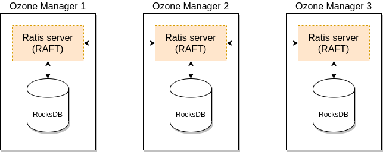

<!---
  Licensed to the Apache Software Foundation (ASF) under one or more
  contributor license agreements.  See the NOTICE file distributed with
  this work for additional information regarding copyright ownership.
  The ASF licenses this file to You under the Apache License, Version 2.0
  (the "License"); you may not use this file except in compliance with
  the License.  You may obtain a copy of the License at

      http://www.apache.org/licenses/LICENSE-2.0

  Unless required by applicable law or agreed to in writing, software
  distributed under the License is distributed on an "AS IS" BASIS,
  WITHOUT WARRANTIES OR CONDITIONS OF ANY KIND, either express or implied.
  See the License for the specific language governing permissions and
  limitations under the License.
-->

Ozone has two metadata-manager nodes (*Ozone Manager* for key space management and *Storage Container Manager* for block space management) and multiple storage nodes (Datanode). Data is replicated between Datanodes with the help of RAFT consensus algorithm.

To avoid any single point of failure the metadata-manager nodes also should have a HA setup.

Both Ozone Manager and Storage Container Manager supports HA. In this mode the internal state is replicated via RAFT (with Apache Ratis) 

This document explains the HA setup of Ozone Manager (OM) HA, please check [this page]() for SCM HA.  While they can be setup for HA independently, a reliable, full HA setup requires enabling HA for both services.

## Ozone Manager HA

A single Ozone Manager uses [RocksDB](https://github.com/facebook/rocksdb/) to persist metadata (volumes, buckets, keys) locally. HA version of Ozone Manager does exactly the same but all the data is replicated with the help of the RAFT consensus algorithm to follower Ozone Manager instances.



Client connects to the Leader Ozone Manager which process the request and schedule the replication with RAFT. When the request is replicated to all the followers the leader can return with the response.

## Configuration

One Ozone configuration (`ozone-site.xml`) can support multiple Ozone HA cluster. To select between the available HA clusters a logical name is required for each of the clusters which can be resolved to the IP addresses (and domain names) of the Ozone Managers.

This logical name is called `serviceId` and can be configured in the `ozone-site.xml`
 
```XML
<property>
   <name>ozone.om.service.ids</name>
   <value>cluster1</value>
</property>
```

For each of the defined `serviceId` a logical configuration name should be defined for each of the servers.

```XML
<property>
   <name>ozone.om.nodes.cluster1</name>
   <value>om1,om2,om3</value>
</property>
```

The defined prefixes can be used to define the address of each of the OM services:

```XML
<property>
   <name>ozone.om.address.cluster1.om1</name>
   <value>host1</value>
</property>
<property>
   <name>ozone.om.address.cluster1.om2</name>
   <value>host2</value>
</property>
<property>
   <name>ozone.om.address.cluster1.om3</name>
   <value>host3</value>
</property>
```

The defined `serviceId` can be used instead of a single OM host using [client interfaces]()

For example with `o3fs://`

```shell
hdfs dfs -ls o3fs://bucket.volume.cluster1/prefix/
```

Or with `ofs://`:

```shell
hdfs dfs -ls ofs://cluster1/volume/bucket/prefix/
```

## Implementation details

Raft can guarantee the replication of any request if the request is persisted to the RAFT log on the majority of the nodes. To achieve high throughput with Ozone Manager, it returns with the response even if the request is persisted only to the RAFT logs.

RocksDB instance are updated by a background thread with batching transactions (so called "double buffer" as when one of the buffers is used to commit the data the other one collects all the new requests for the next commit.) To make all data available for the next request even if the background process has not yet written them, the key data is cached in the memory.


The details of this approach are discussed in a separate [design doc]() but it's an integral part of the OM HA design.

## OM Bootstrap

To convert a non-HA OM to be HA or to add new OM nodes to existing HA OM ring, new OM node(s) need to be bootstrapped.

Before bootstrapping a new OM node, all the existing OM's on-disk configuration file (ozone-site.xml) must be updated with the configuration details
of the new OM such as nodeId, address, port etc. Note that the existing OMs need not be restarted. They will reload the configuration from disk when
they receive a bootstrap request from the bootstrapping node.

To bootstrap an OM, the following command needs to be run:

```shell
ozone om [global options (optional)] --bootstrap
```

The bootstrap command will first verify that all the OMs have the updated configuration file and fail the command otherwise. This check can be skipped
using the _force_ option. The _force_ option allows to continue with the bootstrap when one of the existing OMs is down or not responding.

```shell
ozone om [global options (optional)] --bootstrap --force
```

Note that using the _force_ option during bootstrap could crash the OM process if it does not have updated configurations.

## OM Leader Transfer

The `ozone admin om transfer` command allows you to manually transfer the leadership of the Ozone Manager (OM) Raft group to a specific OM node or to a randomly chosen follower.

### Usage

```bash
ozone admin om transfer -id <OM_SERVICE_ID> -n <NEW_LEADER_ID>
ozone admin om transfer -id <OM_SERVICE_ID> -r
```

*   `-id, --service-id`: Specifies the Ozone Manager Service ID.
*   `-n, --newLeaderId, --new-leader-id`: The node ID of the OM to which leadership will be transferred (e.g., `om1`).
*   `-r, --random`: Randomly chooses a follower to transfer leadership to.

### Example

To transfer leadership to `om2` in a cluster with service ID `cluster1`:

```bash
ozone admin om transfer -id cluster1 -n om2
```

To transfer leadership to a random follower:

```bash
ozone admin om transfer -id cluster1 -r
```

## OM Service Roles Listing

The `ozone admin om roles` command lists all Ozone Managers and their respective Raft server roles (leader, follower, or candidate).

### Usage

```bash
ozone admin om roles [-id <OM_SERVICE_ID>] [--json | --table]
```

*   `-id, --service-id`: (Optional) Specifies the Ozone Manager Service ID.
*   `--json`: (Optional) Formats the output as JSON.
*   `--table`: (Optional) Formats the output as a table.

### Example

To list OM roles for `cluster1`:

```bash
ozone admin om roles -id cluster1
```

Example output:

```
om1 : LEADER (host1)
om2 : FOLLOWER (host2)
om3 : FOLLOWER (host3)
```

To list OM roles as a table:

```bash
ozone admin om roles -id cluster1 --table
```

Example table output:

```
Ozone Manager Roles
-------------------
Host Name | Node ID | Role
-------------------
host1     | om1     | LEADER
host2     | om2     | FOLLOWER
host3     | om3     | FOLLOWER
-------------------
```

## Automatic Snapshot Installation for Stale Ozone Managers

Sometimes an OM follower node may be offline or fall far behind the OM leader's raft log.
Then, it cannot easily catch up by replaying individual log entries.
The OM HA implementation includes an automatic snapshot installation
and recovery process for such cases.

How it works:

1. Leader determines that the follower is too far behind.
2. Leader notifies the follower to install a snapshot.
3. The follower downloads and installs the latest snapshot from the leader.
4. After installing the snapshot, the follower OM resumes normal operation and log replication from the new state.

This logic is implemented in the `OzoneManagerStateMachine.notifyInstallSnapshotFromLeader()`;
see the [code](https://github.com/apache/ozone/blob/ozone-2.0.0/hadoop-ozone/ozone-manager/src/main/java/org/apache/hadoop/ozone/om/ratis/OzoneManagerStateMachine.java#L520-L531)
in Release 2.0.0.

Note that this `Raft Snapshot`, used for OM HA state synchronization, is distinct from `Ozone Snapshot`, which is used for data backup and recovery purposes.

In most scenarios, stale OMs will recover automatically, even if they have missed a large number of operations.
Manual intervention (such as running `ozone om --bootstrap`) is only required when adding a new OM node to the cluster.

**Important Note on Ozone Manager (OM) Disk Space for Snapshots**

When an Ozone Manager (OM) acts as a follower in an HA setup, it downloads snapshot tarballs from the leader to its
local metadata directory. Therefore, always ensure your OM disks have at least 2x the current OM database size to
accommodate the existing data and incoming snapshots, preventing disk space issues and maintaining cluster stability.

## References

 * Check [this page]() for the links to the original design docs
 * For troubleshooting OM HA snapshot installation issues, see [this page]().
 * Ozone distribution contains an example OM HA configuration, under the `compose/ozone-om-ha` directory which can be tested with the help of [docker-compose]().
* [Apache Ratis State Machine API documentation](https://github.com/apache/ratis/blob/ratis-3.1.3/ratis-server-api/src/main/java/org/apache/ratis/statemachine/StateMachine.java)
