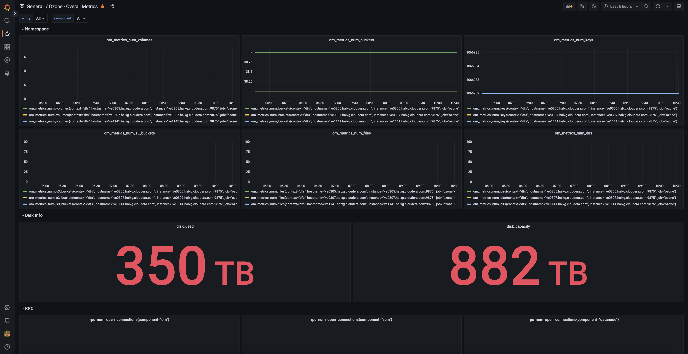
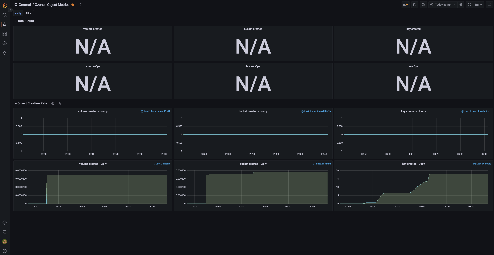
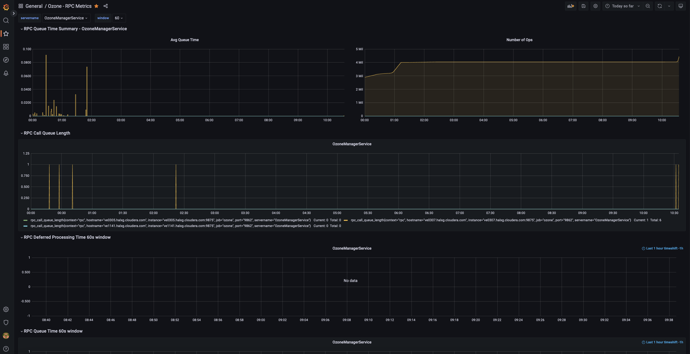

<!---
  Licensed to the Apache Software Foundation (ASF) under one or more
  contributor license agreements.  See the NOTICE file distributed with
  this work for additional information regarding copyright ownership.
  The ASF licenses this file to You under the Apache License, Version 2.0
  (the "License"); you may not use this file except in compliance with
  the License.  You may obtain a copy of the License at

      http://www.apache.org/licenses/LICENSE-2.0

  Unless required by applicable law or agreed to in writing, software
  distributed under the License is distributed on an "AS IS" BASIS,
  WITHOUT WARRANTIES OR CONDITIONS OF ANY KIND, either express or implied.
  See the License for the specific language governing permissions and
  limitations under the License.
-->

Ozone provides multiple tools to get more information about the current state of the cluster.

## Prometheus

Ozone has native support for Prometheus integration. All internal metrics (collected by Hadoop metrics framework) are published under the `/prom` HTTP endpoint. (For example under http://localhost:9876/prom for SCM).

The Prometheus endpoint is turned on by default but can be turned off by the `hdds.prometheus.endpoint.enabled` configuration variable.

In a secure environment the page is guarded with SPNEGO authentication which is not supported by Prometheus. To enable monitoring in a secure environment, a specific authentication token can be configured

Example `ozone-site.xml`:

```XML
<property>
   <name>hdds.prometheus.endpoint.token</name>
   <value>putyourtokenhere</value>
</property>
```

Example prometheus configuration:

```YAML
scrape_configs:
  - job_name: ozone
    bearer_token: <putyourtokenhere>
    metrics_path: /prom
    static_configs:
     - targets:
         - "127.0.0.1:9876" 
```

## Grafana

Once Prometheus is up and running, Grafana can be configured to monitor and visualize Ozone metrics.

### Add Prometheus as a data source

In the Grafana web UI, go to `Add Data Sources` and then select `Prometheus`.

Enter the Prometheus hostname/port in the `HTTP`. For example, http://localhost:9094 (verify the port used by looking at Prometheus command line flags `-web.listen-address`. The port can also be found from Prometheus web UI → Status → Command-Line Flags.)

Choose Prometheus type: `Prometheus`

Choose Prometheus version: `2.37.x`

Finish the setup by clicking on `Save and Test`.

### Import a Grafana dashboard for Ozone

Apache Ozone comes with a default Grafana dashboard. Follow the instructions below to import it:

Download dashboard json:

```shell
wget https://raw.githubusercontent.com/apache/ozone/master/hadoop-ozone/dist/src/main/compose/common/grafana/dashboards/Ozone%20-%20Overall%20Metrics.json
```

Open Grafana portal and click on Dashboards on the left and select `Import`.

Click at `Upload JSON file` and select the file `Ozone - Overall Metrics.json` that was just downloaded.

The dashboard is now imported.



Repeat the same for [Object Metrics](https://raw.githubusercontent.com/apache/ozone/master/hadoop-ozone/dist/src/main/compose/common/grafana/dashboards/Ozone%20-%20Object%20Metrics.json) dashboard and [RPC Metrics](https://raw.githubusercontent.com/apache/ozone/master/hadoop-ozone/dist/src/main/compose/common/grafana/dashboards/Ozone%20-%20RPC%20Metrics.json) dashboard. (For more dashboards, including Create/Read/List/Delete Key, OM Snapshot, OM CommitIndex, OM RocksDB, S3 Object, RPC, JVM and Memory Metrics, see [this folder](https://github.com/apache/ozone/tree/master/hadoop-ozone/dist/src/main/compose/common/grafana/dashboards).)





## Distributed tracing

Distributed tracing can help to understand performance bottleneck with visualizing end-to-end performance.
Ozone makes use of [OpenTelemetry](https://opentelemetry.io/) API for tracing and uses otlp with Grpc format for sending traces.
[jaeger](https://jaegertracing.io) tracing library as collector can collect traces from Ozone over default port 4317 (as default).

Tracing is turned off by default, but can be turned on with `hdds.tracing.enabled` from `ozone-site.xml`

```XML
<property>
   <name>hdds.tracing.enabled</name>
   <value>true</value>
</property>
```

Below are the configuration steps for setting the collector endpoint and sampling strategy. Set these environment variables to be set for each Ozone component (OM, SCM, datanode) and for the Ozone client to enable tracing.

```
OTEL_EXPORTER_OTLP_ENDPOINT=http://localhost:4317
OTEL_TRACES_SAMPLER_ARG=0.01
```

This configuration will record 1% of the requests to limit the performance overhead.

## ozone insight

Ozone insight is a swiss-army-knife tool to for checking the current state of Ozone cluster. It can show logging, metrics and configuration for a particular component.

To check the available components use `ozone insight list`:

```shell
> ozone insight list

Available insight points:

  scm.node-manager                     SCM Datanode management related information.
  scm.replica-manager                  SCM closed container replication manager
  scm.event-queue                      Information about the internal async event delivery
  scm.protocol.block-location          SCM Block location protocol endpoint
  scm.protocol.container-location      SCM Container location protocol endpoint
  scm.protocol.security                SCM Block location protocol endpoint
  om.key-manager                       OM Key Manager
  om.protocol.client                   Ozone Manager RPC endpoint
  datanode.pipeline                    More information about one ratis datanode ring.
```  

### Configuration

`ozone insight config` can show configuration related to a specific component (supported only for selected components).

```shell
> ozone insight config scm.replica-manager

Configuration for `scm.replica-manager` (SCM closed container replication manager)

>>> hdds.scm.replication.thread.interval
       default: 300s
       current: 300s

There is a replication monitor thread running inside SCM which takes care of replicating the containers in the cluster. This property is used to configure the interval in which that thread runs.


>>> hdds.scm.replication.event.timeout
       default: 30m
       current: 30m

Timeout for the container replication/deletion commands sent  to datanodes. After this timeout the command will be retried.

```

### Metrics

`ozone insight metrics` can show metrics related to a specific component (supported only for selected components).


```shell
> ozone insight metrics scm.protocol.block-location
Metrics for `scm.protocol.block-location` (SCM Block location protocol endpoint)

RPC connections

  Open connections: 0
  Dropped connections: 0
  Received bytes: 1267
  Sent bytes: 2420


RPC queue

  RPC average queue time: 0.0
  RPC call queue length: 0


RPC performance

  RPC processing time average: 0.0
  Number of slow calls: 0


Message type counters

  Number of AllocateScmBlock: ???
  Number of DeleteScmKeyBlocks: ???
  Number of GetScmInfo: ???
  Number of SortDatanodes: ???
```

### Logs

`ozone insight logs` can connect to the required service and show the DEBUG/TRACE log related to one specific component. For example to display RPC message:

```shell
>ozone insight logs om.protocol.client

[OM] 2020-07-28 12:31:49,988 [DEBUG|org.apache.hadoop.ozone.protocolPB.OzoneManagerProtocolServerSideTranslatorPB|OzoneProtocolMessageDispatcher] OzoneProtocol ServiceList request is received
[OM] 2020-07-28 12:31:50,095 [DEBUG|org.apache.hadoop.ozone.protocolPB.OzoneManagerProtocolServerSideTranslatorPB|OzoneProtocolMessageDispatcher] OzoneProtocol CreateVolume request is received
```

Using `-v` flag the content of the protobuf message can also be displayed (TRACE level log):

```shell
ozone insight logs -v om.protocol.client

[OM] 2020-07-28 12:33:28,463 [TRACE|org.apache.hadoop.ozone.protocolPB.OzoneManagerProtocolServerSideTranslatorPB|OzoneProtocolMessageDispatcher] [service=OzoneProtocol] [type=CreateVolume] request is received:
cmdType: CreateVolume
traceID: ""
clientId: "client-A31DF5C6ECF2"
createVolumeRequest {
  volumeInfo {
    adminName: "hadoop"
    ownerName: "hadoop"
    volume: "vol1"
    quotaInBytes: 1152921504606846976
    volumeAcls {
      type: USER
      name: "hadoop"
      rights: "200"
      aclScope: ACCESS
    }
    volumeAcls {
      type: GROUP
      name: "users"
      rights: "200"
      aclScope: ACCESS
    }
    creationTime: 1595939608460
    objectID: 0
    updateID: 0
    modificationTime: 0
  }
}

[OM] 2020-07-28 12:33:28,474 [TRACE|org.apache.hadoop.ozone.protocolPB.OzoneManagerProtocolServerSideTranslatorPB|OzoneProtocolMessageDispatcher] [service=OzoneProtocol] [type=CreateVolume] request is processed. Response:
cmdType: CreateVolume
traceID: ""
success: false
message: "Volume already exists"
status: VOLUME_ALREADY_EXISTS
```

<div class="alert alert-warning" role="alert">

Under the hood `ozone insight` uses HTTP endpoints to retrieve the required information (`/conf`, `/prom` and `/logLevel` endpoints). It's not yet supported in secure environment.

</div>
