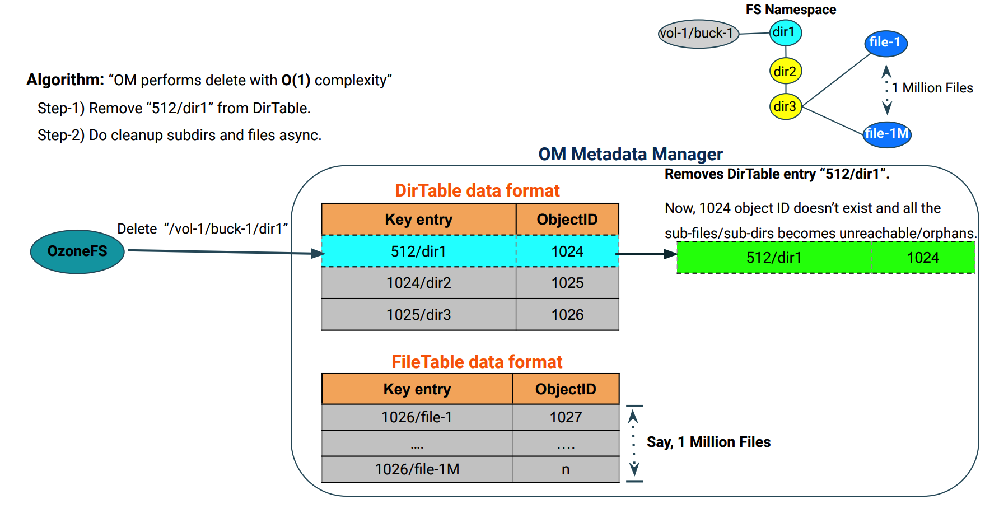
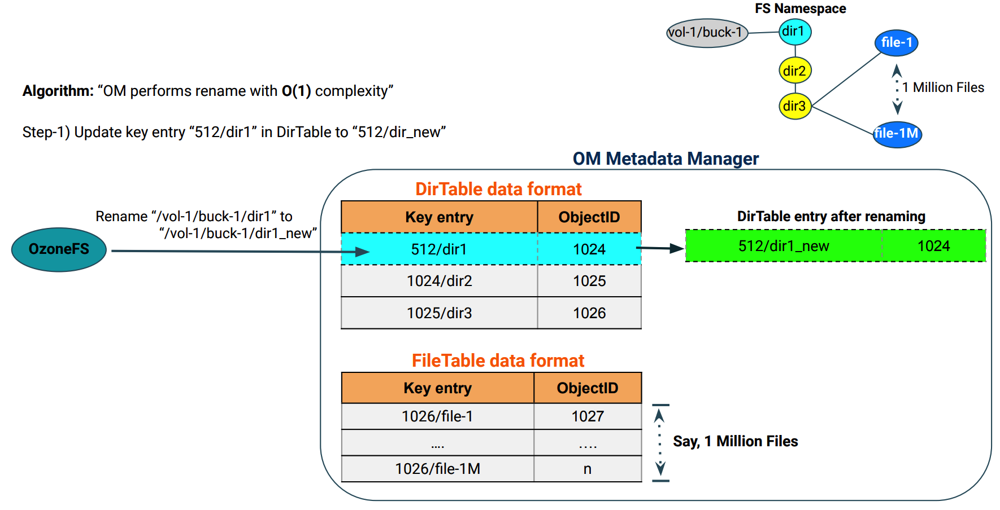

<!---
  Licensed to the Apache Software Foundation (ASF) under one or more
  contributor license agreements.  See the NOTICE file distributed with
  this work for additional information regarding copyright ownership.
  The ASF licenses this file to You under the Apache License, Version 2.0
  (the "License"); you may not use this file except in compliance with
  the License.  You may obtain a copy of the License at

      http://www.apache.org/licenses/LICENSE-2.0

  Unless required by applicable law or agreed to in writing, software
  distributed under the License is distributed on an "AS IS" BASIS,
  WITHOUT WARRANTIES OR CONDITIONS OF ANY KIND, either express or implied.
  See the License for the specific language governing permissions and
  limitations under the License.
-->

The prefix-based File System Optimization feature supports atomic rename and delete of any directory at any level in the
namespace in deterministic/constant time.

This feature can be enabled for each specific bucket that requires it by setting the `--layout` flag
to `FILE_SYSTEM_OPTIMIZED` at the time of bucket creation.

```bash
ozone sh bucket create /<volume-name>/<bucket-name> --layout FILE_SYSTEM_OPTIMIZED
```

Note: File System Optimization favors Hadoop Compatible File System instead of S3 compatibility. Some irregular S3 key
names may be rejected or normalized.

This feature is strongly recommended to be turned ON for Ozone buckets mainly used via Hadoop compatible interfaces,
especially with high number of files in deep directory hierarchy.

## OzoneManager Metadata layout format
OzoneManager supports two metadata bucket layout formats - Object Store (OBS) and File System Optimized (FSO).

Object Store (OBS) is the existing OM metadata format, which stores key entry with full path name. In File System
Optimized (FSO) buckets, OM metadata format stores intermediate directories into `DirectoryTable` and files
into `FileTable` as shown in the below picture. The key to the table is the name of a directory or a file prefixed by
the unique identifier of its parent directory, `<parent unique-id>/<filename>`.


### Directory delete operation with prefix layout: ###
Following picture describes the OM metadata changes while performing a delete
 operation on a directory.



### Directory rename operation with prefix layout: ###
Following picture describes the OM metadata changes while performing a rename
 operation on a directory.



## Configuration

The following configuration can be configured in `ozone-site.xml` to define the default value for bucket layout during bucket creation
if the client has not specified the bucket layout argument.
Supported values are `OBJECT_STORE`, `FILE_SYSTEM_OPTIMIZED` and `LEGACY`.

By default, this config value is empty. Ozone will default to `FILE_SYSTEM_OPTIMIZED` bucket layout if it finds an empty config value.

```XML

<property>
    <name>ozone.default.bucket.layout</name>
    <value/>
</property>
```
