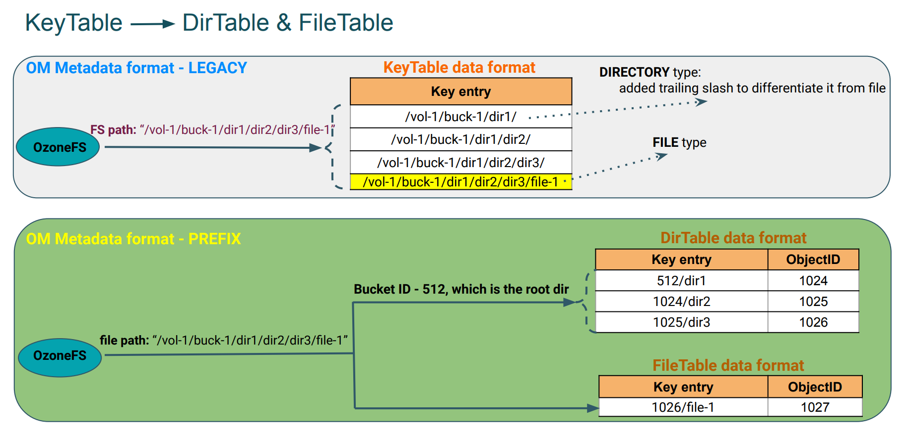

<!---
  Licensed to the Apache Software Foundation (ASF) under one or more
  contributor license agreements.  See the NOTICE file distributed with
  this work for additional information regarding copyright ownership.
  The ASF licenses this file to You under the Apache License, Version 2.0
  (the "License"); you may not use this file except in compliance with
  the License.  You may obtain a copy of the License at

      http://www.apache.org/licenses/LICENSE-2.0

  Unless required by applicable law or agreed to in writing, software
  distributed under the License is distributed on an "AS IS" BASIS,
  WITHOUT WARRANTIES OR CONDITIONS OF ANY KIND, either express or implied.
  See the License for the specific language governing permissions and
  limitations under the License.
-->

The prefix based FileSystem optimization feature supports atomic rename and
 delete of any directory at any level in the namespace. Also, it will perform
  rename and delete of any directory in a deterministic/constant time.

Note: This feature works only when `ozone.om.enable.filesystem.paths` is
 enabled which means that Hadoop Compatible File System compatibility is
  favored instead of S3 compatibility. Some irregular S3 key names may be
   rejected or normalized.

This feature is strongly recommended to be turned ON when Ozone buckets are
 mainly used via Hadoop compatible interfaces, especially with high number of
  files in deep directory hierarchy.

## OzoneManager Metadata layout format
OzoneManager supports two metadata layout formats - simple and prefix.

Simple is the existing OM metadata format, which stores key entry with full path
 name. In Prefix based optimization, OM metadata format stores intermediate
  directories into `DirectoryTable` and files into `FileTable` as shown in the
   below picture. The key to the table is the name of a directory or a file
    prefixed by the unique identifier of its parent directory, `<parent
     unique-id>/<filename>`. 
     



### Directory delete operation with prefix layout: ###
Following picture describes the OM metadata changes while performing a delete
 operation on a directory.


### Directory rename operation with prefix layout: ###
Following picture describes the OM metadata changes while performing a rename
 operation on a directory.


## Configuration
By default the feature is disabled. It can be enabled with the following
 settings in `ozone-site.xml`:

```XML
<property>
   <name>ozone.om.enable.filesystem.paths</name>
   <value>true</value>
</property>
<property>
   <name>ozone.om.metadata.layout</name>
   <value>PREFIX</value>
</property>
```

In reference to efforts towards supporting protocol aware buckets within a
single OM the following configurations can be used to define the default value
for bucket layout during bucket creation if the client (S3 or o3fs) is not
passing the bucket layout argument.

By default, the buckets will default to OBS behaviour.
```XML
<property>
   <name>ozone.default.bucket.layout</name>
   <value>OBS</value>
</property>
```