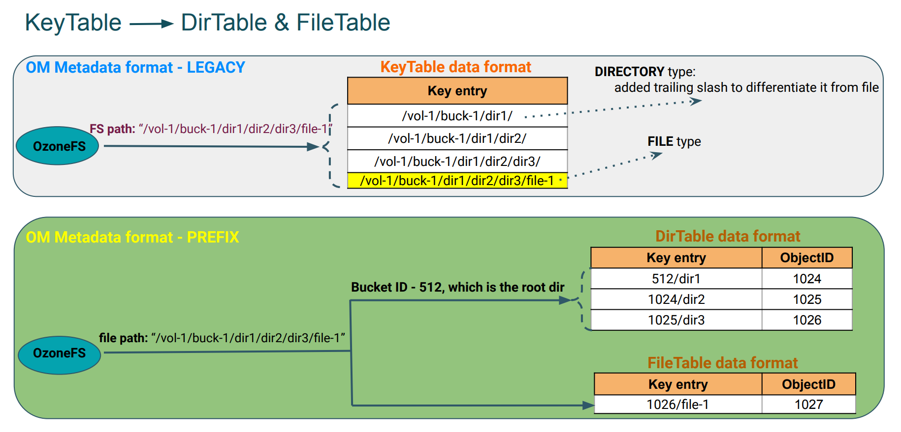
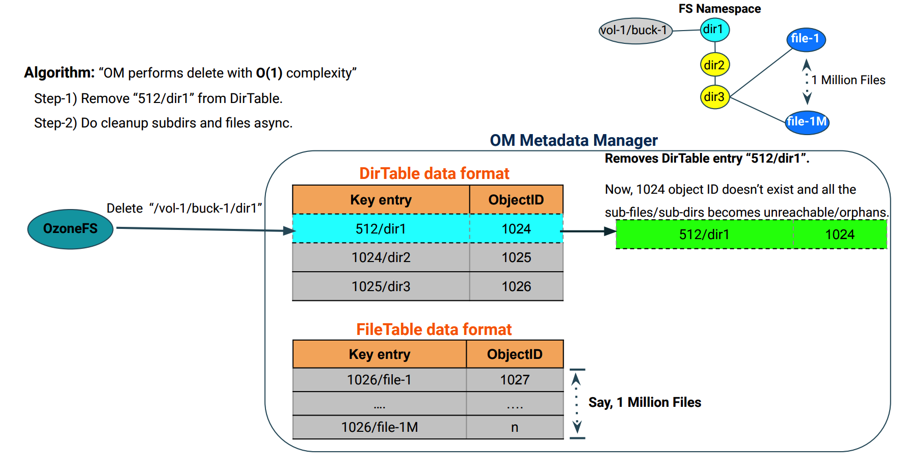
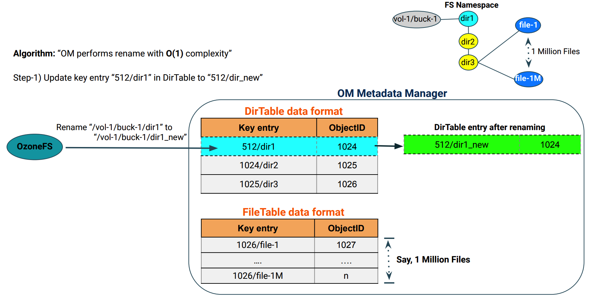

<!---
  Licensed to the Apache Software Foundation (ASF) under one or more
  contributor license agreements.  See the NOTICE file distributed with
  this work for additional information regarding copyright ownership.
  The ASF licenses this file to You under the Apache License, Version 2.0
  (the "License"); you may not use this file except in compliance with
  the License.  You may obtain a copy of the License at

      http://www.apache.org/licenses/LICENSE-2.0

  Unless required by applicable law or agreed to in writing, software
  distributed under the License is distributed on an "AS IS" BASIS,
  WITHOUT WARRANTIES OR CONDITIONS OF ANY KIND, either express or implied.
  See the License for the specific language governing permissions and
  limitations under the License.
-->

基于前缀的文件系统优化特性支持命名空间中任意级别目录的重命名和删除操作，且操作均能在常数时间内完成。

若要启用该特性，需要在创建桶时指定 `--layout` 参数为 `FILE_SYSTEM_OPTIMIZED`.

```bash
ozone sh bucket create /<volume-name>/<bucket-name> --layout FILE_SYSTEM_OPTIMIZED
```

注意：在启用基于前缀的文件系统优化的桶中，对 Hadoop 文件系统的兼容性优先于对 S3 的兼容性，某些不规范的 S3 键名在操作时将会被拒绝或规范化。

当 Ozone 中的桶主要通过兼容 Hadoop 的接口使用，尤其是涉及到较深目录层级下的大量文件时，强烈推荐开启该特性。

## OzoneManager 元数据布局格式
OzoneManager 支持两种元数据布局格式：简单布局格式和基于前缀的布局格式。

在简单布局格式中，OM 采用完整路径名来存储每个键的元数据。在基于前缀的优化布局格式中，OM 将中间目录的元数据存储在 `DirectoryTable` 中，将文件的元数据存储在 `FileTable` 中，如下图所示。两张表中的主键是以父目录唯一标识符为前缀的文件名或目录名， 形如 `<parent unique-id>/<filename>`。
     



### 基于前缀布局的目录删除操作 ###
下图描述了进行目录删除操作时 OM 的元数据变化。



### 基于前缀布局的目录重命名操作 ###
下图描述了进行目录重命名操作时 OM 的元数据变化。



## 配置

可以在 `ozone-site.xml` 中加入以下配置来设定创建桶时，客户端未指定桶样式时的默认的桶样式：
可用的值有 `OBJECT_STORE`, `FILE_SYSTEM_OPTIMIZED` 和 `LEGACY`.

若该配置的值为空，则默认值为 `FILE_SYSTEM_OPTIMIZED`.

```XML

<property>
    <name>ozone.default.bucket.layout</name>
    <value/>
</property>
```
