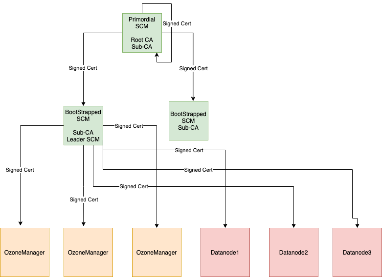

<!---
  Licensed to the Apache Software Foundation (ASF) under one or more
  contributor license agreements.  See the NOTICE file distributed with
  this work for additional information regarding copyright ownership.
  The ASF licenses this file to You under the Apache License, Version 2.0
  (the "License"); you may not use this file except in compliance with
  the License.  You may obtain a copy of the License at

      http://www.apache.org/licenses/LICENSE-2.0

  Unless required by applicable law or agreed to in writing, software
  distributed under the License is distributed on an "AS IS" BASIS,
  WITHOUT WARRANTIES OR CONDITIONS OF ANY KIND, either express or implied.
  See the License for the specific language governing permissions and
  limitations under the License.
-->

Ozone has two metadata-manager nodes (*Ozone Manager* for key space management and *Storage Container Management* for block space management) and multiple storage nodes (Datanode). Data is replicated between Datanodes with the help of RAFT consensus algorithm.

To avoid any single point of failure the metadata-manager nodes also should have a HA setup.

Both Ozone Manager and Storage Container Manager supports HA. In this mode the internal state is replicated via RAFT (with Apache Ratis) 

This document explains the HA setup of Storage Container Manager (SCM), please check [this page]() for HA setup of Ozone Manager (OM). While they can be setup for HA independently, a reliable, full HA setup requires enabling HA for both services. 

## Configuration

One Ozone configuration (`ozone-site.xml`) can support multiple SCM HA node set, multiple Ozone clusters. To select between the available SCM nodes a logical name is required for each of the clusters which can be resolved to the IP addresses (and domain names) of the Storage Container Managers.

This logical name is called `serviceId` and can be configured in the `ozone-site.xml`

Most of the time you need to set only the values of your current cluster:

 ```xml
<property>
   <name>ozone.scm.service.ids</name>
   <value>cluster1</value>
</property>
```

For each of the defined `serviceId` a logical configuration name should be defined for each of the servers

```xml
<property>
   <name>ozone.scm.nodes.cluster1</name>
   <value>scm1,scm2,scm3</value>
</property>
```

The defined prefixes can be used to define the address of each of the SCM services:

```xml
<property>
   <name>ozone.scm.address.cluster1.scm1</name>
   <value>host1</value>
</property>
<property>
   <name>ozone.scm.address.cluster1.scm2</name>
   <value>host2</value>
</property>
<property>
   <name>ozone.scm.address.cluster1.scm3</name>
   <value>host3</value>
</property>
```

For reliable HA support choose 3 independent nodes to form a quorum. 

## Bootstrap

The initialization of the **first** SCM-HA node is the same as a non-HA SCM:

```
ozone scm --init
```

Second and third nodes should be *bootstrapped* instead of init. These clusters will join to the configured RAFT quorum. The id of the current server is identified by DNS name or can be set explicitly by `ozone.scm.node.id`. Most of the time you don't need to set it as DNS based id detection can work well.

```
ozone scm --bootstrap
```

Note: both commands perform one-time initialization.  SCM still needs to be started by running `ozone --daemon start scm`.

## SCM Leader Transfer

The `ozone admin scm transfer` command allows you to manually transfer the leadership of the Storage Container Manager (SCM) Raft group to a specific SCM node or to a randomly chosen follower.

Be aware of the node's status(eg. Safemode, Operational status), ozone currently has no ability to check the target node's status before transfering the leadership.

### Usage

```bash
ozone admin scm transfer -id <SCM_SERVICE_ID> -n <NEW_LEADER_ID>
ozone admin scm transfer -id <SCM_SERVICE_ID> -r
```

*   `-id, --service-id`: Specifies the SCM Service ID.
*   `-n, --newLeaderId, --new-leader-id`: The SCM UUID (Raft peer ID) of the SCM to which leadership will be transferred (e.g., `e6877ce5-56cd-4f0b-ad60-4c8ef9000882`).
*   `-r, --random`: Randomly chooses a follower to transfer leadership to.

### Example

To transfer leadership to a specific SCM in a cluster with service ID `cluster1`:

```bash
ozone admin scm transfer -id cluster1 -n e6877ce5-56cd-4f0b-ad60-4c8ef9000882
```

To transfer leadership to a random follower:

```bash
ozone admin scm transfer -id cluster1 -r
```

## SCM Service Roles Listing

The `ozone admin scm roles` command lists all Storage Container Managers and their respective Raft server roles (leader, follower, or candidate).

### Usage

```bash
ozone admin scm roles [--json | --table]
```

*   `--json`: (Optional) Formats the output as JSON.
*   `--table`: (Optional) Formats the output as a table.

### Example

To list SCM roles:

```bash
ozone admin scm roles
```

Example output:

```
host1:9876:LEADER:e6877ce5-56cd-4f0b-ad60-4c8ef9000882:192.168.1.1
host2:9876:FOLLOWER:f2ba1c28-486a-4192-9a5f-b3752fe27d6b:192.168.1.2
host3:9876:FOLLOWER:9c8d2b3a-e4f5-6789-0123-456789abcdef:192.168.1.3
```

To list SCM roles as a table:

```bash
ozone admin scm roles --table
```

Example table output:

```
Storage Container Manager Roles
------------------------------------------------------------------------------------
Host Name | Ratis Port | Role     | Node ID                                  | Host Address
------------------------------------------------------------------------------------
host1     | 9876       | LEADER   | e6877ce5-56cd-4f0b-ad60-4c8ef9000882     | 192.168.1.1
host2     | 9876       | FOLLOWER | f2ba1c28-486a-4192-9a5f-b3752fe27d6b     | 192.168.1.2
host3     | 9876       | FOLLOWER | 9c8d2b3a-e4f5-6789-0123-456789abcdef     | 192.168.1.3
------------------------------------------------------------------------------------
```

## Auto-bootstrap

In some environments (e.g. Kubernetes) we need to have a common, unified way to initialize SCM HA quorum. As a reminder, the standard initialization flow is the following:

 1. On the first, "primordial" node: `ozone scm --init`
 2. On second/third nodes: `ozone scm --bootstrap`

This can be improved: primordial SCM can be configured by setting `ozone.scm.primordial.node.id` in the config to one of the nodes.

```xml
<property>
   <name>ozone.scm.primordial.node.id</name>
   <value>scm1</value>
</property>
```

With this configuration both `scm --init` and `scm --bootstrap` can be safely executed on **all** SCM nodes.  Each node will only perform the action applicable to it based on the `ozone.scm.primordial.node.id` and its own node ID.

Note: SCM still needs to be started after the init/bootstrap process.

```
ozone scm --init
ozone scm --bootstrap
ozone --daemon start scm
```

For Docker/Kubernetes, use `ozone scm` to start it in the foreground.

## SCM HA Security



In a secure SCM HA cluster on the SCM where we perform init, we call this SCM as a primordial SCM. 
Primordial SCM starts root-CA with self-signed certificates and is used to issue a signed certificate 
to itself and other bootstrapped SCM’s. Only primordial SCM can issue signed certificates for other SCM’s.
So, primordial SCM has a special role in the SCM HA cluster, as it is the only one that can issue certificates to SCM’s.

The primordial SCM takes a root-CA role, which signs all SCM instances with a sub-CA certificate. 
The sub-CA certificates are used by SCM to sign certificates for OM/Datanodes.

When bootstrapping a SCM, it gets a signed certificate from the primary SCM and starts sub-CA.

Sub-CA on the SCM’s are used to issue signed certificates for OM/DN in the cluster. Only the leader SCM issues a certificate to OM/DN.

### How to enable security:

```xml
<property>
<name>ozone.security.enable</name>
<value>true</value>
</property>

<property>
<name>hdds.grpc.tls.enabled</name>
<value>true</value>
</property>
```

Above configs are needed in addition to normal SCM HA configuration.

### Primordial SCM:

Primordial SCM is determined from the config ozone.scm.primordial.node.id. 
The value for this can be node id or hostname of the SCM. If the config is 
not defined, the node where init is run is considered as the primordial SCM.


bin/ozone scm --init


This will set up a public,private key pair and self-signed certificate for root CA 
and also generate public, private key pair and CSR to get a signed certificate for sub-CA from root CA.


### Bootstrap SCM:


bin/ozone scm --bootstrap


This will set up a public, private key pair for sub CA and generate CSR to get a 
signed certificate for sub-CA from root CA.

**Note**: Make sure to run **--init** only on one of the SCM host if 
primordial SCM is not defined. Bring up other SCM's using **--bootstrap**. 

### Current SCM HA Security limitation:
* Unsecure HA cluster upgrade to secure HA cluster is not supported.


## Implementation details

SCM HA uses Apache Ratis to replicate state between the members of the SCM HA quorum. Each node maintains the block management metadata in local RocksDB.

This replication process is a simpler version of OM HA replication process as it doesn't use any double buffer (as the overall db thourghput of SCM requests are lower)

Datanodes are sending all the reports (Container reports, Pipeline reports...) to *all* SCM nodes in parallel. Only the leader node can assign/create new containers, and only the leader node sends commands back to the Datanodes.

## Verify SCM HA setup

After starting an SCM-HA it can be validated if the SCM nodes are forming one single quorum instead of 3 individual SCM nodes.

First, check if all the SCM nodes store the same ClusterId metadata:

```bash
cat /data/metadata/scm/current/VERSION
```

ClusterId is included in the VERSION file and should be the same in all the SCM nodes:

```bash
#Tue Mar 16 10:19:33 UTC 2021
cTime=1615889973116
clusterID=CID-130fb246-1717-4313-9b62-9ddfe1bcb2e7
nodeType=SCM
scmUuid=e6877ce5-56cd-4f0b-ad60-4c8ef9000882
layoutVersion=0
```

You can also create data and double check with `ozone debug` tool if all the container metadata is replicated.

```shell
bin/ozone freon randomkeys --numOfVolumes=1 --numOfBuckets=1 --numOfKeys=10000 --keySize=524288 --replicationType=RATIS --numOfThreads=8 --factor=THREE --bufferSize=1048576


# use debug ldb to check scm.db on all the machines
bin/ozone debug ldb --db=/tmp/metadata/scm.db ls


bin/ozone debug ldb --db=/tmp/metadata/scm.db scan --column-family=containers
```

## Migrating from Non-HA to HA SCM

Add additional SCM nodes and extend the cluster configuration to reflect the newly added nodes. 
Bootstrap the newly added SCM nodes with `scm --bootstrap` command and start the SCM service.
Note: Make sure that the `ozone.scm.primordial.node.id` property is pointed to the existing SCM before you run the `bootstrap` command on the newly added SCM nodes.
