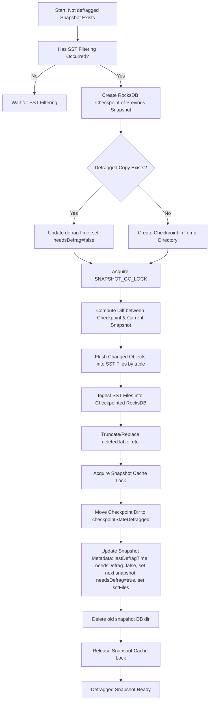
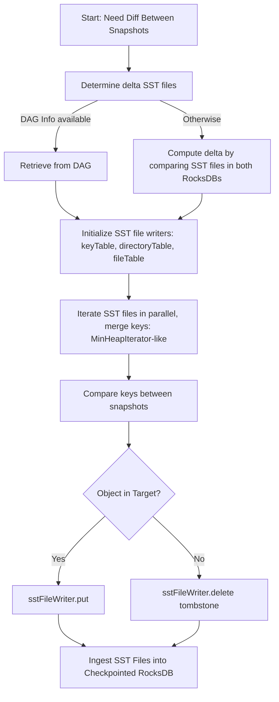
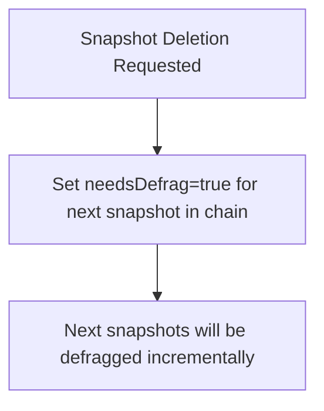

<!---
  Licensed to the Apache Software Foundation (ASF) under one or more
  contributor license agreements.  See the NOTICE file distributed with
  this work for additional information regarding copyright ownership.
  The ASF licenses this file to You under the Apache License, Version 2.0
  (the "License"); you may not use this file except in compliance with
  the License.  You may obtain a copy of the License at

      http://www.apache.org/licenses/LICENSE-2.0

  Unless required by applicable law or agreed to in writing, software
  distributed under the License is distributed on an "AS IS" BASIS,
  WITHOUT WARRANTIES OR CONDITIONS OF ANY KIND, either express or implied.
  See the License for the specific language governing permissions and
  limitations under the License.
-->
# Improving Snapshot Scale

[HDDS-13003](https://issues.apache.org/jira/browse/HDDS-13003)

# Problem Statement

In Apache Ozone, snapshots currently take a checkpoint of the Active Object Store (AOS) RocksDB each time a snapshot is created and track the compaction of SST files over time. This model works efficiently when snapshots are short-lived, as they merely serve as hard links to the AOS RocksDB. However, over time, if an older snapshot persists while significant churn occurs in the AOS RocksDB (due to compactions and writes), the snapshot RocksDB may diverge significantly from both the AOS RocksDB and other snapshot RocksDB instances. This divergence increases storage requirements linearly with the number of snapshots.

# Solution Proposal

The primary inefficiency in the current snapshot mechanism stems from constant RocksDB compactions in AOS, which can cause a key, file, or directory entry to appear in multiple SST files. Ideally, each unique key, file, or directory entry should reside in only one SST file, eliminating redundant storage and mitigating the multiplier effect caused by snapshots. If implemented correctly, the total RocksDB size would be proportional to the total number of unique keys in the system rather than the number of snapshots.

## Snapshot Defragmentation

Currently, snapshot RocksDBs has automatic RocksDB compaction disabled intentionally to preserve snapshot diff performance, preventing any form of compaction. However, snapshots can be defragmented in the way that the next active snapshot in the chain is a checkpoint of its previous active snapshot plus a diff stored in separate SST files (one SST for each column family changed). The proposed approach involves rewriting snapshots iteratively from the beginning of the snapshot chain and restructuring them in a separate directory.

Note: Snapshot Defragmentation was previously called Snapshot Compaction earlier during the design phase. It is not RocksDB compaction. Thus the rename to avoid such confusion. We are also not going to enable RocksDB auto compaction on snapshot RocksDBs.

1. ### Introducing last defragmentation time

   A new boolean flag (`needsDefrag`), timestamp (`lastDefragTime`), int `version` would be added to snapshot metadata.
   `needsDefrag` tells the system whether a snapshot is pending defrag (`true`) or if it is already defragged and up to date (`false`). This helps manage and automate the defrag workflow, ensuring snapshots are efficiently stored and maintained. `needsDefrag` defaults to `false` during initialization and when absent.
   A new list of Map\<String, List\<Longs\>\> (`notDefraggedSstFileList`) also would be added to snapshot meta as part of snapshot create operation; this would be storing the original list of SST files in the not defragged copy of the snapshot corresponding to keyTable/fileTable/DirectoryTable. This should be done as part of the snapshot create operation.
   Since this is not going to be consistent across all OMs this would have to be written to a local yaml file inside the snapshot directory and this can be maintained in the SnapshotChainManager in memory on startup. So all updates should not go through Ratis.  
   An additional Map\<Integer, Map\<String, List\<Long\>\>\> (`defraggedSstFileList`) also would be added to snapshotMeta. This will be maintaining a list of sstFiles of different versions of defragged snapshots. The key here would be the version number of snapshot DBs.

2. ### Snapshot Cache Lock for Read Prevention

   A snapshot lock will be introduced in the snapshot cache to prevent reads on a specific snapshot during the last step of defragmentation. This ensures no active reads occur while we are replacing the underlying RocksDB instance. The swap should be instantaneous.

3. ### Directory Structure Changes

   Snapshots currently reside under `db.snapshots/checkpointState/` directory. The proposal introduces a `db.snapshots/checkpointStateDefragged/` directory for defragged snapshots. The directory format should be as follows:

| om.db-\<snapshot\_id\>-\<version\> |
| :---- |

4. ### Optimized Snapshot Diff Computation

To compute a snapshot diff:

* If both snapshots are defragged, their defragged versions will be used. The diff between two defragged snapshot should be present in one SST file.
* If the target snapshot is not defragged & the source snapshot is defragged (other way is not possible as we always defrag snapshots in order) and if the DAG has all the sst files corresponding to the not defragged snapshot version of the defragged snapshot which would be captured as part of the snapshot metadata, then an efficient diff can be performed with the information present in the DAG. Use `notDefraggedSstFileList` from each of the snapshot's meta  
* Otherwise, a full diff will be computed between the defragged source and the defragged target snapshot. Delta SST files would be computed corresponding to the latest version number of the target snapshot(version number of target snapshot would always be greater)
* Changes in the full diff logic is required to check inode ids of sst files and remove the common sst files b/w source and target snapshots.

5. ### Snapshot Defragmentation Workflow

   A background snapshot defragmentation service should be added which would be done by iterating through the snapshot chain in the same order as the global snapshot chain. This is to ensure the snapshot created after is always defragged after all the snapshots previously created are defragged. Snapshot defragmentation should only occur once the snapshot has undergone SST filtering. The following steps outline the process:  
1. **Create a RocksDB checkpoint** of the path previous snapshot corresponding to the bucket in the chain (if it exists). `version` of previous snapshot should be strictly greater than the current snapshot’s `version` otherwise skip compacting this snapshot in this iteration.
2. **Acquire the `SNAPSHOT_GC_LOCK`** for the snapshot ID to prevent garbage collection during defragmentation\[This is to keep contents of deleted Table contents same while defragmentation consistent\].  
   1. If there is no path previous snapshot then  
      1.  Take a checkpoint of the same RocksDB instance remove keys that don’t correspond to the bucket from tables `keyTable`, `fileTable`, `directoryTable,deletedTable,deletedDirectoryTable` by running RocksDB delete range api. This should be done if the snapshot has never been defragged before i.e. if `lastDefragTime` is zero or null. Otherwise just update the `needsDefrag` to False.  
      2. We can trigger a forced manual compaction on the RocksDB instance(i & ii can be behind a flag where in we can just work with the checkpoint of the RocksDB if the flag is disabled).  
   2. If path previous snapshot exists:  
      1. **Compute the diff** between tables (`keyTable`, `fileTable`, `directoryTable`) of the checkpoint and the current snapshot using snapshot diff functionality.  
      2. **Flush changed objects** into separate SST files using the SST file writer, categorizing them by table type.  
      3. **Ingest these SST files** into the RocksDB checkpoint using the `ingestFile` API.  
3. Check if the entire current snapshot has been flushed to disk otherwise wait for the flush to happen.  
4. Truncate `deletedTable,deletedDirectoryTable,snapshotRenamedTable etc. (All tables excepting keyTable/fileTable/directoryTable)` in checkpointed RocksDB and ingest the entire table from deletedTable and deletedDirectoryTable from the current snapshot RocksDB.  
5. **Acquire the snapshot cache lock** to prevent snapshot access during directory updates.\[While performing the snapshot RocksDB directory switch there should be no RocksDB handle with read happening on it\].  
6. **Move the checkpoint directory** into `checkpointStateDefragged` with the format:

| om.db-\<snapshot\_id\>-\<version\> |
| :---- |

7. **Update snapshot metadata**, setting `lastDefragTime` and marking `needsDefrag = false` and set the next snapshot in the chain is marked for defragmentation. If there is no path previous snapshot in the chain then increase `version`  by 1 otherwise set `version` which is equal to the previous snapshot in the chain. Based on the sstFiles in the RocksDB compute Map\<String, List\<Long\>\> and add this Map to `defraggedSstFileList` corresponding to the `version` of the snapshot.  
8. **Delete old not defragged/defragged snapshots**, ensuring unreferenced not defragged/defragged snapshots are purged during OM startup(This is to handle jvm crash after viii).  
9. **Release the snapshot cache lock** on the snapshot id. Now the snapshot is ready to be used to read.

#### Visualization

### Computing Changed Objects Between Snapshots

   The following steps outline how to compute changed objects:  
1. **Determine delta SST files**:  
   * Retrieve from DAG if the snapshot was not defragged previously and the previous snapshot has an not defragged copy.  
   * Otherwise, compute delta SST files by comparing SST files in both defragged RocksDBs.  
2. **Initialize SST file writers** for `keyTable`, `directoryTable`, and `fileTable`.  
3. **Iterate SST files in parallel**, reading and merging keys to maintain sorted order.(Similar to the MinHeapIterator instead of iterating through multiple tables we would be iterating through multiple sst files concurrently).  
4. **Compare keys** between snapshots to determine changes and write updated objects if and only if they have changed into the SST file.  
   * If the object is present in the target snapshot then do an sstFileWriter.put().  
     * If the object is present in source snapshot but not present in target snapshot then we just have to write a tombstone entry by calling sstFileWriter.delete().  
5. **Ingest these SST files** into the checkpointed RocksDB.

#### Visualization

### Handling Snapshot Purge

   Upon snapshot deletion, the `needsDefrag` flag for the next snapshot in the chain is set to `true`, ensuring defragmentation propagates incrementally across the snapshot chain.

#### Visualization

# Conclusion

This approach effectively reduces storage overhead while maintaining efficient snapshot retrieval and diff computation. The total storage would be in the order of total number of keys in the snapshots \+ AOS by reducing overall redundancy of the objects while also making the snapshot diff computation for even older snapshots more computationally efficient.
