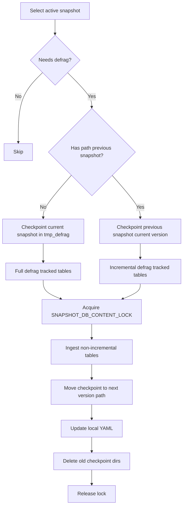
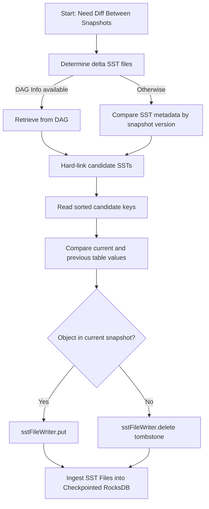
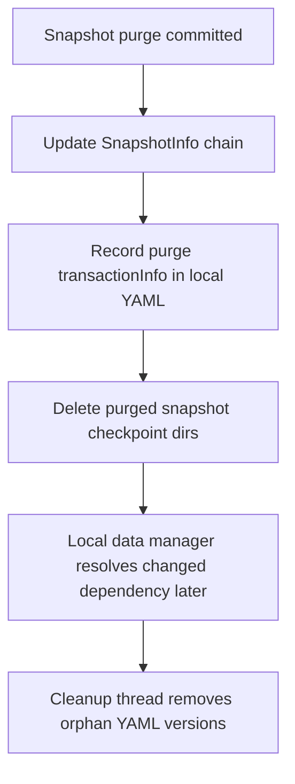

<!---
  Licensed to the Apache Software Foundation (ASF) under one or more
  contributor license agreements.  See the NOTICE file distributed with
  this work for additional information regarding copyright ownership.
  The ASF licenses this file to You under the Apache License, Version 2.0
  (the "License"); you may not use this file except in compliance with
  the License.  You may obtain a copy of the License at

      http://www.apache.org/licenses/LICENSE-2.0

  Unless required by applicable law or agreed to in writing, software
  distributed under the License is distributed on an "AS IS" BASIS,
  WITHOUT WARRANTIES OR CONDITIONS OF ANY KIND, either express or implied.
  See the License for the specific language governing permissions and
  limitations under the License.
-->
# Improving Snapshot Scale

[HDDS-13003](https://issues.apache.org/jira/browse/HDDS-13003)

# Problem Statement

In Apache Ozone, snapshots currently take a checkpoint of the Active Object Store (AOS) RocksDB each time a snapshot is created and track the compaction of SST files over time. This model works efficiently when snapshots are short-lived, as they merely serve as hard links to the AOS RocksDB. However, over time, if an older snapshot persists while significant churn occurs in the AOS RocksDB (due to compactions and writes), the snapshot RocksDB may diverge significantly from both the AOS RocksDB and other snapshot RocksDB instances. This divergence increases storage requirements linearly with the number of snapshots.

# Solution Proposal

The primary inefficiency in the current snapshot mechanism stems from constant RocksDB compactions in AOS, which can cause a key, file, or directory entry to appear in multiple SST files. Ideally, each unique key, file, or directory entry should reside in only one SST file, eliminating redundant storage and mitigating the multiplier effect caused by snapshots. If implemented correctly, the total RocksDB size would be proportional to the total number of unique keys in the system rather than the number of snapshots.

## Snapshot Defragmentation

Currently, snapshot RocksDBs has automatic RocksDB compaction disabled intentionally to preserve snapshot diff performance, preventing any form of compaction. However, snapshots can be defragmented in the way that the next active snapshot in the chain is a checkpoint of its previous active snapshot plus a diff stored in separate SST files (one SST for each column family changed). The proposed approach involves rewriting snapshots iteratively from the beginning of the snapshot chain and restructuring them in a separate directory.

Note: Snapshot Defragmentation was previously called Snapshot Compaction earlier during the design phase. It is not RocksDB compaction. Thus the rename to avoid such confusion. We are also not going to enable RocksDB auto compaction on snapshot RocksDBs.

1. ### Snapshot local YAML metadata

   The implemented metadata is stored in local `OmSnapshotLocalData` YAML files,
   not in Ratis-replicated `SnapshotInfo`. The YAML is created on every snapshot
   creation even when the periodic defrag service is disabled.

   The important YAML fields are `snapshotId`, `previousSnapshotId`, `version`,
   `needsDefrag`, `versionSstFileInfos`, `dbTxSequenceNumber`,
   `transactionInfo`, `lastDefragTime`, `checksum`, and `isSSTFiltered`.
   `lastDefragTime` records the local wall-clock time when a new defragged
   snapshot version is committed. Current defrag decisions are still based on
   `version`, `needsDefrag`, and `versionSstFileInfos`.

   The earlier proposal's `notDefraggedSstFileList` and `defraggedSstFileList`
   became `versionSstFileInfos`, a map from local snapshot version to
   `VersionMeta`. Each `VersionMeta` records the previous snapshot version it
   depends on and the tracked SST files for `keyTable`, `fileTable`, and
   `directoryTable`.

2. ### Snapshot Cache Lock for Read Prevention

   The implemented lock path uses `SNAPSHOT_DB_CONTENT_LOCK` to prevent
   concurrent snapshot content changes while defrag reloads non-incremental
   tables and switches the current version. Older checkpoint directory deletion
   also acquires the snapshot DB cache write lock so stale cached handles cannot
   write to an old version while it is being removed.

3. ### Directory Structure Changes

   Snapshots reside under the OM metadata directory in
   `db.snapshots/checkpointState/`. The implementation does not use a separate
   `checkpointStateDefragged` directory. Defragged versions are sibling
   directories next to the original checkpoint:

| Directory | Meaning |
| :---- | :---- |
| `om.db-<snapshot_id>` | Version `0`, the original checkpoint. |
| `om.db-<snapshot_id>-<version>` | Defragged version, where `version > 0`. |

   On a typical OM with metadata under `/var/lib/ozone/om`, these directories
   live under `/var/lib/ozone/om/db.snapshots/checkpointState/`. Older version
   directories are deleted locally after a successful version switch once there
   are no open cached handles for that snapshot DB. The YAML sidecar is stored
   next to the version `0` directory as `om.db-<snapshot_id>.yaml`.

4. ### Optimized Snapshot Diff Computation

To compute a snapshot diff:

* The snapshot diff API and report generation flow are unchanged. `SnapshotDiffManager`
  still opens the current local snapshot DB versions through `OmSnapshotManager`,
  asks `CompositeDeltaDiffComputer` for candidate SSTs, reads candidate keys,
  and builds the object ID maps used for the final report.
* Before defrag, the target snapshot is version `0`, which is the original OM DB
  checkpoint. `RDBDifferComputer` can use `RocksDBCheckpointDiffer` and the
  active DB compaction DAG to identify changed SSTs. If the DAG cannot provide a
  complete answer, `CompositeDeltaDiffComputer` falls back to `FullDiffComputer`.
* After defrag, the target snapshot's current version is greater than `0` and
  is a rewritten checkpoint, not an active DB compaction output. The differ
  resolves the source snapshot dependency through `OmSnapshotLocalDataManager`,
  passes the YAML `versionSstFileInfos` version map into
  `RocksDBCheckpointDiffer`, and compares SST metadata for the relevant
  versions instead of using the compaction-DAG walk.
* `FullDiffComputer` compares relevant SST files by inode when inode metadata is
  available, and falls back to a full file-list comparison when inode comparison
  fails. `--forceFullDiff` still bypasses the DAG path.

5. ### Snapshot Defragmentation Workflow

   `SnapshotDefragService` iterates the global snapshot chain in forward order
   and processes active snapshots only. A snapshot is selected when its local
   `needsDefrag` flag is true or when its current version depends on an older
   version of the resolved path previous snapshot.

1. **Acquire the bootstrap read lock** and load `SnapshotInfo` plus local YAML.
2. **Create a temporary checkpoint** in `tmp_defrag`.
   * If this is the first snapshot in the bucket path chain, checkpoint the
     current snapshot.
   * Otherwise, checkpoint the current version of the path previous snapshot.
3. **Drop non-incremental column families** from the temporary checkpoint. They
   are reloaded from the current snapshot later.
4. **Defrag tracked tables** (`keyTable`, `fileTable`, `directoryTable`).
   * For the first snapshot in the path chain, perform full defrag by deleting
     ranges outside the bucket prefix and compacting the tracked tables.
   * For later snapshots, compute incremental delta SSTs, write changed records
     or tombstones into temporary SST files, and ingest those files.
5. **Acquire `SNAPSHOT_DB_CONTENT_LOCK`** for the current snapshot. Snapshot
   reads and deep-clean writes follow the same DAG-based lock hierarchy.
6. **Reload non-incremental tables** from the current snapshot into the
   checkpoint.
7. **Move the checkpoint directory** to
   `db.snapshots/checkpointState/om.db-<snapshot_id>-<next_version>`.
8. **Update local YAML**, incrementing `version`, adding the new
   `versionSstFileInfos` entry, and clearing `needsDefrag`.
9. **Delete older checkpoint directories** for the same snapshot under
   `SNAPSHOT_DB_CONTENT_LOCK` and the snapshot DB cache write lock. Older YAML
   version metadata is removed later by `OmSnapshotLocalDataManagerService`
   only when no local version depends on it.
10. **Release `SNAPSHOT_DB_CONTENT_LOCK`**.

#### Visualization

```mermaid
flowchart TD
    A[Select active snapshot] --> B{Needs defrag?}
    B -- No --> Z[Skip]
    B -- Yes --> C{Has path previous snapshot?}
    C -- No --> D[Checkpoint current snapshot in tmp_defrag]
    C -- Yes --> E[Checkpoint previous snapshot current version]
    D --> F[Full defrag tracked tables]
    E --> G[Incremental defrag tracked tables]
    F --> H[Acquire SNAPSHOT_DB_CONTENT_LOCK]
    G --> H
    H --> I[Ingest non-incremental tables]
    I --> J[Move checkpoint to next version path]
    J --> K[Update local YAML]
    K --> L[Delete old checkpoint dirs]
    L --> M[Release lock]
```

### Computing Changed Objects Between Snapshots

   The following steps outline how changed objects are computed from candidate
   SSTs:
1. **Determine delta SST files**:
   * Use the compaction DAG when the target snapshot is still version `0` and
     the DAG can produce a complete answer.
   * Otherwise, compare the relevant SST metadata for the resolved snapshot
     versions, with inode-based pruning when available.
2. **Materialize delta SSTs as hard links** under the temporary delta directory
   so the source SST content remains stable while it is being read.
3. **Read candidate keys** with `SstFileSetReader`, including tombstones through
   the raw SST reader when native RocksDB tools are available.
4. **Compare keys** between the current and previous snapshot tables with
   `TableMergeIterator`. Because candidate keys are sorted, the iterator walks
   RocksDB table iterators with seeks instead of issuing a point lookup for
   every key.
5. **Write only changed records** to temporary SST files.
   * If the object exists in the current snapshot, write it with
     `sstFileWriter.put()`.
   * If it exists in the previous snapshot but not in the current snapshot,
     write a tombstone with `sstFileWriter.delete()`.
6. **Ingest these SST files** into the checkpointed RocksDB.

#### Visualization

```mermaid
flowchart TD
    A[Start: Need Diff Between Snapshots] --> B[Determine delta SST files]
    B -- DAG Info available --> C[Retrieve from DAG]
    B -- Otherwise --> D[Compare SST metadata by snapshot version]
    C --> E[Hard-link candidate SSTs]
    D --> E
    E --> F[Read sorted candidate keys]
    F --> G[Compare current and previous table values]
    G --> H{Object in current snapshot?}
    H -- Yes --> I[sstFileWriter.put]
    H -- No --> J[sstFileWriter.delete tombstone]
    I --> K[Ingest SST Files into Checkpointed RocksDB]
    J --> K
```

### Handling Snapshot Purge

   Snapshot purge updates the snapshot chain in `SnapshotInfo`, records purge
   `transactionInfo` in the purged snapshot's local YAML, invalidates the
   snapshot cache entry, and deletes the purged snapshot's checkpoint
   directories. The purge path does not directly write `needsDefrag = true` into
   the next snapshot's YAML because defrag state is local to each OM. Instead,
   `OmSnapshotLocalDataManager` resolves the updated path previous snapshot
   later; if the dependency changes or references an older previous-snapshot
   version, the snapshot is reported as needing defrag.

   `OmSnapshotLocalDataManagerService` runs as a single-threaded cleanup thread.
   It removes orphan version metadata only when no local version depends on it,
   and deletes a purged snapshot's YAML only after the purge transaction has
   flushed to the OM DB and no versions remain.

#### Visualization

```mermaid
flowchart TD
    A[Snapshot purge committed] --> B[Update SnapshotInfo chain]
    B --> C[Record purge transactionInfo in local YAML]
    C --> D[Delete purged snapshot checkpoint dirs]
    D --> E[Local data manager resolves changed dependency later]
    E --> F[Cleanup thread removes orphan YAML versions]
```

# Conclusion

This approach effectively reduces storage overhead while maintaining efficient snapshot retrieval and diff computation. The total storage would be in the order of total number of keys in the snapshots \+ AOS by reducing overall redundancy of the objects while also making the snapshot diff computation for even older snapshots more computationally efficient.
