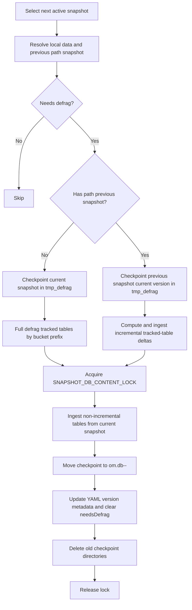

<!---
  Licensed to the Apache Software Foundation (ASF) under one or more
  contributor license agreements.  See the NOTICE file distributed with
  this work for additional information regarding copyright ownership.
  The ASF licenses this file to You under the Apache License, Version 2.0
  (the "License"); you may not use this file except in compliance with
  the License.  You may obtain a copy of the License at

      http://www.apache.org/licenses/LICENSE-2.0

  Unless required by applicable law or agreed to in writing, software
  distributed under the License is distributed on an "AS IS" BASIS,
  WITHOUT WARRANTIES OR CONDITIONS OF ANY KIND, either express or implied.
  See the License for the specific language governing permissions and
  limitations under the License.
-->
# Improving Snapshot Scale

[HDDS-13003](https://issues.apache.org/jira/browse/HDDS-13003)

## Problem Statement

An Ozone snapshot is created as a RocksDB checkpoint of the active OM DB. A
new snapshot is cheap because its SST files are hard links to the active DB SST
files. Over time, active DB compactions rewrite SST files. Older snapshot
directories continue to pin their original SST files while newer snapshots pin
newer versions of the same metadata. With many long-lived snapshots and high
metadata churn, the disk usage under the snapshot checkpoint directory can grow
roughly with the number of snapshots rather than with the number of live unique
keys.

Snapshot defragmentation rewrites each snapshot into a versioned checkpoint
that contains only the data needed for that snapshot. It uses the previous
snapshot in the same bucket path chain plus the changed SST/key ranges for the
current snapshot, so the newest defragmented copy does not keep a full,
independent copy of every historical SST file.

Snapshot defragmentation was previously called snapshot compaction during the
design phase. It is not RocksDB automatic compaction of snapshot DBs. Snapshot
DB automatic compaction remains disabled because the snapshot diff path relies
on stable SST metadata.

## Current Implementation

The implementation is centered on these classes:

* `SnapshotDefragService`: background and on-demand service that rewrites
  snapshot checkpoint directories.
* `OmSnapshotLocalData` and `OmSnapshotLocalDataYaml`: local per-OM metadata
  persisted in YAML sidecar files.
* `OmSnapshotLocalDataManager`: loads YAML files, maintains the in-memory
  dependency graph for `(snapshotId, version)` nodes, resolves previous
  snapshot versions, and removes orphaned version metadata.
* `CompositeDeltaDiffComputer`, `RDBDifferComputer`, and `FullDiffComputer`:
  compute the SST files that may contain differences between two snapshots.
* `OmSnapshotManager`: opens the current snapshot version and deletes old
  checkpoint directories after a version switch.

The defrag service is local to each OM. The rewritten checkpoint directories
and YAML files are not Ratis-replicated state. In an HA deployment, each OM has
its own local snapshot DB directories and must defragment its own copies. The
admin command can target any OM node.

## On-Disk Layout

The active OM DB lives under the OM metadata directory selected by
`ozone.om.db.dirs`. If that property is not set, OM falls back to
`ozone.metadata.dirs`.

For an OM metadata directory `<om-meta-dir>`, snapshot checkpoint directories
live under:

```text
<om-meta-dir>/db.snapshots/checkpointState/
```

The current implementation does not place defragmented DBs under a separate
`checkpointStateDefragged` directory. The original and defragmented versions
are sibling directories in `checkpointState`:

```text
<om-meta-dir>/db.snapshots/checkpointState/om.db-<snapshot_uuid>
<om-meta-dir>/db.snapshots/checkpointState/om.db-<snapshot_uuid>-<version>
```

Version `0` is the original, non-defragmented checkpoint and has no version
suffix. Versions greater than `0` are produced by snapshot defragmentation. For
example:

```text
/var/lib/ozone/om/db.snapshots/checkpointState/om.db-3d0a...9f62
/var/lib/ozone/om/db.snapshots/checkpointState/om.db-3d0a...9f62-1
/var/lib/ozone/om/db.snapshots/checkpointState/om.db-3d0a...9f62-2
```

Each snapshot also has one local YAML sidecar next to the version `0`
directory:

```text
<om-meta-dir>/db.snapshots/checkpointState/om.db-3d0a...9f62.yaml
```

Temporary work is created under:

```text
<om-meta-dir>/db.snapshots/checkpointState/tmp_defrag/
<om-meta-dir>/db.snapshots/checkpointState/tmp_defrag/differSstFiles/
```

`SnapshotDefragService` deletes and recreates `tmp_defrag` on service startup
and deletes it on shutdown.

When an OM DB checkpoint is served to another OM, the checkpoint code uses the
current version from the local YAML metadata and includes that snapshot DB
directory.

## Local Snapshot Metadata

Snapshot defrag metadata is stored in `OmSnapshotLocalData` YAML, not in
`SnapshotInfo` and not in the Ratis log. Important fields are:

| Field | Meaning |
| :---- | :------ |
| `snapshotId` | Snapshot UUID. Must match the checkpoint directory name. |
| `previousSnapshotId` | The previous snapshot in the same bucket path chain that this local data is resolved against. |
| `version` | Current version to open. `0` means the original checkpoint; `> 0` means a defragmented version. |
| `needsDefrag` | Explicit local flag that forces the service to defragment the snapshot. |
| `versionSstFileInfos` | Map from snapshot version to `VersionMeta`. This replaces the earlier split between `notDefraggedSstFileList` and `defraggedSstFileList`. |
| `VersionMeta.previousSnapshotVersion` | The version of `previousSnapshotId` that this version depends on. |
| `VersionMeta.sstFiles` | SST file metadata for `keyTable`, `directoryTable`, and `fileTable`. |
| `dbTxSequenceNumber` | Largest RocksDB sequence number observed in tracked SST files when the original snapshot YAML is created. Used by the checkpoint differ. |
| `transactionInfo` | Purge transaction marker used to remove local metadata only after the purge has flushed to disk. |
| `lastDefragTime` | Serialized by the YAML class, but current defrag decisions are based on `version`, `needsDefrag`, and `versionSstFileInfos`. |

On snapshot creation, OM creates the YAML file and captures the live SST file
metadata for `keyTable`, `directoryTable`, and `fileTable` as version `0`.
New and migrated snapshots are committed with `needsDefrag = true`. When a
new defragmented version is added, the current version is incremented, the new
version's SST list is captured from RocksDB, and `needsDefrag` is cleared.

`OmSnapshotLocalDataManager` keeps an in-memory graph of local version
dependencies. Each node is a `(snapshotId, version)` pair and points to the
`(previousSnapshotId, previousSnapshotVersion)` it depends on. The graph is
rebuilt from YAML at OM startup. It is used to:

* reject deletion of a version that is still referenced by another snapshot
  version;
* resolve a snapshot's previous-version dependency when the path chain changes
  after purge;
* identify orphaned versions and YAML files that can be removed after purge.

## Service Configuration

Snapshot defragmentation is disabled by default.

| Property | Default | Meaning |
| :------- | :------ | :------ |
| `ozone.snapshot.defrag.service.interval` | `-1` | Background interval. A value `<= 0` disables the service. |
| `ozone.snapshot.defrag.limit.per.task` | `1` | Maximum number of snapshots defragmented in one service run. |
| `ozone.snapshot.defrag.service.timeout` | `300s` | Timeout for one service run. |

The service is gated by the `SNAPSHOT_DEFRAG` OM layout feature. It also
requires the Rocks tools native library; if the library is unavailable, an
on-demand run returns without defragmenting snapshots.

If defrag is enabled, `KeyManagerImpl` does not start `SstFilteringService`,
even when the SST filtering interval is configured. Defrag already filters the
tracked snapshot tables by bucket prefix while building the rewritten
checkpoint. If defrag is disabled and SST filtering is enabled, the older SST
filtering service still removes irrelevant SST files from version `0`
snapshots and writes the `sstFiltered` marker file.

Manual defrag is exposed through:

```bash
ozone admin om snapshot defrag --service-id=<om-service-id> --node-id=<om-node-id>
ozone admin om snapshot defrag --service-id=<om-service-id> --node-id=<om-node-id> --no-wait
```

The command requires the defrag service to be initialized on the target OM.
Any OM in an HA service can run it because the rewritten snapshot DB state is
local to that OM.

## Defragmentation Workflow

`SnapshotDefragService` iterates the global snapshot chain in forward order and
processes active snapshots only. For each snapshot, it resolves the path
previous snapshot in the same bucket. Incremental defrag is based on the path
chain, not merely the global creation order.

The service decides that a snapshot needs defrag when either:

* the local `needsDefrag` flag is true; or
* the snapshot's current version depends on an older version of its resolved
  previous snapshot than the previous snapshot's current version.

The second condition is what propagates defrag after a previous snapshot is
rewritten or when snapshot purge changes the path chain.

The main workflow is:

1. Acquire the bootstrap read lock and load `SnapshotInfo` plus local YAML.
2. Create a temporary checkpoint in `tmp_defrag`.
   * If this is the first snapshot in the path chain, checkpoint the current
     snapshot.
   * Otherwise, checkpoint the current version of the path previous snapshot.
3. Drop non-incremental column families from the temporary checkpoint. They are
   reloaded from the current snapshot later.
4. For the first snapshot in the path chain, do a full defrag of `keyTable`,
   `directoryTable`, and `fileTable`:
   * delete ranges outside the bucket prefix;
   * compact each tracked table with forced bottommost-level compaction so the
     range tombstones are removed from the rewritten checkpoint.
5. For later snapshots, do incremental defrag of the same tracked tables:
   * compute delta SST files between the path previous snapshot and the current
     snapshot;
   * group deltas by column family;
   * read candidate keys from the delta SST files, merge them with the previous
     and current snapshot tables, and write only changed keys or tombstones into
     a temporary SST file;
   * ingest the resulting SST file into the temporary checkpoint.
6. Acquire a write `SNAPSHOT_DB_CONTENT_LOCK` for the current snapshot. This is
   the lock that prevents concurrent snapshot content changes while the service
   reloads non-incremental tables and switches versions. Snapshot reads and
   deep-clean writes use `SNAPSHOT_DB_LOCK` or read `SNAPSHOT_DB_CONTENT_LOCK`
   in the same lock hierarchy.
7. Dump and ingest non-incremental tables from the current snapshot into the
   checkpoint. The tracked tables (`keyTable`, `directoryTable`, `fileTable`)
   are skipped because they were already rebuilt.
8. Close the temporary checkpoint metadata manager and move the checkpoint
   directory to the next version path:

   ```text
   <om-meta-dir>/db.snapshots/checkpointState/om.db-<snapshot_uuid>-<next_version>
   ```

9. Open the new version, add its live SST metadata to
   `versionSstFileInfos`, update `version`, and clear `needsDefrag`.
10. Delete older checkpoint directories for that snapshot after acquiring the
    snapshot DB cache write lock. The YAML version metadata may remain longer
    than the directories when another snapshot version still references it.
    `OmSnapshotLocalDataManager` removes orphaned version metadata later.
11. Release `SNAPSHOT_DB_CONTENT_LOCK`.


```mermaid
flowchart TD
    A["Select next active snapshot"] --> B["Resolve local data and previous path snapshot"]
    B --> C{"Needs defrag?"}
    C -- "No" --> Z["Skip"]
    C -- "Yes" --> D{"Has path previous snapshot?"}
    D -- "No" --> E["Checkpoint current snapshot in tmp_defrag"]
    D -- "Yes" --> F["Checkpoint previous snapshot current version in tmp_defrag"]
    E --> G["Full defrag tracked tables by bucket prefix"]
    F --> H["Compute and ingest incremental tracked-table deltas"]
    G --> I["Acquire SNAPSHOT_DB_CONTENT_LOCK"]
    H --> I
    I --> J["Ingest non-incremental tables from current snapshot"]
    J --> K["Move checkpoint to om.db-<snapshot_id>-<next_version>"]
    K --> L["Update YAML version metadata and clear needsDefrag"]
    L --> M["Delete old checkpoint directories"]
    M --> N["Release lock"]
```

## Delta Computation

Defrag uses only the column families tracked by the checkpoint differ:
`keyTable`, `directoryTable`, and `fileTable`.

`CompositeDeltaDiffComputer` first tries `RDBDifferComputer`. The differ uses
the local `versionSstFileInfos` metadata and the active DB compaction DAG. When
the current snapshot version is `0`, the DAG path can be used to find the SST
files that changed since the previous snapshot. For versions greater than `0`,
the differ falls back to comparing SST file metadata by version because
defragmented versions are already rewritten snapshot DBs rather than raw active
DB checkpoints.

If the DAG-based differ cannot produce a complete answer, the code falls back
to `FullDiffComputer`. The full differ compares relevant SST files by inode
when inode metadata is available, and falls back to comparing full file lists
when inode comparison fails.

The delta files identify candidate SSTs, not final row-level changes. The
defrag service still reads keys from those files, compares current and previous
snapshot table values, writes only changed records or tombstones to a new SST
file, and ingests that file into the checkpoint. If there is exactly one delta
file for a table and the current snapshot version is already greater than `0`,
the service can ingest that delta file directly.

## Snapshot Reads

Snapshot reads go through `OmSnapshotManager` and `SnapshotCache`. The cache
loader reads the snapshot's current version from `OmSnapshotLocalDataManager`
and opens:

```text
<om-meta-dir>/db.snapshots/checkpointState/om.db-<snapshot_uuid>[-<version>]
```

The read path does not scan for the highest directory suffix on disk. The YAML
current version is the source of truth: moving a new checkpoint directory is
not visible to readers until the YAML current version is committed.

## Snapshot Purge and Orphan Cleanup

Snapshot delete first marks `SnapshotInfo` as `SNAPSHOT_DELETED`. Later,
`SnapshotDeletingService` submits an internal purge request. Purge updates the
next snapshots' path/global previous IDs in `SnapshotInfo`, removes the purged
snapshot from the chain, records purge `transactionInfo` in the purged
snapshot's local YAML, invalidates the snapshot cache entry, and deletes the
purged snapshot's checkpoint directories.

The purge path does not directly write `needsDefrag = true` into the next
snapshot's YAML. Instead, the next time local data for that snapshot is opened
for defrag, `OmSnapshotLocalDataManager` resolves the updated
`pathPreviousSnapshotId`. If that changes the dependency or if the referenced
previous snapshot version is stale, the provider marks or reports the snapshot
as needing defrag.

Old version metadata and YAML files are cleaned separately from checkpoint
directories. The local data manager periodically checks whether version nodes
have no dependents and whether purge transactions have flushed to disk. Only
then can it remove orphaned version entries or delete the YAML file for a
purged snapshot.

## Expected Effect

After a full pass, each active snapshot's current version is a compact,
bucket-scoped checkpoint that reuses the previous path snapshot plus the
snapshot's own changes. This reduces duplicate SST retention for long snapshot
chains while keeping snapshot reads and snapshot-diff computation based on
ordinary RocksDB checkpoints and SST metadata.
