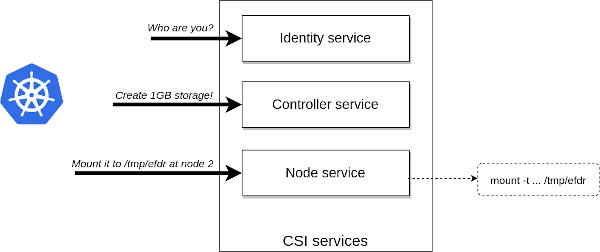

<!---
  Licensed to the Apache Software Foundation (ASF) under one or more
  contributor license agreements.  See the NOTICE file distributed with
  this work for additional information regarding copyright ownership.
  The ASF licenses this file to You under the Apache License, Version 2.0
  (the "License"); you may not use this file except in compliance with
  the License.  You may obtain a copy of the License at

      http://www.apache.org/licenses/LICENSE-2.0

  Unless required by applicable law or agreed to in writing, software
  distributed under the License is distributed on an "AS IS" BASIS,
  WITHOUT WARRANTIES OR CONDITIONS OF ANY KIND, either express or implied.
  See the License for the specific language governing permissions and
  limitations under the License.
-->

<div class="alert alert-warning" role="alert">

Ozone CSI support is still in alpha phase and buckets can be mounted only via 3rd party S3 compatible Fuse implementation (like Goofys). Fuse over S3 can provide only limited performance compared to a native Fuse file system. Long-term Ozone may support a custom solution to mount buckets which provides better user experience (with fuse or NFS or any other solution). Until that CSI is recommended to use only if you can live with this limitation and your use case is tested carefully.
</div>

`Container Storage Interface` (CSI) will enable storage vendors (SP) to develop a plugin once and have it work across a number of container orchestration (CO) systems like Kubernetes or Yarn.

To get more information about CSI at [SCI spec](https://github.com/container-storage-interface/spec/blob/master/spec.md)

CSI defined a simple GRPC interface with 3 interfaces (Identity, Controller, Node). It defined how the Container Orchestrator can request the creation of a new storage space or the mount of the newly created storage but doesn't define how the storage can be mounted.



By default Ozone CSI service uses a S3 fuse driver ([goofys](https://github.com/kahing/goofys)) to mount the created Ozone bucket. Implementation of other mounting options such as a dedicated NFS server or native Fuse driver is work in progress.


Ozone CSI is an implementation of CSI, it can make possible of using Ozone as a storage volume for a container. 

## Getting started

First of all, we need an Ozone cluster with s3gateway, and its OM rpc port and s3gateway port must be visible to CSI pod,
because CSIServer will access OM to create or delete a bucket, also, CSIServer will publish volume by creating a mount point to s3g
through goofys. 

If you don't have an Ozone cluster on kubernetes, you can reference [Kubernetes]() to create one. Use the resources from `kubernetes/examples/ozone` where you can find all the required Kubernetes resources to run cluster together with the dedicated Ozone CSI daemon (check `kubernetes/examples/ozone/csi`)   

Now, create the CSI related resources by execute the follow command.

```bash
kubectl create -f /ozone/kubernetes/examples/ozone/csi
```

## Create pv-test and visit the result.

Create pv-test related resources by execute the follow command.

```bash
kubectl create -f /ozone/kubernetes/examples/ozone/pv-test
```

Attach the pod scm-0 and put a key into the /s3v/pvc* bucket.

```bash
kubectl exec -it  scm-0  bash
[hadoop@scm-0 ~]$ ozone sh bucket list s3v
[ {
  "metadata" : { },
  "volumeName" : "s3v",
  "name" : "pvc-861e2d8b-2232-4cd1-b43c-c0c26697ab6b",
  "storageType" : "DISK",
  "versioning" : false,
  "creationTime" : "2020-06-11T08:19:47.469Z",
  "encryptionKeyName" : null
} ]
[hadoop@scm-0 ~]$ ozone sh key put /s3v/pvc-861e2d8b-2232-4cd1-b43c-c0c26697ab6b/A LICENSE.txt
```

Now, let's forward port of the `ozone-csi-test-webserver-7cbdc5d65c-h5mnn` to see the UI through the web browser.

```bash
kubectl port-forward ozone-csi-test-webserver-7cbdc5d65c-h5mnn 8000:8000
```

Eventually, we can see the result from `http://localhost:8000/`


