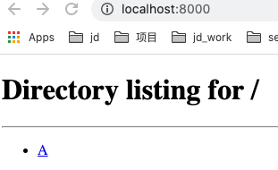

<!---
  Licensed to the Apache Software Foundation (ASF) under one or more
  contributor license agreements.  See the NOTICE file distributed with
  this work for additional information regarding copyright ownership.
  The ASF licenses this file to You under the Apache License, Version 2.0
  (the "License"); you may not use this file except in compliance with
  the License.  You may obtain a copy of the License at

      http://www.apache.org/licenses/LICENSE-2.0

  Unless required by applicable law or agreed to in writing, software
  distributed under the License is distributed on an "AS IS" BASIS,
  WITHOUT WARRANTIES OR CONDITIONS OF ANY KIND, either express or implied.
  See the License for the specific language governing permissions and
  limitations under the License.
-->

容器存储接口 `Container Storage Interface` (CSI) 使存储供应商（SP）能够一次性开发一个插件，并让它跨多个容器编排工作。

获取更多 CSI 的信息，可以参考[SCI spec](https://github.com/container-storage-interface/spec/blob/master/spec.md)

Ozone CSI 是 CSI 的一种实现，它可以将 Ozone 用作容器的存储卷。 

## 入门

首先，我们需要一个带有 S3Gateway 的 Ozone 集群，并且它的 OM 和 S3Gateway 的端口都可以对 CSI pod 可见，
因为 CSIServer 将会访问 OM 来创建或者删除篮子，并且，CSIServer 将会通过 goofys 创建到 s3g 的挂载点的方式来发布桶。 

如果你没有一个运行在 kubernetes 上的 Ozone 集群，你可以参考[Kubernetes]() 来创建一个。
使用来自 `kubernetes/examples/ozone`的资源，你可以找到所有需要的kubernetes资源来和指定的CSI运行在一起
(参考 `kubernetes/examples/ozone/csi`)   

现在，使用如下命令，创建 CSI 相关的资源。

```bash
kubectl create -f /ozone/kubernetes/examples/ozone/csi
```

## 创建 pv-test 并查看结果

通过执行以下命令，创建 pv-test 相关的资源。

```bash
kubectl create -f /ozone/kubernetes/examples/ozone/pv-test
```

连接 pod scm-0 并且 创建一个键到桶 /s3v/pvc* 。

```bash
kubectl exec -it  scm-0  bash
[hadoop@scm-0 ~]$ ozone sh bucket list s3v
{
  "metadata" : { },
  "volumeName" : "s3v",
  "name" : "pvc-861e2d8b-2232-4cd1-b43c-c0c26697ab6b",
  "storageType" : "DISK",
  "versioning" : false,
  "creationTime" : "2020-06-11T08:19:47.469Z",
  "encryptionKeyName" : null
}
[hadoop@scm-0 ~]$ ozone sh key put /s3v/pvc-861e2d8b-2232-4cd1-b43c-c0c26697ab6b/A LICENSE.txt
```

现在，通过映射 `ozone-csi-test-webserver-7cbdc5d65c-h5mnn` 的端口来通过浏览器看到 web 页面.

```bash
kubectl port-forward ozone-csi-test-webserver-7cbdc5d65c-h5mnn 8000:8000
```

最终，我们可以通过 `http://localhost:8000/` 看到结果


