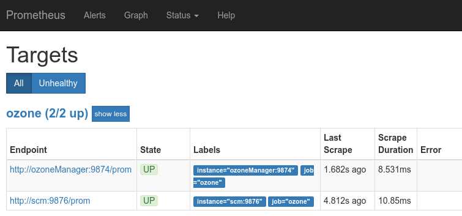
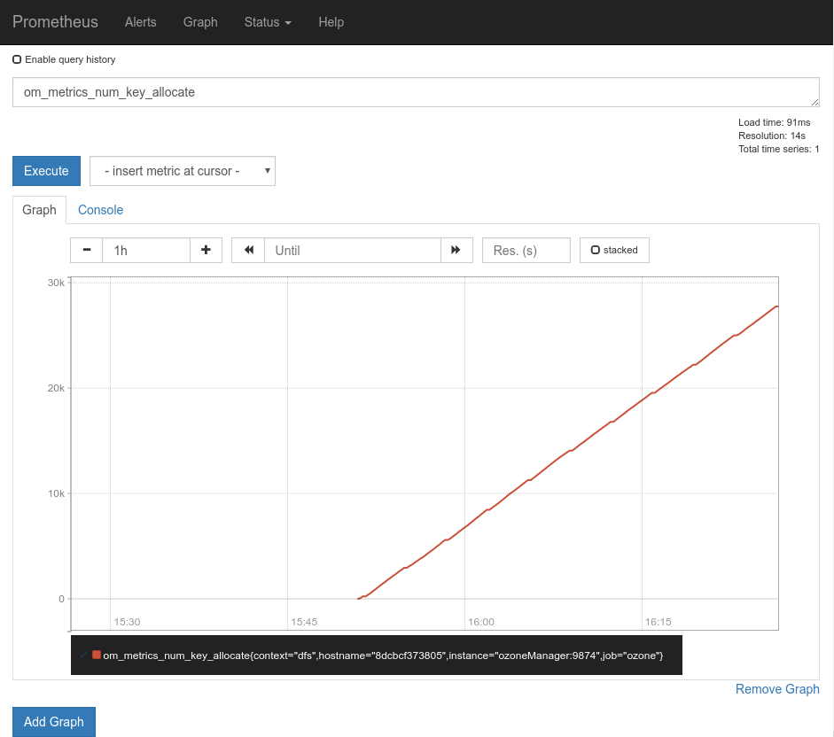

<!---
  Licensed to the Apache Software Foundation (ASF) under one or more
  contributor license agreements.  See the NOTICE file distributed with
  this work for additional information regarding copyright ownership.
  The ASF licenses this file to You under the Apache License, Version 2.0
  (the "License"); you may not use this file except in compliance with
  the License.  You may obtain a copy of the License at

      http://www.apache.org/licenses/LICENSE-2.0

  Unless required by applicable law or agreed to in writing, software
  distributed under the License is distributed on an "AS IS" BASIS,
  WITHOUT WARRANTIES OR CONDITIONS OF ANY KIND, either express or implied.
  See the License for the specific language governing permissions and
  limitations under the License.
-->

[Prometheus](https://prometheus.io/)是在[云原生计算基金会](https://www.cncf.io/)管理下开发的一款开源监控软件。

Ozone 原生支持 Prometheus，各个组件会启动一个兼容 Prometheus 的指标端点，将所有可用的 hadoop 指标以 Prometheus 的格式导出发布。

## 准备

 1. [安装启动]()一个 Ozone 集群。
 2. [下载](https://prometheus.io/download/#prometheus) Prometheus 二进制包。

## 使用 Prometheus 进行监控

* 你需要在 `ozone-site.xml` 文件中添加配置才可以启用 Prometheus 指标端点。

 ```xml
  <property>
    <name>hdds.prometheus.endpoint.enabled</name>
    <value>true</value>
  </property>
```

_注意_: 对于基于 docker-compose 方式的伪集群，在 `docker-config` 文件中添加 `OZONE-SITE.XML_hdds.prometheus.endpoint.enabled=true`。

* 重启 OM 和 SCM，检查端点：

 * http://scm:9876/prom

 * http://ozoneManager:9874/prom

* 根据这两个端点，创建 prometheus.yaml 配置文件：

```yaml
global:
  scrape_interval: 15s

scrape_configs:
  - job_name: ozone
    metrics_path: /prom
    static_configs:
     - targets:
        - "scm:9876"
        - "ozoneManager:9874"
```

* 在 prometheus.yaml 文件所在目录启动 Prometheus：

```bash
prometheus
```

* 在 Prometheus 的 web ui 中查看目标：

http://localhost:9090/targets




* 在 Prometheus web ui 中查看任意的指标，例如：
For example:

http://localhost:9090/graph?g0.range_input=1h&g0.expr=om_metrics_num_key_allocate&g0.tab=1



## 注意事项

Ozone 发行包中包含了一个即开即用的容器化环境来试用 Ozone 和 Prometheus，在 `compose/ozone` 目录下。

```bash
cd compose/ozone
export COMPOSE_FILE=docker-compose.yaml:monitoring.yaml
docker-compose up -d
```
