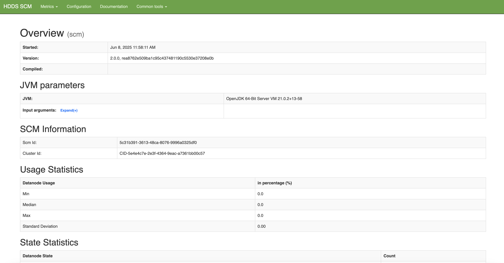
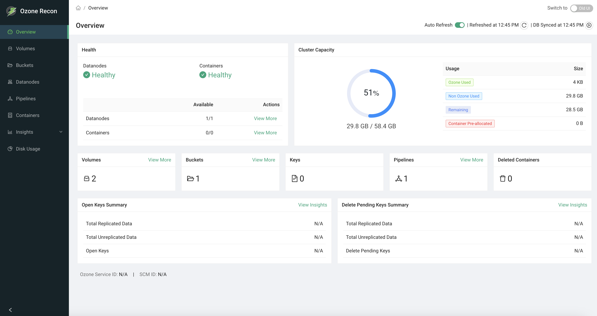

<!---
  Licensed to the Apache Software Foundation (ASF) under one or more
  contributor license agreements.  See the NOTICE file distributed with
  this work for additional information regarding copyright ownership.
  The ASF licenses this file to You under the Apache License, Version 2.0
  (the "License"); you may not use this file except in compliance with
  the License.  You may obtain a copy of the License at

      http://www.apache.org/licenses/LICENSE-2.0

  Unless required by applicable law or agreed to in writing, software
  distributed under the License is distributed on an "AS IS" BASIS,
  WITHOUT WARRANTIES OR CONDITIONS OF ANY KIND, either express or implied.
  See the License for the specific language governing permissions and
  limitations under the License.
-->


 * Working docker setup
 * AWS CLI (optional)


# Local multi-container cluster

## Obtain the Docker Compose Configuration
First, obtain Ozone's sample Docker Compose configuration:

```bash
# Download the latest Docker Compose configuration file
curl -O https://raw.githubusercontent.com/apache/ozone-docker/refs/heads/latest/docker-compose.yaml
```

## Start the Cluster
Start your Ozone cluster with three Datanodes using the following command:

```bash
docker compose up -d --scale datanode=3
```

This command will:

- Automatically pull required images from Docker Hub
- Create a multi-node cluster with the core Ozone services
- Start all components in detached mode

## Verify the Deployment
Check the status of your Ozone cluster components:

```bash
docker compose ps
```

You should see output similar to this:

```
docker-datanode-1   apache/ozone:2.0.0   "/usr/local/bin/dumb…"   datanode   14 seconds ago   Up 13 seconds   0.0.0.0:32958->9864/tcp, :::32958->9864/tcp
docker-datanode-2   apache/ozone:2.0.0   "/usr/local/bin/dumb…"   datanode   14 seconds ago   Up 13 seconds   0.0.0.0:32957->9864/tcp, :::32957->9864/tcp
docker-datanode-3   apache/ozone:2.0.0   "/usr/local/bin/dumb…"   datanode   14 seconds ago   Up 12 seconds   0.0.0.0:32959->9864/tcp, :::32959->9864/tcp
docker-om-1         apache/ozone:2.0.0   "/usr/local/bin/dumb…"   om         14 seconds ago   Up 13 seconds   0.0.0.0:9874->9874/tcp, :::9874->9874/tcp
docker-recon-1      apache/ozone:2.0.0   "/usr/local/bin/dumb…"   recon      14 seconds ago   Up 13 seconds   0.0.0.0:9888->9888/tcp, :::9888->9888/tcp
docker-s3g-1        apache/ozone:2.0.0   "/usr/local/bin/dumb…"   s3g        14 seconds ago   Up 13 seconds   0.0.0.0:9878->9878/tcp, :::9878->9878/tcp
docker-scm-1        apache/ozone:2.0.0   "/usr/local/bin/dumb…"   scm        14 seconds ago   Up 13 seconds   0.0.0.0:9876->9876/tcp, :::9876->9876/tcp
```
## Check the Ozone version

```bash
docker compose exec om ozone version
```

Once the cluster is booted up and ready, you can verify its status by
connecting to the SCM's UI at [http://localhost:9876](http://localhost:9876).



Navigate to the Recon server home page. The Ozone Recon server is at [http://localhost:9888](http://localhost:9888), which provides monitoring and management capabilities.



## Other Commonly Used Commands

- **View logs from the OM:**
  ```bash
  docker compose logs om
  ```
- **Stop and remove all containers:**
  ```bash
  docker compose down
  ```

## Configuration
You can customize your Ozone deployment by modifying the configuration parameters in the `docker-compose.yaml` file:

- **Common Configurations:** Located under the `x-common-config` section
- **Service-Specific Settings:** Found under the `environment` section of individual services

As an example, to update the port on which Recon listens to, append the following configuration:

```yaml
x-common-config:
  ...
  OZONE-SITE.XML_ozone.recon.http-address: 0.0.0.0:9090
```

**Note:** If you change the port Recon listens on (e.g., 9090), you must also update the ports mapping in the recon service definition within the docker-compose.yaml file. For example, change:
```yaml
ports:
  - "9888:9888"
```
to:
```yaml
ports:
  - "9090:9090"
```
# Running S3 Clients

The S3 gateway endpoint will be exposed at port 9878. You can use Ozone's S3
support as if you are working against the real S3.  S3 buckets are stored under
the `/s3v` volume.

First, let's configure AWS access key and secret key. Because the cluster is not secured,
you can use any arbitrary access key and secret key. For example:

```bash
export AWS_ACCESS_KEY_ID=testuser/scm@EXAMPLE.COM
export AWS_SECRET_ACCESS_KEY=c261b6ecabf7d37d5f9ded654b1c724adac9bd9f13e247a235e567e8296d2999
```

Here is how you create buckets from command line:

```bash
aws s3api --endpoint http://localhost:9878/ create-bucket --bucket=bucket1
```

Only notable difference in the above command line is the fact that you have
to tell the _endpoint_ address to the aws s3api command.

Now let us put a simple file into the S3 Bucket hosted by Ozone. We will
start by creating a temporary file that we can upload to Ozone via S3 support.
```bash
ls -1 > /tmp/testfile
```
This command creates a temporary file that
we can upload to Ozone. The next command actually uploads to Ozone's S3
bucket using the standard aws s3 command line interface.

```bash
aws s3 --endpoint http://localhost:9878 cp --storage-class REDUCED_REDUNDANCY  /tmp/testfile  s3://bucket1/testfile
```
<div class="alert alert-info" role="alert">
Note: Add --storage-class REDUCED_REDUNDANCY if only one DataNode is started.
Since this example starts three DataNodes, this parameter is optional.
</div>
We can now verify that file got uploaded by running the list command against
our bucket.

```bash
aws s3 --endpoint http://localhost:9878 ls s3://bucket1/testfile
```

For more information on using the S3 protocol with Ozone, S3 developers may be interested in the following pages:
* [S3 Protocol](../interface/S3.md)
* [Securing S3](../security/SecuringS3.md)
* [Access Ozone using Boto3 (Docker Quickstart)](../recipe/Boto3Tutorial.md)
