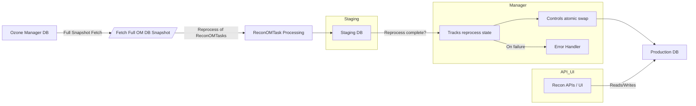
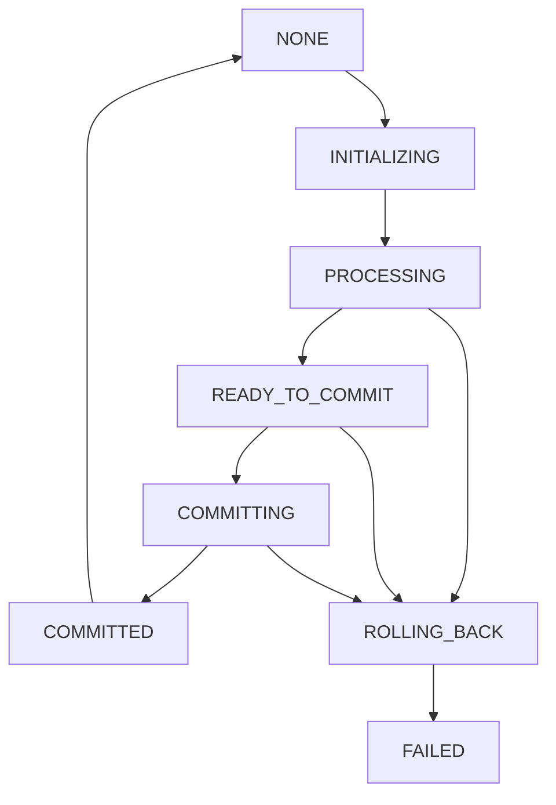

# HDDS-13515: Staged Reprocessing for Recon Task Data During Full Snapshot Recovery

## Document Information
- **JIRA**: HDDS-13515
- **Component**: Apache Ozone - Recon
- **Type**: Design Document
- **Author**: [Devesh Singh]
- **Date**: [Current Date]
- **Status**: Draft

---

## 1. Executive Summary

### Problem Statement
Currently, when Recon falls back to full snapshot recovery (due to SequenceNumberNotFoundException (OM DB Compaction) or any other error thrown by OM), all underlying downstream ReconOmTasks truncates their existing processed data tables before rebuilding from the new snapshot. This causes some Recon APIs to return empty/blank data during the reprocessing period affecting the visualization of OM metadata, creating a poor user experience in the Recon UI until respective tasks complete their full snapshot re-processing.

### Proposed Solution
Implement a **Staged Reprocessing Architecture** that leverages the existing staging pattern (similar to TarExtractor) to maintain data availability during full snapshot recovery. The solution involves:

1. **Staging Database Creation**: Create staging instance of Recon rocksDB where ReconOmTask data tables will be processed without impacting production rocksDB tables.
2. **Parallel Reprocessing**: Process full snapshot data into staging tables while production tables remain accessible
3. **Atomic Switchover**: Atomically replace production tables with staging tables once all respective concurrently running tasks complete successfully. 
4. **Rollback Capability**: Provide a rollback mechanism in case of reprocessing failures
5. **Enhanced Monitoring**: Introduce metrics and health checks to monitor staging operations

### Benefits
- **Zero Downtime**: Recon APIs remain functional even during full snapshot recovery and bootstrapping.
- **Data Consistency**: Atomic switchover ensures a consistent view across all task data, because once all the tasks complete their reprocessing and success, then the staging tables are switched to production tables, else failure of one task which is related, may provide data inconsistency. E.g. OmTableInsightTask (Number of keys, Number of buckets etc) and NSSummary tree. This is how the current architecture works as well.
- **Failure Resilience**: Rollback capability ensures system stability during failures
- **Performance Isolation**: Reprocessing load doesn't impact API query performance
- **Minimal Disk Usage**: Staging tables can be cleaned up after successful switch, minimizing disk usage. Full OM DB tar ball is already stored in the Recon OM DB, so no need to store it again in the staging area.

---

## 2. Current Architecture Analysis

### 2.1 Current Sync Flow


> **Figure:** Full‐snapshot fallback path: OM DB delta error → fetch full snapshot → concurrently trigger tasks (`OmTableInsightTask`, `NSSummaryTask`, `ContainerKeyMapperTask`, `FileSizeCountTask`) → each task clears its Recon metadata tables → API reads from those cleared tables (empty) → **User Experience Impacted**


### 2.2 Current ReconOmTask Data Management

#### Task Data Tables Overview
| Task Class | Data Tables | Storage Type | Clear Method | Impact on APIs |
|------------|-------------|--------------|--------------|----------------|
| **NSSummaryTask** | `nsSummaryTable` | RocksDB | `clearNSSummaryTable()` | Namespace browsing, path construction |
| **OmTableInsightTask** | `GlobalStats` (SQL) | SQL | Reinitialize maps | Table statistics, counts |
| **FileSizeCountTaskFSO/OBS** | `FILE_COUNT_BY_SIZE` (SQL) | SQL | `delete().execute()` | File size distribution charts |
| **ContainerKeyMapperTask** | `CONTAINER_KEY`, `KEY_CONTAINER`, `CONTAINER_KEY_COUNT` | RocksDB | `reinitWithNewContainerDataFromOm()` | Container content browsing |

#### Current Reprocess Flow
```java
// Current problematic pattern across all tasks
public TaskResult reprocess(OMMetadataManager omMetadataManager) {
    try {
        // STEP 1: Clear existing data (USER IMPACT STARTS HERE)
        clearExistingData(); 
        
        // STEP 2: Process full snapshot (TAKES SIGNIFICANT TIME)
        processFullSnapshot(omMetadataManager);
        
        // STEP 3: Commit new data (USER IMPACT ENDS HERE)
        return buildTaskResult(true);
    } catch (Exception e) {
        return buildTaskResult(false);
    }
}
```

### 2.3 Current Storage Layer Interfaces

#### ReconNamespaceSummaryManager (RocksDB)
```java
public interface ReconNamespaceSummaryManager {
    // Current operations
    void clearNSSummaryTable() throws IOException;
    void storeNSSummary(NSSummary nsSummary) throws IOException;
    NSSummary getNSSummary(long objectId) throws IOException;
    
    // Batch operations
    void batchStoreNSSummaries(List<NSSummary> nsSummaries);
    void commitBatchOperation(RDBBatchOperation batchOperation);
}
```

#### ReconContainerMetadataManager (RocksDB)
```java
public interface ReconContainerMetadataManager {
    // Current operations
    void reinitWithNewContainerDataFromOm(Map<Long, Long> containerKeyCountMap);
    void batchStoreContainerKeyMapping(Map<ContainerKeyPrefix, Integer> containerKeyMap);
    
    // Query operations
    Set<ContainerKeyPrefix> getKeyPrefixesForContainer(long containerId, String prevKey, int limit);
    long getKeyCountForContainer(long containerId);
}
```

#### SQL-based Storage (GlobalStatsDao, FileCountBySizeDao)

## 3. Proposed Staged Reprocessing Architecture

### 3.1 High-Level Architecture



### 3.2 Core Components

#### 3.2.1 StagingManager Interface
```java
public interface StagingManager {
    /**
     * Create staging area for reprocessing operation
     * @return stagingId unique identifier for this staging operation
     */
    String createStagingArea() throws IOException;
    
    /**
     * Get staging-aware storage interfaces for reprocessing
     * @param stagingId the staging operation identifier
     * @return map of storage interfaces configured for staging
     */
    Map<String, Object> getStagingStorageInterfaces(String stagingId) throws IOException;
    
    /**
     * Atomically switch from production to staging data
     * @param stagingId the staging operation to promote
     * @return true if switch was successful
     */
    boolean commitStagingArea(String stagingId) throws IOException;
    
    /**
     * Rollback staging operation and clean up staging data
     * @param stagingId the staging operation to rollback
     */
    void rollbackStagingArea(String stagingId) throws IOException;
    
    /**
     * Get current staging state for monitoring
     */
    StagingState getStagingState();
}
```

#### 3.2.2 Enhanced Storage Interface Contracts

**Enhanced ReconNamespaceSummaryManager**
```java
public interface ReconNamespaceSummaryManager {
    // Existing operations...
    
    // Staging-aware operations
    void clearNSSummaryTable(String stagingId) throws IOException;
    void storeNSSummary(NSSummary nsSummary, String stagingId) throws IOException;
    NSSummary getNSSummary(long objectId, String stagingId) throws IOException;
    
    // Atomic operations
    void switchToStaging(String stagingId) throws IOException;
    void cleanupStaging(String stagingId) throws IOException;
}
```

**Enhanced ReconContainerMetadataManager**
```java
public interface ReconContainerMetadataManager {
    // Existing operations...
    
    // Staging-aware operations  
    void reinitWithNewContainerDataFromOm(Map<Long, Long> containerKeyCountMap, String stagingId);
    void batchStoreContainerKeyMapping(Map<ContainerKeyPrefix, Integer> containerKeyMap, String stagingId);
    
    // Atomic operations
    void switchToStaging(String stagingId) throws IOException;
    void cleanupStaging(String stagingId) throws IOException;
}
```

## 4. Detailed Design

### 4.1 Staging State Management

#### 4.1.1 Staging State Enum
```java
public enum StagingState {
    NONE,              // No staging operation in progress
    INITIALIZING,      // Creating staging area and storage interfaces  
    PROCESSING,        // Tasks are reprocessing into staging area
    READY_TO_COMMIT,   // All tasks completed successfully, ready for switch
    COMMITTING,        // Atomic switch in progress
    COMMITTED,         // Switch completed successfully
    ROLLING_BACK,      // Rollback in progress due to failure
    FAILED             // Operation failed, manual intervention needed
}
```

#### 4.1.2 Staging State Transitions


### 4.2 Enhanced ReconOmTask Interface

#### 4.2.1 Staging-Aware Task Interface
```java
public interface ReconOmTask {
    // Existing methods...
    TaskResult process(OMUpdateEventBatch events, Map<String, Integer> subTaskSeekPosMap);
    TaskResult reprocess(OMMetadataManager omMetadataManager);
    
    // New staging-aware methods
    TaskResult reprocessToStaging(OMMetadataManager omMetadataManager, String stagingId);
    boolean validateStagingData(String stagingId);
    void cleanupStagingData(String stagingId);
    
    // Lifecycle hooks
    void onStagingStart(String stagingId);
    void onStagingComplete(String stagingId, boolean success);
}
```

### 4.3 Orchestrated Staging Reprocess Flow

#### 4.3.1 Enhanced ReconTaskController
```java
public class ReconTaskControllerImpl implements ReconTaskController {
    
    private volatile StagingState currentStagingState = StagingState.NONE;
    
    /**
     * Enhanced reInitializeTasks with staging support
     */
    @Override
    public synchronized void reInitializeTasksWithStaging(ReconOMMetadataManager omMetadataManager,
                                                         Map<String, ReconOmTask> reconOmTaskMap) {
        try {
            // Phase 1: Initialize staging area
            
            // Phase 2: Execute staging reprocess
            
            if (!allTasksSucceeded) {
                throw new RuntimeException("One or more tasks failed during staging reprocess");
            }
            
            // Phase 3: Validate staging data
                        
            // Phase 4: Atomic commit
            
            currentStagingState = StagingState.COMMITTED;
            LOG.info("Staging reprocess completed successfully with stagingId: {}", stagingId);
            
            // Notify all tasks of successful staging completion
        } catch (Exception e) {
            LOG.error("Staging reprocess failed", e);
            currentStagingState = StagingState.ROLLING_BACK;
        } finally {
            if (currentStagingState != StagingState.FAILED) {
                currentStagingState = StagingState.NONE;
            }
        }
    }
}
```

## 5. Implementation Scenarios

### 5.1 Success Scenario: Smooth Staging Operation

#### Timeline
```
T0: SequenceNumberNotFoundException occurs or any other runtime error thrown at OM → Full snapshot triggered
T1: Staging area creation begins
    - Create staging RocksDB instances  
    - Create staging SQL tables
    - Initialize staging storage interfaces
    
T2: Parallel staging reprocess begins (Production APIs remain functional)
    - NSSummaryTask 
    - ContainerKeyMapperTask  
    - FileSizeCountTask 
    - OmTableInsightTask 
    
T3: All tasks complete staging reprocess successfully
    - Staging data validation passes
    - System ready for atomic switch
    
T4: Atomic switchover (Brief API unavailability ~seconds)
    - RocksDB: Atomic directory moves
    - SQL: Atomic table renames in transaction
    - Storage interface reinitialization
    
T5: System operational with fresh data
    - All APIs using new processed data
    - Staging cleanup completed
    - Old backup data retained for rollback if needed
```

#### User Experience
- **T0-T4**: Recon UI continues to show existing data (slightly stale but functional)
- **T4**: Brief loading indicators during atomic switch (~1-5 seconds)
- **T5+**: Fresh data from new OM snapshot available

### 5.2 Failure Scenario: Task Failure During Staging

#### Timeline
```
T0: SequenceNumberNotFoundException occurs → Full snapshot triggered
T1: Staging area creation successful
T2: Staging reprocess begins
T3: One task fails (e.g., NSSummaryTask encounters corruption)
    - Task failure detected
    - Rollback procedure initiated
    - Other tasks stopped gracefully
    
T4: Cleanup completed
    - Staging data deleted
    - System returns to previous state
    - Error logged for investigation
    
T5: Retry mechanism or manual intervention
    - Automatic retry after delay (configurable)
    - Or manual intervention based on error type
```

#### User Experience
- **T0-T3**: Normal operation continues with existing data
- **T4+**: System continues with previous data, error logged
- **Admin notification**: Alert sent for manual investigation

### 5.3 Failure Scenario: Atomic Switch Failure

#### Timeline
```
T0-T3: Normal staging process completes successfully
T4: Atomic switch begins but fails (e.g., filesystem error, DB lock)
    - Partial switch detected
    - Immediate rollback initiated
    - Production data restored from backup
    
T5: System recovery
    - Production services restored
    - Staging data preserved for analysis
    - Fallback to old data until next retry
```

#### User Experience
- **T0-T4**: Normal operation continues
- **T4**: Brief service disruption (seconds to minutes)
- **T5+**: Service restored with previous data, retry scheduled

### 5.4 High Load Scenario: Large Dataset Processing

#### Timeline
```
T0: Full snapshot with 100M+ keys triggered
T1: Staging area created with enhanced resources
    - Increased memory allocation for staging tasks
    - Separate thread pools for staging vs production
    
T2: Intelligent processing strategies
    - Batch size optimization based on available memory
    - Periodic progress reporting
    - Circuit breaker for resource exhaustion
    
T3: Extended processing time (30-60 minutes)
    - Production APIs remain responsive
    - Staging progress monitored and reported
    - Resource utilization tracked
    
T4: Successful completion and switch
    - Large dataset successfully processed
    - Atomic switch with minimal downtime
```

#### User Experience
- **T0-T4**: Normal operation with progress indicators in admin UI
- **T4**: Standard brief switch period
- **T5+**: Fresh data available with improved performance

---

## 6. Configuration and Monitoring

### 6.1 Configuration Parameters

```properties
# Staging Configuration
ozone.recon.staging.enabled=true
ozone.recon.staging.base.path=/opt/ozone/recon/staging
ozone.recon.staging.cleanup.retention.hours=24
ozone.recon.staging.timeout.minutes=120

# Resource Allocation
ozone.recon.staging.memory.factor=0.5
ozone.recon.staging.thread.pool.size=4
ozone.recon.staging.batch.size.multiplier=2.0

# Rollback and Retry
ozone.recon.staging.auto.retry.enabled=true  
ozone.recon.staging.max.retry.attempts=3
ozone.recon.staging.retry.delay.minutes=10

# Monitoring
ozone.recon.staging.progress.report.interval.seconds=30
ozone.recon.staging.health.check.interval.seconds=10
```

### 6.2 Metrics and Monitoring

#### Staging Metrics
```java
public class StagingMetrics {
    // Performance metrics
    private final Timer stagingDuration;
    private final Timer atomicSwitchDuration;
    private final Gauge currentStagingState;
    
    // Progress metrics
    private final Gauge stagingProgressPercent;
    private final Counter stagingOperationsTotal;
    private final Counter stagingOperationsSuccessful;
    private final Counter stagingOperationsFailures;
    
    // Resource metrics
    private final Gauge stagingDiskUsage;
    private final Gauge stagingMemoryUsage;
    private final Gauge stagingThreadCount;
    
    // Task-specific metrics
    private final Map<String, Gauge> taskStagingProgress;
    private final Map<String, Timer> taskStagingDuration;
}
```

#### Health Checks
```java
public class StagingHealthIndicator implements HealthIndicator {
    @Override
    public Health health() {
        StagingState state = stagingManager.getStagingState();
        
        switch (state) {
            case NONE:
            case COMMITTED:
                return Health.up()
                    .withDetail("staging", "idle")
                    .build();
                    
            case PROCESSING:
                return Health.up()
                    .withDetail("staging", "in-progress")
                    .withDetail("progress", getProgressPercent())
                    .build();
                    
            case FAILED:
                return Health.down()
                    .withDetail("staging", "failed")
                    .withDetail("error", getLastError())
                    .build();
                    
            default:
                return Health.unknown()
                    .withDetail("staging", state.toString())
                    .build();
        }
    }
}
```

### 6.3 Administrative APIs

#### Staging Control APIs
```java
@RestController
@RequestMapping("/admin/staging")
public class StagingAdminController {
    
    @GetMapping("/status")
    public StagingStatusResponse getStagingStatus() {
        return StagingStatusResponse.builder()
            .state(stagingManager.getStagingState())
            .progress(stagingManager.getProgressDetails())
            .startTime(stagingManager.getStartTime())
            .estimatedCompletion(stagingManager.getEstimatedCompletion())
            .taskProgress(stagingManager.getTaskProgress())
            .build();
    }
    
    @PostMapping("/cancel")
    public ResponseEntity<String> cancelStaging() {
        try {
            boolean cancelled = stagingManager.cancelCurrentOperation();
            return cancelled ? 
                ResponseEntity.ok("Staging operation cancelled") :
                ResponseEntity.badRequest().body("No staging operation to cancel");
        } catch (Exception e) {
            return ResponseEntity.internalServerError().body("Failed to cancel: " + e.getMessage());
        }
    }
    
    @PostMapping("/retry")
    public ResponseEntity<String> retryStaging() {
        try {
            stagingManager.retryLastFailedOperation();
            return ResponseEntity.ok("Staging retry initiated");
        } catch (Exception e) {
            return ResponseEntity.badRequest().body("Retry failed: " + e.getMessage());
        }
    }
}
```

---

## 7. Risk Analysis and Mitigation

### 7.1 Technical Risks

#### Risk 1: Resource Exhaustion During Staging
**Description**: Large datasets may cause memory/disk exhaustion
**Probability**: Medium
**Impact**: High
**Mitigation**:
- Implement resource monitoring and circuit breakers
- Configurable batch sizes and memory limits
- Graceful degradation with partial processing

#### Risk 2: Atomic Switch Failure
**Description**: Filesystem/database issues during switch operation
**Probability**: Low  
**Impact**: High
**Mitigation**:
- Comprehensive pre-switch validation
- Atomic operation with rollback capability
- Multiple backup strategies (filesystem + database backups)

#### Risk 3: Staging Data Corruption
**Description**: Staged data becomes corrupted during processing
**Probability**: Low
**Impact**: Medium
**Mitigation**:
- Staging data validation before commit
- Checksums and integrity verification
- Ability to restart staging from clean state

#### Risk 4: Performance Impact on Production APIs
**Description**: Staging operations affect production API performance
**Probability**: Medium
**Impact**: Medium
**Mitigation**:
- Separate resource pools for staging and production
- Configurable resource allocation limits
- Performance monitoring and alerting

### 7.2 Operational Risks

#### Risk 5: Configuration Complexity
**Description**: Complex configuration leads to operational errors
**Probability**: Medium
**Impact**: Medium
**Mitigation**:
- Comprehensive documentation and examples
- Validation of configuration parameters
- Default values for safe operation

#### Risk 6: Debugging Complexity
**Description**: Staging operations make troubleshooting more complex
**Probability**: Medium
**Impact**: Medium
**Mitigation**:
- Detailed logging at each stage
- Clear state transitions and error messages
- Administrative APIs for visibility

### 7.3 Compatibility Risks

#### Risk 7: Storage Format Evolution
**Description**: Changes to storage formats break staging compatibility
**Probability**: Low
**Impact**: High
**Mitigation**:
- Version compatibility checks in staging manager
- Migration strategies for format changes
- Backward compatibility requirements

---

## 8. Testing Strategy

### 8.1 Unit Testing

#### Component Tests
- **StagingManager**: Mock storage interfaces, test state transitions
- **Enhanced Storage Interfaces**: Test staging operations in isolation
- **Task Implementations**: Test staging-aware reprocess methods

#### Mock-based Testing
```java
@Test
public void testStagingReprocessSuccess() {
    
}
```

### 8.2 Integration Testing

#### End-to-End Staging Tests
```java
@IntegrationTest
public class StagingIntegrationTest {
    
    @Test
    public void testFullStagingCycle() {
    }
    
    @Test
    public void testStagingRollback() {
    }
}
```

### 8.3 Performance Testing

#### Load Testing Scenarios
1. **Large Dataset Processing**: 100M+ keys with staging
2. **Concurrent API Load**: High API traffic during staging
3. **Resource Constraint Testing**: Limited memory/disk scenarios
4. **Failure Recovery**: Performance after rollback operations

#### Performance Benchmarks
```java
@PerformanceTest
public class StagingPerformanceTest {
    
    @Test
    public void benchmarkStagingVsDirectReprocess() {
    }
}
```

---

## 9. Migration and Rollout Strategy

### 9.1 Feature Flag Implementation

#### Gradual Rollout Configuration
```properties
# Phase 1: Development and Testing
ozone.recon.staging.enabled=false
ozone.recon.staging.development.mode=true

# Phase 2: Beta Testing
ozone.recon.staging.enabled=true
ozone.recon.staging.beta.mode=true
ozone.recon.staging.fallback.enabled=true

# Phase 3: Production Rollout
ozone.recon.staging.enabled=true
ozone.recon.staging.production.mode=true
ozone.recon.staging.monitoring.enhanced=true
```

### 9.2 Rollout Phases

#### Phase 1: Development and Unit Testing (Week 1-4)
- Implement core staging interfaces and manager
- Develop enhanced storage layer interfaces  
- Create unit tests for all components
- Internal testing with synthetic data

#### Phase 2: Integration Testing (Week 5-8)
- Integration with existing Recon components
- End-to-end testing with real OM snapshots
- Performance benchmarking and optimization
- Chaos engineering tests

#### Phase 3: Beta Testing (Week 9-12)
- Deploy to staging environments
- A/B testing with feature flags
- Monitor performance and stability
- Documentation and operational runbooks

#### Phase 4: Production Rollout (Week 13-16)
- Gradual rollout to production clusters
- Monitor key metrics and user experience
- Feedback collection and issue resolution
- Full production deployment

### 9.3 Success Criteria

#### Technical Metrics
- **API Availability**: >99.5% during staging operations
- **Performance Overhead**: <25% increase in reprocess time
- **Resource Utilization**: <50% increase in peak memory usage
- **Failure Recovery**: <1 minute average rollback time

#### User Experience Metrics
- **Zero Blank UI Periods**: No more empty dashboard scenarios
- **Data Freshness**: <5 minutes delay from snapshot to fresh data
- **Error Rate**: <0.1% staging operation failure rate

---

## 10. Future Enhancements

### 10.1 Advanced Staging Features

#### Incremental Staging
```java
public interface IncrementalStagingManager extends StagingManager {
    /**
     * Create staging area with incremental updates from last known state
     */
    String createIncrementalStagingArea(long fromSequenceNumber) throws IOException;
    
    /**
     * Apply delta updates to existing staging area
     */
    void applyDeltaToStaging(String stagingId, OMUpdateEventBatch events) throws IOException;
}
```

## 11. Conclusion

The Staged Reprocessing Architecture for HDDS-13515 provides a robust solution to eliminate the data availability gap during Recon's full snapshot recovery operations. By leveraging the proven staging pattern from TarExtractor and extending it to all ReconOmTask data tables, we can maintain continuous API availability while ensuring data consistency and system reliability.

### Key Benefits Delivered:
1. **Zero Downtime**: APIs remain functional during reprocessing
2. **Data Consistency**: Atomic switchover ensures consistent state
3. **Failure Resilience**: Comprehensive rollback and retry mechanisms
4. **Performance Isolation**: Staging operations don't impact API performance
5. **Operational Visibility**: Complete monitoring through metrics and health checks

### Implementation Readiness:
- **Low Risk**: Builds on existing proven patterns
- **Backward Compatible**: Feature flags enable gradual rollout
- **Well Tested**: Comprehensive testing strategy covers all scenarios
- **Monitoring Ready**: Built-in metrics and health checks
- **Operationally Sound**: Clear procedures for all scenarios

This design provides a production-ready foundation for eliminating one of Recon's most significant user experience issues while maintaining the robustness and reliability expected in enterprise Apache Ozone deployments.